# Tutorial 3: Understanding Databases

This tutorial provides a comprehensive overview of different database types, their characteristics, and when to use each one. You'll learn about relational databases, NoSQL databases, caching systems, and specialized databases for specific use cases.

## Learning Objectives

By completing this tutorial, you will understand:
- Fundamental database concepts (ACID, BASE, CAP theorem)
- SQL vs NoSQL databases
- Different database types and their architectures
- When to use each database type
- Trade-offs between different databases
- How to choose the right database for your application

---

## What is a Database?

A **database** is an organized collection of structured data stored electronically. Databases provide:

- **Persistent storage**: Data survives application restarts
- **Efficient querying**: Fast data retrieval
- **Data integrity**: Consistency and validation
- **Concurrency**: Multiple users/processes accessing data simultaneously
- **Scalability**: Handle growing data volumes

---

## Database Fundamentals

### ACID Properties (Relational Databases)

**ACID** ensures reliable transaction processing:

- **Atomicity**: All or nothing - transaction fully completes or fully fails
- **Consistency**: Database moves from one valid state to another
- **Isolation**: Concurrent transactions don't interfere with each other
- **Durability**: Committed transactions are permanent

**Example:** Bank transfer
```
BEGIN TRANSACTION
  Debit $100 from Account A
  Credit $100 to Account B
COMMIT
```
If any step fails, the entire transaction rolls back.

### BASE Properties (NoSQL Databases)

**BASE** prioritizes availability and scalability:

- **Basically Available**: System appears to work most of the time
- **Soft state**: System state may change over time (even without input)
- **Eventually consistent**: System will become consistent over time

**Example:** Social media "likes"
- Immediate feedback to user ("like" registered)
- Count may be slightly off temporarily
- Eventually consistent across all servers

### CAP Theorem

The **CAP theorem** states you can only guarantee **two** of the following three:

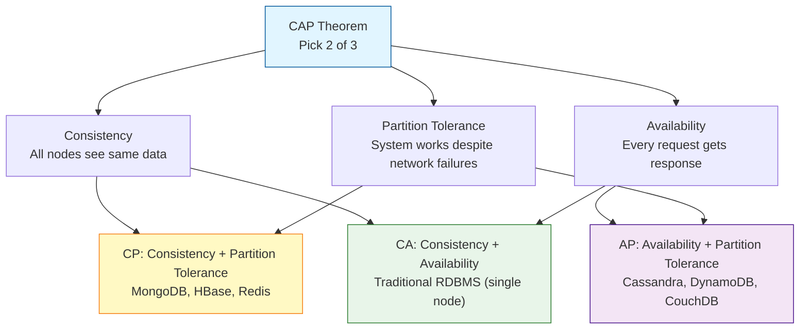

---

## SQL vs NoSQL

### SQL (Structured Query Language)

**Characteristics:**
- Fixed schema (tables with defined columns)
- ACID transactions
- Relationships via foreign keys
- Mature ecosystem and standards
- Vertical scaling (more powerful servers)

**Use cases:**
- Financial systems
- E-commerce platforms
- CRM systems
- Traditional business applications

### NoSQL (Not Only SQL)

**Characteristics:**
- Flexible/dynamic schema
- BASE properties (eventual consistency)
- Horizontal scaling (add more servers)
- Optimized for specific data models
- High performance for specific use cases

**Use cases:**
- Real-time analytics
- Content management
- IoT sensor data
- Social networks
- Gaming leaderboards

---

## Database Types Overview

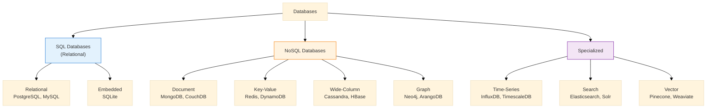

---

## 1. PostgreSQL (Relational Database)

### Overview

**PostgreSQL** is an advanced open-source relational database known for reliability, robustness, and performance.

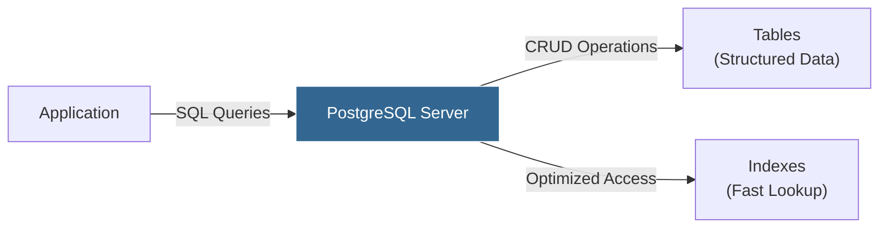

### Key Features

- **ACID compliant**: Fully supports transactions
- **Rich data types**: JSON, Arrays, UUID, Geospatial
- **Advanced features**: Window functions, CTEs, full-text search
- **Extensions**: PostGIS (geospatial), TimescaleDB (time-series)
- **Strong consistency**: Data is always accurate
- **Mature tooling**: pgAdmin, DBeaver, DataGrip

### Data Model

```sql
-- Tables with relationships
CREATE TABLE users (
    id SERIAL PRIMARY KEY,
    username VARCHAR(50) UNIQUE NOT NULL,
    email VARCHAR(100) UNIQUE NOT NULL,
    created_at TIMESTAMP DEFAULT NOW()
);

CREATE TABLE posts (
    id SERIAL PRIMARY KEY,
    user_id INTEGER REFERENCES users(id),
    title VARCHAR(200) NOT NULL,
    content TEXT,
    published_at TIMESTAMP DEFAULT NOW()
);

-- Query with JOIN
SELECT users.username, posts.title
FROM posts
JOIN users ON posts.user_id = users.id
WHERE posts.published_at > '2024-01-01';
```

### When to Use PostgreSQL

✅ **Use PostgreSQL when:**
- Data has complex relationships (e-commerce, CRM)
- ACID transactions are critical (banking, financial systems)
- Need advanced queries (analytics, reporting)
- Data integrity is paramount
- Vertical scaling is acceptable

❌ **Avoid PostgreSQL when:**
- Need extreme horizontal scalability (billions of records)
- Schema changes frequently (highly dynamic data)
- Simple key-value lookups only
- Real-time analytics on streaming data

### Example Use Cases

- **E-commerce**: Orders, products, users with complex relationships
- **Banking**: Account transactions requiring ACID guarantees
- **Healthcare**: Patient records with strict compliance requirements
- **CMS**: Content with categories, tags, and relationships

---

## 2. MongoDB (Document Database)

### Overview

**MongoDB** is a popular NoSQL document database that stores data in flexible JSON-like documents (BSON).

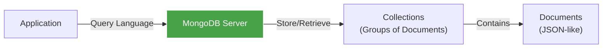

### Key Features

- **Flexible schema**: Documents in same collection can have different fields
- **Rich query language**: Support for complex queries and aggregations
- **Horizontal scaling**: Sharding for distributing data
- **Replication**: Built-in redundancy and high availability
- **Aggregation pipeline**: Powerful data processing
- **Indexes**: Support for complex index types

### Data Model

```javascript
// Document structure (flexible schema)
{
  _id: ObjectId("507f1f77bcf86cd799439011"),
  username: "johndoe",
  email: "john@example.com",
  profile: {
    firstName: "John",
    lastName: "Doe",
    age: 30
  },
  posts: [
    {
      title: "My First Post",
      content: "Hello World!",
      tags: ["introduction", "welcome"],
      publishedAt: ISODate("2024-01-15T10:00:00Z")
    }
  ],
  metadata: {
    lastLogin: ISODate("2024-11-02T08:00:00Z"),
    loginCount: 42
  }
}

// Query examples
db.users.find({ "profile.age": { $gt: 25 } })

db.users.aggregate([
  { $match: { "profile.age": { $gt: 25 } } },
  { $group: { _id: null, avgAge: { $avg: "$profile.age" } } }
])
```

### When to Use MongoDB

✅ **Use MongoDB when:**
- Schema changes frequently (rapid development)
- Data is document-oriented (CMS, catalogs)
- Need horizontal scalability
- Working with nested/hierarchical data
- Real-time analytics and caching

❌ **Avoid MongoDB when:**
- Complex multi-document transactions are critical
- Heavy use of joins across collections
- Strict schema enforcement required
- Data has many-to-many relationships

### Example Use Cases

- **Content Management**: Blog posts, articles with nested comments
- **Product Catalogs**: E-commerce with varying product attributes
- **User Profiles**: Social networks with flexible user data
- **IoT Data**: Sensor readings with varying schemas
- **Mobile Apps**: Offline-first applications

---

## 3. Redis (Key-Value Store / Cache)

### Overview

**Redis** is an in-memory data structure store used as a database, cache, message broker, and streaming engine.

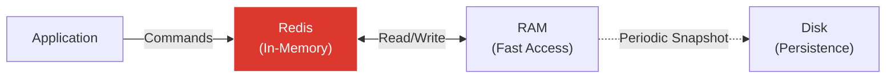

### Key Features

- **In-memory storage**: Extremely fast (sub-millisecond latency)
- **Rich data structures**: Strings, Lists, Sets, Sorted Sets, Hashes, Streams
- **Persistence options**: RDB snapshots, AOF logs
- **Pub/Sub messaging**: Real-time messaging
- **Atomic operations**: Built-in operations are thread-safe
- **Expiration**: Automatic key expiry (TTL)

### Data Structures & Use Cases

```bash
# String: Simple key-value
SET user:1000:name "John Doe"
GET user:1000:name

# Hash: Object storage
HSET user:1000 name "John Doe" email "john@example.com" age 30
HGET user:1000 name

# List: Timeline, queues
LPUSH timeline:user:1000 "Posted a photo"
LPUSH timeline:user:1000 "Liked a post"
LRANGE timeline:user:1000 0 10

# Set: Unique items (tags, followers)
SADD user:1000:tags "developer" "python" "docker"
SISMEMBER user:1000:tags "python"

# Sorted Set: Leaderboards, rankings
ZADD leaderboard 100 "player1" 250 "player2" 175 "player3"
ZREVRANGE leaderboard 0 9  # Top 10

# TTL: Temporary data (sessions, rate limiting)
SET session:abc123 "user_data" EX 3600  # Expires in 1 hour
TTL session:abc123
```

### When to Use Redis

✅ **Use Redis when:**
- Need extremely fast data access (caching)
- Session management
- Real-time analytics (leaderboards, counters)
- Rate limiting / throttling
- Pub/Sub messaging
- Temporary data with expiration

❌ **Avoid Redis when:**
- Data exceeds available RAM
- Need complex queries or joins
- Primary data store with durability requirements
- Data doesn't fit in-memory

### Example Use Cases

- **Caching**: Database query results, API responses
- **Session Store**: User sessions in web applications
- **Real-time Analytics**: Page view counters, trending topics
- **Leaderboards**: Gaming scores, rankings
- **Rate Limiting**: API throttling (X requests per minute)
- **Message Queue**: Background job processing
- **Real-time Chat**: Pub/Sub for messaging

---

## 4. SQLite (Embedded Database)

### Overview

**SQLite** is a self-contained, serverless, zero-configuration SQL database engine. It's the most deployed database in the world.

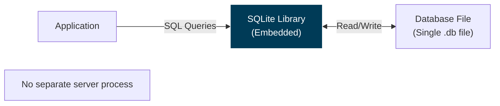

### Key Features

- **Serverless**: No separate database server process
- **Zero configuration**: No setup or administration
- **Single file**: Entire database in one cross-platform file
- **ACID compliant**: Full transaction support
- **Small footprint**: ~600 KB library
- **Cross-platform**: Works on any OS
- **Public domain**: Completely free

### When to Use SQLite

✅ **Use SQLite when:**
- Embedded applications (mobile apps, desktop apps)
- Development/testing environments
- Small to medium-sized websites
- Data analysis / data science notebooks
- IoT / edge devices
- File format for application data

❌ **Avoid SQLite when:**
- High concurrency (many simultaneous writes)
- Multi-user networked applications
- Very large datasets (> 100 GB)
- Need advanced database features
- Require high write throughput

### Example Use Cases

- **Mobile Apps**: iOS/Android app local storage
- **Desktop Applications**: VS Code, Adobe Lightroom settings
- **Browsers**: Firefox, Chrome store data locally
- **Testing**: Lightweight test databases
- **Data Analysis**: Pandas DataFrame storage
- **Configuration Storage**: Application settings
- **Prototype Development**: Quick local database

---

## 5. Time-Series Databases

### Overview

**Time-series databases** are optimized for time-stamped data (metrics, events, measurements over time).

**Popular Options:**
- **InfluxDB**: Purpose-built time-series database
- **TimescaleDB**: PostgreSQL extension for time-series data

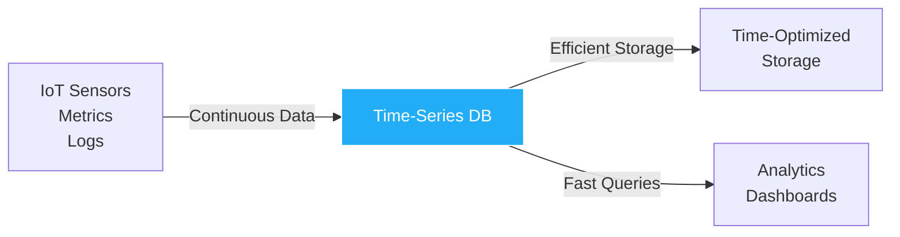

### Key Features

- **Time-based indexing**: Optimized for time-range queries
- **Data retention policies**: Automatic old data deletion
- **Downsampling**: Aggregate old data to save space
- **High write throughput**: Handle millions of writes/sec
- **Compression**: Efficient storage of time-series data
- **Continuous queries**: Real-time aggregations

### Data Model (InfluxDB Example)

```
measurement,tag1=value1,tag2=value2 field1=value1,field2=value2 timestamp

# Example: Temperature sensor data
temperature,sensor=sensor1,location=room1 value=22.5 1699012800000000000
temperature,sensor=sensor1,location=room1 value=22.7 1699012860000000000
temperature,sensor=sensor2,location=room2 value=21.3 1699012800000000000

# Query: Average temperature per room in last hour
SELECT MEAN(value) FROM temperature
WHERE time > now() - 1h
GROUP BY location, time(5m)
```

### When to Use Time-Series DB

✅ **Use time-series DB when:**
- IoT sensor data
- Application performance monitoring (APM)
- Infrastructure metrics (CPU, memory, disk)
- Financial market data (stock prices)
- Event logging and analytics
- Weather data

❌ **Avoid time-series DB when:**
- Data isn't primarily time-based
- Need complex relational queries
- Heavy updates to historical data
- General-purpose application data

### Example Use Cases

- **DevOps**: System metrics, application monitoring (Prometheus + Grafana)
- **IoT**: Temperature, pressure, humidity sensors
- **Finance**: Stock prices, trading volumes
- **Smart Home**: Energy consumption, device status
- **Industrial**: Manufacturing equipment sensors
- **Web Analytics**: Page views, user actions over time

---

## 6. Graph Databases

### Overview

**Graph databases** store data as nodes (entities) and edges (relationships), optimized for traversing connections.

**Popular Option: Neo4j**

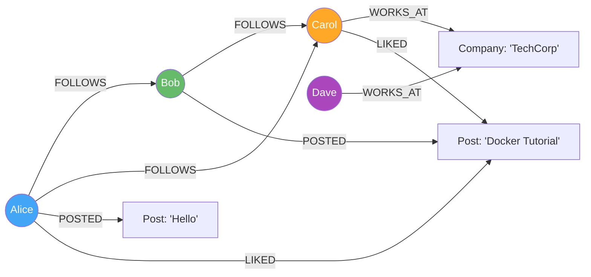

### Key Features

- **Native graph storage**: Stores relationships as first-class citizens
- **Traversal efficiency**: Fast path finding and pattern matching
- **Cypher query language**: Intuitive graph query syntax (Neo4j)
- **ACID transactions**: Consistent graph operations
- **Flexible schema**: Add properties and relationships dynamically
- **Visualization**: Built-in tools for graph visualization

### Data Model (Neo4j Cypher)

```cypher
// Create nodes
CREATE (alice:Person {name: 'Alice', age: 30})
CREATE (bob:Person {name: 'Bob', age: 35})
CREATE (techcorp:Company {name: 'TechCorp'})

// Create relationships
CREATE (alice)-[:FOLLOWS]->(bob)
CREATE (bob)-[:WORKS_AT {since: 2020}]->(techcorp)

// Find friends of friends
MATCH (person:Person)-[:FOLLOWS]->(friend)-[:FOLLOWS]->(fof)
WHERE person.name = 'Alice'
RETURN fof.name

// Find shortest path
MATCH path = shortestPath(
  (alice:Person {name: 'Alice'})-[*]-(company:Company {name: 'TechCorp'})
)
RETURN path

// Recommendation: Find people who like similar posts
MATCH (me:Person {name: 'Alice'})-[:LIKED]->(post)<-[:LIKED]-(other:Person)
WHERE NOT (me)-[:FOLLOWS]->(other)
RETURN other.name, COUNT(post) AS common_likes
ORDER BY common_likes DESC
LIMIT 10
```

### When to Use Graph Database

✅ **Use graph database when:**
- Data has many interconnected relationships
- Need to traverse relationships efficiently
- Social networks, recommendation engines
- Fraud detection (pattern matching)
- Network topology
- Knowledge graphs

❌ **Avoid graph database when:**
- Simple tabular data with few relationships
- Primarily aggregations and analytics
- Data doesn't have complex relationships
- Standard SQL queries suffice

### Example Use Cases

- **Social Networks**: Friends, followers, connections
- **Recommendation Engines**: "Users who bought X also bought Y"
- **Fraud Detection**: Finding suspicious transaction patterns
- **Network Management**: IT infrastructure topology
- **Knowledge Graphs**: Wikipedia, Google Knowledge Graph
- **Access Control**: Complex permission hierarchies
- **Supply Chain**: Track product movement and dependencies

---

## 7. Vector Databases

### Overview

**Vector databases** are specialized databases designed to store and query high-dimensional vector embeddings, essential for AI/ML applications like semantic search, recommendation systems, and RAG (Retrieval-Augmented Generation).

**Popular Options:**
- **Milvus**: Open-source vector database for scalable similarity search
- **Weaviate**: Open-source vector search engine
- **Qdrant**: Vector search engine with extended filtering support
- **Chroma**: Embedding database for LLM applications
- **Pinecone**: Managed vector database service

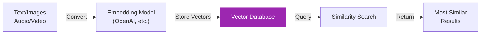

### Key Features

- **Vector storage**: Store high-dimensional vectors (embeddings)
- **Similarity search**: Find nearest neighbors using cosine similarity, euclidean distance
- **Indexing algorithms**: HNSW, IVF, etc. for fast approximate search
- **Metadata filtering**: Combine vector search with traditional filters
- **Scalability**: Handle billions of vectors
- **Low latency**: Sub-100ms queries even at scale

### How Vector Databases Work

**1. Generate Embeddings:**
```python
# Using OpenAI to create embeddings
import openai

text = "Docker is a containerization platform"
response = openai.Embedding.create(
    input=text,
    model="text-embedding-ada-002"
)
vector = response['data'][0]['embedding']  # 1536-dimensional vector
# [0.002, -0.015, 0.031, ..., 0.008]
```

**2. Store Vectors:**
```python
# Store in vector database (example: Milvus)
from pymilvus import connections, Collection, CollectionSchema, FieldSchema, DataType

# Connect to Milvus
connections.connect(host="localhost", port="19530")

# Define schema
fields = [
    FieldSchema(name="id", dtype=DataType.INT64, is_primary=True, auto_id=True),
    FieldSchema(name="text", dtype=DataType.VARCHAR, max_length=500),
    FieldSchema(name="category", dtype=DataType.VARCHAR, max_length=50),
    FieldSchema(name="embedding", dtype=DataType.FLOAT_VECTOR, dim=1536)
]
schema = CollectionSchema(fields, description="Tutorial embeddings")
collection = Collection("tutorials", schema)

# Insert data
data = [
    ["Docker is a containerization platform"],
    ["tutorial"],
    [vector]  # 1536-dimensional vector
]
collection.insert(data)

# Create index for fast search
index_params = {
    "metric_type": "COSINE",
    "index_type": "IVF_FLAT",
    "params": {"nlist": 128}
}
collection.create_index("embedding", index_params)
collection.load()
```

**3. Similarity Search:**
```python
# Search for similar content
query = "What is containerization?"
query_vector = get_embedding(query)

# Search in Milvus
search_params = {"metric_type": "COSINE", "params": {"nprobe": 10}}
results = collection.search(
    data=[query_vector],
    anns_field="embedding",
    param=search_params,
    limit=5,
    output_fields=["text", "category"]
)

# Returns most similar documents
# 1. "Docker is a containerization platform" (score: 0.92)
# 2. "Kubernetes orchestrates containers" (score: 0.85)
# ...
```

### Vector Similarity Metrics

```python
# Cosine Similarity (most common)
# Measures angle between vectors, range: -1 to 1
similarity = dot(v1, v2) / (norm(v1) * norm(v2))

# Euclidean Distance
# Measures straight-line distance
distance = sqrt(sum((v1 - v2)^2))

# Dot Product
# Raw similarity measure
similarity = dot(v1, v2)
```

### When to Use Vector Database

✅ **Use vector database when:**
- Semantic search (search by meaning, not keywords)
- Recommendation systems based on similarity
- RAG (Retrieval-Augmented Generation) for LLMs
- Image/video similarity search
- Anomaly detection (find outliers)
- Duplicate detection
- Question answering systems

❌ **Avoid vector database when:**
- Traditional keyword search is sufficient
- No AI/ML embeddings involved
- Simple exact matches needed
- Relational data queries

### Example Use Cases

**1. Semantic Search:**
```
Query: "best practices for containers"
Traditional search: Looks for exact keywords
Vector search: Finds "Docker optimization tips", "Container security guidelines"
```

**2. RAG (Retrieval-Augmented Generation):**
```
User asks: "How do I deploy to Kubernetes?"
1. Convert question to vector embedding
2. Search vector DB for similar documentation
3. Pass relevant docs to LLM as context
4. LLM generates accurate answer with sources
```

**3. Recommendation Engine:**
- User likes "Docker tutorial"
- Find similar content vectors
- Recommend "Kubernetes basics", "Container security"

**4. Image Search:**
- Upload image → convert to vector
- Find visually similar images
- E-commerce: "Find similar products"

**5. Chatbot Memory:**
- Store conversation history as vectors
- Retrieve relevant past conversations
- Provide contextual responses

### Popular Use Cases by Industry

- **E-commerce**: Product recommendations, visual search
- **Content Platforms**: Article recommendations, similar content
- **Customer Support**: FAQ matching, similar ticket search
- **Healthcare**: Similar patient case retrieval
- **Legal**: Find similar legal cases and precedents
- **Education**: Find similar learning materials
- **Research**: Paper recommendation systems

---

## Database Comparison

### Feature Comparison

| Feature | PostgreSQL | MongoDB | Redis | SQLite | TimescaleDB | Neo4j | Vector DB |
|---------|-----------|---------|-------|--------|-------------|-------|-----------|
| **Type** | Relational | Document | Key-Value | Relational | Time-Series | Graph | Vector |
| **Schema** | Fixed | Flexible | Schema-less | Fixed | Fixed | Flexible | Vectors + Metadata |
| **ACID** | ✅ Full | ⚠️ Partial | ⚠️ Partial | ✅ Full | ✅ Full | ✅ Full | ⚠️ Partial |
| **Scaling** | Vertical | Horizontal | Horizontal | Single-node | Vertical | Horizontal | Horizontal |
| **Joins** | ✅ Excellent | ⚠️ Limited | ❌ No | ✅ Excellent | ✅ Excellent | ✅ Native | ❌ No |
| **Performance** | Fast | Very Fast | Extremely Fast | Fast | Very Fast | Fast (graphs) | Very Fast (similarity) |
| **Use Case** | General | Documents | Caching | Embedded | Time-data | Relationships | AI/ML Search |

### Performance Characteristics

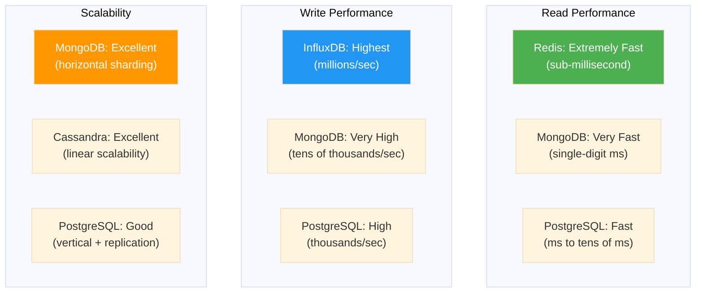

---

## Choosing the Right Database

### Decision Tree

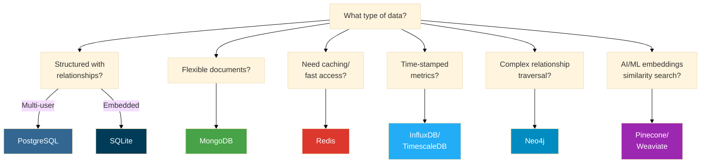

### Use Case Matrix

| Use Case | Primary Choice | Alternative | Why? |
|----------|---------------|-------------|------|
| **E-commerce** | PostgreSQL | MongoDB | Complex transactions, inventory management |
| **Social Network** | Neo4j | MongoDB + Redis | Relationship traversal, friend suggestions |
| **Blog/CMS** | MongoDB | PostgreSQL | Flexible content structure, nested data |
| **Real-time Analytics** | InfluxDB | TimescaleDB | High write throughput, time-based queries |
| **Session Store** | Redis | PostgreSQL | Fast access, automatic expiration |
| **Mobile App** | SQLite | Realm | Embedded, offline-first |
| **IoT Platform** | InfluxDB + MongoDB | TimescaleDB | Metrics + device metadata |
| **Recommendation Engine** | Neo4j | Vector DB | Graph traversal for suggestions |
| **Financial System** | PostgreSQL | CockroachDB | ACID guarantees, compliance |
| **Caching Layer** | Redis | Memcached | Speed, data structures |
| **Semantic Search** | Vector DB | Elasticsearch | AI-powered similarity search |
| **RAG for LLMs** | Vector DB | PostgreSQL+pgvector | Efficient embedding storage and retrieval |
| **Image Search** | Vector DB | Custom solution | Visual similarity matching |

---

## Best Practices

### 1. Understand Your Access Patterns

**Before choosing a database, analyze:**
- Read vs write ratio
- Query patterns (simple lookups vs complex joins)
- Data volume and growth rate
- Consistency requirements
- Latency requirements

### 2. Use the Right Tool for the Job

**Polyglot Persistence**: Use multiple databases in one application

**Example Architecture:**
```
Application
├── PostgreSQL (transactional data, orders, users)
├── Redis (session store, caching)
├── MongoDB (product catalog, user-generated content)
├── InfluxDB (application metrics, monitoring)
├── Neo4j (recommendation engine, social graph)
└── Vector DB (semantic search, AI-powered recommendations)
```

### 3. Start Simple, Scale When Needed

- Start with a single database (usually PostgreSQL)
- Add specialized databases as needs arise
- Don't over-engineer early

### 4. Consider Operational Complexity

- More databases = more complexity
- Factor in: backups, monitoring, scaling, expertise
- Managed services (AWS RDS, MongoDB Atlas) reduce burden

### 5. Data Modeling Best Practices

**Relational (PostgreSQL):**
- Normalize to 3NF, denormalize for performance
- Use foreign keys for referential integrity
- Index frequently queried columns

**Document (MongoDB):**
- Embed related data that's accessed together
- Reference data that's shared across documents
- Design for your query patterns

**Key-Value (Redis):**
- Use meaningful key naming conventions
- Set appropriate TTLs
- Choose right data structure for use case

---

## Summary

You've learned about:

- **Database fundamentals**: ACID, BASE, CAP theorem
- **SQL vs NoSQL**: Different paradigms for different needs
- **PostgreSQL**: Relational database for structured data with relationships
- **MongoDB**: Document database for flexible, nested data
- **Redis**: In-memory cache and data structure store
- **SQLite**: Embedded database for local storage
- **Time-Series DB**: Optimized for metrics and time-stamped data
- **Graph DB**: Optimized for relationship traversal
- **Vector DB**: AI/ML embeddings for semantic search and recommendations

**Key Takeaway**: There's no "best" database - choose based on your specific requirements, access patterns, and scalability needs.

---

## What's Next?

- **Tutorial 4**: Learn about frameworks and choosing the right tech stack for microservices
- **Tutorial 5**: Set up Kubernetes and start deploying containerized applications with orchestration!

---

## Additional Resources

### PostgreSQL
- [Official Documentation](https://www.postgresql.org/docs/)
- [PostgreSQL Tutorial](https://www.postgresqltutorial.com/)

### MongoDB
- [Official Documentation](https://docs.mongodb.com/)
- [MongoDB University](https://university.mongodb.com/) (Free courses)

### Redis
- [Official Documentation](https://redis.io/documentation)
- [Redis University](https://university.redis.com/) (Free courses)
- [Try Redis](https://try.redis.io/) (Interactive tutorial)

### SQLite
- [Official Documentation](https://www.sqlite.org/docs.html)
- [SQLite Tutorial](https://www.sqlitetutorial.net/)

### Time-Series Databases
- [InfluxDB Documentation](https://docs.influxdata.com/influxdb/)
- [TimescaleDB Documentation](https://docs.timescale.com/)

### Graph Databases
- [Neo4j Documentation](https://neo4j.com/docs/)
- [Neo4j Graph Academy](https://graphacademy.neo4j.com/) (Free courses)

### General
- [Database of Databases](https://dbdb.io/) - Comprehensive database catalog
- [DB-Engines Ranking](https://db-engines.com/en/ranking) - Database popularity trends
