# Tutorial 4: Frontend and Backend Frameworks

A comprehensive guide to choosing the right frameworks for building modern microservices architectures.

## Learning Objectives

By the end of this tutorial, you will understand:
- The landscape of microservices-friendly frameworks
- Key criteria for selecting frameworks for microservices
- Trade-offs between different framework choices
- When to use React, Vue, Svelte, Angular, and Rust/WebAssembly for frontend development
- When to use Flask, FastAPI, Express.js, NestJS, Go, Rust, and Java frameworks for microservices
- How to choose different frameworks for different services (polyglot architecture)
- Why monolithic frameworks (Django, Rails) don't fit microservices well

## Introduction

Choosing the right framework is critical for building modern microservices. Unlike monolithic applications where you pick one framework for everything, microservices let you choose the **best framework for each service's specific needs**.

### Key Considerations for Microservices

- **Performance**: Can it handle high throughput and low latency?
- **Deployment**: How easy is it to containerize and deploy?
- **Scalability**: Can individual services scale independently?
- **Developer Experience**: How quickly can teams build and iterate?
- **Ecosystem**: What microservices patterns does it support?
- **Resource Footprint**: Memory and CPU usage matter in cloud environments
- **Async Support**: Critical for I/O-bound microservices
- **Type Safety**: Reduces bugs in distributed systems

### Microservices vs Monolithic Frameworks

⚠️ **Important**: This tutorial focuses on **microservices-friendly** frameworks. We intentionally omit monolithic frameworks like Django and Ruby on Rails, as they're designed for single-application deployments and don't align with modern microservices architectures.

## Understanding Frontend and Backend

Before diving into specific frameworks, it's important to understand the fundamental architecture of web applications.

### What is Frontend?

The **frontend** (also called client-side) is everything the user sees and interacts with in their web browser. It's responsible for:
- **User Interface (UI)**: Buttons, forms, navigation, layout
- **User Experience (UX)**: Interactions, animations, responsiveness
- **Data Display**: Rendering data received from the backend
- **Client-side Logic**: Form validation, UI state management, routing

**Technologies:**
- HTML: Structure and content
- CSS: Styling and layout
- JavaScript: Interactivity and dynamic behavior
- Frontend Frameworks: React, Vue, Svelte, Angular (organize and simplify development)

**Example:** When you type in a search box and see suggestions appear, or when you click a button and see a modal pop up - that's frontend code running in your browser.

### What is Backend?

The **backend** (also called server-side) runs on servers and handles:
- **Business Logic**: Processing rules, calculations, workflows
- **Data Storage**: Database operations (create, read, update, delete)
- **Authentication**: User login, permissions, security
- **API Endpoints**: Providing data to the frontend
- **External Integrations**: Connecting to other services (payment processors, email services)

**Technologies:**
- Server Languages: Python, JavaScript/TypeScript, Go, Rust, Java
- Backend Frameworks: Flask, FastAPI, Express, NestJS, Spring Boot
- Databases: PostgreSQL, MongoDB, Redis
- APIs: REST, GraphQL, gRPC

**Example:** When you submit a login form, the backend verifies your credentials against the database, creates a session, and sends back an authentication token.

### Frontend ↔ Backend Communication

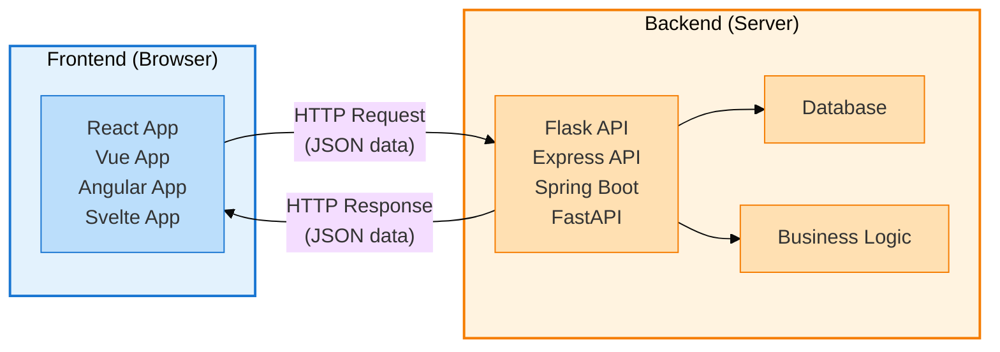

**Example Flow:**
1. User clicks "Load Todos" button (Frontend)
2. Frontend sends HTTP GET request to `/api/todos` (Frontend → Backend)
3. Backend queries database for todos (Backend)
4. Backend sends JSON response with todo data (Backend → Frontend)
5. Frontend receives data and updates UI to display todos (Frontend)

### The DOM (Document Object Model)

The **DOM** is a tree-like representation of HTML that browsers create. Every HTML element becomes a node in this tree.

```html
<html>
  <body>
    <div id="app">
      <h1>My Todos</h1>
      <ul>
        <li>Todo 1</li>
        <li>Todo 2</li>
      </ul>
    </div>
  </body>
</html>
```

**DOM Tree:**
```
html
└── body
    └── div#app
        ├── h1 ("My Todos")
        └── ul
            ├── li ("Todo 1")
            └── li ("Todo 2")
```

**The Problem:** Updating the DOM is slow. Every change triggers:
1. Recalculating styles
2. Re-laying out elements (reflow)
3. Repainting pixels on screen

Updating many elements can cause performance issues and janky UI.

### Virtual DOM

The **Virtual DOM** is an optimization technique used by frameworks like React and Vue. Instead of directly manipulating the real DOM, they:

1. **Keep a Virtual Copy**: Maintain a lightweight JavaScript copy of the DOM
2. **Calculate Changes**: When data changes, create a new virtual DOM and compare it to the old one
3. **Batch Updates**: Figure out the minimal set of real DOM changes needed
4. **Efficient Updates**: Apply only those specific changes to the real DOM

**Example:**

```javascript
// You update state
setTodos([...todos, newTodo]);

// React's Virtual DOM process:
1. Creates new virtual DOM tree with the new todo
2. Compares (diffs) new tree with old tree
3. Finds: "Only 1 new <li> element needed"
4. Updates real DOM: Adds just that one <li> element
```

**Traditional Approach (Vanilla JS):**
```javascript
// Update requires manual DOM manipulation
const ul = document.getElementById('todo-list');
ul.innerHTML = ''; // Clear everything
todos.forEach(todo => {
  const li = document.createElement('li');
  li.textContent = todo.text;
  ul.appendChild(li); // Rebuild everything
});
// Inefficient: Destroys and recreates all elements
```

**Virtual DOM Approach (React):**
```javascript
// React figures out only what changed
function TodoList({ todos }) {
  return (
    <ul>
      {todos.map(todo => (
        <li key={todo.id}>{todo.text}</li>
      ))}
    </ul>
  );
}
// Efficient: Only adds/removes/updates what changed
```

### DOM vs Virtual DOM Comparison

| Aspect | Direct DOM | Virtual DOM |
|--------|-----------|-------------|
| **Updates** | Manual `document.getElementById()`, `innerHTML`, etc. | Automatic diffing and patching |
| **Performance** | Slow for frequent updates | Optimized batch updates |
| **Developer Experience** | Tedious, error-prone | Declarative, easier to maintain |
| **Used By** | Vanilla JavaScript | React, Vue (optional), Preact |

### Alternatives to Virtual DOM

**Svelte (Compile-time Optimization):**
- No Virtual DOM at all
- Compiles components to efficient imperative code at build time
- Updates DOM surgically without diffing
- Result: Smaller bundles, faster runtime

**Solid.js (Fine-grained Reactivity):**
- No Virtual DOM
- Tracks dependencies at compile time
- Updates only specific DOM nodes that changed
- Result: Very fast updates

### Why This Matters for Framework Choice

- **React/Vue (Virtual DOM)**: Good balance of performance and developer experience
- **Svelte (No Virtual DOM)**: Better performance, smaller bundles, but smaller ecosystem
- **Angular (Incremental DOM)**: Different approach, updates DOM incrementally
- **Rust/WASM (Direct DOM)**: Can manipulate DOM from compiled WebAssembly for maximum performance

---

## SPA vs SSR: Application Architecture Patterns

Understanding the difference between Single Page Applications (SPA) and Server-Side Rendering (SSR) is crucial for choosing the right framework approach.

### SPA (Single Page Application)

**What it is:** A web application that loads a single HTML page and dynamically updates content without full page reloads.

**How it works:**
1. Browser requests the application
2. Server sends minimal HTML + JavaScript bundle
3. JavaScript takes over and renders everything in the browser
4. Navigation happens client-side (no page reloads)
5. API calls fetch data as JSON

**Example Flow:**
```
User visits site → Server sends index.html + app.js (empty <div id="app">)
↓
Browser downloads JavaScript bundle
↓
React/Vue/Svelte renders entire UI in browser
↓
User clicks "Products" → JavaScript updates DOM (no server request for HTML)
↓
JavaScript fetches data from /api/products → Updates UI
```

**Advantages:**
- ✅ Fast, smooth navigation after initial load
- ✅ Rich, interactive user experiences
- ✅ Less server load (only serves API data)
- ✅ Can work offline (with service workers)
- ✅ Clear separation: Frontend + Backend API

**Disadvantages:**
- ❌ Slow initial load (large JavaScript bundle)
- ❌ Poor SEO (search engines see empty HTML initially)
- ❌ Blank screen while JavaScript loads
- ❌ Requires JavaScript enabled
- ❌ Larger bundle sizes

**Best For:**
- Web applications (dashboards, admin panels, tools)
- Apps behind authentication
- Rich interactive experiences
- When SEO is not critical

**Examples:**
- Gmail, Google Docs
- Figma, Notion
- Admin dashboards
- Internal tools

**Frameworks/Tools:**
- React (default)
- Vue (default)
- Svelte (default)
- Angular (default)

---

### SSR (Server-Side Rendering)

**What it is:** The server generates complete HTML for each page and sends it to the browser, which displays content immediately.

**How it works:**
1. Browser requests a page
2. Server runs JavaScript/framework code
3. Server generates full HTML with content
4. Browser receives and displays complete HTML immediately
5. JavaScript "hydrates" to make it interactive

**Example Flow:**
```
User visits /products → Server runs React/Vue/Svelte code
↓
Server fetches data from database
↓
Server renders complete HTML with product list
↓
Browser receives full HTML and displays immediately (content visible!)
↓
JavaScript downloads and "hydrates" (adds interactivity)
```

**Advantages:**
- ✅ Fast initial page load (content visible immediately)
- ✅ Excellent SEO (search engines see full HTML)
- ✅ Works without JavaScript (basic functionality)
- ✅ Better perceived performance
- ✅ Social media previews work (Open Graph)

**Disadvantages:**
- ❌ More complex setup and deployment
- ❌ Higher server load (server renders HTML)
- ❌ Slower navigation (some frameworks optimize this)
- ❌ Need Node.js server (or similar)
- ❌ More complicated caching

**Best For:**
- Content websites (blogs, news, documentation)
- E-commerce sites
- Marketing pages
- When SEO is critical
- When initial load performance matters

**Examples:**
- Amazon, eBay (product pages)
- News websites (New York Times)
- Blogs, documentation sites
- Marketing landing pages

**Frameworks/Tools:**
- Next.js (React)
- Nuxt.js (Vue)
- SvelteKit (Svelte)
- Angular Universal (Angular)

---

### SSG (Static Site Generation) - Bonus

**What it is:** Pre-renders all pages at build time. A variant of SSR that generates HTML during deployment, not per request.

**How it works:**
1. At build time, generate HTML for all pages
2. Deploy static HTML files to CDN
3. Browser requests page → CDN serves pre-built HTML instantly
4. JavaScript hydrates for interactivity

**Advantages:**
- ✅ Fastest possible load times
- ✅ Perfect SEO
- ✅ Cheap hosting (just static files)
- ✅ Excellent scalability (CDN)
- ✅ Most secure (no server-side code)

**Disadvantages:**
- ❌ Only works for content that doesn't change often
- ❌ Rebuilding required for content updates
- ❌ Not suitable for personalized/dynamic content
- ❌ Build time increases with page count

**Best For:**
- Blogs, documentation
- Marketing websites
- Portfolios
- Content that updates infrequently

**Examples:**
- Gatsby (React)
- Next.js (React, hybrid)
- VuePress (Vue)
- SvelteKit (Svelte, hybrid)

---

### Comparison Table

| Feature | SPA | SSR | SSG |
|---------|-----|-----|-----|
| **Initial Load** | Slow (download JS) | Fast (HTML ready) | Fastest (pre-built) |
| **Navigation** | Very fast (client-side) | Slower (may fetch HTML) | Very fast (static files) |
| **SEO** | Poor (requires tricks) | Excellent | Excellent |
| **Server Load** | Low (API only) | High (renders HTML) | None (static files) |
| **Hosting Cost** | Low | Higher (Node.js server) | Lowest (CDN) |
| **Dynamic Content** | Excellent | Excellent | Limited |
| **JavaScript Required** | Yes | For interactivity | For interactivity |
| **Real-time Updates** | Easy | Moderate | Difficult |

---

### Hybrid Approaches (Modern Frameworks)

Modern frameworks like **Next.js**, **Nuxt.js**, and **SvelteKit** support **hybrid rendering**:

- **Per-page choice**: Some pages SSR, some SPA, some SSG
- **Incremental Static Regeneration (ISR)**: Update static pages periodically
- **Streaming SSR**: Send HTML as it's generated (faster perceived load)

**Example Next.js App:**
```
/                    → SSG (marketing page, pre-built)
/blog/[slug]         → SSG (blog posts, pre-built)
/products/[id]       → SSR (dynamic, SEO-critical)
/dashboard           → SPA (authenticated, no SEO needed)
/api/products        → API route (backend)
```

---

### Decision Guide

**Choose SPA when:**
- Building web applications (not websites)
- SEO doesn't matter (behind login)
- Rich interactivity is primary goal
- Backend is separate API

**Choose SSR when:**
- SEO is critical
- Initial load performance matters
- Content is dynamic and personalized
- Need social media previews

**Choose SSG when:**
- Content doesn't change often
- Maximum performance needed
- Want cheapest hosting
- Don't need personalization

**Choose Hybrid when:**
- Different pages have different needs
- Want flexibility
- Building modern web apps

---

### Framework Support Summary

| Framework | Default | SSR Support | SSG Support | Hybrid |
|-----------|---------|-------------|-------------|--------|
| **React** | SPA | Via Next.js | Via Next.js | Next.js |
| **Vue** | SPA | Via Nuxt.js | Via Nuxt.js | Nuxt.js |
| **Svelte** | SPA | Via SvelteKit | Via SvelteKit | SvelteKit |
| **Angular** | SPA | Angular Universal | Angular Universal | Limited |

**Recommendation for this course:** Start with **SPA** (Tutorial 8 uses React SPA) to understand fundamentals, then explore Next.js/Nuxt.js/SvelteKit for production projects.

---

## Framework Landscape

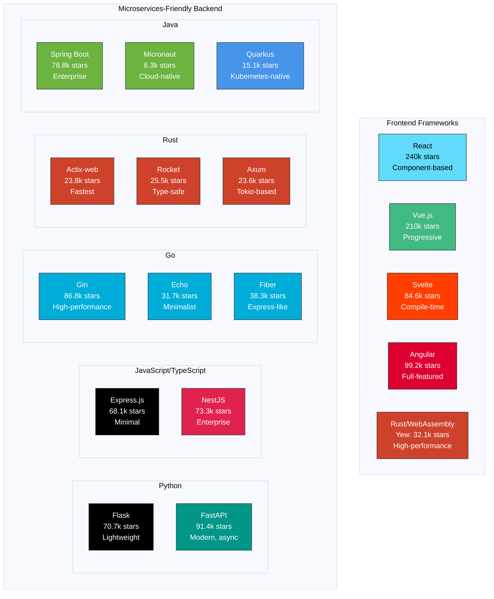

**Note:** GitHub star counts as of January 2025. This landscape shows only microservices-friendly frameworks.

## Frontend Frameworks

### React

**Official Website:** https://react.dev/
**GitHub:** https://github.com/facebook/react (240k stars)

**What it is:** A JavaScript library for building user interfaces, created by Meta (Facebook).

**Key Features:**
- Component-based architecture
- Virtual DOM for efficient updates
- Unidirectional data flow
- Huge ecosystem (React Router, Redux, Next.js)
- JSX syntax (JavaScript + HTML)

**When to Use:**
- ✅ Large, complex applications with many interactive components
- ✅ When you need a vast ecosystem of libraries and tools
- ✅ Teams already familiar with JavaScript
- ✅ When you want flexibility in choosing libraries
- ✅ Mobile development with React Native

**When NOT to Use:**
- ❌ Very simple websites (might be overkill)
- ❌ When you need the smallest possible bundle size
- ❌ When you want an opinionated, all-in-one solution

**Example:**
```javascript
import React, { useState, useEffect } from 'react';

function TodoApp() {
  const [todos, setTodos] = useState([]);

  useEffect(() => {
    fetch('/api/todos')
      .then(res => res.json())
      .then(data => setTodos(data));
  }, []);

  const addTodo = (text) => {
    const newTodo = { id: Date.now(), text, completed: false };
    setTodos([...todos, newTodo]);
  };

  return (
    <div className="todo-app">
      <h1>My Todos</h1>
      <TodoList todos={todos} />
      <AddTodo onAdd={addTodo} />
    </div>
  );
}
```


---

### Vue.js

**Official Website:** https://vuejs.org/
**GitHub:** https://github.com/vuejs/vue (210k stars)

**What it is:** A progressive JavaScript framework for building user interfaces.

**Key Features:**
- Progressive framework (use as little or as much as you need)
- Template syntax (HTML-like)
- Reactive data binding
- Single-file components (.vue files)
- Excellent documentation

**When to Use:**
- ✅ When you want an easy learning curve
- ✅ Progressive enhancement of existing applications
- ✅ Smaller to medium-sized projects
- ✅ When you prefer template syntax over JSX
- ✅ Teams with both beginners and experienced developers

**When NOT to Use:**
- ❌ When you need the absolute largest ecosystem (React has more)
- ❌ When corporate backing is a requirement (React/Angular have Meta/Google)

**Example:**
```vue
<template>
  <div class="todo-app">
    <h1>My Todos</h1>
    <ul>
      <li v-for="todo in todos" :key="todo.id">
        {{ todo.text }}
      </li>
    </ul>
    <input v-model="newTodo" @keyup.enter="addTodo">
  </div>
</template>

<script>
export default {
  data() {
    return {
      todos: [],
      newTodo: ''
    }
  },
  mounted() {
    fetch('/api/todos')
      .then(res => res.json())
      .then(data => this.todos = data);
  },
  methods: {
    addTodo() {
      this.todos.push({ id: Date.now(), text: this.newTodo });
      this.newTodo = '';
    }
  }
}
</script>
```


---

### Svelte

**Official Website:** https://svelte.dev/
**GitHub:** https://github.com/sveltejs/svelte (84.6k stars)

**What it is:** A compile-time framework that shifts work from the browser to build time.

**Key Features:**
- No virtual DOM (compiles to efficient vanilla JavaScript)
- Reactive by default
- Smaller bundle sizes
- Simple, intuitive syntax
- Built-in animations and transitions

**When to Use:**
- ✅ When performance and bundle size are critical
- ✅ Smaller projects or components
- ✅ When you want simpler, more readable code
- ✅ Interactive data visualizations
- ✅ Embedded widgets

**When NOT to Use:**
- ❌ When you need a massive ecosystem (still growing)
- ❌ Large enterprise applications (less mature tooling)
- ❌ When team is already invested in React/Vue

**Example:**
```svelte
<script>
  import { onMount } from 'svelte';

  let todos = [];
  let newTodo = '';

  onMount(async () => {
    const res = await fetch('/api/todos');
    todos = await res.json();
  });

  function addTodo() {
    todos = [...todos, { id: Date.now(), text: newTodo }];
    newTodo = '';
  }
</script>

<div class="todo-app">
  <h1>My Todos</h1>
  <ul>
    {#each todos as todo (todo.id)}
      <li>{todo.text}</li>
    {/each}
  </ul>
  <input bind:value={newTodo} on:keyup.enter={addTodo}>
</div>
```


---

### Angular

**Official Website:** https://angular.io/
**GitHub:** https://github.com/angular/angular (99.2k stars)

**What it is:** A full-featured TypeScript framework by Google for building web applications.

**Key Features:**
- Complete solution (routing, forms, HTTP client built-in)
- TypeScript first
- Dependency injection
- RxJS for reactive programming
- Strong opinions and structure

**When to Use:**
- ✅ Large enterprise applications
- ✅ Teams that prefer TypeScript
- ✅ When you want everything included out-of-the-box
- ✅ Long-term, large-scale projects
- ✅ When you need strong typing and structure

**When NOT to Use:**
- ❌ Small projects (might be overkill)
- ❌ When you need quick prototyping
- ❌ Teams unfamiliar with TypeScript/RxJS

**Example:**
```typescript
import { Component, OnInit } from '@angular/core';
import { HttpClient } from '@angular/common/http';

@Component({
  selector: 'app-todo',
  template: `
    <div class="todo-app">
      <h1>My Todos</h1>
      <ul>
        <li *ngFor="let todo of todos">{{ todo.text }}</li>
      </ul>
      <input [(ngModel)]="newTodo" (keyup.enter)="addTodo()">
    </div>
  `
})
export class TodoComponent implements OnInit {
  todos: any[] = [];
  newTodo: string = '';

  constructor(private http: HttpClient) {}

  ngOnInit() {
    this.http.get<any[]>('/api/todos')
      .subscribe(data => this.todos = data);
  }

  addTodo() {
    this.todos.push({ id: Date.now(), text: this.newTodo });
    this.newTodo = '';
  }
}
```


---

### Rust + WebAssembly (Yew, Leptos, Dioxus)

**What it is:** High-performance frontend frameworks using Rust compiled to WebAssembly.

**Popular Options:**
- **Yew**: React-like component framework
  - **GitHub:** https://github.com/yewstack/yew (32.1k stars)
  - **Website:** https://yew.rs/
- **Leptos**: Fine-grained reactivity, similar to SolidJS
  - **GitHub:** https://github.com/leptos-rs/leptos (19.4k stars)
  - **Website:** https://leptos.dev/
- **Dioxus**: Cross-platform, React-like API
  - **GitHub:** https://github.com/DioxusLabs/dioxus (31.5k stars)
  - **Website:** https://dioxuslabs.com/

**Key Features:**
- Near-native performance (WebAssembly runs at ~95% native speed)
- Strong type safety with Rust's type system
- Zero-cost abstractions
- Small bundle sizes (after wasm-opt)
- Memory safety without garbage collection
- Can interop with JavaScript

**When to Use:**
- ✅ Performance-critical applications (gaming, data visualization, image/video processing)
- ✅ Computational heavy tasks in the browser
- ✅ When you need strong type safety
- ✅ Teams already using Rust
- ✅ WebAssembly modules for existing JavaScript apps
- ✅ Real-time data processing in browser

**When NOT to Use:**
- ❌ Simple CRUD applications (overkill)
- ❌ When you need rapid prototyping
- ❌ SEO-critical content sites (limited SSR support)
- ❌ Teams unfamiliar with Rust

**Example (Yew Framework):**
```rust
use yew::prelude::*;

#[derive(Clone, PartialEq)]
struct Todo {
    id: usize,
    text: String,
    completed: bool,
}

#[function_component]
fn App() -> Html {
    let todos = use_state(|| vec![]);
    let new_todo = use_state(|| String::new());

    let on_add = {
        let todos = todos.clone();
        let new_todo = new_todo.clone();
        Callback::from(move |_| {
            let mut current_todos = (*todos).clone();
            current_todos.push(Todo {
                id: current_todos.len(),
                text: (*new_todo).clone(),
                completed: false,
            });
            todos.set(current_todos);
            new_todo.set(String::new());
        })
    };

    let on_input = {
        let new_todo = new_todo.clone();
        Callback::from(move |e: InputEvent| {
            let input: web_sys::HtmlInputElement = e.target_unchecked_into();
            new_todo.set(input.value());
        })
    };

    html! {
        <div class="todo-app">
            <h1>{"My Todos"}</h1>
            <ul>
                { for todos.iter().map(|todo| html! {
                    <li key={todo.id}>{&todo.text}</li>
                })}
            </ul>
            <input
                type="text"
                value={(*new_todo).clone()}
                oninput={on_input}
            />
            <button onclick={on_add}>{"Add"}</button>
        </div>
    }
}
```

**Example (Leptos Framework - Modern Reactivity):**
```rust
use leptos::*;

#[component]
fn App() -> impl IntoView {
    let (todos, set_todos) = create_signal(Vec::<String>::new());
    let (new_todo, set_new_todo) = create_signal(String::new());

    let add_todo = move |_| {
        set_todos.update(|todos| {
            todos.push(new_todo.get());
        });
        set_new_todo.set(String::new());
    };

    view! {
        <div class="todo-app">
            <h1>"My Todos"</h1>
            <ul>
                <For
                    each=move || todos.get().into_iter().enumerate()
                    key=|(index, _)| *index
                    children=|(_, todo)| view! { <li>{todo}</li> }
                />
            </ul>
            <input
                type="text"
                prop:value=new_todo
                on:input=move |ev| set_new_todo.set(event_target_value(&ev))
            />
            <button on:click=add_todo>"Add"</button>
        </div>
    }
}
```


**Why Rust/WebAssembly?**

1. **Performance**:
   - WebAssembly runs at near-native speed
   - No garbage collection pauses
   - Predictable performance

2. **Type Safety**:
   - Catch errors at compile time
   - Strong type system prevents many runtime bugs
   - No `undefined` or `null` pointer exceptions

3. **Security**:
   - Memory safe by design
   - No buffer overflows
   - Safe concurrency

4. **Use Cases**:
   - **Figma**: Uses WebAssembly for high-performance rendering
   - **Google Earth**: Performance-critical 3D rendering
   - **AutoCAD**: CAD rendering in the browser
   - **Game engines**: Unity, Unreal support WebAssembly

---

### Frontend Framework Comparison

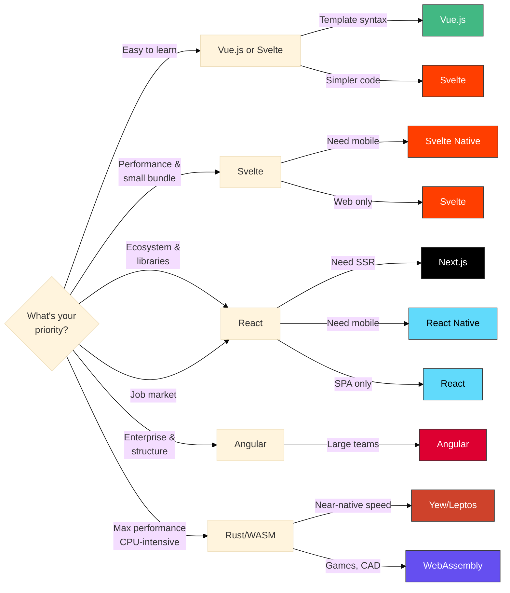

## Backend Frameworks

### Flask (Python)

**Official Website:** https://flask.palletsprojects.com/
**GitHub:** https://github.com/pallets/flask (70.7k stars)

**What it is:** A lightweight, flexible Python web framework.

**Key Features:**
- Minimalist core with extensions
- Easy to learn and get started
- Flexible - you choose your tools
- Great for APIs and small to medium applications
- Excellent documentation

**When to Use:**
- ✅ RESTful APIs
- ✅ Small to medium applications
- ✅ Microservices
- ✅ When you need flexibility
- ✅ Rapid prototyping
- ✅ Teams already using Python (data science, ML)

**When NOT to Use:**
- ❌ Very large monolithic applications
- ❌ When you need built-in admin panel and ORM
- ❌ When you want opinionated structure

**Example:**
```python
from flask import Flask, jsonify, request
from flask_cors import CORS

app = Flask(__name__)
CORS(app)

todos = []

@app.route('/api/todos', methods=['GET'])
def get_todos():
    return jsonify(todos)

@app.route('/api/todos', methods=['POST'])
def add_todo():
    todo = request.json
    todos.append(todo)
    return jsonify(todo), 201

if __name__ == '__main__':
    app.run(debug=True, host='0.0.0.0', port=8000)
```


---

### FastAPI (Python)

**Official Website:** https://fastapi.tiangolo.com/
**GitHub:** https://github.com/tiangolo/fastapi (91.4k stars)

**What it is:** A modern, fast Python web framework for building APIs with automatic documentation.

**Key Features:**
- Async/await support (high performance)
- Automatic API documentation (Swagger/OpenAPI)
- Type hints and validation (Pydantic)
- Fast development
- Production-ready

**When to Use:**
- ✅ RESTful APIs
- ✅ When performance is critical
- ✅ Microservices
- ✅ When you need automatic API docs
- ✅ ML model serving
- ✅ Real-time applications

**When NOT to Use:**
- ❌ Traditional server-rendered websites
- ❌ When you need built-in admin panel
- ❌ Very simple scripts (overkill)

**Example:**
```python
from fastapi import FastAPI
from pydantic import BaseModel
from typing import List

app = FastAPI()

class Todo(BaseModel):
    id: int
    text: str
    completed: bool = False

todos: List[Todo] = []

@app.get("/api/todos", response_model=List[Todo])
async def get_todos():
    return todos

@app.post("/api/todos", response_model=Todo)
async def add_todo(todo: Todo):
    todos.append(todo)
    return todo

# Automatic API docs at /docs
```


---

### Express.js (Node.js)

**Official Website:** https://expressjs.com/
**GitHub:** https://github.com/expressjs/express (68.1k stars)

**What it is:** A minimal and flexible Node.js web application framework.

**Key Features:**
- Minimalist design
- Middleware-based architecture
- Large ecosystem (npm)
- Full-stack JavaScript
- Unopinionated

**When to Use:**
- ✅ RESTful APIs
- ✅ When you want full-stack JavaScript
- ✅ Real-time applications (with Socket.io)
- ✅ Microservices
- ✅ When you need maximum flexibility

**When NOT to Use:**
- ❌ CPU-intensive tasks (Node.js is single-threaded)
- ❌ When you want opinionated structure

**Example:**
```javascript
const express = require('express');
const cors = require('cors');

const app = express();
app.use(cors());
app.use(express.json());

let todos = [];

app.get('/api/todos', (req, res) => {
  res.json(todos);
});

app.post('/api/todos', (req, res) => {
  const todo = req.body;
  todos.push(todo);
  res.status(201).json(todo);
});

app.listen(8000, () => {
  console.log('Server running on port 8000');
});
```


---

### NestJS (Node.js/TypeScript)

**Official Website:** https://nestjs.com/
**GitHub:** https://github.com/nestjs/nest (73.3k stars)

**What it is:** A progressive TypeScript framework for building efficient, scalable server-side applications and microservices.

**Key Features:**
- TypeScript-first with full type safety
- Modular architecture (modules, controllers, services)
- Dependency injection
- Built-in support for microservices (gRPC, Message queues)
- Decorators and extensive documentation
- Supports both Express and Fastify under the hood

**When to Use:**
- ✅ Enterprise-grade microservices
- ✅ When you need structure and scalability
- ✅ Teams that prefer TypeScript
- ✅ Complex domain logic requiring strong architecture
- ✅ GraphQL APIs
- ✅ Monorepo with multiple services

**When NOT to Use:**
- ❌ Simple, quick prototypes
- ❌ When team prefers minimal frameworks
- ❌ Very small projects (overhead might be unnecessary)

**Example:**
```typescript
// todo.controller.ts
import { Controller, Get, Post, Body } from '@nestjs/common';
import { TodoService } from './todo.service';
import { CreateTodoDto } from './dto/create-todo.dto';

@Controller('api/todos')
export class TodoController {
  constructor(private readonly todoService: TodoService) {}

  @Get()
  findAll() {
    return this.todoService.findAll();
  }

  @Post()
  create(@Body() createTodoDto: CreateTodoDto) {
    return this.todoService.create(createTodoDto);
  }
}

// todo.service.ts
import { Injectable } from '@nestjs/common';
import { CreateTodoDto } from './dto/create-todo.dto';

interface Todo {
  id: number;
  text: string;
  completed: boolean;
}

@Injectable()
export class TodoService {
  private todos: Todo[] = [];

  findAll(): Todo[] {
    return this.todos;
  }

  create(createTodoDto: CreateTodoDto): Todo {
    const todo: Todo = {
      id: Date.now(),
      ...createTodoDto,
      completed: false
    };
    this.todos.push(todo);
    return todo;
  }
}

// main.ts
import { NestFactory } from '@nestjs/core';
import { AppModule } from './app.module';

async function bootstrap() {
  const app = await NestFactory.create(AppModule);
  app.enableCors();
  await app.listen(8000);
}
bootstrap();
```

**Microservices Support:**
```typescript
// With microservices transport (e.g., gRPC, Redis, NATS)
import { Transport, MicroserviceOptions } from '@nestjs/microservices';

const app = await NestFactory.createMicroservice<MicroserviceOptions>(
  AppModule,
  {
    transport: Transport.REDIS,
    options: {
      host: 'localhost',
      port: 6379,
    },
  },
);
```


---

### Go Frameworks (Gin, Echo, Fiber)

**What it is:** High-performance web frameworks written in Go (Golang), designed for building fast, scalable APIs and microservices.

**Popular Options:**
- **Gin**: Most popular, HTTP router with middleware support
  - **GitHub:** https://github.com/gin-gonic/gin (86.8k stars)
  - **Website:** https://gin-gonic.com/
- **Echo**: High-performance, minimalist framework
  - **GitHub:** https://github.com/labstack/echo (31.7k stars)
  - **Website:** https://echo.labstack.com/
- **Fiber**: Express-inspired, extremely fast
  - **GitHub:** https://github.com/gofiber/fiber (38.3k stars)
  - **Website:** https://gofiber.io/

**Key Features:**
- Compiled language (single binary deployment)
- Excellent performance and low memory footprint
- Built-in concurrency (goroutines)
- Strong typing
- Fast compilation
- Small Docker images

**When to Use:**
- ✅ High-performance APIs and microservices
- ✅ When you need low latency and high throughput
- ✅ Cloud-native applications
- ✅ Real-time systems
- ✅ When you want simple deployment (single binary)
- ✅ CPU-intensive tasks
- ✅ Systems programming background

**When NOT to Use:**
- ❌ Rapid prototyping (slower development than Python/Ruby)
- ❌ When team is unfamiliar with Go
- ❌ Applications requiring rich ecosystem of libraries (Python/Node.js have more)
- ❌ Complex web applications with server-side rendering

**Example (Gin Framework):**
```go
package main

import (
    "net/http"
    "github.com/gin-gonic/gin"
)

type Todo struct {
    ID        int    `json:"id"`
    Text      string `json:"text"`
    Completed bool   `json:"completed"`
}

var todos = []Todo{}

func main() {
    router := gin.Default()

    // Enable CORS
    router.Use(func(c *gin.Context) {
        c.Writer.Header().Set("Access-Control-Allow-Origin", "*")
        c.Writer.Header().Set("Access-Control-Allow-Methods", "GET, POST, PUT, DELETE")
        c.Next()
    })

    // Get all todos
    router.GET("/api/todos", func(c *gin.Context) {
        c.JSON(http.StatusOK, todos)
    })

    // Create todo
    router.POST("/api/todos", func(c *gin.Context) {
        var todo Todo
        if err := c.BindJSON(&todo); err != nil {
            c.JSON(http.StatusBadRequest, gin.H{"error": err.Error()})
            return
        }
        todos = append(todos, todo)
        c.JSON(http.StatusCreated, todo)
    })

    router.Run(":8000")
}
```

**Example (Echo Framework):**
```go
package main

import (
    "net/http"
    "github.com/labstack/echo/v4"
    "github.com/labstack/echo/v4/middleware"
)

type Todo struct {
    ID        int    `json:"id"`
    Text      string `json:"text"`
    Completed bool   `json:"completed"`
}

var todos = []Todo{}

func main() {
    e := echo.New()

    // Middleware
    e.Use(middleware.CORS())
    e.Use(middleware.Logger())

    // Routes
    e.GET("/api/todos", getTodos)
    e.POST("/api/todos", createTodo)

    e.Start(":8000")
}

func getTodos(c echo.Context) error {
    return c.JSON(http.StatusOK, todos)
}

func createTodo(c echo.Context) error {
    todo := new(Todo)
    if err := c.Bind(todo); err != nil {
        return err
    }
    todos = append(todos, *todo)
    return c.JSON(http.StatusCreated, todo)
}
```

**Example (Fiber Framework):**
```go
package main

import (
    "github.com/gofiber/fiber/v2"
    "github.com/gofiber/fiber/v2/middleware/cors"
)

type Todo struct {
    ID        int    `json:"id"`
    Text      string `json:"text"`
    Completed bool   `json:"completed"`
}

var todos = []Todo{}

func main() {
    app := fiber.New()

    // Middleware
    app.Use(cors.New())

    // Routes
    app.Get("/api/todos", func(c *fiber.Ctx) error {
        return c.JSON(todos)
    })

    app.Post("/api/todos", func(c *fiber.Ctx) error {
        todo := new(Todo)
        if err := c.BodyParser(todo); err != nil {
            return err
        }
        todos = append(todos, *todo)
        return c.Status(201).JSON(todo)
    })

    app.Listen(":8000")
}
```


**Framework Comparison:**

| Feature | Gin | Echo | Fiber |
|---------|-----|------|-------|
| **Middleware** | Excellent | Excellent | Excellent |
| **Documentation** | Good | Excellent | Good |
| **Inspiration** | Martini | - | Express.js |
| **HTTP Router** | httprouter | Custom | fasthttp |

**Why Go for Backend?**

1. **Performance**:
   - Compiled to native code
   - Efficient memory usage
   - Built-in concurrency with goroutines
   - Can handle 10,000+ concurrent connections easily

2. **Deployment**:
   - Single binary (no dependencies)
   - Cross-platform compilation
   - Tiny Docker images (~10MB with Alpine)
   - Easy to containerize

3. **Cloud-Native**:
   - Kubernetes is written in Go
   - Many cloud-native tools use Go (Docker, Prometheus, Terraform)
   - Great for microservices

4. **Developer Experience**:
   - Fast compilation
   - Built-in testing
   - Great tooling (gofmt, go vet)
   - Strong standard library

**Real-World Use Cases:**

- **Docker**: Container platform
- **Kubernetes**: Container orchestration
- **Prometheus**: Monitoring system
- **Terraform**: Infrastructure as code
- **Uber**: Microservices platform
- **Dropbox**: Migration from Python to Go
- **Twitch**: Real-time messaging

---

### Rust Backend Frameworks

**What is Rust?** Rust is a systems programming language focused on safety, speed, and concurrency. It offers memory safety without garbage collection, making it ideal for high-performance backend services.

**Why Rust for Backend?**

1. **Performance**:
   - Compiled to native code like C/C++
   - Zero-cost abstractions
   - No garbage collection pauses
   - Performance comparable to or exceeding Go and C++

2. **Safety**:
   - Memory safety guaranteed at compile time
   - No null pointer exceptions
   - No data races in concurrent code
   - Catches bugs before runtime

3. **Concurrency**:
   - Fearless concurrency model
   - Async/await support
   - Multi-threaded without data races
   - Efficient task scheduling with Tokio runtime

4. **Deployment**:
   - Single static binary
   - Extremely small Docker images (~5MB)
   - Low memory footprint
   - Fast startup times

---

#### Actix-web

**Official Website:** https://actix.rs/
**GitHub:** https://github.com/actix/actix-web (23.8k stars)

**What it is:** A powerful, pragmatic, and extremely fast web framework for Rust, built on the Actix actor system.

**Key Features:**
- **Fastest** web framework (benchmarks consistently show top performance)
- Type-safe request/response handling
- Built-in WebSocket support
- Middleware support
- Async/await with Tokio
- HTTP/2 and HTTP/1.x support
- Excellent for microservices

**When to Use:**
- ✅ Need absolute maximum performance
- ✅ High-throughput APIs (100k+ req/s)
- ✅ Real-time services
- ✅ Microservices requiring minimal latency
- ✅ CPU-intensive operations
- ✅ When resource efficiency is critical

**When NOT to Use:**
- ❌ Team not familiar with Rust
- ❌ Rapid prototyping (compile times)
- ❌ Simple CRUD apps (might be overkill)

**Example:**
```rust
use actix_web::{web, App, HttpResponse, HttpServer, Responder};
use serde::{Deserialize, Serialize};
use std::sync::Mutex;

#[derive(Serialize, Deserialize, Clone)]
struct Todo {
    id: u32,
    text: String,
    completed: bool,
}

struct AppState {
    todos: Mutex<Vec<Todo>>,
}

#[actix_web::get("/api/todos")]
async fn get_todos(data: web::Data<AppState>) -> impl Responder {
    let todos = data.todos.lock().unwrap();
    HttpResponse::Ok().json(&*todos)
}

#[actix_web::post("/api/todos")]
async fn create_todo(
    todo: web::Json<Todo>,
    data: web::Data<AppState>,
) -> impl Responder {
    let mut todos = data.todos.lock().unwrap();
    todos.push(todo.into_inner());
    HttpResponse::Created().json(&todos.last())
}

#[actix_web::main]
async fn main() -> std::io::Result<()> {
    let app_state = web::Data::new(AppState {
        todos: Mutex::new(vec![]),
    });

    HttpServer::new(move || {
        App::new()
            .app_data(app_state.clone())
            .service(get_todos)
            .service(create_todo)
    })
    .bind(("0.0.0.0", 8000))?
    .run()
    .await
}
```


---

#### Rocket

**Official Website:** https://rocket.rs/
**GitHub:** https://github.com/rwf2/Rocket (25.5k stars)

**What it is:** A web framework for Rust that makes it simple to write fast, type-safe, secure web applications with minimal boilerplate.

**Key Features:**
- Type-safe routing with procedural macros
- Compile-time correctness guarantees
- Built-in form validation
- Templating support
- Testing library included
- Most ergonomic Rust framework
- JSON/Data serialization built-in

**When to Use:**
- ✅ Need type safety and compile-time guarantees
- ✅ Building APIs with validation
- ✅ Developer experience matters
- ✅ Want easier Rust web framework
- ✅ Microservices with complex routing
- ✅ When correctness is critical

**When NOT to Use:**
- ❌ Need absolute maximum performance (use Actix)
- ❌ Team new to Rust (still steep learning curve)
- ❌ Very simple services

**Example:**
```rust
#[macro_use] extern crate rocket;

use rocket::State;
use rocket::serde::{json::Json, Deserialize, Serialize};
use std::sync::Mutex;

#[derive(Serialize, Deserialize, Clone)]
#[serde(crate = "rocket::serde")]
struct Todo {
    id: u32,
    text: String,
    completed: bool,
}

struct AppState {
    todos: Mutex<Vec<Todo>>,
}

#[get("/api/todos")]
fn get_todos(state: &State<AppState>) -> Json<Vec<Todo>> {
    let todos = state.todos.lock().unwrap();
    Json(todos.clone())
}

#[post("/api/todos", data = "<todo>")]
fn create_todo(todo: Json<Todo>, state: &State<AppState>) -> Json<Todo> {
    let mut todos = state.todos.lock().unwrap();
    let new_todo = todo.into_inner();
    todos.push(new_todo.clone());
    Json(new_todo)
}

#[launch]
fn rocket() -> _ {
    rocket::build()
        .manage(AppState {
            todos: Mutex::new(vec![]),
        })
        .mount("/", routes![get_todos, create_todo])
}
```


---

#### Axum

**Official Website:** https://github.com/tokio-rs/axum (Docs via crates.io)
**GitHub:** https://github.com/tokio-rs/axum (23.6k stars)

**What it is:** A modern, ergonomic web framework built on Tokio, Tower, and Hyper, designed for the async Rust ecosystem.

**Key Features:**
- Built on Tokio async runtime
- Leverages Tower middleware ecosystem
- Type-safe extractors
- Minimal macros (more explicit)
- Excellent error handling
- WebSocket support
- Compile-time request/response validation
- Modular and composable

**When to Use:**
- ✅ Building on existing Tokio/Tower ecosystem
- ✅ Need flexible middleware composition
- ✅ Want modern async Rust patterns
- ✅ Microservices with complex middleware
- ✅ Integration with other async Rust libraries
- ✅ Prefer explicitness over macros

**When NOT to Use:**
- ❌ Need maximum ergonomics (use Rocket)
- ❌ Need proven stability (newer framework)
- ❌ Team prefers macro-based routing

**Example:**
```rust
use axum::{
    extract::State,
    http::StatusCode,
    routing::{get, post},
    Json, Router,
};
use serde::{Deserialize, Serialize};
use std::sync::{Arc, Mutex};

#[derive(Clone, Serialize, Deserialize)]
struct Todo {
    id: u32,
    text: String,
    completed: bool,
}

type SharedState = Arc<Mutex<Vec<Todo>>>;

async fn get_todos(State(todos): State<SharedState>) -> Json<Vec<Todo>> {
    let todos = todos.lock().unwrap();
    Json(todos.clone())
}

async fn create_todo(
    State(todos): State<SharedState>,
    Json(todo): Json<Todo>,
) -> (StatusCode, Json<Todo>) {
    let mut todos = todos.lock().unwrap();
    todos.push(todo.clone());
    (StatusCode::CREATED, Json(todo))
}

#[tokio::main]
async fn main() {
    let shared_state = Arc::new(Mutex::new(vec![]));

    let app = Router::new()
        .route("/api/todos", get(get_todos))
        .route("/api/todos", post(create_todo))
        .with_state(shared_state);

    let listener = tokio::net::TcpListener::bind("0.0.0.0:8000")
        .await
        .unwrap();

    axum::serve(listener, app).await.unwrap();
}
```


---

**Rust Framework Comparison:**

| Feature | Actix-web | Rocket | Axum |
|---------|-----------|--------|------|
| **Async Support** | Yes (Tokio) | Yes (Tokio) | Yes (Tokio) |
| **Type Safety** | Strong | Strongest | Strong |
| **Macros** | Moderate | Heavy | Minimal |
| **Middleware** | Built-in | Built-in | Tower ecosystem |
| **Maturity** | Very Mature | Mature | Newer |

**When to Choose Rust for Backend:**

1. **Performance-Critical Services**: Payment processing, trading systems, game servers
2. **Resource-Constrained Environments**: IoT gateways, edge computing
3. **High-Concurrency Services**: WebSocket servers, real-time data processing
4. **Safety-Critical Systems**: Healthcare, finance, automotive
5. **Microservices Platform**: When 10x performance improvement justifies learning curve

**Real-World Rust Backend Examples:**
- **Discord**: Handles millions of concurrent connections
- **Cloudflare**: Workers platform, ultra-low latency
- **AWS**: Firecracker (serverless), Bottlerocket (container OS)
- **Dropbox**: File sync engine rewrite
- **npm**: Package registry performance improvements
- **Microsoft**: Azure IoT Edge runtime

---

### Java Frameworks

**What is Java?** Java is a mature, statically-typed, object-oriented programming language with a massive ecosystem. It's widely used in enterprise environments and offers excellent performance, reliability, and extensive tooling.

**Why Java for Backend?**

1. **Maturity & Stability**:
   - 25+ years of production use
   - Battle-tested in enterprise environments
   - Extensive libraries and frameworks
   - Long-term support (LTS) versions

2. **Performance**:
   - JVM (Java Virtual Machine) optimizations
   - Just-In-Time (JIT) compilation
   - Excellent garbage collection
   - Comparable to Go in many benchmarks

3. **Enterprise Features**:
   - Strong typing and compile-time checks
   - Excellent IDE support (IntelliJ, Eclipse)
   - Built-in security features
   - Comprehensive monitoring and profiling tools

4. **Ecosystem**:
   - Vast library ecosystem (Maven Central)
   - Enterprise integration patterns
   - Database drivers for all major databases
   - Cloud-native tooling

---

#### Spring Boot

**Official Website:** https://spring.io/projects/spring-boot
**GitHub:** https://github.com/spring-projects/spring-boot (78.8k stars)

**What it is:** The most popular Java framework for building production-ready microservices and enterprise applications. Part of the Spring ecosystem.

**Key Features:**
- Auto-configuration and convention over configuration
- Embedded server (Tomcat, Jetty, Undertow)
- Production-ready features (health checks, metrics)
- Extensive Spring ecosystem integration
- Dependency injection and IoC container
- Comprehensive testing support

**When to Use:**
- ✅ Enterprise microservices
- ✅ Large-scale systems with complex business logic
- ✅ When you need extensive enterprise integrations
- ✅ RESTful and reactive APIs
- ✅ Teams with Java expertise
- ✅ Long-term maintainability is critical

**When NOT to Use:**
- ❌ Startup time is critical (<1s required)
- ❌ Very memory-constrained environments
- ❌ Simple scripts or CLI tools
- ❌ Team has no Java experience

**Example:**
```java
// TodoController.java
package com.example.todoapi.controller;

import org.springframework.web.bind.annotation.*;
import org.springframework.http.HttpStatus;
import java.util.*;

@RestController
@RequestMapping("/api/todos")
@CrossOrigin(origins = "*")
public class TodoController {

    private List<Todo> todos = new ArrayList<>();

    @GetMapping
    public List<Todo> getTodos() {
        return todos;
    }

    @PostMapping
    @ResponseStatus(HttpStatus.CREATED)
    public Todo createTodo(@RequestBody Todo todo) {
        todos.add(todo);
        return todo;
    }

    @DeleteMapping("/{id}")
    @ResponseStatus(HttpStatus.NO_CONTENT)
    public void deleteTodo(@PathVariable Long id) {
        todos.removeIf(t -> t.getId().equals(id));
    }
}

// Todo.java
package com.example.todoapi.model;

public class Todo {
    private Long id;
    private String text;
    private boolean completed;

    // Constructors, getters, setters
    public Todo() {}

    public Todo(Long id, String text, boolean completed) {
        this.id = id;
        this.text = text;
        this.completed = completed;
    }

    // Getters and setters...
    public Long getId() { return id; }
    public void setId(Long id) { this.id = id; }
    public String getText() { return text; }
    public void setText(String text) { this.text = text; }
    public boolean isCompleted() { return completed; }
    public void setCompleted(boolean completed) { this.completed = completed; }
}

// Application.java
package com.example.todoapi;

import org.springframework.boot.SpringApplication;
import org.springframework.boot.autoconfigure.SpringBootApplication;

@SpringBootApplication
public class TodoApiApplication {
    public static void main(String[] args) {
        SpringApplication.run(TodoApiApplication.class, args);
    }
}
```

---

#### Micronaut

**Official Website:** https://micronaut.io/
**GitHub:** https://github.com/micronaut-projects/micronaut-core (6.3k stars)

**What it is:** A modern JVM framework designed specifically for microservices and serverless applications with minimal memory footprint and fast startup.

**Key Features:**
- Compile-time dependency injection (no reflection)
- Fast startup time compared to traditional Spring Boot
- Low memory footprint with native images
- Native image support with GraalVM
- Reactive and non-blocking
- Built-in service discovery and distributed tracing

**When to Use:**
- ✅ Cloud-native microservices
- ✅ Serverless functions (AWS Lambda, Google Cloud Functions)
- ✅ When startup time matters
- ✅ Memory-constrained environments
- ✅ Need better performance than Spring Boot
- ✅ Modern reactive applications

**When NOT to Use:**
- ❌ Heavy enterprise integration requirements
- ❌ Team expects Spring-like conventions
- ❌ Need the massive Spring ecosystem

**Example:**
```java
// TodoController.java
package com.example.controller;

import io.micronaut.http.annotation.*;
import io.micronaut.http.HttpStatus;
import java.util.*;

@Controller("/api/todos")
public class TodoController {

    private List<Todo> todos = new ArrayList<>();

    @Get
    public List<Todo> getTodos() {
        return todos;
    }

    @Post
    @Status(HttpStatus.CREATED)
    public Todo createTodo(@Body Todo todo) {
        todos.add(todo);
        return todo;
    }

    @Delete("/{id}")
    @Status(HttpStatus.NO_CONTENT)
    public void deleteTodo(@PathVariable Long id) {
        todos.removeIf(t -> t.getId().equals(id));
    }
}

// Todo.java
package com.example.model;

import io.micronaut.serde.annotation.Serdeable;

@Serdeable
public class Todo {
    private Long id;
    private String text;
    private boolean completed;

    // Constructors, getters, setters
    public Todo() {}

    public Todo(Long id, String text, boolean completed) {
        this.id = id;
        this.text = text;
        this.completed = completed;
    }

    // Getters and setters...
}

// Application.java
package com.example;

import io.micronaut.runtime.Micronaut;

public class Application {
    public static void main(String[] args) {
        Micronaut.run(Application.class, args);
    }
}
```

---

#### Quarkus

**Official Website:** https://quarkus.io/
**GitHub:** https://github.com/quarkusio/quarkus (15.1k stars)

**What it is:** A Kubernetes-native Java framework designed for GraalVM and OpenJDK HotSpot, optimized for containers and cloud deployments.

**Key Features:**
- Supersonic startup time with GraalVM native images
- Very low memory footprint with native compilation
- Live coding (hot reload in development)
- Developer joy focus
- Reactive and imperative programming models
- Extension ecosystem

**When to Use:**
- ✅ Kubernetes-native microservices
- ✅ Serverless/FaaS with extreme startup requirements
- ✅ Container-optimized deployments
- ✅ When memory and startup time are critical
- ✅ Modern cloud-native Java applications
- ✅ Teams wanting modern Java development experience

**When NOT to Use:**
- ❌ Cannot use GraalVM native images (some libraries incompatible)
- ❌ Traditional Java EE applications
- ❌ Team prefers Spring conventions

**Example:**
```java
// TodoResource.java
package com.example.resource;

import javax.ws.rs.*;
import javax.ws.rs.core.MediaType;
import javax.ws.rs.core.Response;
import java.util.*;

@Path("/api/todos")
@Produces(MediaType.APPLICATION_JSON)
@Consumes(MediaType.APPLICATION_JSON)
public class TodoResource {

    private List<Todo> todos = new ArrayList<>();

    @GET
    public List<Todo> getTodos() {
        return todos;
    }

    @POST
    public Response createTodo(Todo todo) {
        todos.add(todo);
        return Response.status(Response.Status.CREATED)
                      .entity(todo)
                      .build();
    }

    @DELETE
    @Path("/{id}")
    public Response deleteTodo(@PathParam("id") Long id) {
        todos.removeIf(t -> t.id.equals(id));
        return Response.noContent().build();
    }
}

// Todo.java
package com.example.model;

public class Todo {
    public Long id;
    public String text;
    public boolean completed;

    public Todo() {}

    public Todo(Long id, String text, boolean completed) {
        this.id = id;
        this.text = text;
        this.completed = completed;
    }
}

// Build native image:
// ./mvnw package -Pnative
// Result: native executable optimized for fast startup and low memory usage
```

---

**Java Framework Comparison:**

| Feature | Spring Boot | Micronaut | Quarkus |
|---------|-------------|-----------|---------|
| **GitHub Stars** | 78.8k | 6.3k | 15.1k |
| **DI/IoC** | Runtime (reflection) | Compile-time | Compile-time |
| **Reactive Support** | Spring WebFlux | Built-in | Built-in |
| **Native Image** | Limited support | GraalVM | GraalVM (optimized) |
| **Ecosystem** | Massive (Spring ecosystem) | Growing | Growing |
| **Maturity** | Very Mature (15+ years) | Mature | Mature |
| **Primary Focus** | Enterprise apps | Cloud microservices | Cloud-native + serverless |

**When to Choose Java for Backend:**

1. **Enterprise Requirements**: Large organizations with existing Java infrastructure
2. **Complex Business Logic**: Domain-driven design, complex transactions
3. **Team Expertise**: Team already knows Java and wants modern frameworks
4. **Long-term Stability**: Projects that will run for 5-10+ years
5. **Integration Heavy**: Need to integrate with many enterprise systems
6. **Regulated Industries**: Banking, healthcare, insurance (mature, well-tested frameworks)

**Real-World Java Backend Examples:**
- **Netflix**: Microservices platform (Spring Boot)
- **Uber**: Marketplace services (Java + Spring)
- **LinkedIn**: Backend services (Play Framework, Spring)
- **Twitter**: Some services use JVM-based frameworks
- **Amazon**: Many internal services use Java
- **Banks & Financial Services**: Most use Java extensively (JPMorgan, Goldman Sachs)

**Cloud-Native Java Performance:**

Modern frameworks like Quarkus and Micronaut have significantly improved Java's cloud-native characteristics:
- **Faster Startup**: GraalVM native images can start in milliseconds instead of seconds
- **Lower Memory**: Native compilation reduces memory footprint dramatically compared to traditional JVM
- **Container-Optimized**: Designed specifically for containerized and serverless deployments

---

### Backend Framework Comparison (Microservices Focus)

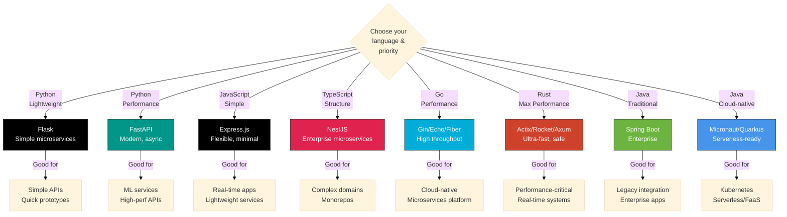

**Note:** This diagram focuses on microservice-friendly frameworks. Monolithic frameworks like Django and Rails have been omitted as they're not recommended for modern microservices architectures.


## Decision Framework

### Frontend Selection Criteria

| Criterion | React | Vue | Svelte | Angular | Rust/WASM (Yew) |
|-----------|-------|-----|--------|---------|-----------------|
| **GitHub Stars** | 240k | 210k | 84.6k | 99.2k | 32.1k |
| **TypeScript Support** | Excellent | Excellent | Excellent | Native | N/A (Rust) |
| **Mobile Development** | React Native | NativeScript | Svelte Native | Ionic | Tauri (native) |
| **Corporate Backing** | Meta | Independent | Independent | Google | Independent |
| **Common Use Cases** | Most web apps | Incremental adoption | Small bundles | Large teams | Games, CAD, ML inference |

### Backend Selection Criteria (Microservices)

| Criterion | Flask | FastAPI | Express | NestJS | Go (Gin) | Rust (Actix) | Java (Spring Boot) |
|-----------|-------|---------|---------|--------|----------|--------------|-------------------|
| **GitHub Stars** | 70.7k | 91.4k | 68.1k | 73.3k | 86.8k | 23.8k | 78.8k |
| **Async Support** | Basic | Excellent | Excellent | Excellent | Excellent (goroutines) | Excellent (Tokio) | Good (WebFlux) |
| **Type Safety** | Optional | Good (Pydantic) | Optional (TS) | Excellent (TypeScript) | Excellent (Go) | Strongest (Rust) | Excellent (Java) |
| **API Docs** | Manual/Swagger | Automatic (Swagger) | Manual/Swagger | Automatic (Swagger) | Manual/Swagger | Manual/utoipa | SpringDoc/Swagger |
| **Deployment** | Standard | Standard | Standard | Standard | Single Binary (~20MB) | Single Binary (~5MB) | JAR/Container (~50MB) |
| **Ecosystem** | Large | Growing | Huge | Large | Large | Growing | Massive (Maven Central) |
| **Common Use Cases** | Simple APIs | ML/Data services | Real-time apps | Enterprise services | Cloud-native | Performance-critical | Enterprise/Banking |

## AI-Assisted Development Friendliness

This section evaluates how well AI coding assistants (like Claude) can help you work with each framework, based on code generation reliability, error handling, and learning curve support.

### Frontend Frameworks

| Framework | AI Friendliness | Rating | Why |
|-----------|-----------------|--------|-----|
| **React** | ⭐⭐⭐⭐⭐ Excellent | 5/5 | Massive training data, clear functional patterns, hooks are straightforward, consistent conventions. AI excels at React code generation. |
| **Vue** | ⭐⭐⭐⭐ Very Good | 4/5 | Good documentation coverage, clear template syntax, options/composition API well understood. Slightly less training data than React. |
| **Svelte** | ⭐⭐⭐ Good | 3/5 | Simpler syntax helps, but less training data. Special reactive syntax (`$:`) can be tricky. AI handles basic patterns well. |
| **Angular** | ⭐⭐ Fair | 2/5 | Complex architecture, heavy decorators, RxJS patterns challenging for AI. More boilerplate means more room for errors. Better for experienced teams. |
| **Rust/WASM** | ⭐⭐ Fair | 2/5 | Ownership/borrowing/lifetimes are difficult for AI to reason about correctly. Type system complexity. Better with human Rust expertise. |

**Recommendation**: React and Vue are the most AI-friendly choices for rapid development with AI assistance.

### Backend Frameworks

| Framework | AI Friendliness | Rating | Why |
|-----------|-----------------|--------|-----|
| **Flask** | ⭐⭐⭐⭐⭐ Excellent | 5/5 | Simple, minimal, explicit patterns. AI generates clean Flask code easily. Huge training data. Perfect for rapid prototyping with AI. |
| **FastAPI** | ⭐⭐⭐⭐⭐ Excellent | 5/5 | Type hints provide clear intent, modern Python syntax. AI leverages types for accurate code generation. Automatic validation helps catch errors. |
| **Express** | ⭐⭐⭐⭐⭐ Excellent | 5/5 | Minimal, widely used, massive training data. Simple middleware patterns. AI handles Express naturally. |
| **NestJS** | ⭐⭐⭐ Good | 3/5 | TypeScript helps AI understand intent. Decorators and DI add complexity. Works well once patterns established. |
| **Go (Gin/Echo/Fiber)** | ⭐⭐⭐⭐ Very Good | 4/5 | Explicit, typed, simple syntax. Go's simplicity helps AI generate correct code. Error handling can be verbose but clear. |
| **Rust (Actix/Rocket/Axum)** | ⭐⭐ Fair | 2/5 | Ownership/borrowing/lifetimes challenge AI. Complex type inference. AI can help with patterns but needs human review for correctness. |
| **Spring Boot** | ⭐⭐ Fair | 2/5 | Heavy annotations, lots of boilerplate, complex configuration. AI struggles with dependency injection wiring and Spring magic. |
| **Micronaut/Quarkus** | ⭐⭐⭐ Good | 3/5 | Less boilerplate than Spring Boot. Cleaner patterns. Still Java verbosity. AI handles better than traditional Spring. |

**Recommendation**: Flask, FastAPI, and Express are the most AI-friendly backend choices. Go frameworks also work very well with AI assistance.

### Key Factors for AI Friendliness

**What Makes a Framework AI-Friendly:**

1. **Type Information**: TypeScript, Python type hints, Go, Java help AI understand intent
   - ✅ Best: TypeScript (NestJS), FastAPI (Pydantic), Go
   - ⚠️ Okay: JavaScript (can add JSDoc), Python (optional types)
   - ❌ Challenging: Rust (complex type system)

2. **Explicit Over Implicit**: Clear, readable code beats "magic"
   - ✅ Best: Flask, Express, Go frameworks
   - ⚠️ Okay: FastAPI (Pydantic magic is well-defined)
   - ❌ Challenging: Spring Boot (heavy dependency injection, annotations)

3. **Training Data Coverage**: Popular frameworks = better AI results
   - ✅ Best: React, Express, Flask (massive representation)
   - ⚠️ Okay: Vue, FastAPI, NestJS (good coverage)
   - ❌ Less: Svelte, Rust/WASM (smaller communities)

4. **Error Messages**: Clear errors help AI fix mistakes
   - ✅ Best: TypeScript, Rust (excellent compiler errors)
   - ⚠️ Okay: Go, Python
   - ❌ Challenging: JavaScript runtime errors

5. **Pattern Consistency**: Predictable patterns = reliable generation
   - ✅ Best: Go (one obvious way), React hooks (clear patterns)
   - ⚠️ Okay: Vue (options vs composition), Python (many ways to do things)
   - ❌ Challenging: Spring Boot (many configuration styles)

### Practical AI-Assisted Development Scenarios

**Best Combinations for AI Pair Programming:**

| Scenario | Frontend | Backend | Why |
|----------|----------|---------|-----|
| **Rapid Prototyping** | React | Flask or Express | AI generates clean, working code fast. Minimal boilerplate. |
| **Production MVP** | React or Vue | FastAPI | Type safety catches AI mistakes. Great developer experience. |
| **Type-Safe Stack** | React + TypeScript | NestJS | End-to-end types help AI maintain consistency. |
| **High Performance** | React | Go (Gin) | Go's simplicity + React's popularity = good AI support. |
| **Learning Project** | React | Flask or FastAPI | AI can explain and generate educational code easily. |

**Avoid for AI-Heavy Development:**
- Angular + Spring Boot: Too much complexity, boilerplate, and "magic" for optimal AI assistance
- Rust full-stack: Ownership model challenging for AI to reason about correctly
- Complex NestJS microservices: DI and decorators add cognitive load for AI

### Tips for Working with AI on Any Framework

1. **Be Explicit**: Add type annotations even when optional (TypeScript, Python type hints)
2. **Use Comments**: Describe intent, AI uses this to generate better code
3. **Prefer Simple Patterns**: Avoid clever abstractions until needed
4. **Validate AI Output**: Always review generated code, especially for:
   - Security (authentication, input validation)
   - Error handling
   - Edge cases
   - Performance implications
5. **Iterative Refinement**: Ask AI to fix/improve generated code in small steps

## Real-World Use Cases (Microservices Architecture)

### E-Commerce Microservices Platform

**Frontend:** Next.js (React with SSR)
- SEO-optimized product pages
- Complex state management
- Server-side rendering

**Backend:** Microservices with multiple frameworks
- **Product Service**: FastAPI (Python) - High-performance product catalog
- **User Service**: Go (Gin) - Authentication and user management
- **Order Service**: NestJS (TypeScript) - Complex order processing logic
- **Payment Service**: Go (Echo) - High-security payment processing

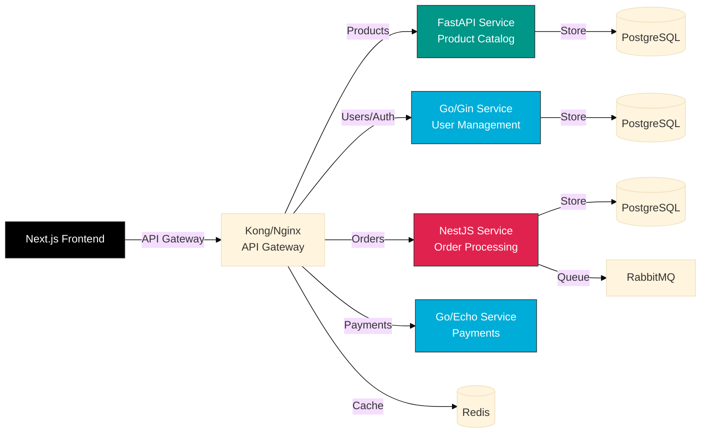

**Why this architecture:**
- Each service uses the best framework for its specific needs
- FastAPI for data-heavy product catalog
- Go for high-performance auth and payments
- NestJS for complex business logic in orders

---

### Real-Time Chat Application

**Frontend:** React or Vue
- Real-time updates
- Component-based for chat rooms/messages

**Backend:** Express.js with Socket.io
- WebSocket support
- Non-blocking I/O
- Full-stack JavaScript

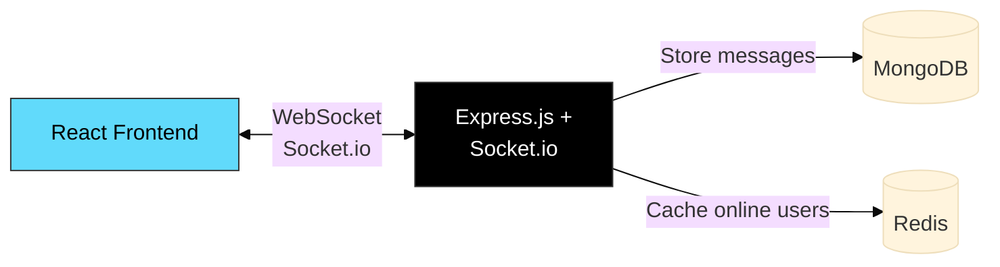

---

### Machine Learning Dashboard

**Frontend:** Svelte
- Data visualization
- Small bundle size
- Fast updates for real-time metrics

**Backend:** FastAPI
- Serve ML models
- High performance
- Automatic API documentation
- Type validation

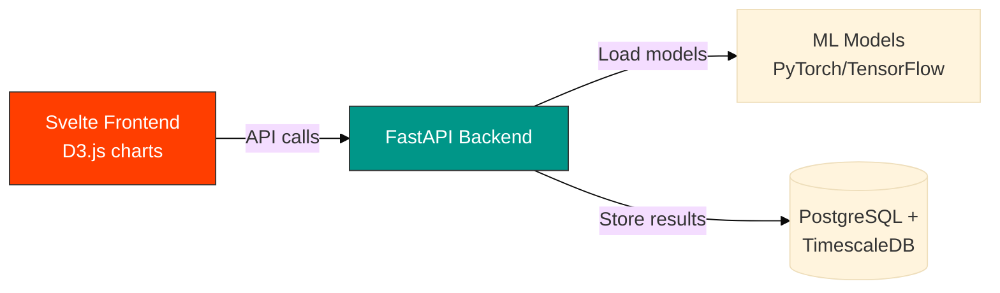

---

### Enterprise Internal Tool (Microservices)

**Frontend:** Angular
- TypeScript for type safety
- Large team needs structure
- Component-based architecture

**Backend:** NestJS Microservices
- TypeScript across the stack
- Modular architecture
- Built-in microservices support (gRPC, message queues)
- Dependency injection for testability

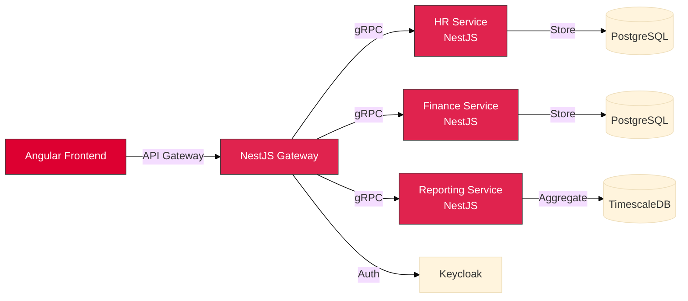

**Why NestJS:**
- TypeScript across frontend and backend
- Built-in microservices patterns
- Easy to scale and maintain
- Strong typing reduces bugs in large codebases

---

### Microservices Platform

**Frontend:** React
- Modern UI
- API gateway communication
- Service-agnostic

**Backend:** Go (Gin/Echo)
- High-performance microservices
- Low resource footprint
- Single binary deployment
- Built-in concurrency

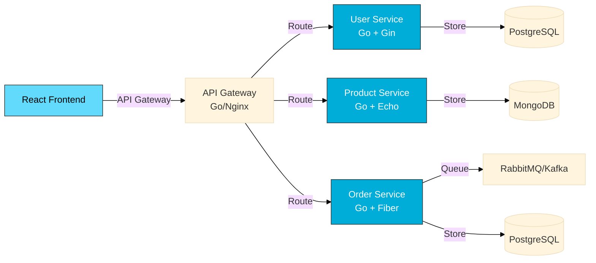

**Why Go for Microservices?**
- Fast startup time (critical for scaling)
- Small memory footprint (cost-effective)
- Easy deployment (single binary)
- Excellent concurrency (goroutines)
- Strong typing (fewer runtime errors)

---

### High-Performance Trading Platform (Rust for Performance-Critical Services)

**Frontend:** React with WASM modules for charting
- Real-time data visualization
- WebAssembly for intensive chart calculations
- Sub-millisecond UI updates

**Backend:** Polyglot microservices emphasizing performance
- **Market Data Service**: Rust (Actix-web) - Ultra-low latency market data processing
- **Order Matching Engine**: Rust (Actix-web) - High-frequency order matching (80k+ req/s)
- **Risk Management**: Go (Gin) - Real-time risk calculations
- **User Service**: NestJS (TypeScript) - Account management and auth
- **Analytics Service**: FastAPI (Python) - ML-based trading signals

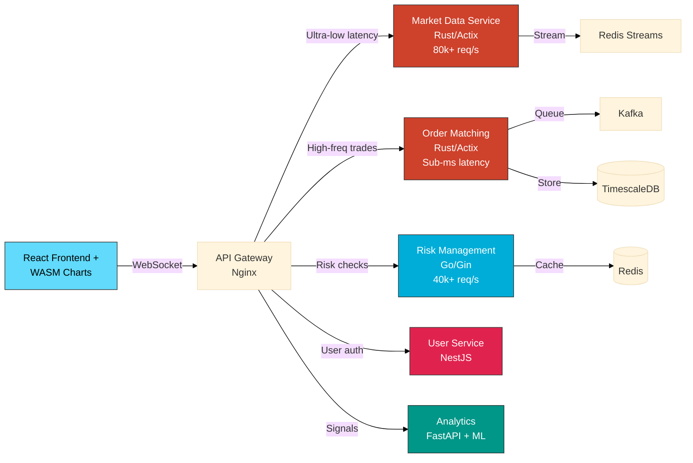

**Why Rust for Critical Services:**
- **Sub-millisecond latency**: Rust's zero-cost abstractions and lack of garbage collection enable predictable low latency
- **Memory safety**: No crashes in production (financial industry requirement)
- **Predictable performance**: No garbage collection pauses that could delay critical operations
- **Resource efficiency**: Compiled native code with minimal runtime overhead
- **Zero-downtime**: Reliability for 24/7 trading operations

**Real-World Examples:**
- **Coinbase**: Exchange matching engine uses Rust
- **Discord**: Rust for message routing (handles millions of concurrent connections)
- **Figma**: Multiplayer engine uses Rust + WebAssembly

---

### Real-Time Gaming Backend (Rust for Low-Latency Services)

**Frontend:** React or Rust/WASM (Yew) for game client
- Real-time game state rendering
- WebAssembly for game physics (if using browser)
- Low-latency input handling

**Backend:** Rust-focused microservices
- **Game Server**: Rust (Axum) - Real-time game loop, 60+ ticks/s
- **Matchmaking**: Go (Fiber) - Fast player matching
- **User Service**: NestJS - Authentication, profiles
- **Leaderboards**: Redis + Go (Gin) - Real-time rankings

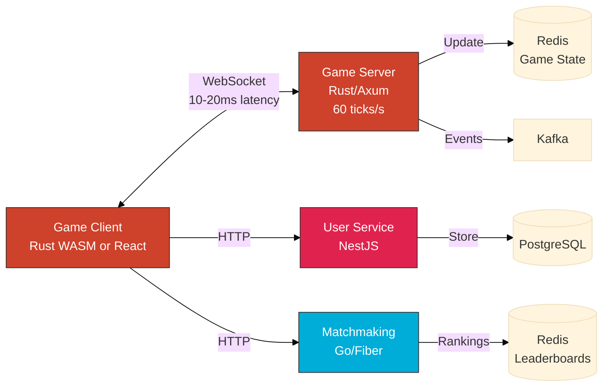

**Why Rust for Game Servers:**
- **Consistent frame times**: No GC pauses during gameplay
- **High tick rate**: Maintain 60+ game updates/second
- **Concurrent connections**: Handle thousands of players per server
- **Memory efficiency**: Run more game instances per machine
- **Safety**: Prevent crashes during live games

---

## Full-Stack Frameworks

Some frameworks handle both frontend and backend:

### Next.js (React)

**Official Website:** https://nextjs.org/
**GitHub:** https://github.com/vercel/next.js (135k stars)

- React framework with server-side rendering
- API routes built-in
- Automatic code splitting
- Best for: SEO-critical React apps

```javascript
// pages/api/todos.js - API route
export default function handler(req, res) {
  const todos = getTodos(); // Your logic
  res.json(todos);
}

// pages/index.js - React component with SSR
export async function getServerSideProps() {
  const todos = await fetch('http://localhost:3000/api/todos').then(r => r.json());
  return { props: { todos } };
}

export default function Home({ todos }) {
  return <TodoList todos={todos} />;
}
```

### SvelteKit (Svelte)

**Official Website:** https://kit.svelte.dev/

**GitHub:** https://github.com/sveltejs/kit (19.9k stars)

- Full-stack Svelte framework
- Server-side rendering and static site generation
- File-based routing with API endpoints
- Best for: Performance-focused Svelte apps with SSR

```javascript
// src/routes/api/todos/+server.js - API endpoint
export async function GET() {
  const todos = getTodos(); // Your logic
  return new Response(JSON.stringify(todos), {
    headers: { 'content-type': 'application/json' }
  });
}

export async function POST({ request }) {
  const todo = await request.json();
  // Add todo logic
  return new Response(JSON.stringify(todo), { status: 201 });
}
```

```svelte
<!-- src/routes/+page.svelte - Page component with SSR -->
<script>
  export let data; // From load function
</script>

<h1>Todos</h1>
<TodoList todos={data.todos} />

<!-- src/routes/+page.js - Load function for SSR -->
<script context="module">
  export async function load({ fetch }) {
    const res = await fetch('/api/todos');
    const todos = await res.json();
    return { props: { todos } };
  }
</script>
```

### Nuxt.js (Vue)

**Official Website:** https://nuxt.com/
**GitHub:** https://github.com/nuxt/nuxt (58.7k stars)

- Vue framework with SSR
- File-based routing with server middleware
- Similar to Next.js but for Vue

```vue
<!-- pages/index.vue - Vue component with SSR -->
<template>
  <div>
    <h1>Todos</h1>
    <TodoList :todos="todos" />
  </div>
</template>

<script setup>
const { data: todos } = await useFetch('/api/todos')
</script>

<!-- server/api/todos.js - API endpoint -->
<script>
export default defineEventHandler(async (event) => {
  const todos = getTodos(); // Your logic
  return todos;
})
</script>
```

## Common Mistakes

### 1. Choosing Based on Hype

**Mistake:** "Everyone is using React, so we must too!"

**Better:** Evaluate based on your specific needs, team skills, and project requirements.

### 2. Using Enterprise Framework for Simple Project

**Mistake:** Using Angular for a simple landing page

**Better:** Match complexity of framework to complexity of project

### 3. Ignoring Team Experience

**Mistake:** Choosing Svelte when team knows React well

**Better:** Consider learning curve and team productivity

### 4. Not Considering Ecosystem

**Mistake:** Choosing framework without checking if libraries you need exist

**Better:** Research ecosystem for your specific needs (auth, forms, charts, etc.)

### 5. Premature Optimization

**Mistake:** "We need to use Go because it's fastest!"

**Better:** Developer productivity often more important than raw performance. Optimize when you have actual performance problems.

## Recommendations by Project Type (Microservices Focus)

| Project Type | Frontend | Backend | Why |
|--------------|----------|---------|-----|
| **Simple API** | None or minimal | Flask/FastAPI | Quick, lightweight, async support |
| **Todo App (Tutorial)** | Vanilla JS or React | Flask | Learning fundamentals |
| **E-commerce Platform** | Next.js (React) | FastAPI + Go + NestJS | Multiple services for different needs |
| **Real-Time Chat** | React/Vue | Express/NestJS + Socket.io | WebSockets, event-driven |
| **ML/Data Dashboard** | Svelte/React | FastAPI | Performance, async, ML model serving |
| **Enterprise Services** | Angular | NestJS | TypeScript end-to-end, strong architecture |
| **Payment Processing** | Any | Go (Gin/Echo) | Security, performance critical |
| **User Authentication** | Any | Go/NestJS | High security, scalable |
| **Mobile + Web** | React | FastAPI/Go | React Native reuse, fast APIs |
| **Microservices Platform** | React/Vue | Go (Gin/Echo/Fiber) | Cloud-native, low resources |
| **High-Traffic API** | Any | Go/FastAPI | Low latency, high throughput |
| **IoT/Real-Time System** | React/Svelte | Go (Fiber) | Concurrency, real-time performance |
| **Data Analytics Service** | React | FastAPI | Python data libs, async processing |
| **Content API** | Any | Express/FastAPI | Fast development, flexible |

**Key Principle:** Choose based on service requirements, not monolithic thinking. Different services can use different frameworks!

## What We're Using in This Course

In this tutorial series, we use:

- **Frontend:**
  - Tutorial 1: Vanilla JavaScript (fundamentals)
  - Tutorial 8: React (modern framework)

- **Backend:**
  - Flask (simple, Python-based, easy to learn)

- **Why these choices:**
  - Flask: Lightweight, great for learning APIs
  - Vanilla JS first: Understand fundamentals before frameworks
  - React: Most popular, excellent job market, large ecosystem

## Next Steps

1. **Tutorial 1**: Build with vanilla JavaScript and Flask (fundamentals)
2. **Tutorial 2**: Containerize with Docker
3. **Tutorial 3**: Understand databases
4. **Tutorial 5**: Deploy to Kubernetes
5. **Tutorial 8**: Rebuild with React (see framework benefits)

## Further Reading

**Frontend:**
- [React Documentation](https://react.dev/)
- [Vue.js Guide](https://vuejs.org/guide/)
- [Svelte Tutorial](https://svelte.dev/tutorial)
- [Angular Docs](https://angular.io/docs)

**Backend (Microservices-Friendly):**
- [Flask Mega-Tutorial](https://blog.miguelgrinberg.com/post/the-flask-mega-tutorial-part-i-hello-world)
- [FastAPI Documentation](https://fastapi.tiangolo.com/)
- [Express.js Guide](https://expressjs.com/en/guide/routing.html)
- [NestJS Documentation](https://docs.nestjs.com/)
- [NestJS Microservices](https://docs.nestjs.com/microservices/basics)
- [Gin Web Framework](https://gin-gonic.com/docs/)
- [Echo Framework](https://echo.labstack.com/guide/)
- [Fiber Documentation](https://docs.gofiber.io/)
- [Go by Example](https://gobyexample.com/)

**Microservices Architecture:**
- [Microservices.io](https://microservices.io/)
- [Building Microservices Book](https://samnewman.io/books/building_microservices_2nd_edition/)

Remember: **In microservices, choose the best framework for EACH service's specific needs, not one framework for everything!**
