# Tutorial 5: Microservices and Kubernetes

An introduction to microservices architecture and Kubernetes concepts for deploying distributed systems.

## Why This Tutorial Matters

**Course Requirement**: In this course, you will build a microservices-based application deployed on Kubernetes. This tutorial teaches the foundational concepts you need to understand.

**What You'll Learn:**

**Microservices Architecture** - How to structure an application as independent services that communicate over networks. Companies like Netflix, Uber, and Amazon use this pattern to enable multiple independent teams to deploy updates without coordination.

**Kubernetes** - The container orchestration platform that automates deployment, scaling, and management of containerized applications. It handles automatic healing, load balancing, rolling updates, and service discovery.

These are industry-standard technologies widely used in cloud-native application development.

## Learning Objectives

By the end of this tutorial, you will understand:
- What microservices architecture is and its key characteristics
- Differences between monolithic and microservices architectures
- How Kubernetes works: the controller pattern, desired state, and reconciliation
- Core Kubernetes resources: Pods, Deployments, StatefulSets, and Services
- Why the Deployment → ReplicaSet → Pod hierarchy exists
- Database-per-service pattern
- API Gateway pattern for routing and authentication
- **Kubernetes Ingress for exposing services to the internet**
- How Kubernetes enables zero-downtime deployments
- The difference between stateless and stateful workloads
- How to deploy and manage microservices on Kubernetes

## Prerequisites

- Completed Tutorial 1-4 (Docker, Databases, Frameworks)
- Basic understanding of containers
- Familiarity with Docker concepts

## What are Microservices?

**Microservices** is an architectural style that structures an application as a collection of small, autonomous services. Instead of building one large, monolithic application where all functionality is tightly coupled, you decompose the system into independent services that each handle a specific business capability.

### Core Characteristics

Each microservice:

1. **Runs Independently**: Operates in its own process or container, isolated from other services. If the Payment Service crashes, the User Service continues running normally. This isolation is achieved through containerization (Docker) and orchestration (Kubernetes). Each service has its own memory space, CPU allocation, and file system. When one service experiences a memory leak or crashes due to a bug, it doesn't affect the memory or stability of other services. The operating system or container runtime treats each service as a separate, independent application.

2. **Communicates Over Networks**: Services talk to each other using standard network protocols like HTTP/REST, gRPC, or message queues. This is fundamentally different from monoliths where components communicate via in-memory function calls. When the Order Service needs user information, it makes an HTTP request to the User Service over the network (e.g., `GET http://user-service:5000/api/users/123`). This network communication adds latency (typically 1-50ms) but provides the isolation and independence that enables separate deployments. Services serialize data to JSON or Protocol Buffers, send it over TCP/IP, and the receiving service deserializes it back into objects.

3. **Deploys Independently**: You can update the Order Service to version 2.0 without touching or redeploying the User Service. This enables multiple teams to work simultaneously without coordination bottlenecks. Independent deployment means each service has its own CI/CD pipeline, its own release schedule, and its own version number. When you deploy Order Service v2.0, Kubernetes performs a rolling update of just the Order Service Pods while all other services continue running their current versions. This is possible because services communicate through well-defined APIs (REST endpoints) that maintain backward compatibility.

4. **Owns Its Data**: Each service has its own database. The Product Service owns the product database, and no other service directly queries that database. This is called the "database-per-service" pattern. Data ownership means the Product Service is the only service that can read or write to the `products` table. If the Order Service needs product information, it must call the Product Service API (`GET /api/products/456`) rather than querying the database directly. This prevents tight coupling between services and allows the Product Service team to change their database schema, switch databases (PostgreSQL to MongoDB), or optimize queries without breaking other services. However, this pattern makes operations that would be simple database JOINs in a monolith more complex - requiring multiple API calls or eventual consistency patterns.

5. **Can Use Different Technologies**: The User Service might use Python/Flask for rapid development, while the Payment Service uses Java/Spring for enterprise integration, and the Analytics Service uses Go for high performance. This is called a "polyglot" architecture. Technology independence works because services communicate through language-agnostic protocols (HTTP/JSON, gRPC). The User Service doesn't care that the Payment Service is written in Java - it just sends an HTTP POST request and receives JSON back. This allows teams to choose technologies that fit their specific requirements: Python for machine learning libraries, Go for low-latency APIs, Java for accessing enterprise systems, Node.js for real-time event handling. However, it also increases operational complexity since you need expertise in multiple languages, different monitoring tools, and diverse dependency management systems.

6. **Is Developed by a Small Team**: Amazon's famous "two-pizza team" rule - if you can't feed the team with two pizzas, it's too large. Typically 5-10 developers per service. Small teams own complete services from design to deployment to operations. A team of 7 developers can fully understand their service's codebase, make decisions quickly without extensive meetings, and deploy changes rapidly. This contrasts with large monolithic codebases where 50+ developers work in the same repository, requiring extensive code reviews, coordination meetings, and careful merge conflict resolution. The service boundary creates a natural organizational boundary - the User Service team can make internal changes without coordinating with the Order Service team, as long as they maintain the public API contract.

### Real-World Example: E-commerce Platform

Consider an online shopping platform. Instead of building one monolithic application containing all features, you split it into specialized services:

**User Service** (Python/Flask)
- User registration and authentication
- Profile management
- Address book
- 3 developers, deploys 2-3 times per week

**Product Service** (Python/FastAPI)
- Product catalog and search
- Inventory management
- Product recommendations
- 5 developers, deploys daily (high traffic, frequent updates)

**Order Service** (Go/Gin)
- Shopping cart
- Order processing
- Order history
- 4 developers, deploys weekly (critical, changes carefully)

**Payment Service** (Java/Spring Boot)
- Payment processing
- Integration with payment gateways (Stripe, PayPal)
- PCI compliance requirements
- 3 developers, deploys monthly (security-critical)

**Notification Service** (Node.js/Express)
- Email notifications (order confirmations, shipping updates)
- SMS notifications
- Push notifications
- 2 developers, deploys as needed

**Why This Matters:**
- Product Service can scale to 20 instances during Black Friday while User Service stays at 3
- Payment Service can use Java's enterprise libraries for PCI compliance
- A bug in Notification Service doesn't prevent customers from placing orders
- The Order Service team can deploy bug fixes without waiting for the Product Service team

---

## Monolithic vs Microservices

Understanding the differences between these architectures is crucial for making the right choice for your project.

### Monolithic Architecture

A **monolith** is a single, unified application where all functionality exists in one codebase and runs as a single process. This is how most applications start - and for good reason: monoliths are simpler to build initially.

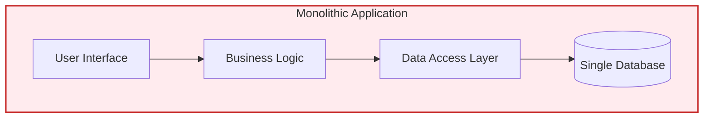

**Characteristics:**

1. **Single Codebase**: All features - user management, product catalog, orders, payments - exist in one repository. A developer can search the entire codebase to understand how features work.

2. **Single Deployment Unit**: To deploy any change, you must deploy the entire application. Fixing a typo in the email template requires rebuilding and redeploying everything.

3. **Shared Database**: All features access the same database. The User module can directly query the Order table. This makes complex queries easy but creates tight coupling.

4. **Scales as a Whole**: If the product search feature needs more resources, you must scale the entire application - even though user authentication doesn't need extra capacity.

**Example: Traditional E-commerce Monolith**
```
ecommerce-app/
├── app.py              (All routes in one file)
├── models/
│   ├── user.py         (User database model)
│   ├── product.py      (Product database model)
│   ├── order.py        (Order database model)
│   └── payment.py      (Payment database model)
├── services/
│   ├── auth.py         (Authentication logic)
│   ├── catalog.py      (Product logic)
│   ├── checkout.py     (Order logic)
│   └── billing.py      (Payment logic)
└── database.py         (Single database connection)

All runs in one process on port 5000
All shares the same PostgreSQL database
One bug crashes everything
```

### Microservices Architecture

A **microservices architecture** decomposes the application into multiple small services, each running independently. This enables organizational scalability - multiple teams can work on different services simultaneously without stepping on each other's toes.

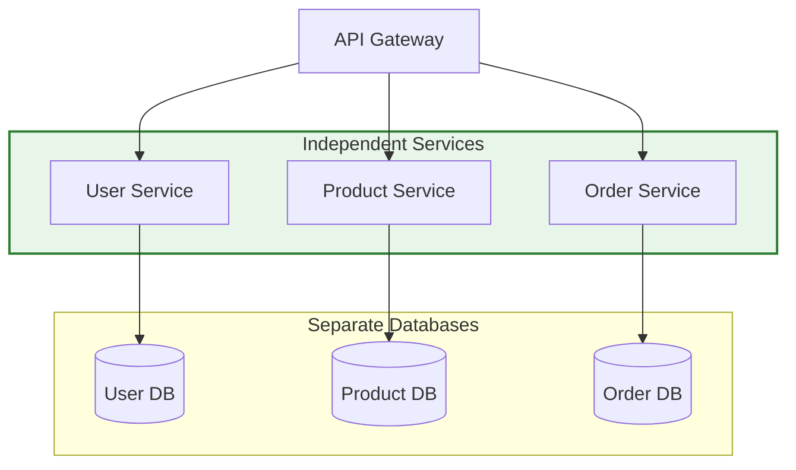

**Characteristics:**

1. **Multiple Codebases**: Each service has its own repository. The User Service team works in `user-service` repo, Product Service team in `product-service` repo. Code reviews are faster because teams focus on their domain.

2. **Independent Deployments**: Services deploy separately. The Product team can deploy 5 times a day while the Payment team deploys monthly. No coordination needed.

3. **Database Per Service**: Each service owns its data. Product Service can use MongoDB for flexible schemas, User Service uses PostgreSQL for relational data. No service directly queries another service's database.

4. **Scales Individually**: During a sale, Product Service scales to 20 instances to handle search traffic. User Service stays at 3 instances since login traffic is normal. This saves infrastructure costs.

**Example: Microservices E-commerce Structure**
```
user-service/
├── app.py              (Flask app, port 5001)
├── models/user.py
└── database.py         (PostgreSQL: users_db)
Deployed independently, 3 instances

product-service/
├── app.py              (FastAPI app, port 5002)
├── models/product.py
└── database.py         (MongoDB: products_db)
Deployed independently, 10 instances (high traffic)

order-service/
├── main.go             (Go/Gin app, port 5003)
├── models/order.go
└── database.go         (PostgreSQL: orders_db)
Deployed independently, 3 instances

api-gateway/
├── nginx.conf          (Routes /users → user-service:5001)
│                       (Routes /products → product-service:5002)
│                       (Routes /orders → order-service:5003)
└── port 8080

Each service:
- Has its own database
- Can be deployed without affecting others
- Can scale independently
- Can use different technologies
- Failure is isolated
```

---

## Comparison: Monolithic vs Microservices

| Aspect | Monolithic | Microservices |
|--------|-----------|---------------|
| **Deployment** | Deploy entire application | Deploy services independently |
| **Scaling** | Scale entire application | Scale individual services |
| **Technology** | Single tech stack | Polyglot (different frameworks) |
| **Database** | Single shared database | Database per service |
| **Team Structure** | One large team | Multiple small teams |
| **Failure Impact** | Entire app fails | Only one service fails |
| **Complexity** | Simple architecture | Complex communication/orchestration |
| **Development Speed** | Fast initially, slows with size | Slower initially, scales better |
| **Best For** | Small/medium apps | Large apps, multiple teams |

---

## Understanding Microservices in Practice

### Key Benefits

**1. Independent Deployment**

Each service can be deployed separately without affecting others. This means the Product Service team can deploy new search features on Monday, the User Service team can deploy authentication improvements on Tuesday, and the Payment Service team can deploy compliance updates on Friday - all without coordinating or waiting for each other.

**How it works**: Each service has its own container image (e.g., `product-service:v2.3.1`) stored in a container registry. When you update the Product Service, Kubernetes pulls the new image and performs a rolling update of only the Product Service Pods. All other services continue running their current versions. The services communicate through versioned APIs (e.g., `/api/v1/products`), so as long as the Product Service maintains backward compatibility in its API, other services aren't affected by the deployment.

**Impact**: A team can deploy 10 times per day instead of waiting for weekly coordinated releases. If a deployment introduces a bug, only that service is affected and can be quickly rolled back without touching other services.

**Example**: Product team deploys new search features while Payment team works on compliance updates. Neither team blocks the other.

**2. Independent Scaling**

Scale individual services based on their specific load rather than scaling the entire application. During a Black Friday sale, your Product Service might receive 1 million requests per hour (product searches, browsing), while your User Service receives only 50,000 requests per hour (login, profile updates).

**How it works**: In Kubernetes, you can run 20 replicas of the Product Service to handle high search traffic while running only 3 replicas of the User Service. Each replica is a separate Pod running the service. Kubernetes' Service resource automatically load balances incoming requests across all replicas. You can even configure Horizontal Pod Autoscaler (HPA) to automatically scale based on CPU usage: `kubectl autoscale deployment product-service --min=5 --max=50 --cpu-percent=70`. When CPU usage exceeds 70%, Kubernetes automatically adds more replicas.

**Impact**: More resource-efficient and cost-effective than scaling the entire application. You only pay for the compute resources you actually need for each service.

**Example**: E-commerce site scales Product Service to 20 instances during sales (high traffic), while User Service stays at 3 instances (normal traffic). This could save 60% in infrastructure costs compared to scaling everything uniformly.

**3. Technology Diversity (Polyglot Architecture)**

Choose the best technology for each service's specific requirements. Not every service has the same needs - some need rapid development, some need maximum performance, some need specific libraries or enterprise integrations.

**How it works**: Services communicate through language-agnostic protocols (HTTP/REST with JSON, or gRPC with Protocol Buffers). The User Service written in Python makes an HTTP request: `POST http://payment-service:8080/api/payments` with a JSON body. The Payment Service written in Java receives the HTTP request, deserializes the JSON, processes the payment, and returns JSON. Neither service needs to know the other's implementation language. In Kubernetes, each service is packaged as a Docker container - the container image includes all the language-specific dependencies (Python interpreter for User Service, JVM for Payment Service).

**Impact**: Use the right tool for the job. Python has excellent ML libraries (TensorFlow, scikit-learn), Go has low latency and high throughput, Java has mature enterprise libraries, Node.js excels at real-time communication.

**Example**: ML Service uses Python/TensorFlow for recommendation algorithms, API Gateway uses Go/Gin for high performance (handles 50,000 requests/second), Payment Service uses Java/Spring to integrate with enterprise payment gateways that provide Java SDKs.

**4. Fault Isolation**

Failure in one service doesn't crash the entire system. If the Notification Service crashes due to a bug, users can still browse products, place orders, and make payments. Only email notifications are temporarily unavailable.

**How it works**: Each service runs in separate Pods with separate memory and CPU. When the Notification Service crashes due to an out-of-memory error, only its Pods crash. Kubernetes detects the crash (via liveness probes), kills the failed Pods, and starts new replacement Pods. Meanwhile, the Order Service continues processing orders - it just logs a warning that it couldn't send the email notification. You can implement fallback mechanisms: if Notification Service is down for more than 5 minutes, queue the notifications in a database to send later when the service recovers.

**Impact**: System degradation instead of complete failure. The user experience is slightly degraded (no confirmation email) but core functionality (ordering) still works.

**Example**: If Notification Service fails at 2 AM, users can still browse products and place orders. The on-call engineer receives an alert and fixes it in the morning. No emergency wakeup needed because core business operations continue.

**5. Team Autonomy**

Small teams own specific services end-to-end, from design to deployment to operations. A team of 5-8 developers owns the Product Service - they understand the entire codebase, they decide on technology choices, they manage the database schema, they deploy on their own schedule.

**How it works**: The service boundary creates an organizational boundary. The Product Service team owns the product catalog database, the product search API, the product-service codebase, and the Kubernetes Deployment configuration. They communicate with other teams through well-defined API contracts (`GET /api/v1/products`). If they want to refactor internal code, switch from PostgreSQL to MongoDB, or change their caching strategy - they can do so without asking permission from other teams, as long as the external API remains stable. Other teams treat the Product Service as a "black box" - they only care about the API contract, not the internal implementation.

**Impact**: Faster decision-making (no need for cross-team approval meetings), faster development (team fully understands their small codebase), clearer ownership (Product Service issues go to Product team, not everyone).

**Example**: Each team at Spotify owns 1-3 services and manages them independently. The Playlist team can deploy playlist features without coordinating with the Search team.

**6. Clear Business Domain Boundaries**

Services align with business capabilities, making domain logic easier to understand and modify. Instead of mixing user management, product catalog, and payment processing logic in one codebase, each domain has its own service.

**How it works**: Domain-Driven Design (DDD) principles guide service boundaries. User Service contains all logic related to users (registration, authentication, profiles, preferences). Product Service contains all logic related to products (catalog, search, inventory, reviews). Order Service contains order management logic. Each service's code is focused on one business domain, making it easier for new developers to understand. When business requirements change (e.g., add subscription-based pricing), you know exactly which service to modify (Payment Service) without touching unrelated code.

**Impact**: Easier onboarding (new developer joins Shipping team, only needs to understand Shipping Service), easier maintenance (business logic is localized), clearer communication with business stakeholders (features map directly to services).

**Example**: User Service, Product Service, Order Service, Payment Service - each maps to a distinct business capability. When marketing wants new product recommendation features, they talk to the Product team. When finance wants new payment reporting, they talk to the Payment team.

### Challenges of Microservices

**1. Distributed System Complexity**

Network calls can fail in ways that in-memory function calls never do. The network can be slow, connections can timeout, packets can be lost, or the remote service might be temporarily unavailable.

**Why it's challenging**: In a monolith, when you call `getUserById(123)`, it either succeeds or throws an exception. In microservices, when Order Service calls `GET http://user-service:5000/api/users/123`, many things can go wrong: DNS resolution fails, connection timeout (service overloaded), network partition (no route to host), service returns 500 error, or response is lost in transmission.

**How to handle it**: Implement retry logic with exponential backoff (retry after 100ms, 200ms, 400ms), set timeouts on all network calls (fail fast after 5 seconds), implement circuit breaker pattern (after 5 consecutive failures, stop calling the service for 30 seconds), and use distributed tracing tools (Jaeger, Zipkin) to follow requests across service boundaries. When debugging, you need to trace a single request across 5+ services, each with its own logs, to find where it failed.

**Impact**: A feature that takes 10 lines of code in a monolith might require 50+ lines with proper error handling, retries, and fallbacks in microservices.

**2. Data Consistency**

No ACID transactions across services. In a monolith, you can wrap multiple database operations in a transaction that either all succeed or all roll back. In microservices, each service has its own database, and distributed transactions are extremely complex (and often avoided).

**Why it's challenging**: Imagine processing an order: (1) Reserve inventory in Product Service, (2) Charge payment in Payment Service, (3) Create order in Order Service. What happens if step 2 (payment) fails after step 1 (inventory) succeeds? In a monolith, you'd use a database transaction to automatically rollback the inventory reservation. In microservices, the Product Service has already committed its transaction - you can't rollback across service boundaries.

**How to handle it**: Use eventual consistency (accept that data might be temporarily inconsistent, but will eventually become consistent), implement the Saga pattern (coordinate a sequence of local transactions with compensating transactions for rollback - if payment fails, send a "release inventory" command to Product Service), or use event sourcing (store events rather than current state, allowing replay and reconciliation). For our order example, implement a saga: Order Service sends "ReserveInventory" → Product Service reserves → Order Service sends "ProcessPayment" → Payment Service fails → Order Service sends "ReleaseInventory" → Product Service releases reservation.

**Impact**: Operations that are simple database transactions in monoliths require complex coordination, compensation logic, and careful state management in microservices. Developers must think about failure scenarios and partial successes.

**3. Operational Overhead**

Managing many services requires significantly more infrastructure and tooling than managing a single monolith. You need container orchestration, service discovery, centralized logging, distributed tracing, and sophisticated monitoring.

**Why it's challenging**: With a monolith, you deploy one application, check one log file, and monitor one set of metrics. With 20 microservices, you deploy 20 different applications (each with its own deployment pipeline), logs are scattered across 20 services (need Elasticsearch or Loki to aggregate them), and you need to monitor 20 different health endpoints. When a user reports "checkout is slow," you need to trace the request across User Service → Product Service → Inventory Service → Payment Service → Order Service → Notification Service to find the bottleneck.

**How to handle it**: Use Kubernetes for orchestration (handles deployment, scaling, health checks), implement centralized logging (Elasticsearch + Fluentd + Kibana, or Loki + Grafana), use distributed tracing (Jaeger or Zipkin to trace requests across services), implement comprehensive monitoring (Prometheus + Grafana to collect metrics from all services), and use service mesh (Istio or Linkerd for traffic management, security, observability).

**Impact**: Requires dedicated DevOps team and significant infrastructure investment. A team comfortable managing 1 monolith might struggle with 20 microservices without proper tooling.

**4. Development Complexity**

Features often span multiple services, requiring coordinated changes across multiple codebases. API versioning and backward compatibility become critical concerns.

**Why it's challenging**: Imagine adding a "wishlist" feature: (1) User Service needs to store wishlist items, (2) Product Service needs to mark products as wishlisted, (3) Frontend needs new UI components. In a monolith, this is 3 files in one repository - one pull request. In microservices, it's 2 repositories (user-service, product-service) requiring 2 pull requests, 2 code reviews, 2 deployments. If you need to change the User Service API (add a new field to user profile), you must ensure backward compatibility so Order Service (which calls User Service) doesn't break. This means maintaining API versioning (`/api/v1/users`, `/api/v2/users`) and supporting old versions while clients migrate.

**How to handle it**: Use API versioning from day one (semantic versioning for APIs), maintain backward compatibility for at least 6 months (support both old and new API formats), use consumer-driven contract testing (each service that calls User Service writes tests that verify User Service API behaves as expected), and implement feature flags (deploy new code but enable it gradually).

**Impact**: Simple features take longer to implement because they require coordination across teams, multiple pull requests, and careful API design. Developers must think about backward compatibility for every API change.

**5. Network Latency**

In-memory function calls (monolith) are replaced by network calls (microservices), which are 100-1000x slower. Latency compounds when requests chain across multiple services.

**Why it's challenging**: In a monolith, calling `getUserById(123)` takes ~1 microsecond (in-memory function call). In microservices, `GET http://user-service:5000/api/users/123` takes ~1-50 milliseconds (network call with DNS resolution, TCP handshake, HTTP request/response, JSON serialization/deserialization). Consider an order placement flow: API Gateway → User Service (10ms) → Product Service (15ms) → Inventory Service (12ms) → Payment Service (200ms, external API) → Order Service (8ms) → Notification Service (5ms). Total latency: 250ms, where most time is network communication and waiting.

**How to handle it**: Minimize service-to-service calls (denormalize data when appropriate - Order Service might cache user email rather than calling User Service every time), use asynchronous communication where possible (publish "OrderCreated" event, let Notification Service subscribe and send emails asynchronously), implement caching (Redis cache for frequently accessed data), use gRPC instead of REST for inter-service communication (binary protocol is faster than JSON), and call services in parallel when possible (fetch user and product data simultaneously rather than sequentially).

**Impact**: Operations that take 5ms in a monolith might take 50-200ms in microservices. Developers must carefully design service communication patterns to avoid excessive latency.

---

## Kubernetes: Enabling Microservices

Kubernetes is a container orchestration platform that makes deploying and managing microservices practical. Without an orchestration platform like Kubernetes, managing microservices manually becomes overwhelming.

### The Problem: Managing Microservices Without Kubernetes

Imagine you have 10 microservices, each running 3 instances (30 containers total). **Without Kubernetes**, you must:

**Manual Deployment:**
```bash
# On server-1
docker run -d --name user-service-1 user-service:v2
docker run -d --name product-service-1 product-service:v2
docker run -d --name order-service-1 order-service:v2

# On server-2 (for redundancy)
docker run -d --name user-service-2 user-service:v2
docker run -d --name product-service-2 product-service:v2
docker run -d --name order-service-2 order-service:v2

# On server-3
docker run -d --name user-service-3 user-service:v2
...
```

**Problems:**
- **Container crashes?** You must manually detect and restart it
- **Need to scale?** SSH to servers, run docker commands manually
- **Deploy new version?** Stop old containers, start new ones - results in downtime
- **Server fails?** All containers on that server are gone
- **Load balancing?** Configure nginx manually, update when adding/removing containers
- **Service discovery?** Hardcode IP addresses, update when containers move
- **Configuration?** SSH to each server, update config files manually
- **Monitoring?** Check each server individually

**Result**: Managing 30 containers across 3 servers requires a full-time DevOps engineer and is error-prone.

### The Solution: Kubernetes

With Kubernetes, you **declare desired state** and Kubernetes handles everything:

```yaml
# Desired state: 3 replicas of user-service
apiVersion: apps/v1
kind: Deployment
metadata:
  name: user-service
spec:
  replicas: 3
  template:
    spec:
      containers:
      - name: user-service
        image: user-service:v2
```

Apply this file:
```bash
kubectl apply -f user-service-deployment.yaml
```

**Kubernetes automatically:**
- ✅ Schedules 3 Pods across available nodes (servers)
- ✅ Monitors Pods and restarts failed ones
- ✅ Load balances traffic across all 3 Pods
- ✅ Provides DNS-based service discovery (user-service:5000)
- ✅ Performs rolling updates when you change the image version
- ✅ Scales up/down with a single command
- ✅ Redistributes Pods if a node fails

### Why Kubernetes for Microservices?

#### 1. Service Discovery - No Hardcoded IPs

**Without Kubernetes:**
```python
# Todo Service needs to call User Service
# But where is it running? IP changes when containers restart!
USER_SERVICE_URL = "http://192.168.1.10:5000"  # Breaks when container moves
```

**With Kubernetes:**
```python
# Service name resolves automatically via DNS
USER_SERVICE_URL = "http://user-service:5000"  # Always works
```

Kubernetes maintains a DNS registry. When a Pod restarts and gets a new IP, the Service automatically updates. Your code never changes.

#### 2. Load Balancing - Automatic Traffic Distribution

**Without Kubernetes:**
```nginx
# nginx config - must manually update when adding/removing containers
upstream user-service {
    server 192.168.1.10:5000;  # user-service-1
    server 192.168.1.11:5000;  # user-service-2
    server 192.168.1.12:5000;  # user-service-3
}
```

**With Kubernetes:**
```yaml
# Define Service once, Kubernetes handles the rest
apiVersion: v1
kind: Service
metadata:
  name: user-service
spec:
  selector:
    app: user-service
  ports:
  - port: 5000
```

Kubernetes automatically load balances requests across all healthy Pods. Add/remove Pods, and load balancing updates instantly.

#### 3. Scaling - One Command

**Without Kubernetes:**
```bash
# Scale from 3 to 5 instances manually
ssh server-4
docker run -d user-service:v2
ssh server-5
docker run -d user-service:v2
# Update load balancer config
# Restart nginx
```

**With Kubernetes:**
```bash
kubectl scale deployment user-service --replicas=5
# Done! Kubernetes schedules 2 new Pods, updates load balancing automatically
```

**Auto-scaling:**
```bash
kubectl autoscale deployment user-service --min=3 --max=10 --cpu-percent=70
# Kubernetes watches CPU usage and scales automatically
```

#### 4. Self-Healing - Automatic Failure Recovery

**Without Kubernetes:**
```bash
# Container crashes at 3 AM
# No one notices until users report errors
# On-call engineer SSH to server, manually restarts container
# 30 minutes of downtime
```

**With Kubernetes:**
```
Container crashes → Kubernetes detects within seconds
                  → Starts new container automatically
                  → Total downtime: < 5 seconds
                  → No human intervention needed
```

**Node (server) fails:**
```
Node-2 goes down → All Pods on Node-2 marked as failed
                 → Kubernetes reschedules Pods on healthy nodes
                 → Services continue with minimal disruption
```

#### 5. Rolling Updates - Zero Downtime Deployments

**Without Kubernetes:**
```bash
# Deploy new version
# Must stop all containers, then start new ones = downtime
docker stop user-service-1 user-service-2 user-service-3
docker run -d user-service:v3 user-service:v3 user-service:v3
# 2-5 minutes of downtime
```

**With Kubernetes:**
```bash
kubectl set image deployment/user-service user-service=user-service:v3
# Kubernetes performs rolling update:
# 1. Starts 1 new Pod (v3)
# 2. Waits for it to be healthy
# 3. Stops 1 old Pod (v2)
# 4. Repeat until all Pods upgraded
# Zero downtime!
```

#### 6. Configuration Management - Centralized and Secure

**Without Kubernetes:**
```bash
# Configuration scattered across servers
# SSH to each server, update .env files manually
ssh server-1
echo "DATABASE_URL=postgres://..." > /app/.env

ssh server-2
echo "DATABASE_URL=postgres://..." > /app/.env
# Secrets in plain text, different configs on different servers
```

**With Kubernetes:**
```yaml
# ConfigMap: non-sensitive config
apiVersion: v1
kind: ConfigMap
metadata:
  name: app-config
data:
  DATABASE_URL: "postgres-service:5432"

# Secret: sensitive data (base64 encoded, can integrate with Vault)
apiVersion: v1
kind: Secret
metadata:
  name: db-credentials
data:
  password: cGFzc3dvcmQxMjM=
```

All Pods automatically get the latest config. Update once, applies everywhere.

### Kubernetes Makes Microservices Manageable

| Task | Without Kubernetes | With Kubernetes |
|------|-------------------|-----------------|
| Deploy service | SSH to servers, run docker commands | `kubectl apply -f deployment.yaml` |
| Scale service | SSH, start containers manually | `kubectl scale deployment/service --replicas=5` |
| Update service | Stop containers, start new ones (downtime) | `kubectl set image` (zero downtime) |
| Container crashes | Manual detection and restart | Automatic restart within seconds |
| Server fails | Manually move containers to new server | Automatic rescheduling |
| Load balancing | Configure nginx manually | Automatic via Service |
| Service discovery | Hardcode IPs, update when changed | Automatic DNS |
| Configuration | SSH to servers, update files | Centralized ConfigMaps/Secrets |
| Time to manage 30 containers | Hours per week, error-prone | Minutes per week, declarative |

**Bottom Line**: Kubernetes transforms microservices from a DevOps nightmare into a manageable, scalable architecture. It's the difference between 1 DevOps engineer managing 10 services vs managing 100+ services.

---

## Core Kubernetes Concepts

Before diving into specific resources, it's critical to understand how Kubernetes works at a fundamental level.

### The Kubernetes Controller Pattern

Kubernetes operates on a **declarative model** using the **controller pattern** with **reconciliation loops**.

#### Desired State vs Current State

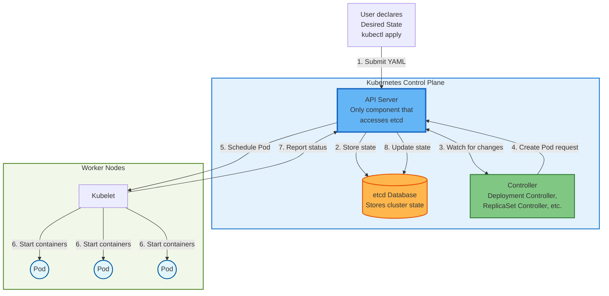

**Key Concepts:**

1. **Desired State**: What you want (defined in YAML)
   ```yaml
   replicas: 3  # I want 3 Pods running
   ```

2. **Current State**: What actually exists right now
   ```
   Currently running: 2 Pods
   ```

3. **API Server**: Central hub - ONLY component that reads/writes to etcd
   - All communication goes through API Server
   - Controllers never access etcd directly
   - Provides watch mechanism for controllers

4. **Controller**: Continuously watches API Server and reconciles
   ```
   Controller: "Desired=3, Current=2, need to create 1 Pod"
   ```

5. **Reconciliation Loop**: Controller continuously works to make Current State match Desired State

**Important:** Controllers communicate ONLY with the API Server, not directly with etcd. This is a fundamental Kubernetes design principle.

#### How the Controller Pattern Works

**Example: Scaling from 2 to 3 replicas**

```
Step 1: User updates Deployment
  kubectl scale deployment user-service --replicas=3

Step 2: API Server receives request
  - Validates request
  - Stores new desired state in etcd
  - Desired: 3 replicas

Step 3: Deployment Controller watches API Server
  - Notices change (watching for Deployment updates)
  - Reads current state from API Server
  - Compares: Desired=3, Current=2
  - Action: Need to update ReplicaSet

Step 4: Deployment Controller updates ReplicaSet
  - Sends request to API Server: "Set ReplicaSet replicas to 3"
  - API Server stores in etcd

Step 5: ReplicaSet Controller watches API Server
  - Notices ReplicaSet change
  - Compares: Desired=3 Pods, Current=2 Pods
  - Action: Create 1 Pod

Step 6: ReplicaSet Controller creates Pod
  - Sends request to API Server: "Create new Pod"
  - API Server stores Pod spec in etcd

Step 7: Scheduler watches API Server for unscheduled Pods
  - Notices new Pod without assigned Node
  - Selects appropriate Node
  - Updates API Server: "Pod scheduled to Node-1"

Step 8: Kubelet on Node-1 watches API Server
  - Notices new Pod assigned to its Node
  - Pulls container image
  - Starts container

Step 9: Kubelet reports back to API Server
  - Pod status: Running
  - API Server updates etcd

Step 10: Current state now matches desired state
  Desired: 3 replicas ✅
  Current: 3 replicas ✅

All communication flows through the API Server!
```

**Self-Healing Example:**

```
Step 1: Pod crashes
  - Kubelet detects container died
  - Kubelet reports to API Server: "Pod failed"
  - API Server updates etcd

Step 2: ReplicaSet Controller watches API Server
  - Notices Pod deletion event
  - Compares: Desired=3 Pods, Current=2 Pods
  - Action: Create replacement Pod

Step 3: ReplicaSet Controller requests new Pod
  - Sends to API Server: "Create new Pod"
  - API Server stores in etcd
  - Scheduler assigns to Node
  - Kubelet starts container

Step 4: Kubelet reports success
  - API Server updates etcd
  - Current: 3 Pods ✅

All automatic - no human intervention needed!
The API Server is the central communication hub.
```

**This pattern applies to all Kubernetes resources**: Deployments, StatefulSets, Services, etc.

---

### 1. Pods: The Fundamental Building Block

**What is a Pod?**

A **Pod** is the smallest deployable unit in Kubernetes. It's a wrapper around one or more containers, providing them with shared resources. Think of a Pod as a "logical host" for containers - similar to how a VM hosts processes.

**Why not deploy containers directly?** Kubernetes needs a higher-level abstraction to manage networking, storage, and lifecycle. The Pod provides this abstraction.

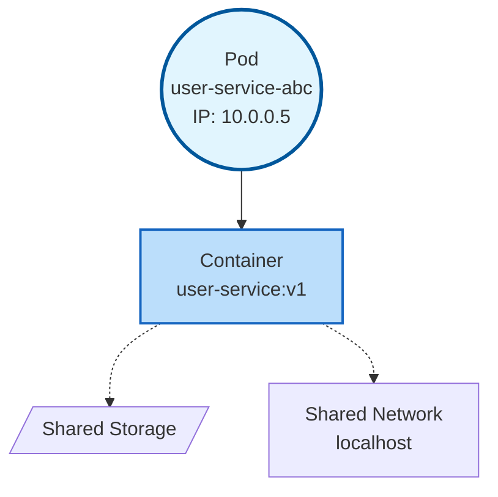

**Key Characteristics:**

#### 1. Ephemeral (Temporary)

Pods are designed to be disposable. Kubernetes can delete and recreate them at any time:
- Node fails → Pods rescheduled to another node
- Deployment updated → Old Pods replaced with new Pods
- Pod crashes → Kubernetes creates replacement Pod

**Implication**: Never store important data inside a Pod. Use external databases or persistent volumes.

#### 2. Unique IP Address

Each Pod gets its own IP address in the cluster network. Other Pods can communicate directly:

```python
# In order-service Pod (IP: 10.0.0.10)
import requests
# Can reach user-service Pod directly
response = requests.get("http://10.0.0.5:5000/api/users/123")
```

**However**: Pod IPs change when Pods are recreated. This is why we use **Services** (covered later) which provide stable IPs and DNS names.

#### 3. Shared Networking

All containers in a Pod share the same network namespace:
- Same IP address
- Same network ports
- Can communicate via `localhost`

**Example: Main App + Sidecar Pattern**
```yaml
# Pod with two containers
spec:
  containers:
  - name: app
    image: user-service:v1
    ports:
    - containerPort: 5000
  - name: log-collector
    image: fluent-bit:latest
```

Both containers share `localhost`:
- App listens on `localhost:5000`
- Log collector reads logs via `localhost:5000/metrics`

**Most common pattern for microservices**: One container per Pod (keeps services independent).

#### 4. Shared Storage

Containers in a Pod can share volumes:

```yaml
apiVersion: v1
kind: Pod
metadata:
  name: multi-container-pod
spec:
  containers:
  - name: writer
    image: alpine
    command: ["/bin/sh", "-c", "echo 'Hello' > /shared/data.txt"]
    volumeMounts:
    - name: shared-volume
      mountPath: /shared
  - name: reader
    image: alpine
    command: ["/bin/sh", "-c", "cat /shared/data.txt"]
    volumeMounts:
    - name: shared-volume
      mountPath: /shared
  volumes:
  - name: shared-volume
    emptyDir: {}
```

Both containers see the same files in `/shared`.

#### 5. Scheduled on a Single Node

A Pod always runs entirely on one node. Kubernetes won't split containers across nodes.

**Why this matters**: If a node has limited resources, a large Pod might not fit. Solution: Keep Pods small.

#### Pod Lifecycle

```
1. Pending:   Kubernetes accepted the Pod, scheduling it to a node
2. Running:   Pod bound to node, containers started
3. Succeeded: All containers completed successfully (for batch jobs)
4. Failed:    At least one container failed
5. Unknown:   Can't determine state (node unreachable)
```

**Kubernetes Controller watches and reconciles**:
```
Desired: 3 Pods running
Current: 2 Pods running (1 crashed)
Action:  Create 1 replacement Pod
```

#### Typical Pod Configuration

```yaml
apiVersion: v1
kind: Pod
metadata:
  name: user-service-abc123
  labels:
    app: user-service
    version: v2
spec:
  containers:
  - name: user-service
    image: user-service:v2
    ports:
    - containerPort: 5000
    env:
    - name: DATABASE_URL
      valueFrom:
        configMapKeyRef:
          name: app-config
          key: DATABASE_URL
    resources:
      requests:
        memory: "128Mi"
        cpu: "250m"
      limits:
        memory: "256Mi"
        cpu: "500m"
```

**Key fields:**
- **metadata.labels**: Used by Services and Deployments to select Pods
- **spec.containers**: List of containers in the Pod (usually just one)
- **ports**: Exposed ports (documentation, not enforced)
- **env**: Environment variables
- **resources**: CPU/memory requests and limits

#### When to Use Multiple Containers in a Pod

**Use multiple containers (sidecar pattern) when:**
- Containers must run on the same node (e.g., log shipper reading app logs)
- Containers share files via volumes
- Containers communicate via localhost

**Common sidecar patterns:**
- **Logging**: Main app + log collector (Fluent Bit)
- **Proxying**: Main app + Envoy proxy (service mesh)
- **Initialization**: Init container + main container

**Use single container per Pod (standard for microservices) when:**
- Service is independent
- No need to share localhost or volumes
- Want to scale/update containers independently

#### Practical Example: User Service

```yaml
apiVersion: v1
kind: Pod
metadata:
  name: user-service-xyz789
  labels:
    app: user-service
spec:
  containers:
  - name: user-service
    image: user-service:v2
    ports:
    - containerPort: 5000
    env:
    - name: DATABASE_URL
      value: "postgresql://postgres:5432/users"
    - name: LOG_LEVEL
      value: "info"
```

**In practice, you rarely create Pods directly.** Instead, you create **Deployments** which create and manage Pods for you. Deployments handle scaling, updates, and healing.

### 2. Deployments and ReplicaSets

**The Hierarchy: Deployment → ReplicaSet → Pod**

A Deployment doesn't directly manage Pods. Instead, it manages **ReplicaSets**, which in turn manage Pods.

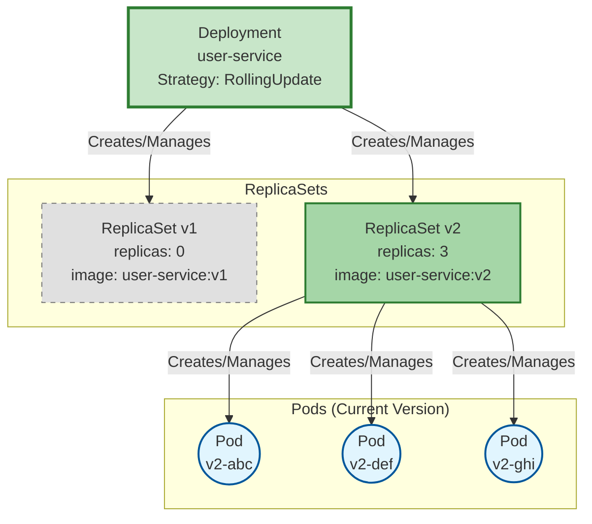

#### What is a ReplicaSet?

A **ReplicaSet** ensures a specified number of identical Pod replicas are running at any time.

**Key Responsibilities:**
- Maintain exact number of Pod replicas
- Create Pods when needed
- Delete Pods when there are too many
- Use controller pattern (desired vs current state)

**Example:**
```yaml
apiVersion: apps/v1
kind: ReplicaSet
metadata:
  name: user-service-v2-abc123
spec:
  replicas: 3  # Desired: 3 Pods
  selector:
    matchLabels:
      app: user-service
      version: v2
  template:
    metadata:
      labels:
        app: user-service
        version: v2
    spec:
      containers:
      - name: user-service
        image: user-service:v2
```

**ReplicaSet Controller Loop:**
```
1. Check: How many Pods exist? (Current State)
2. Compare: Is it equal to replicas? (Desired State)
3. Act: Create or delete Pods to match desired state
4. Repeat forever
```

#### What is a Deployment?

A **Deployment** is a higher-level controller that manages ReplicaSets to enable:
- **Rolling Updates**: Gradually replace old Pods with new ones
- **Rollback**: Revert to previous version
- **Declarative Updates**: Just change the image version, Deployment handles the rest

**Why the extra layer?**

Without Deployment:
```
Update image → Delete all Pods → Create new Pods
❌ Downtime during transition
```

With Deployment:
```
Update image → Deployment creates new ReplicaSet
              → Gradually scale up new ReplicaSet
              → Gradually scale down old ReplicaSet
✅ Zero downtime
```

#### Rolling Update Process

**Before Update:**
```
Deployment: user-service
  ├─ ReplicaSet v1 (replicas: 3)
  │   ├─ Pod v1-abc ✅
  │   ├─ Pod v1-def ✅
  │   └─ Pod v1-ghi ✅
```

**During Update (Rolling):**
```
Deployment: user-service (updating v1 → v2)
  ├─ ReplicaSet v1 (replicas: 2) ← Scaling down
  │   ├─ Pod v1-abc ✅
  │   └─ Pod v1-def ✅
  └─ ReplicaSet v2 (replicas: 1) ← Scaling up
      └─ Pod v2-xyz ✅ (new)

# Next iteration:
  ├─ ReplicaSet v1 (replicas: 1)
  │   └─ Pod v1-abc ✅
  └─ ReplicaSet v2 (replicas: 2)
      ├─ Pod v2-xyz ✅
      └─ Pod v2-jkl ✅ (new)

# Final state:
  ├─ ReplicaSet v1 (replicas: 0) ← Kept for rollback
  └─ ReplicaSet v2 (replicas: 3)
      ├─ Pod v2-xyz ✅
      ├─ Pod v2-jkl ✅
      └─ Pod v2-mno ✅ (new)
```

**At each step:**
- **Max Surge**: Can temporarily have 4 Pods (25% extra)
- **Max Unavailable**: Always keep at least 2 Pods running (25% down)
- **Zero Downtime**: Old Pods kept until new Pods are ready

#### Deployment Features

**1. Declarative Updates**
```bash
# Just change image version
kubectl set image deployment/user-service user-service=user-service:v3
# Deployment handles the rolling update automatically
```

**2. Rollback**
```bash
# Something wrong? Rollback to previous version
kubectl rollout undo deployment/user-service

# Deployment scales down new ReplicaSet (v3)
# Deployment scales up old ReplicaSet (v2)
```

**3. Pause/Resume**
```bash
# Make multiple changes without triggering updates
kubectl rollout pause deployment/user-service
kubectl set image deployment/user-service user-service=user-service:v4
kubectl set resources deployment/user-service -c user-service --limits=memory=512Mi
kubectl rollout resume deployment/user-service
# Now triggers single update with all changes
```

**4. Revision History**
```bash
# View deployment history
kubectl rollout history deployment/user-service

# Rollback to specific revision
kubectl rollout undo deployment/user-service --to-revision=2
```

**When to Use Deployments:**
- ✅ **Stateless** applications (APIs, web servers, workers)
- ✅ Services that don't store data locally
- ✅ Any service where Pods are interchangeable
- ✅ Need rolling updates and zero downtime

**Example Configuration:**
```yaml
apiVersion: apps/v1
kind: Deployment
metadata:
  name: user-service
spec:
  replicas: 3
  strategy:
    type: RollingUpdate
    rollingUpdate:
      maxSurge: 1        # Can have 4 Pods during update (3+1)
      maxUnavailable: 1  # Minimum 2 Pods running (3-1)
  selector:
    matchLabels:
      app: user-service
  template:
    metadata:
      labels:
        app: user-service
    spec:
      containers:
      - name: user-service
        image: user-service:v2
        ports:
        - containerPort: 5000
```

#### Deployment Controller Reconciliation

**Deployment Controller watches for changes and maintains desired state:**

```
Event: User updates Deployment (v1 → v2)

Deployment Controller:
  1. Create new ReplicaSet for v2
  2. Scale up new ReplicaSet: 0 → 1 Pod
  3. Wait for new Pod to be Ready
  4. Scale down old ReplicaSet: 3 → 2 Pods
  5. Scale up new ReplicaSet: 1 → 2 Pods
  6. Wait for new Pod to be Ready
  7. Scale down old ReplicaSet: 2 → 1 Pod
  8. Scale up new ReplicaSet: 2 → 3 Pods
  9. Wait for new Pod to be Ready
  10. Scale down old ReplicaSet: 1 → 0 Pods
  11. Done! Keep old ReplicaSet for potential rollback

All automatic based on desired state!
```

### 3. StatefulSets: For Stateful Applications

**What is a StatefulSet?**

A **StatefulSet** is a Kubernetes controller designed for stateful applications - services that store data locally and require stable identities. While Deployments treat Pods as interchangeable cattle, StatefulSets treat Pods as unique pets.

**The Problem StatefulSets Solve:**

Imagine deploying a PostgreSQL database with a Deployment:

```yaml
# This would be problematic!
kind: Deployment
metadata:
  name: postgres
spec:
  replicas: 3
```

**Problems:**
1. **Random names**: Pods named `postgres-abc123`, `postgres-def456`, `postgres-ghi789`. How do you configure which is the primary?
2. **No persistent storage**: When `postgres-abc123` restarts, it gets a new empty disk. All data is lost!
3. **Parallel creation**: All 3 Pods start simultaneously. Databases need ordered initialization (primary first, then replicas).
4. **Changing IPs**: Replicas connect to primary via IP. When primary restarts, IP changes, breaking replication.

**StatefulSets fix these issues:**
- Stable, predictable names: `postgres-0`, `postgres-1`, `postgres-2`
- Persistent storage: Each Pod has its own disk that survives restarts
- Ordered deployment: `postgres-0` starts first, then `postgres-1`, then `postgres-2`
- Stable network identities: `postgres-0.postgres` DNS name never changes

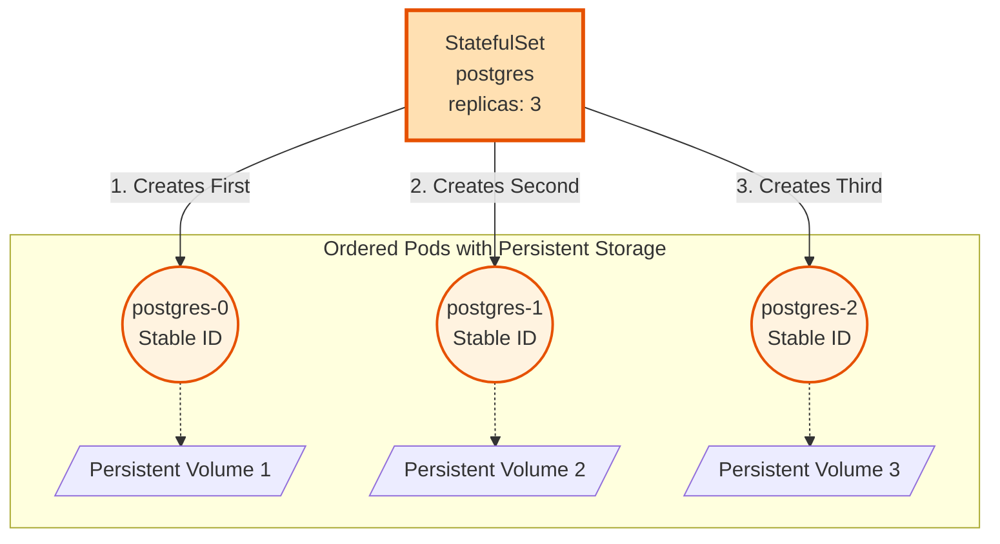

**Key Differences from Deployments:**

| Feature | Deployment | StatefulSet |
|---------|-----------|-------------|
| **Pod Identity** | Random names (user-service-abc123) | Ordered names (postgres-0, postgres-1) |
| **Storage** | Ephemeral (lost on restart) | Persistent (survives restarts) |
| **Creation Order** | Parallel (all at once) | Sequential (0, then 1, then 2) |
| **Network Identity** | Random IP, changes on restart | Stable hostname (postgres-0.postgres) |
| **Use Case** | Stateless apps (APIs, web servers) | Stateful apps (databases, queues) |

**When to Use StatefulSets:**
- **Databases**: PostgreSQL, MySQL, MongoDB
- **Message Queues**: Kafka, RabbitMQ
- **Distributed Systems**: Elasticsearch, Cassandra
- Any application that needs:
  - Stable network identity
  - Persistent storage
  - Ordered deployment

**Example Configuration:**
```yaml
apiVersion: apps/v1
kind: StatefulSet
metadata:
  name: postgres
spec:
  serviceName: postgres  # Stable network identity
  replicas: 3
  selector:
    matchLabels:
      app: postgres
  template:
    metadata:
      labels:
        app: postgres
    spec:
      containers:
      - name: postgres
        image: postgres:15
        ports:
        - containerPort: 5432
        volumeMounts:
        - name: postgres-storage
          mountPath: /var/lib/postgresql/data
  volumeClaimTemplates:  # Each Pod gets its own storage
  - metadata:
      name: postgres-storage
    spec:
      accessModes: ["ReadWriteOnce"]
      resources:
        requests:
          storage: 10Gi
```

**StatefulSet Guarantees:**
1. **Ordered Creation**: postgres-0 created first, then postgres-1, then postgres-2
2. **Ordered Deletion**: postgres-2 deleted first, then postgres-1, then postgres-0
3. **Stable Hostnames**: postgres-0.postgres.default.svc.cluster.local (never changes)
4. **Persistent Storage**: Even if postgres-0 Pod is deleted, new postgres-0 gets the same storage

### 4. Services: Stable Network Endpoints

**What is a Service?**

A **Service** provides a stable network endpoint for accessing Pods. Without Services, you would need to track changing Pod IPs manually - an impossible task when Pods are constantly being created and destroyed.

**The Problem Services Solve:**

Imagine your Order Service needs to call the User Service:

```python
# Without Service - BROKEN
import requests
response = requests.get("http://10.0.0.5:5000/api/users/123")
# Problem: Pod IP 10.0.0.5 changes when Pod restarts!
```

Every time a Pod restarts (deployment, node failure, crash), it gets a new IP. Your code would break.

**Services provide:**
1. **Stable IP**: ClusterIP never changes
2. **Stable DNS name**: `user-service` or `user-service.default.svc.cluster.local`
3. **Load balancing**: Automatically distributes traffic across healthy Pods
4. **Health checking**: Only routes to Pods that are ready

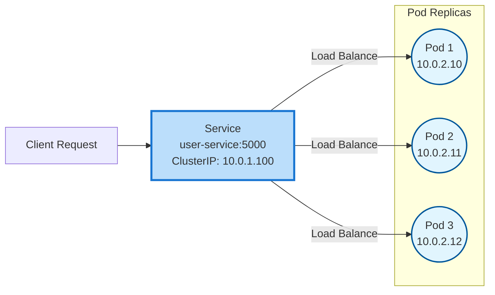

**With Service - WORKS:**
```python
import requests
# DNS name resolves to stable ClusterIP
# Service load balances to healthy Pods
response = requests.get("http://user-service:5000/api/users/123")
# Always works, regardless of Pod restarts
```

#### How Services Work

**1. Label Selectors**

Services find Pods using label selectors:

```yaml
apiVersion: v1
kind: Service
metadata:
  name: user-service
spec:
  selector:
    app: user-service  # Select all Pods with label app=user-service
  ports:
  - port: 5000
```

```yaml
# Pod with matching label
apiVersion: v1
kind: Pod
metadata:
  labels:
    app: user-service  # This Pod is selected by the Service
spec:
  containers:
  - name: user-service
    image: user-service:v2
```

Kubernetes continuously watches for Pods with matching labels. When Pods are created/deleted, the Service automatically updates its endpoint list.

**2. Endpoints**

Behind the scenes, Kubernetes maintains an **Endpoints** object:

```bash
kubectl get endpoints user-service
```

```
NAME           ENDPOINTS
user-service   10.0.2.10:5000,10.0.2.11:5000,10.0.2.12:5000
```

This list updates automatically as Pods come and go.

**3. DNS Resolution**

Kubernetes runs a DNS server (CoreDNS). Every Service gets a DNS entry:

**DNS names:**
- Short form: `user-service` (same namespace)
- Full form: `user-service.default.svc.cluster.local`
  - `user-service`: Service name
  - `default`: Namespace
  - `svc.cluster.local`: Kubernetes domain

**Example:**
```python
# From any Pod in the 'default' namespace
requests.get("http://user-service:5000")  # Works

# From a Pod in a different namespace (e.g., 'production')
requests.get("http://user-service.default:5000")  # Full namespace needed
```

**4. Load Balancing**

Services automatically load balance using round-robin (by default):

```
Request 1 → Service → Pod 1
Request 2 → Service → Pod 2
Request 3 → Service → Pod 3
Request 4 → Service → Pod 1 (cycle repeats)
```

No configuration needed - it just works.

#### Service Types

Kubernetes supports several Service types for different use cases:

**1. ClusterIP (Default) - Internal Access Only**

```yaml
apiVersion: v1
kind: Service
metadata:
  name: user-service
spec:
  type: ClusterIP  # Default, can be omitted
  selector:
    app: user-service
  ports:
  - port: 5000        # Service port
    targetPort: 5000  # Pod port
```

**Characteristics:**
- Only accessible within the cluster
- Gets internal ClusterIP (e.g., 10.0.1.100)
- Most common for microservice-to-microservice communication
- No external access

**Use case**: Backend services (User Service, Product Service, Order Service)

**2. LoadBalancer - External Access via Cloud Provider**

```yaml
apiVersion: v1
kind: Service
metadata:
  name: api-gateway
spec:
  type: LoadBalancer
  selector:
    app: api-gateway
  ports:
  - port: 80
    targetPort: 8080
```

**Characteristics:**
- Creates external load balancer (AWS ELB, GCP Load Balancer, Azure Load Balancer)
- Gets external IP address accessible from internet
- Costs money (cloud provider charges for load balancer)
- Automatically configures health checks

**Use case**: Public-facing services (API Gateway, web frontend)

**External access:**
```bash
curl http://<EXTERNAL-IP>:80
```

**3. NodePort - Expose on Every Node**

```yaml
apiVersion: v1
kind: Service
metadata:
  name: user-service
spec:
  type: NodePort
  selector:
    app: user-service
  ports:
  - port: 5000
    targetPort: 5000
    nodePort: 30001  # Optional: Kubernetes assigns if not specified
```

**Characteristics:**
- Exposes service on a static port (30000-32767) on every node
- Accessible via `<NodeIP>:<NodePort>`
- Less common in production (LoadBalancer preferred)
- Useful for on-premise clusters without cloud load balancer

**Access:**
```bash
curl http://192.168.1.10:30001  # Any node IP
curl http://192.168.1.11:30001  # Any node IP works
```

**4. Headless Service - Direct Pod Access**

```yaml
apiVersion: v1
kind: Service
metadata:
  name: postgres
spec:
  clusterIP: None  # Headless service
  selector:
    app: postgres
  ports:
  - port: 5432
```

**Characteristics:**
- No ClusterIP assigned
- DNS returns Pod IPs directly (not Service IP)
- Used for StatefulSets where you need to reach specific Pods
- Useful for databases, Kafka, etc.

**Use case**: Reaching specific StatefulSet Pods (postgres-0, postgres-1, postgres-2)

#### Multi-Port Services

Services can expose multiple ports:

```yaml
apiVersion: v1
kind: Service
metadata:
  name: user-service
spec:
  selector:
    app: user-service
  ports:
  - name: http
    port: 5000
    targetPort: 5000
  - name: metrics
    port: 9090
    targetPort: 9090
```

**Access:**
```python
# Application traffic
requests.get("http://user-service:5000/api/users")

# Metrics endpoint
requests.get("http://user-service:9090/metrics")
```

#### Port Mapping

Services can map external port to different internal port:

```yaml
apiVersion: v1
kind: Service
metadata:
  name: user-service
spec:
  selector:
    app: user-service
  ports:
  - port: 80         # External: clients call user-service:80
    targetPort: 5000 # Internal: Pods listen on port 5000
```

**Client calls:**
```python
# Client uses port 80
requests.get("http://user-service:80/api/users")

# Pod receives on port 5000 (transparent mapping)
```

#### Service Discovery in Action

**Complete example: Order Service calling User Service**

```python
# order_service/app.py
import requests
import os

# Service discovery via environment variables (automatic)
USER_SERVICE_URL = os.getenv("USER_SERVICE_URL", "http://user-service:5000")

@app.route('/api/orders', methods=['POST'])
def create_order():
    # Get user info from User Service
    user_id = request.json['user_id']

    # Call User Service - DNS resolves, Service load balances
    user_response = requests.get(f"{USER_SERVICE_URL}/api/users/{user_id}")

    if user_response.status_code != 200:
        return {"error": "User not found"}, 404

    user = user_response.json()

    # Create order logic...
    order = {
        "order_id": generate_id(),
        "user_id": user_id,
        "user_email": user['email']
    }

    return order, 201
```

**What happens:**
1. Order Service makes HTTP request to `user-service:5000`
2. Kubernetes DNS resolves `user-service` to ClusterIP `10.0.1.100`
3. Service load balances to one of 3 User Service Pods
4. Request reaches Pod, response returns
5. All transparent - no hardcoded IPs, automatic load balancing

#### Session Affinity (Sticky Sessions)

By default, Services use round-robin. For session affinity:

```yaml
apiVersion: v1
kind: Service
metadata:
  name: user-service
spec:
  sessionAffinity: ClientIP  # Stick to same Pod based on client IP
  selector:
    app: user-service
  ports:
  - port: 5000
```

**Use case**: Stateful applications where user session data is stored in Pod memory (not recommended - use Redis instead)

#### Practical Example

```yaml
# Complete User Service setup
---
apiVersion: apps/v1
kind: Deployment
metadata:
  name: user-service
spec:
  replicas: 3
  selector:
    matchLabels:
      app: user-service
  template:
    metadata:
      labels:
        app: user-service  # Label for Service selector
    spec:
      containers:
      - name: user-service
        image: user-service:v2
        ports:
        - containerPort: 5000
---
apiVersion: v1
kind: Service
metadata:
  name: user-service
spec:
  type: ClusterIP
  selector:
    app: user-service  # Matches Deployment label
  ports:
  - port: 5000
    targetPort: 5000
```

**Access from any Pod in cluster:**
```bash
curl http://user-service:5000/api/users
```

Kubernetes handles everything: DNS, load balancing, health checks, endpoint updates.

### 5. ConfigMaps and Secrets

**ConfigMaps**: Store non-sensitive configuration
```yaml
apiVersion: v1
kind: ConfigMap
metadata:
  name: app-config
data:
  DATABASE_URL: "postgres-service:5432"
  LOG_LEVEL: "info"
```

**Secrets**: Store sensitive data (base64 encoded)
```yaml
apiVersion: v1
kind: Secret
metadata:
  name: db-secret
type: Opaque
data:
  password: cGFzc3dvcmQxMjM=  # base64 encoded
```

---

## Microservices Design Principles

### 1. Single Responsibility
Each service does **one thing well**.

**Good:**
- User Service: Authentication, user profiles
- Product Service: Product catalog
- Order Service: Order processing

**Bad:**
- Mega Service: Users + Products + Orders + Payments

### 2. Database Per Service

Each service owns its database. **No shared database access.**

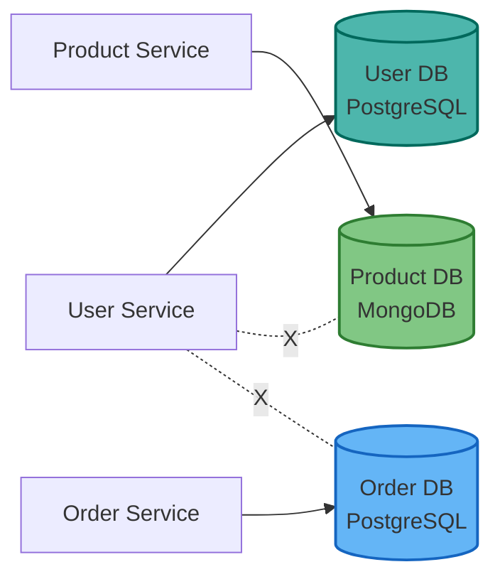

**Why:**
- Services scale independently
- Technology choice per service (PostgreSQL vs MongoDB)
- Schema changes don't affect other services
- Failure isolation

**Challenge:** How to get data from multiple services?
- API calls between services (synchronous)
- Event-driven architecture (asynchronous) - covered in Tutorial 12

### 3. API Gateway Pattern

**Single entry point** for all client requests.

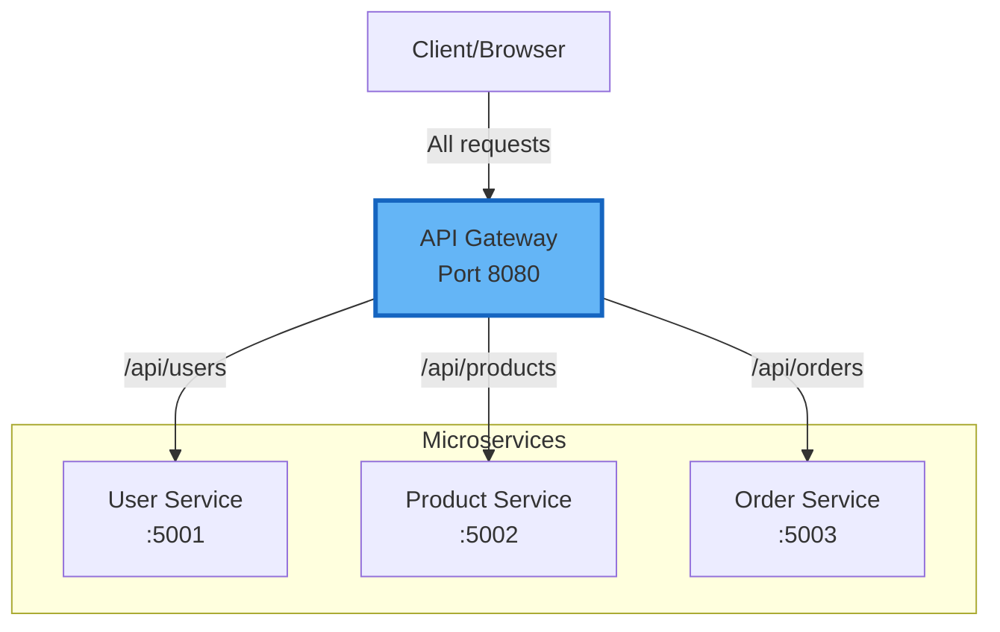

**Gateway Responsibilities:**
- **Routing**: Direct requests to correct service
- **Load Balancing**: Distribute traffic across replicas
- **Authentication**: Verify tokens once, not in every service
- **Rate Limiting**: Protect backend from overload
- **SSL Termination**: Handle HTTPS

**Common Tools:**
- Nginx
- Kong
- AWS API Gateway
- Traefik

### 4. Service Discovery

In Kubernetes, services find each other using **DNS**.

**Example:**
```python
# Todo Service calling User Service
import requests

# Kubernetes DNS: <service-name>.<namespace>.svc.cluster.local
USER_SERVICE_URL = "http://user-service.default.svc.cluster.local:5000"

# Simplified (same namespace)
USER_SERVICE_URL = "http://user-service:5000"

response = requests.get(f"{USER_SERVICE_URL}/api/users/123")
```

**How it works:**
1. Kubernetes maintains DNS records
2. Service name resolves to ClusterIP
3. ClusterIP load balances to Pod IPs
4. No hardcoded IPs needed!

---

## Microservices + Kubernetes: Real-World Architecture

### Example: E-commerce Platform

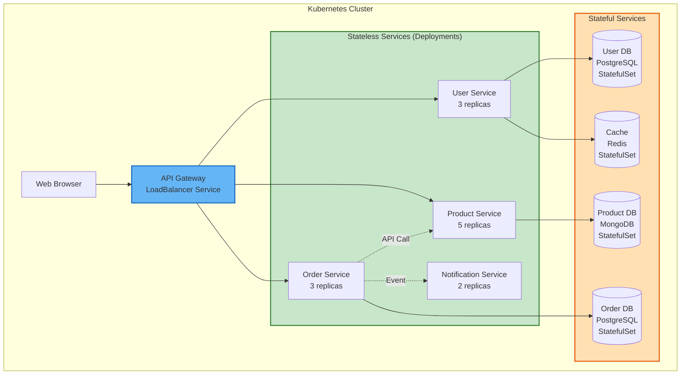

**Kubernetes Resources Used:**

| Service | Resource Type | Replicas | Why |
|---------|---------------|----------|-----|
| API Gateway | Deployment + LoadBalancer Service | 2 | Stateless, needs external access |
| User Service | Deployment + ClusterIP Service | 3 | Stateless, internal only |
| Product Service | Deployment + ClusterIP Service | 5 | Stateless, high traffic |
| Order Service | Deployment + ClusterIP Service | 3 | Stateless |
| Notification Service | Deployment + ClusterIP Service | 2 | Stateless |
| User DB (PostgreSQL) | StatefulSet + ClusterIP Service | 1 | Stateful, needs persistent storage |
| Product DB (MongoDB) | StatefulSet + ClusterIP Service | 3 | Stateful, replica set |
| Order DB (PostgreSQL) | StatefulSet + ClusterIP Service | 1 | Stateful |
| Redis Cache | StatefulSet + ClusterIP Service | 1 | Stateful |

---

## Key Differences: Deployments vs StatefulSets

### Quick Decision Guide

**Use Deployment when:**
- ✅ Service is stateless
- ✅ Pods are interchangeable
- ✅ No local data storage needed
- ✅ Examples: APIs, web servers, workers

**Use StatefulSet when:**
- ✅ Service stores data locally
- ✅ Pods need unique identities
- ✅ Ordered startup/shutdown required
- ✅ Examples: Databases, message queues

### Visual Comparison

**Deployment:**
```
Pods are cattle (interchangeable):
  user-service-abc123  (any Pod handles any request)
  user-service-def456
  user-service-ghi789
```

**StatefulSet:**
```
Pods are pets (unique, special):
  postgres-0  (primary database, must start first)
  postgres-1  (replica, depends on postgres-0)
  postgres-2  (replica, depends on postgres-1)
```

---

## Kubernetes Ingress: Exposing Services to the Internet

So far, we've learned about Services for internal load balancing between Pods. But how do external users access your microservices? This is where **Ingress** comes in.

### The Problem: External Access

**Services are internal by default:**
- ClusterIP Services (default) are only accessible within the cluster
- You can't reach `http://user-service:5000` from your browser
- Each service would need its own public IP address (expensive and complex)

**Without Ingress, you would need:**
```
User → LoadBalancer Service ($$) → user-service
User → LoadBalancer Service ($$) → product-service
User → LoadBalancer Service ($$) → order-service
```
Problem: 3 services = 3 public IP addresses = 3× cost and complexity!

### The Solution: Ingress

**Ingress** is a Kubernetes resource that provides HTTP/HTTPS routing from outside the cluster to Services inside the cluster. It acts as an API Gateway and reverse proxy.

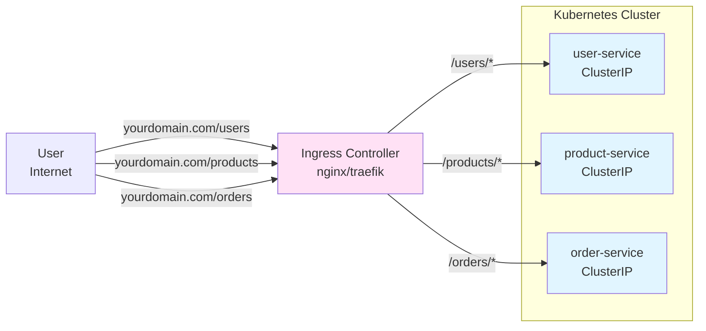

**One public IP address routes to all services!**

### How Ingress Works

**1. Ingress Controller (the actual server)**
- A reverse proxy (nginx, Traefik, HAProxy) running as a Deployment
- Watches for Ingress resources and configures itself
- Has a LoadBalancer Service with a public IP address

**2. Ingress Resource (the configuration)**
- A YAML file that defines routing rules
- Tells the Ingress Controller where to route traffic
- Can handle multiple domains, paths, and SSL certificates

### Example: Basic Ingress

**Ingress YAML:**
```yaml
apiVersion: networking.k8s.io/v1
kind: Ingress
metadata:
  name: api-ingress
  annotations:
    nginx.ingress.kubernetes.io/rewrite-target: /
spec:
  rules:
  - host: api.mycompany.com
    http:
      paths:
      - path: /users
        pathType: Prefix
        backend:
          service:
            name: user-service
            port:
              number: 5000
      - path: /products
        pathType: Prefix
        backend:
          service:
            name: product-service
            port:
              number: 5001
      - path: /orders
        pathType: Prefix
        backend:
          service:
            name: order-service
            port:
              number: 5002
```

**What this does:**
```
User → http://api.mycompany.com/users/123
  ↓
Ingress Controller (nginx)
  ↓
user-service:5000/123
```

The Ingress Controller:
1. Receives request for `api.mycompany.com/users/123`
2. Matches the `/users` path rule
3. Forwards to `user-service:5000/users/123`
4. Returns response to user

### Ingress with HTTPS (Automatic SSL)

Most production systems use HTTPS. Kubernetes can automatically provision SSL certificates with cert-manager and Let's Encrypt:

```yaml
apiVersion: networking.k8s.io/v1
kind: Ingress
metadata:
  name: api-ingress
  annotations:
    cert-manager.io/cluster-issuer: "letsencrypt-prod"
    nginx.ingress.kubernetes.io/ssl-redirect: "true"
spec:
  tls:
  - hosts:
    - api.mycompany.com
    secretName: api-tls-cert  # Automatically generated by cert-manager
  rules:
  - host: api.mycompany.com
    http:
      paths:
      - path: /
        pathType: Prefix
        backend:
          service:
            name: frontend
            port:
              number: 80
      - path: /api/users
        pathType: Prefix
        backend:
          service:
            name: user-service
            port:
              number: 5000
      - path: /api/products
        pathType: Prefix
        backend:
          service:
            name: product-service
            port:
              number: 5001
```

**What this does:**
1. cert-manager automatically requests SSL certificate from Let's Encrypt
2. Certificate stored in `api-tls-cert` Secret
3. Ingress Controller serves HTTPS on port 443
4. All HTTP traffic redirected to HTTPS (secure!)

### Ingress as API Gateway

Ingress can implement API Gateway patterns:

#### 1. Path-Based Routing
```yaml
paths:
- path: /api/v1/users
  backend:
    service:
      name: user-service-v1
- path: /api/v2/users  # New version
  backend:
    service:
      name: user-service-v2
```

#### 2. Host-Based Routing
```yaml
rules:
- host: api.mycompany.com
  http:
    paths:
    - path: /
      backend:
        service:
          name: api-service
- host: admin.mycompany.com
  http:
    paths:
    - path: /
      backend:
        service:
          name: admin-service
```

#### 3. Authentication (with annotations)
```yaml
metadata:
  annotations:
    nginx.ingress.kubernetes.io/auth-url: "http://auth-service/verify"
    nginx.ingress.kubernetes.io/auth-response-headers: "X-User-Id,X-User-Role"
```

The Ingress Controller will:
1. Receive request
2. Call `auth-service/verify` with the request
3. If auth succeeds, forward to backend with user headers
4. If auth fails, return 401 Unauthorized

#### 4. Rate Limiting
```yaml
metadata:
  annotations:
    nginx.ingress.kubernetes.io/limit-rps: "10"  # Max 10 requests per second
```

#### 5. CORS Headers
```yaml
metadata:
  annotations:
    nginx.ingress.kubernetes.io/enable-cors: "true"
    nginx.ingress.kubernetes.io/cors-allow-origin: "https://myapp.com"
```

### Example: Complete Microservices Setup

**Services (internal):**
```yaml
# user-service (ClusterIP - internal only)
apiVersion: v1
kind: Service
metadata:
  name: user-service
spec:
  type: ClusterIP  # Not accessible externally
  selector:
    app: user-service
  ports:
  - port: 5000
    targetPort: 5000
---
# product-service (ClusterIP - internal only)
apiVersion: v1
kind: Service
metadata:
  name: product-service
spec:
  type: ClusterIP
  selector:
    app: product-service
  ports:
  - port: 5001
    targetPort: 5001
```

**Ingress (external access):**
```yaml
apiVersion: networking.k8s.io/v1
kind: Ingress
metadata:
  name: microservices-ingress
  annotations:
    cert-manager.io/cluster-issuer: "letsencrypt-prod"
    nginx.ingress.kubernetes.io/ssl-redirect: "true"
    nginx.ingress.kubernetes.io/limit-rps: "100"
spec:
  tls:
  - hosts:
    - api.example.com
    secretName: api-tls
  rules:
  - host: api.example.com
    http:
      paths:
      # Frontend
      - path: /
        pathType: Prefix
        backend:
          service:
            name: frontend
            port:
              number: 80

      # User API
      - path: /api/users
        pathType: Prefix
        backend:
          service:
            name: user-service
            port:
              number: 5000

      # Product API
      - path: /api/products
        pathType: Prefix
        backend:
          service:
            name: product-service
            port:
              number: 5001
```

**Traffic flow:**
```
https://api.example.com/           → frontend:80
https://api.example.com/api/users  → user-service:5000
https://api.example.com/api/products → product-service:5001
```

### Ingress Controllers: Popular Options

**1. Nginx Ingress Controller** (Most popular)
- Battle-tested, feature-rich
- Used by majority of Kubernetes deployments
- Supports most annotations and features

**2. Traefik** (Modern alternative)
- Automatic service discovery
- Built-in Let's Encrypt support
- Good UI dashboard

**3. HAProxy Ingress**
- High performance
- Advanced load balancing

**4. Cloud Provider Ingress**
- AWS ALB Ingress Controller
- GCP Ingress (uses Google Cloud Load Balancer)
- Azure Application Gateway

### Ingress vs Service Types

| Feature | ClusterIP | NodePort | LoadBalancer | Ingress |
|---------|-----------|----------|--------------|---------|
| **Access** | Cluster-internal only | Node IP:Port | Cloud Load Balancer | HTTP/HTTPS routing |
| **Cost** | Free | Free | $$$ per service | $ (one LB) |
| **Use Case** | Backend services | Development/testing | Simple external access | Production API Gateway |
| **Multiple Services** | N/A | Different ports | Multiple IPs | Single IP + routing |
| **SSL/TLS** | No | Manual | Manual | Automatic (cert-manager) |
| **Path Routing** | No | No | No | Yes |
| **Host Routing** | No | No | No | Yes |

**Best Practice:**
- Use **ClusterIP** for all backend services (user-service, product-service, database)
- Use **Ingress** for external HTTP/HTTPS access
- Avoid LoadBalancer Services (expensive - you pay for each one!)

### Why Ingress Matters for Microservices

**Without Ingress:**
```
User → LoadBalancer ($50/month) → user-service
User → LoadBalancer ($50/month) → product-service
User → LoadBalancer ($50/month) → order-service

Total: $150/month + 3 public IPs to manage
```

**With Ingress:**
```
User → Ingress ($50/month) → {user, product, order}-service

Total: $50/month + 1 public IP + smart routing
```

**Plus you get:**
- ✅ Path-based routing (`/users`, `/products`)
- ✅ Host-based routing (api.example.com, admin.example.com)
- ✅ Automatic SSL certificates with Let's Encrypt
- ✅ Rate limiting and authentication
- ✅ Centralized monitoring and logging
- ✅ Canary deployments (route 10% traffic to v2)

---

## Scaling in Kubernetes

### Horizontal Scaling (Deployments)

Add more Pod replicas:
```bash
# Scale up
kubectl scale deployment user-service --replicas=5

# Scale down
kubectl scale deployment user-service --replicas=2

# Auto-scale based on CPU
kubectl autoscale deployment user-service --min=2 --max=10 --cpu-percent=70
```

**When a service is under heavy load:**
1. Kubernetes detects high CPU/memory
2. Creates additional Pods
3. Service load balances across all Pods
4. When load decreases, scales down

### Vertical Scaling (Resource Limits)

Increase resources per Pod:
```yaml
resources:
  requests:
    memory: "256Mi"
    cpu: "500m"
  limits:
    memory: "512Mi"
    cpu: "1000m"
```

---

## Benefits of Microservices + Kubernetes

### Independent Scaling
```bash
# Scale only Product Service (high traffic)
kubectl scale deployment product-service --replicas=10

# User Service stays at 3 replicas
```

### Independent Deployment
```bash
# Deploy new version of Order Service
kubectl set image deployment/order-service order-service=order-service:v2

# Rolling update: zero downtime
# Other services unaffected
```

### Technology Diversity
```
User Service:    Flask (Python)   - Easy to develop
Product Service: FastAPI (Python) - Automatic API docs
Order Service:   Go (Gin)         - High performance
Payment Service: Java (Spring)    - Enterprise libraries
```

### Failure Isolation
```
If Product Service crashes:
  ❌ Product catalog unavailable
  ✅ User login still works
  ✅ View orders still works
  ✅ Notifications still work
```

---

## Challenges with Microservices

### 1. Distributed System Complexity
- Network calls can fail
- Need retry logic, timeouts, circuit breakers
- Debugging is harder (request spans multiple services)

### 2. Data Consistency
- No transactions across services
- Must use eventual consistency or saga patterns
- Example: Order created, but payment fails - need compensation logic

### 3. Testing
- Need all services running for integration tests
- Contract testing between services
- Mocking service dependencies

### 4. Monitoring & Logging
- Logs scattered across services
- Need centralized logging (ELK, Loki)
- Distributed tracing (Jaeger) - covered in Tutorial 12

### 5. Deployment Orchestration
- Managing many services manually is impossible
- Kubernetes solves this with Deployments, Services, ConfigMaps

---

## Microservices Best Practices

### 1. Design for Failure
- Services **will** fail
- Implement health checks
- Use timeouts and retries
- Circuit breakers for dependencies

### 2. Keep Services Small
- Single Responsibility Principle
- If service is too complex, split it

### 3. Use Health Checks
Every service should expose:
```yaml
livenessProbe:   # Is service alive?
  httpGet:
    path: /health
    port: 5000
readinessProbe:  # Is service ready to serve traffic?
  httpGet:
    path: /ready
    port: 5000
```

### 4. Version Your APIs
```
/api/v1/users
/api/v2/users  # New version, backward compatible
```

### 5. Log Everything
- Use structured logging (JSON)
- Include correlation IDs (trace requests across services)
- Centralized log aggregation

### 6. Use Environment Variables
```python
# Don't hardcode URLs
DATABASE_URL = os.getenv("DATABASE_URL")
USER_SERVICE_URL = os.getenv("USER_SERVICE_URL", "http://user-service:5000")
```

---

## Summary: Deployment Decision Tree

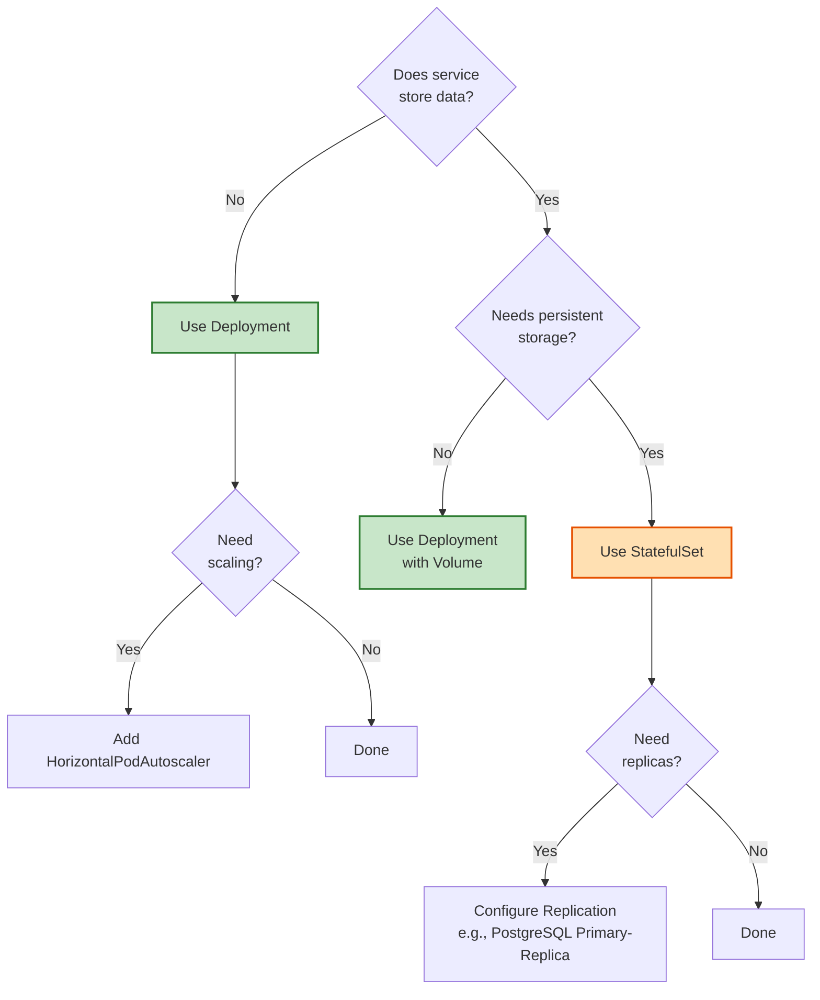

---

## Key Takeaways

### Microservices Architecture:
- ✅ Independent services that communicate over networks
- ✅ Each service owns its own database (database-per-service pattern)
- ✅ Services can be deployed and scaled independently
- ✅ Enables team autonomy and technology diversity
- ✅ Provides fault isolation - one service failure doesn't crash the system
- ⚠️ Introduces distributed system complexity
- ⚠️ Requires robust DevOps infrastructure (Kubernetes, monitoring, tracing)

### Kubernetes Concepts:
- **Controller Pattern**: Desired state vs current state, continuous reconciliation
- **API Server**: Central hub for all cluster communication (only component accessing etcd)
- **Pods**: Smallest deployable unit, wraps containers, ephemeral
- **Deployments**: Manage stateless applications via ReplicaSets
- **ReplicaSets**: Maintain specified number of Pod replicas
- **Rolling Updates**: Zero-downtime deployments by gradually replacing Pods
- **StatefulSets**: Manage stateful applications with stable identities
- **Services**: Stable network endpoints, DNS-based discovery, load balancing
- **Ingress**: HTTP/HTTPS routing from external to internal services (API Gateway)
- **ConfigMaps/Secrets**: Centralized configuration and sensitive data

### Kubernetes Capabilities:
- Automatic self-healing when containers crash
- Declarative configuration (desired state vs current state)
- Horizontal scaling with simple commands
- DNS-based service discovery
- Rolling updates with zero downtime
- Automatic load balancing across Pod replicas
- HTTP/HTTPS routing with Ingress (one public IP for all services)
- Automatic SSL certificates with cert-manager
- Resource management (CPU, memory limits)

### Microservices Design Patterns:

**Database per Service**: Each service owns its data store and is the only component that can access it directly. The User Service owns the `users` database (PostgreSQL), the Product Service owns the `products` database (MongoDB), and the Order Service owns the `orders` database (PostgreSQL). Other services cannot query these databases directly - they must use the service's API. This pattern enables independent deployment (change User Service schema without affecting others), technology diversity (choose the best database for each service), and failure isolation (Product Service database crash doesn't affect User Service). However, it makes queries that span multiple domains more complex - what would be a simple JOIN in a monolith becomes multiple API calls or eventual consistency patterns.

**API Gateway**: Single entry point for all client requests, acting as a reverse proxy that routes requests to the appropriate microservices. The API Gateway handles cross-cutting concerns like authentication (verify JWT tokens once at the gateway rather than in every service), rate limiting (prevent abuse by limiting requests per client), request routing (route `/api/users/*` to User Service, `/api/products/*` to Product Service), SSL termination (handle HTTPS at the gateway, use HTTP internally), and request/response transformation (aggregate data from multiple services into a single response). In Kubernetes, this is typically implemented with Nginx Ingress Controller, Kong, or cloud provider load balancers. The gateway shields internal service architecture from clients - you can split or merge services without changing client code.

**Service Discovery**: Mechanism for services to find each other dynamically without hardcoded IP addresses or hostnames. In Kubernetes, this is DNS-based: every Service gets a DNS entry (e.g., `user-service.default.svc.cluster.local`). When Order Service needs to call User Service, it simply makes a request to `http://user-service:5000/api/users/123`. Kubernetes DNS (CoreDNS) resolves `user-service` to the Service's ClusterIP, which then load balances to healthy Pods. When you scale User Service from 3 to 10 Pods, or when Pods restart and get new IPs, the DNS and Service abstractions handle everything automatically - no code changes needed. This is in contrast to manually maintaining a configuration file with service locations that breaks every time IPs change.

**Saga Pattern**: Coordinate transactions across multiple services without distributed database transactions (which are slow and complex). A saga is a sequence of local transactions where each service commits its own transaction and publishes an event. If one step fails, compensating transactions undo the previous steps. Example for order placement: (1) Order Service: Create order in "PENDING" state, (2) Payment Service: Reserve payment, publishes "PaymentReserved" event, (3) Inventory Service: Reserve inventory, publishes "InventoryReserved" event, (4) Order Service: Confirm order, change state to "CONFIRMED". If Payment Service fails at step 2, Order Service receives "PaymentFailed" event and marks order as "FAILED". If Inventory Service fails at step 3 after Payment succeeded, Order Service sends compensating transaction "ReleasePayment" to Payment Service, and marks order as "FAILED". Sagas can be choreographed (services listen to events and react) or orchestrated (central coordinator tells each service what to do).

**Circuit Breaker Pattern**: Prevent cascading failures when a downstream service is down or slow. The circuit breaker wraps service calls and monitors failures. It has three states: (1) **Closed** (normal operation): Requests pass through normally. If failures exceed threshold (e.g., 5 failures in 10 seconds), circuit opens. (2) **Open**: Immediately fail all requests without calling the downstream service. After timeout period (e.g., 30 seconds), move to Half-Open state. (3) **Half-Open**: Allow a few test requests to check if service recovered. If successful, close circuit. If still failing, reopen circuit. This prevents the Order Service from hammering a failing Payment Service with thousands of requests, wasting resources and making recovery harder. Instead, after detecting Payment Service is down, Order Service fails fast, logs an error, and returns a friendly error message to users. Libraries like Netflix Hystrix or Resilience4j implement this pattern.

### Best Practices for Microservices:

**Design clear service boundaries aligned with business domains**: Use Domain-Driven Design principles to identify bounded contexts. Each service should represent a cohesive business capability (User Management, Order Processing, Payment Handling). Avoid splitting services too fine-grained (don't create separate services for "AddUser" and "UpdateUser") or too coarse-grained (don't combine User, Product, and Order into one service). A good test: Can you explain the service's purpose in one sentence to a non-technical stakeholder? Good: "Order Service manages customer orders." Bad: "Helper Service does various things."

**Design for failure**: Assume everything will fail eventually. Implement health checks (liveness probe: "Is the service running?", readiness probe: "Is the service ready to receive traffic?"), use retries with exponential backoff for transient failures (retry after 100ms, 200ms, 400ms, up to 3 times), set timeouts on all network calls (fail fast after 5 seconds rather than hanging indefinitely), implement circuit breakers to prevent cascading failures, use bulkheads (isolate critical resources so failure in one area doesn't exhaust all resources), and provide fallback mechanisms (if Product Recommendations Service is down, show popular products instead).

**Use environment variables for configuration**: Never hardcode configuration values (database URLs, API keys, feature flags) in your code. Use environment variables or ConfigMaps in Kubernetes so you can deploy the same container image to dev, staging, and production with different configurations. Example: `DATABASE_URL = os.getenv("DATABASE_URL", "postgresql://localhost:5432/dev")` allows the same code to connect to different databases in different environments. This also enables secrets management (store sensitive values in Kubernetes Secrets, injected as environment variables) and feature flag toggling (enable new features in staging before production).

**Implement comprehensive logging and distributed tracing**: Each service should log structured logs (JSON format) with correlation IDs that link logs from the same request across multiple services. When a user reports "order #12345 failed," you can grep for correlation ID `req-abc-123` across all services to see the complete request flow. Use distributed tracing (Jaeger, Zipkin) to visualize request paths and identify latency bottlenecks - see that the request spent 5ms in User Service, 200ms in Payment Service (the bottleneck), and 10ms in Order Service. Without distributed tracing, debugging across 10 services is nearly impossible.

**Version your APIs from the start**: Use URL versioning (`/api/v1/users`, `/api/v2/users`) or header versioning from day one. When you need to change the API (add required field, rename field, change response structure), create a new version rather than breaking existing clients. Support old versions for at least 6 months while clients migrate. Document deprecation timelines clearly. Example: Deploy `/api/v2/users` with new fields, but keep `/api/v1/users` working. Send deprecation warnings in v1 responses: `X-API-Deprecated: v1 will be removed on 2024-12-31`.

**Use asynchronous communication where appropriate**: Not every interaction needs synchronous request-response. For workflows that don't need immediate response, use message queues (RabbitMQ, Kafka) or event buses. When Order Service creates an order, it can publish an "OrderCreated" event to a message queue. Multiple services can subscribe: Notification Service sends confirmation email, Analytics Service updates sales metrics, Warehouse Service prepares shipping - all happening asynchronously and in parallel. This reduces coupling (Order Service doesn't need to know about Notification Service) and improves resilience (if Notification Service is down, the order still completes, and emails are sent when it recovers).

**Automate testing and deployment (CI/CD pipelines)**: Every service should have automated unit tests, integration tests, and contract tests that run on every commit. Use CI/CD pipelines (GitHub Actions, GitLab CI, Jenkins) to automatically build, test, and deploy services. When a developer pushes code to `main` branch, the pipeline automatically runs tests, builds a Docker image, pushes to container registry, and updates the Kubernetes Deployment. This enables frequent deployments (10+ times per day) with confidence. Without automation, deploying 20 services manually is error-prone and slow.

**Monitor service health and performance continuously**: Implement comprehensive monitoring with metrics (CPU, memory, request rate, error rate, latency percentiles), alerts (notify on-call engineer when error rate > 1% or latency p99 > 500ms), and dashboards (Grafana dashboards showing service health at a glance). Use the RED method: Rate (requests per second), Errors (error rate), Duration (latency). Monitor business metrics too (orders per minute, failed payments), not just technical metrics. Set up SLOs (Service Level Objectives) and alert when you're at risk of violating them. Example: "99% of requests should complete in < 200ms" - alert when p99 latency exceeds 180ms so you can investigate before hitting the SLO.

---

## Next Steps

In the following tutorials, you will:
- **Tutorial 6**: Set up Kubernetes cluster and kubectl
- **Tutorial 7**: Deploy applications with Helm and Ingress
- **Tutorial 8**: Deploy PostgreSQL with StatefulSets
- **Tutorial 9**: Build a React frontend
- **Tutorial 10**: Implement GitOps with ArgoCD
- **Tutorial 11**: Add authentication with Keycloak (OAuth 2.0, JWT)
- **Tutorial 12**: Implement asynchronous communication with RabbitMQ
- **Tutorial 13**: Monitor microservices with Prometheus and Grafana
- **Tutorial 14**: Advanced traffic management with Istio service mesh

---

## Further Reading

**Microservices:**
- [Microservices.io](https://microservices.io/) - Patterns and best practices
- [Building Microservices by Sam Newman](https://samnewman.io/books/building_microservices/)

**Kubernetes:**
- [Kubernetes Documentation](https://kubernetes.io/docs/)
- [Kubernetes Patterns by Roland Huß](https://www.oreilly.com/library/view/kubernetes-patterns/9781492050278/)

**Service Mesh:**
- [Istio](https://istio.io/) - Advanced traffic management
- [Linkerd](https://linkerd.io/) - Lightweight service mesh
