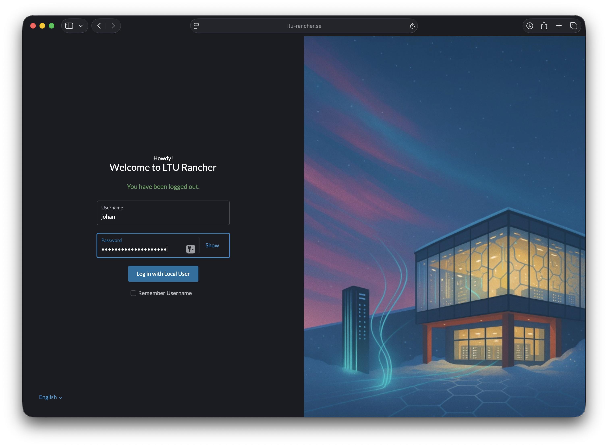

# Tutorial 5 - Getting started using Kubernetes

This guide provides step-by-step instructions to help you begin working with Kubernetes on the LTU-Rancher cluster.

## 1. Install kubectl
Install the `kubectl` command-line tool to interact with and manage Kubernetes clusters.

**Installation:** Follow the official guide at [https://kubernetes.io/docs/tasks/tools](https://kubernetes.io/docs/tasks/tools/)

## 2. Install Helm
Install `helm`, the package manager for Kubernetes that simplifies application deployment and management.

**Installation:** Follow the official guide at [https://helm.sh/docs/intro/install](https://helm.sh/docs/intro/install/)

## 3. Install Docker or Podman
Install a container runtime to package and run applications as containers. Choose either Docker or Podman. Podman is a modern, daemonless alternative to Docker that offers enhanced security and doesn't require root privileges.

- **Docker Desktop:** [https://www.docker.com/products/docker-desktop](https://www.docker.com/products/docker-desktop)
- **Podman:** [https://podman.io/getting-started/installation](https://podman.io/getting-started/installation)

## 4. Verification
Once everything is installed, verify your setup by running the commands below. Note that newer versions may be available after this tutorial was written and should work fine, but older versions might not be compatible.

### kubectl
```bash
kubectl version --client
```
Expected output (versions may vary):
```bash
Client Version: version.Info{Major:"1", Minor:"27", GitVersion:"v1.27.4", GitCommit:"fa3d7990104d7c1f16943a67f11b154b71f6a132", GitTreeState:"clean", BuildDate:"2023-07-19T12:20:54Z", GoVersion:"go1.20.6", Compiler:"gc", Platform:"linux/amd64"}
Kustomize Version: v5.0.1
```

### Helm
```bash
helm version
```
Expected output (versions may vary):
```bash
version.BuildInfo{Version:"v3.12.2", GitCommit:"1e210a2c8cc5117d1055bfaa5d40f51bbc2e345e", GitTreeState:"clean", GoVersion:"go1.20.5"}
```

### Docker
```bash
docker --version
```
Expected output (versions may vary):
```bash
Docker version 20.10.24+dfsg1, build 297e128
```

# Kubernetes Cluster Access

Contact **Casper Lunderberg** to obtain access credentials for the Kubernetes cluster.

**Cluster Details:**
- **Rancher Management Interface:** [https://ltu-rancher.se](https://ltu-rancher.se)
- **Domain Pattern:** Each cluster includes a pre-registered domain (e.g., `ltu-m7011e-1.se`) for ingress configuration and external access

## Download Kubernetes Configuration

### 1. Log in to Rancher
Navigate to the Rancher interface and log in with your provided credentials.



### 2. Select Your Cluster
Click on your assigned cluster name (e.g., `ltu-m7011e-johan`).


### 3. Download KubeConfig
Click on "Download KubeConfig" to download your cluster configuration file.


### 4. Configure kubectl

#### Linux and macOS
```bash
# Navigate to your home directory
cd ~

# Create the .kube directory if it doesn't exist
mkdir -p .kube

# Set proper permissions
chmod 755 .kube

# Copy the downloaded config file (replace with your actual filename)
cp ~/Downloads/ltu-m7011e-johan.yaml ~/.kube/config

# Set proper permissions for the config file
chmod 600 ~/.kube/config
```

#### Windows (PowerShell)
```powershell
# Navigate to your user profile
cd $env:USERPROFILE

# Create the .kube directory if it doesn't exist
New-Item -Path ".kube" -ItemType Directory -Force

# Copy the downloaded config file (adjust path as needed)
Copy-Item -Path "Downloads\ltu-m7011e-johan.yaml" -Destination ".kube\config"
```

### 5. Verify Connection
Test your cluster connection:
```bash
kubectl get nodes
```

Expected output (node names and details will vary):
```bash
NAME                STATUS   ROLES                              AGE   VERSION
ubuntu-8gb-hel1-1   Ready    control-plane,etcd,master,worker   77m   v1.33.3+k3s1
```

If you see output similar to the above showing your cluster nodes in "Ready" status, your kubectl is properly configured and connected to the cluster.
