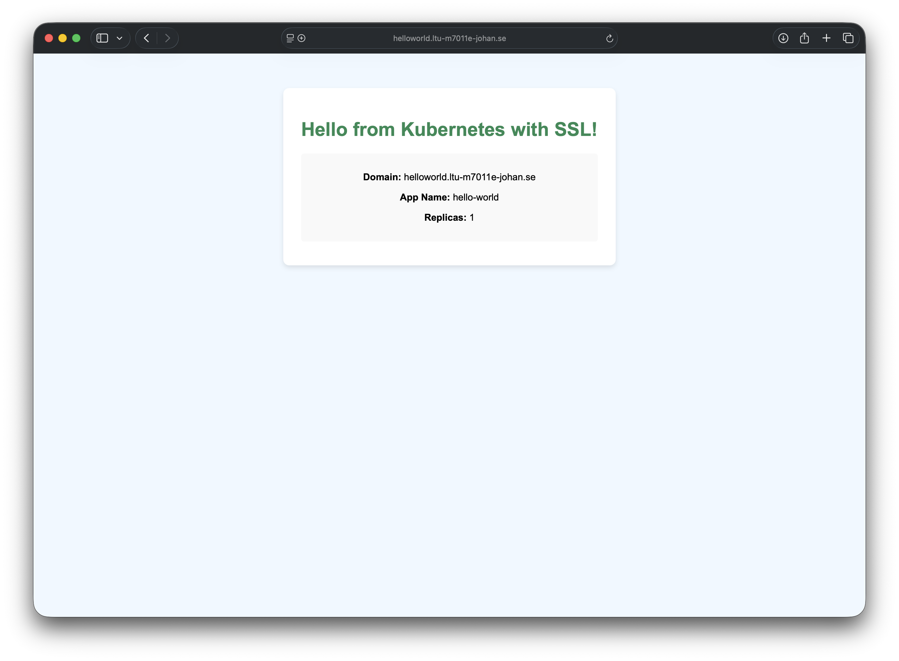

# Tutorial 6 - Deploy a simple web app on Kubernetes 

This tutorial will guide you through deploying a simple application using Helm to verify your Kubernetes setup is working correctly.

## Understanding Helm
Helm is a package manager for Kubernetes that simplifies application deployment and management. Think of it like `apt` for Ubuntu or `brew` for macOS, but specifically designed for Kubernetes applications.

### How Helm Works
Helm uses a templating system to generate Kubernetes YAML manifests. Here's how the files in this project work together:

**Project Structure:**
```
hello-world-app/
├── Chart.yaml              # Chart metadata and version info
├── values.yaml             # Configuration values
└── templates/              # Template directory
    ├── deployment.yaml     # Pod deployment template
    ├── service.yaml        # Service template (networking)
    ├── ingress.yaml        # External access template
    └── configmap.yaml      # HTML content template
```

**Template Processing:**
1. **Values**: The `values.yaml` file contains your configuration (domain, app name, replicas, etc.)
2. **Templates**: Files in `templates/` contain Kubernetes YAML with placeholders like `{{ .Values.app.name }}`
3. **Processing**: Helm substitutes placeholders with actual values from `values.yaml`
4. **Deployment**: Generated YAML manifests are applied to your cluster

**Example Template Usage:**
In `templates/deployment.yaml`, you'll see:
```yaml
name: {{ .Values.app.name }}        # Becomes: hello-world
replicas: {{ .Values.app.replicas }} # Becomes: 1
```

## Project Components
This Helm chart creates several Kubernetes resources:

- **Deployment**: Manages your application pods (nginx containers)
- **Service**: Provides internal networking to reach your pods
- **Ingress**: Enables external access with automatic SSL/TLS certificates
- **ConfigMap**: Contains your HTML content served by nginx

### Automatic SSL Certificate Management
The ingress configuration automatically provisions SSL/TLS certificates using **Let's Encrypt** and **cert-manager**. Here's how it works:

**ACME Protocol**: ACME (Automatic Certificate Management Environment) is a protocol that enables automatic SSL certificate issuance and renewal. It's the standard protocol used by Let's Encrypt to verify domain ownership and issue certificates without manual intervention.

**Certificate Issuer Configuration**:
In the ingress template, you'll see metadata like this:
```yaml
metadata:
  name: {{ .Values.app.name }}
  annotations:
    cert-manager.io/cluster-issuer: letsencrypt-staging
```

The `cert-manager.io/cluster-issuer` annotation tells cert-manager which certificate issuer to use:

- **letsencrypt-staging**: Used for testing and development. Issues certificates from Let's Encrypt's staging environment, which has higher rate limits but produces certificates that browsers will show as "untrusted" (perfect for testing)
- **letsencrypt-prod**: Used for production environments. Issues trusted certificates from Let's Encrypt's production environment, but has stricter rate limits (5 certificates per domain per week)

**The Process**:
1. When you deploy the application, cert-manager detects the `cert-manager.io/cluster-issuer: letsencrypt-staging` annotation
2. Cert-manager uses the ACME protocol to contact Let's Encrypt's servers
3. Let's Encrypt validates that you control the domain (through HTTP-01 challenge)
4. Once verified, Let's Encrypt issues a free SSL certificate
5. The certificate is stored as a Kubernetes secret and automatically applied to your ingress

**Benefits**:
- Free SSL certificates from a trusted Certificate Authority
- Automatic renewal before expiration (every 90 days)
- No manual certificate management required
- Industry-standard security for your web application

This means your application will be accessible over HTTPS immediately after deployment, with no additional configuration needed.

## Configure Your Application
### 1. Edit the Values File
Modify `values.yaml` to match your assigned domain:

```yaml
# values.yaml
app:
  name: hello-world
  replicas: 1

domain: helloworld.ltu-m7011e-johan.se  # Change this to your domain
email: johan.kristiansson@ltu.se        # Change this to your email

message: "Hello from Kubernetes with SSL!"
```

**Important**: Replace `ltu-m7011e-johan.se` with your actual assigned domain name.

## Understanding Kubernetes Namespaces
A **namespace** in Kubernetes is like a virtual cluster within your physical cluster. It provides:

- **Isolation**: Resources in different namespaces are separated from each other
- **Organization**: Group related resources together (e.g., development, staging, production)
- **Resource Management**: Apply quotas and policies per namespace
- **Naming**: Avoid conflicts by allowing same resource names in different namespaces

Think of namespaces as folders on your computer - they help organize and separate your applications.

## Deploy the Application
### 1. Create Namespace
Create a dedicated namespace for your hello world application:

```bash
kubectl create namespace helloworld
```

This creates an isolated environment where your application resources will live.

### 2. Install with Helm
Deploy your application using Helm:

```bash
helm install helloworld -f values.yaml -n helloworld .
```

**Command breakdown:**
- `helm install` - Deploy a new application
- `helloworld` - Name of this deployment (release name)
- `-f values.yaml` - Use your custom values file
- `-n helloworld` - Deploy into the "helloworld" namespace
- `.` - Use the current directory as the chart source

### 3. Cleanup (when finished)
To completely remove the application and free up resources:

```bash
kubectl delete namespace helloworld
```

**Note**: Deleting a namespace removes everything inside it, including the Helm release, pods, services, and any other resources.

## Verify Deployment
Check that your application is running:

```bash
# Check pods in the namespace
kubectl get pods -n helloworld

# Check all resources
kubectl get all -n helloworld

# Check if your ingress is configured
kubectl get ingress -n helloworld

# View your application's HTML content
kubectl get configmap hello-world-html -n helloworld -o yaml
```

### Expected Output
Your pods should show as `Running`:
```bash
NAME                           READY   STATUS    RESTARTS   AGE
hello-world-xxxxxxxxxx-xxxxx   1/1     Running   0          2m
```

Your application should now be accessible at your configured domain (e.g., `https://helloworld.ltu-m7011e-johan.se`).



## How the Application Works
This application demonstrates several key Kubernetes concepts:

1. **nginx Container**: Serves a custom HTML page
2. **ConfigMap**: Stores the HTML content that gets mounted into the nginx container
3. **Service**: Provides stable internal networking (ClusterIP)
4. **Ingress**: Handles external traffic and SSL termination using Traefik and Let's Encrypt
5. **Deployment**: Ensures your specified number of replicas are always running

## Troubleshooting
If something goes wrong, you can debug with these commands:

```bash
# Check Helm releases
helm list -n helloworld

# View detailed pod information
kubectl describe pods -n helloworld

# Check application logs
kubectl logs -l app=hello-world -n helloworld

# Check ingress status
kubectl describe ingress hello-world -n helloworld

# Verify certificate status
kubectl get certificate -n helloworld

# Check if DNS is resolving correctly
nslookup your-domain.ltu-m7011e-johan.se
```

### Common Issues
- **Pod not starting**: Check `kubectl describe pod` for resource constraints or image issues
- **Website not accessible**: Verify ingress configuration and DNS resolution
- **SSL certificate issues**: Check certificate issuer status and Let's Encrypt rate limits
- **Template errors**: Run `helm template . -f values.yaml` to test template rendering

## Advanced Usage
### Update Your Application
After making changes to values or templates:
```bash
helm upgrade helloworld -f values.yaml -n helloworld .
```

### View Generated YAML
To see what Kubernetes resources Helm will create:
```bash
helm template helloworld -f values.yaml .
```

### Rollback Changes
If an update causes issues:
```bash
helm rollback helloworld -n helloworld
```
