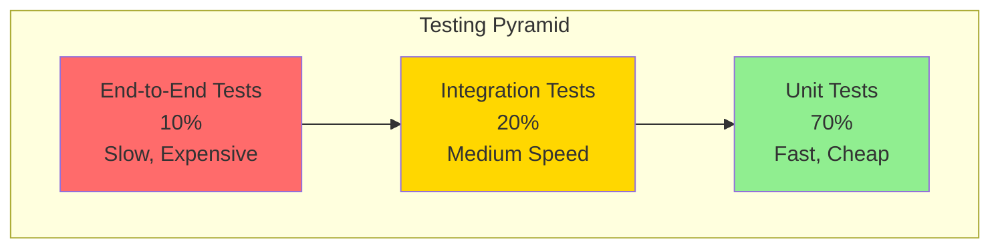
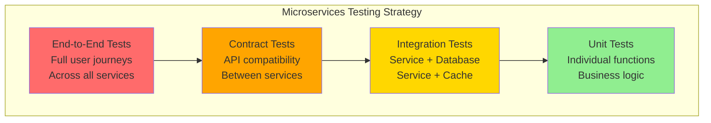

# Tutorial 10: Testing and GitHub CI Pipelines

Implement comprehensive testing strategies and automated CI pipelines with GitHub Actions for your microservices.

## Why Testing Matters

In microservices architecture, testing is critical because:

- **Early Bug Detection**: Catch issues before they reach production
- **Refactoring Confidence**: Change code knowing tests will catch regressions
- **Documentation**: Tests serve as living documentation of expected behavior
- **Deployment Safety**: Automated tests prevent broken code from being deployed
- **Team Collaboration**: Tests ensure new changes don't break existing functionality
- **Cost Savings**: Finding bugs early is 10-100x cheaper than fixing production issues

## Learning Objectives

By the end of this tutorial, you will:

1. Write unit tests for Flask APIs using pytest
2. Write integration tests for database operations
3. Write frontend tests for React components using Jest and React Testing Library
4. Set up GitHub Actions for automated CI/CD
5. Implement code coverage reporting
6. Create test workflows that run on every pull request
7. Understand the testing pyramid and when to use each test type

## Prerequisites

- Completed Tutorial 1 (Basic Web App)
- Completed Tutorial 8 (PostgreSQL)
- Completed Tutorial 9 (React Frontend)
- GitHub account
- Basic understanding of Python and JavaScript

---

## Part 1: Understanding the Testing Pyramid



**Unit Tests (70%)**:
- Test individual functions in isolation
- Fast execution (milliseconds)
- Mock external dependencies
- Example: Testing a password hashing function

**Integration Tests (20%)**:
- Test multiple components together
- Medium speed (seconds)
- Use real databases (test containers)
- Example: Testing API endpoint with real database

**End-to-End Tests (10%)**:
- Test complete user workflows
- Slow execution (minutes)
- Test in production-like environment
- Example: Testing entire registration flow in browser

---

## Part 2: Backend Testing with Python and pytest

### Installing Dependencies

```bash
cd 10-testing-ci/backend-tests
pip install -r requirements.txt
```

**requirements.txt:**
```txt
flask==3.0.0
pytest==7.4.3
pytest-cov==4.1.0
pytest-mock==3.12.0
psycopg2-binary==2.9.9
redis==5.0.1
bcrypt==4.1.2
requests==2.31.0
```

### Example: Todo Service to Test

**`examples/todo_service.py`:**
```python
from flask import Flask, request, jsonify
import psycopg2
from datetime import datetime

app = Flask(__name__)

# Database connection
def get_db_connection():
    return psycopg2.connect(
        host='localhost',
        database='tododb',
        user='postgres',
        password='postgres'
    )

def create_todo(title, description, user_id):
    """Create a new todo item"""
    if not title:
        raise ValueError("Title is required")

    if len(title) > 200:
        raise ValueError("Title too long (max 200 characters)")

    conn = get_db_connection()
    cursor = conn.cursor()

    cursor.execute(
        """
        INSERT INTO todos (title, description, user_id, completed, created_at)
        VALUES (%s, %s, %s, %s, %s)
        RETURNING todo_id
        """,
        (title, description, user_id, False, datetime.utcnow())
    )

    todo_id = cursor.fetchone()[0]
    conn.commit()
    cursor.close()
    conn.close()

    return todo_id

def get_todos_by_user(user_id):
    """Get all todos for a user"""
    conn = get_db_connection()
    cursor = conn.cursor()

    cursor.execute(
        """
        SELECT todo_id, title, description, completed, created_at
        FROM todos
        WHERE user_id = %s
        ORDER BY created_at DESC
        """,
        (user_id,)
    )

    todos = []
    for row in cursor.fetchall():
        todos.append({
            'todo_id': row[0],
            'title': row[1],
            'description': row[2],
            'completed': row[3],
            'created_at': row[4].isoformat()
        })

    cursor.close()
    conn.close()

    return todos

def mark_todo_complete(todo_id, user_id):
    """Mark a todo as complete"""
    conn = get_db_connection()
    cursor = conn.cursor()

    cursor.execute(
        """
        UPDATE todos
        SET completed = true
        WHERE todo_id = %s AND user_id = %s
        RETURNING todo_id
        """,
        (todo_id, user_id)
    )

    result = cursor.fetchone()
    conn.commit()
    cursor.close()
    conn.close()

    if not result:
        raise ValueError("Todo not found or unauthorized")

    return True

@app.route('/api/todos', methods=['POST'])
def create_todo_endpoint():
    """Create todo endpoint"""
    data = request.get_json()

    try:
        todo_id = create_todo(
            data.get('title'),
            data.get('description'),
            data.get('user_id')
        )

        return jsonify({'todo_id': todo_id}), 201
    except ValueError as e:
        return jsonify({'error': str(e)}), 400
    except Exception as e:
        return jsonify({'error': 'Internal server error'}), 500

@app.route('/api/todos/<int:user_id>', methods=['GET'])
def get_todos_endpoint(user_id):
    """Get user todos endpoint"""
    try:
        todos = get_todos_by_user(user_id)
        return jsonify({'todos': todos}), 200
    except Exception as e:
        return jsonify({'error': 'Internal server error'}), 500

@app.route('/api/todos/<int:todo_id>/complete', methods=['PUT'])
def complete_todo_endpoint(todo_id):
    """Mark todo complete endpoint"""
    data = request.get_json()
    user_id = data.get('user_id')

    try:
        mark_todo_complete(todo_id, user_id)
        return jsonify({'success': True}), 200
    except ValueError as e:
        return jsonify({'error': str(e)}), 404
    except Exception as e:
        return jsonify({'error': 'Internal server error'}), 500
```

### Unit Tests

**`backend-tests/test_unit.py`:**
```python
import pytest
from unittest.mock import Mock, patch, MagicMock
from datetime import datetime
import sys
sys.path.append('../examples')

from todo_service import create_todo, get_todos_by_user, mark_todo_complete

class TestCreateTodo:
    """Unit tests for create_todo function"""

    @patch('todo_service.get_db_connection')
    def test_create_todo_success(self, mock_get_db):
        """Test creating a todo successfully"""
        # Arrange
        mock_conn = Mock()
        mock_cursor = Mock()
        mock_cursor.fetchone.return_value = [123]
        mock_conn.cursor.return_value = mock_cursor
        mock_get_db.return_value = mock_conn

        # Act
        todo_id = create_todo('Buy milk', 'From the store', 1)

        # Assert
        assert todo_id == 123
        mock_cursor.execute.assert_called_once()
        mock_conn.commit.assert_called_once()
        mock_cursor.close.assert_called_once()
        mock_conn.close.assert_called_once()

    @patch('todo_service.get_db_connection')
    def test_create_todo_empty_title_fails(self, mock_get_db):
        """Test that empty title raises ValueError"""
        # Act & Assert
        with pytest.raises(ValueError, match="Title is required"):
            create_todo('', 'Description', 1)

        # Database should not be called
        mock_get_db.assert_not_called()

    @patch('todo_service.get_db_connection')
    def test_create_todo_long_title_fails(self, mock_get_db):
        """Test that title > 200 chars raises ValueError"""
        long_title = 'a' * 201

        # Act & Assert
        with pytest.raises(ValueError, match="Title too long"):
            create_todo(long_title, 'Description', 1)

        # Database should not be called
        mock_get_db.assert_not_called()

class TestGetTodosByUser:
    """Unit tests for get_todos_by_user function"""

    @patch('todo_service.get_db_connection')
    def test_get_todos_returns_list(self, mock_get_db):
        """Test getting todos returns correct format"""
        # Arrange
        mock_conn = Mock()
        mock_cursor = Mock()
        mock_cursor.fetchall.return_value = [
            (1, 'Buy milk', 'From store', False, datetime(2024, 1, 15, 10, 30)),
            (2, 'Walk dog', 'In park', True, datetime(2024, 1, 15, 11, 0))
        ]
        mock_conn.cursor.return_value = mock_cursor
        mock_get_db.return_value = mock_conn

        # Act
        todos = get_todos_by_user(1)

        # Assert
        assert len(todos) == 2
        assert todos[0]['todo_id'] == 1
        assert todos[0]['title'] == 'Buy milk'
        assert todos[0]['completed'] == False
        assert todos[1]['todo_id'] == 2
        assert todos[1]['completed'] == True

    @patch('todo_service.get_db_connection')
    def test_get_todos_empty_list(self, mock_get_db):
        """Test getting todos for user with no todos"""
        # Arrange
        mock_conn = Mock()
        mock_cursor = Mock()
        mock_cursor.fetchall.return_value = []
        mock_conn.cursor.return_value = mock_cursor
        mock_get_db.return_value = mock_conn

        # Act
        todos = get_todos_by_user(999)

        # Assert
        assert todos == []

class TestMarkTodoComplete:
    """Unit tests for mark_todo_complete function"""

    @patch('todo_service.get_db_connection')
    def test_mark_complete_success(self, mock_get_db):
        """Test marking todo as complete"""
        # Arrange
        mock_conn = Mock()
        mock_cursor = Mock()
        mock_cursor.fetchone.return_value = [1]
        mock_conn.cursor.return_value = mock_cursor
        mock_get_db.return_value = mock_conn

        # Act
        result = mark_todo_complete(1, 1)

        # Assert
        assert result == True
        mock_conn.commit.assert_called_once()

    @patch('todo_service.get_db_connection')
    def test_mark_complete_not_found(self, mock_get_db):
        """Test marking non-existent todo fails"""
        # Arrange
        mock_conn = Mock()
        mock_cursor = Mock()
        mock_cursor.fetchone.return_value = None
        mock_conn.cursor.return_value = mock_cursor
        mock_get_db.return_value = mock_conn

        # Act & Assert
        with pytest.raises(ValueError, match="Todo not found"):
            mark_todo_complete(999, 1)

# Pytest fixtures for reusable test setup
@pytest.fixture
def mock_db_connection():
    """Fixture to provide a mocked database connection"""
    with patch('todo_service.get_db_connection') as mock:
        mock_conn = Mock()
        mock_cursor = Mock()
        mock_conn.cursor.return_value = mock_cursor
        mock.return_value = mock_conn
        yield {
            'connection': mock_conn,
            'cursor': mock_cursor,
            'get_db': mock
        }
```

### Integration Tests

**`backend-tests/test_integration.py`:**
```python
import pytest
import psycopg2
from datetime import datetime
import sys
sys.path.append('../examples')

from todo_service import create_todo, get_todos_by_user, mark_todo_complete

# Test database configuration
TEST_DB_CONFIG = {
    'host': 'localhost',
    'database': 'test_tododb',
    'user': 'postgres',
    'password': 'postgres'
}

@pytest.fixture(scope='module')
def test_database():
    """Set up test database"""
    # Connect to default database to create test database
    conn = psycopg2.connect(
        host=TEST_DB_CONFIG['host'],
        database='postgres',
        user=TEST_DB_CONFIG['user'],
        password=TEST_DB_CONFIG['password']
    )
    conn.autocommit = True
    cursor = conn.cursor()

    # Create test database
    cursor.execute(f"DROP DATABASE IF EXISTS {TEST_DB_CONFIG['database']}")
    cursor.execute(f"CREATE DATABASE {TEST_DB_CONFIG['database']}")
    cursor.close()
    conn.close()

    # Connect to test database and create schema
    conn = psycopg2.connect(**TEST_DB_CONFIG)
    cursor = conn.cursor()
    cursor.execute("""
        CREATE TABLE IF NOT EXISTS todos (
            todo_id SERIAL PRIMARY KEY,
            title VARCHAR(200) NOT NULL,
            description TEXT,
            user_id INTEGER NOT NULL,
            completed BOOLEAN DEFAULT FALSE,
            created_at TIMESTAMP DEFAULT CURRENT_TIMESTAMP
        )
    """)
    conn.commit()
    cursor.close()
    conn.close()

    yield TEST_DB_CONFIG

    # Cleanup
    conn = psycopg2.connect(
        host=TEST_DB_CONFIG['host'],
        database='postgres',
        user=TEST_DB_CONFIG['user'],
        password=TEST_DB_CONFIG['password']
    )
    conn.autocommit = True
    cursor = conn.cursor()
    cursor.execute(f"DROP DATABASE IF EXISTS {TEST_DB_CONFIG['database']}")
    cursor.close()
    conn.close()

@pytest.fixture(autouse=True)
def clean_database(test_database):
    """Clean database before each test"""
    conn = psycopg2.connect(**test_database)
    cursor = conn.cursor()
    cursor.execute("DELETE FROM todos")
    conn.commit()
    cursor.close()
    conn.close()

class TestTodoIntegration:
    """Integration tests with real database"""

    def test_create_and_retrieve_todo(self, test_database):
        """Test creating and retrieving a todo"""
        # Create todo
        todo_id = create_todo('Integration test todo', 'Test description', 1)

        assert todo_id is not None
        assert isinstance(todo_id, int)

        # Retrieve todos
        todos = get_todos_by_user(1)

        assert len(todos) == 1
        assert todos[0]['todo_id'] == todo_id
        assert todos[0]['title'] == 'Integration test todo'
        assert todos[0]['completed'] == False

    def test_multiple_users_isolation(self, test_database):
        """Test that users only see their own todos"""
        # Create todos for different users
        user1_todo = create_todo('User 1 todo', 'Description', 1)
        user2_todo = create_todo('User 2 todo', 'Description', 2)

        # User 1 should only see their todo
        user1_todos = get_todos_by_user(1)
        assert len(user1_todos) == 1
        assert user1_todos[0]['todo_id'] == user1_todo

        # User 2 should only see their todo
        user2_todos = get_todos_by_user(2)
        assert len(user2_todos) == 1
        assert user2_todos[0]['todo_id'] == user2_todo

    def test_mark_todo_complete_workflow(self, test_database):
        """Test complete todo workflow"""
        # Create todo
        todo_id = create_todo('Complete me', 'Test', 1)

        # Verify it's not complete
        todos = get_todos_by_user(1)
        assert todos[0]['completed'] == False

        # Mark complete
        mark_todo_complete(todo_id, 1)

        # Verify it's complete
        todos = get_todos_by_user(1)
        assert todos[0]['completed'] == True

    def test_mark_complete_wrong_user_fails(self, test_database):
        """Test user cannot complete another user's todo"""
        # User 1 creates todo
        todo_id = create_todo('User 1 todo', 'Description', 1)

        # User 2 tries to complete it
        with pytest.raises(ValueError, match="Todo not found"):
            mark_todo_complete(todo_id, 2)
```

### API Tests

**`backend-tests/test_api.py`:**
```python
import pytest
from unittest.mock import patch
import json
import sys
sys.path.append('../examples')

from todo_service import app

@pytest.fixture
def client():
    """Flask test client"""
    app.config['TESTING'] = True
    with app.test_client() as client:
        yield client

class TestTodoAPI:
    """Test Flask API endpoints"""

    @patch('todo_service.create_todo')
    def test_create_todo_endpoint_success(self, mock_create, client):
        """Test POST /api/todos success"""
        # Arrange
        mock_create.return_value = 123

        # Act
        response = client.post(
            '/api/todos',
            data=json.dumps({
                'title': 'Test todo',
                'description': 'Test description',
                'user_id': 1
            }),
            content_type='application/json'
        )

        # Assert
        assert response.status_code == 201
        data = json.loads(response.data)
        assert data['todo_id'] == 123

    @patch('todo_service.create_todo')
    def test_create_todo_endpoint_validation_error(self, mock_create, client):
        """Test POST /api/todos with validation error"""
        # Arrange
        mock_create.side_effect = ValueError("Title is required")

        # Act
        response = client.post(
            '/api/todos',
            data=json.dumps({
                'title': '',
                'description': 'Test',
                'user_id': 1
            }),
            content_type='application/json'
        )

        # Assert
        assert response.status_code == 400
        data = json.loads(response.data)
        assert 'error' in data

    @patch('todo_service.get_todos_by_user')
    def test_get_todos_endpoint(self, mock_get_todos, client):
        """Test GET /api/todos/<user_id>"""
        # Arrange
        mock_get_todos.return_value = [
            {
                'todo_id': 1,
                'title': 'Test todo',
                'description': 'Test',
                'completed': False,
                'created_at': '2024-01-15T10:30:00'
            }
        ]

        # Act
        response = client.get('/api/todos/1')

        # Assert
        assert response.status_code == 200
        data = json.loads(response.data)
        assert 'todos' in data
        assert len(data['todos']) == 1
        assert data['todos'][0]['title'] == 'Test todo'

    @patch('todo_service.mark_todo_complete')
    def test_complete_todo_endpoint_success(self, mock_complete, client):
        """Test PUT /api/todos/<id>/complete"""
        # Arrange
        mock_complete.return_value = True

        # Act
        response = client.put(
            '/api/todos/1/complete',
            data=json.dumps({'user_id': 1}),
            content_type='application/json'
        )

        # Assert
        assert response.status_code == 200
        data = json.loads(response.data)
        assert data['success'] == True

    @patch('todo_service.mark_todo_complete')
    def test_complete_todo_endpoint_not_found(self, mock_complete, client):
        """Test PUT /api/todos/<id>/complete with non-existent todo"""
        # Arrange
        mock_complete.side_effect = ValueError("Todo not found")

        # Act
        response = client.put(
            '/api/todos/999/complete',
            data=json.dumps({'user_id': 1}),
            content_type='application/json'
        )

        # Assert
        assert response.status_code == 404
        data = json.loads(response.data)
        assert 'error' in data
```

### Running Tests

```bash
# Run all tests
pytest

# Run with coverage
pytest --cov=examples --cov-report=html

# Run specific test file
pytest backend-tests/test_unit.py

# Run specific test class
pytest backend-tests/test_unit.py::TestCreateTodo

# Run specific test
pytest backend-tests/test_unit.py::TestCreateTodo::test_create_todo_success

# Run with verbose output
pytest -v

# Run with output from print statements
pytest -s
```

**Example output:**
```
======================== test session starts ========================
collected 15 items

backend-tests/test_unit.py ............                      [ 80%]
backend-tests/test_api.py ...                                [100%]

==================== 15 passed in 0.45s ====================
```

---

## Part 3: Frontend Testing with Jest and React Testing Library

### Installing Dependencies

```bash
cd 10-testing-ci/frontend-tests
npm install --save-dev jest @testing-library/react @testing-library/jest-dom @testing-library/user-event
```

### Example: TodoList Component to Test

**`examples/TodoList.jsx`:**
```jsx
import React, { useState, useEffect } from 'react';

export function TodoList({ userId }) {
  const [todos, setTodos] = useState([]);
  const [loading, setLoading] = useState(true);
  const [error, setError] = useState(null);
  const [newTodoTitle, setNewTodoTitle] = useState('');

  useEffect(() => {
    fetchTodos();
  }, [userId]);

  const fetchTodos = async () => {
    try {
      setLoading(true);
      const response = await fetch(`/api/todos/${userId}`);
      if (!response.ok) throw new Error('Failed to fetch todos');
      const data = await response.json();
      setTodos(data.todos);
      setError(null);
    } catch (err) {
      setError(err.message);
    } finally {
      setLoading(false);
    }
  };

  const createTodo = async (e) => {
    e.preventDefault();
    if (!newTodoTitle.trim()) return;

    try {
      const response = await fetch('/api/todos', {
        method: 'POST',
        headers: { 'Content-Type': 'application/json' },
        body: JSON.stringify({
          title: newTodoTitle,
          user_id: userId
        })
      });

      if (!response.ok) throw new Error('Failed to create todo');

      setNewTodoTitle('');
      fetchTodos();
    } catch (err) {
      setError(err.message);
    }
  };

  const toggleComplete = async (todoId) => {
    try {
      const response = await fetch(`/api/todos/${todoId}/complete`, {
        method: 'PUT',
        headers: { 'Content-Type': 'application/json' },
        body: JSON.stringify({ user_id: userId })
      });

      if (!response.ok) throw new Error('Failed to update todo');

      fetchTodos();
    } catch (err) {
      setError(err.message);
    }
  };

  if (loading) return <div>Loading...</div>;
  if (error) return <div className="error">Error: {error}</div>;

  return (
    <div className="todo-list">
      <h1>My Todos</h1>

      <form onSubmit={createTodo}>
        <input
          type="text"
          value={newTodoTitle}
          onChange={(e) => setNewTodoTitle(e.target.value)}
          placeholder="Add new todo..."
          data-testid="new-todo-input"
        />
        <button type="submit" data-testid="add-todo-button">
          Add
        </button>
      </form>

      <ul>
        {todos.map(todo => (
          <li key={todo.todo_id} data-testid={`todo-${todo.todo_id}`}>
            <input
              type="checkbox"
              checked={todo.completed}
              onChange={() => toggleComplete(todo.todo_id)}
              data-testid={`todo-checkbox-${todo.todo_id}`}
            />
            <span className={todo.completed ? 'completed' : ''}>
              {todo.title}
            </span>
          </li>
        ))}
      </ul>

      {todos.length === 0 && (
        <p data-testid="empty-message">No todos yet. Add one above!</p>
      )}
    </div>
  );
}
```

### Frontend Tests

**`frontend-tests/TodoList.test.jsx`:**
```jsx
import React from 'react';
import { render, screen, waitFor, fireEvent } from '@testing-library/react';
import userEvent from '@testing-library/user-event';
import '@testing-library/jest-dom';
import { TodoList } from '../examples/TodoList';

// Mock fetch globally
global.fetch = jest.fn();

describe('TodoList Component', () => {
  beforeEach(() => {
    // Clear all mocks before each test
    jest.clearAllMocks();
  });

  describe('Loading and Error States', () => {
    test('shows loading state initially', () => {
      // Arrange
      fetch.mockImplementation(() => new Promise(() => {})); // Never resolves

      // Act
      render(<TodoList userId={1} />);

      // Assert
      expect(screen.getByText('Loading...')).toBeInTheDocument();
    });

    test('shows error when fetch fails', async () => {
      // Arrange
      fetch.mockRejectedValueOnce(new Error('Network error'));

      // Act
      render(<TodoList userId={1} />);

      // Assert
      await waitFor(() => {
        expect(screen.getByText(/Error:/)).toBeInTheDocument();
      });
    });
  });

  describe('Fetching Todos', () => {
    test('fetches and displays todos on mount', async () => {
      // Arrange
      const mockTodos = {
        todos: [
          { todo_id: 1, title: 'Buy milk', completed: false },
          { todo_id: 2, title: 'Walk dog', completed: true }
        ]
      };

      fetch.mockResolvedValueOnce({
        ok: true,
        json: async () => mockTodos
      });

      // Act
      render(<TodoList userId={1} />);

      // Assert
      await waitFor(() => {
        expect(screen.getByText('Buy milk')).toBeInTheDocument();
        expect(screen.getByText('Walk dog')).toBeInTheDocument();
      });
    });

    test('shows empty message when no todos', async () => {
      // Arrange
      fetch.mockResolvedValueOnce({
        ok: true,
        json: async () => ({ todos: [] })
      });

      // Act
      render(<TodoList userId={1} />);

      // Assert
      await waitFor(() => {
        expect(screen.getByTestId('empty-message')).toBeInTheDocument();
      });
    });

    test('calls API with correct user ID', async () => {
      // Arrange
      fetch.mockResolvedValueOnce({
        ok: true,
        json: async () => ({ todos: [] })
      });

      // Act
      render(<TodoList userId={42} />);

      // Assert
      await waitFor(() => {
        expect(fetch).toHaveBeenCalledWith('/api/todos/42');
      });
    });
  });

  describe('Creating Todos', () => {
    test('creates new todo when form submitted', async () => {
      // Arrange
      fetch
        .mockResolvedValueOnce({
          ok: true,
          json: async () => ({ todos: [] })
        })
        .mockResolvedValueOnce({
          ok: true,
          json: async () => ({ todo_id: 1 })
        })
        .mockResolvedValueOnce({
          ok: true,
          json: async () => ({
            todos: [{ todo_id: 1, title: 'New todo', completed: false }]
          })
        });

      render(<TodoList userId={1} />);

      await waitFor(() => screen.getByTestId('new-todo-input'));

      // Act
      const input = screen.getByTestId('new-todo-input');
      const button = screen.getByTestId('add-todo-button');

      await userEvent.type(input, 'New todo');
      await userEvent.click(button);

      // Assert
      await waitFor(() => {
        expect(fetch).toHaveBeenCalledWith('/api/todos', {
          method: 'POST',
          headers: { 'Content-Type': 'application/json' },
          body: JSON.stringify({
            title: 'New todo',
            user_id: 1
          })
        });
      });

      // Input should be cleared
      expect(input.value).toBe('');
    });

    test('does not create todo with empty title', async () => {
      // Arrange
      fetch.mockResolvedValueOnce({
        ok: true,
        json: async () => ({ todos: [] })
      });

      render(<TodoList userId={1} />);

      await waitFor(() => screen.getByTestId('add-todo-button'));

      // Act
      const button = screen.getByTestId('add-todo-button');
      await userEvent.click(button);

      // Assert
      // Only the initial fetch should have been called
      expect(fetch).toHaveBeenCalledTimes(1);
    });
  });

  describe('Completing Todos', () => {
    test('marks todo as complete when checkbox clicked', async () => {
      // Arrange
      const mockTodos = {
        todos: [{ todo_id: 1, title: 'Buy milk', completed: false }]
      };

      fetch
        .mockResolvedValueOnce({
          ok: true,
          json: async () => mockTodos
        })
        .mockResolvedValueOnce({
          ok: true,
          json: async () => ({ success: true })
        })
        .mockResolvedValueOnce({
          ok: true,
          json: async () => ({
            todos: [{ todo_id: 1, title: 'Buy milk', completed: true }]
          })
        });

      render(<TodoList userId={1} />);

      await waitFor(() => screen.getByTestId('todo-checkbox-1'));

      // Act
      const checkbox = screen.getByTestId('todo-checkbox-1');
      await userEvent.click(checkbox);

      // Assert
      await waitFor(() => {
        expect(fetch).toHaveBeenCalledWith('/api/todos/1/complete', {
          method: 'PUT',
          headers: { 'Content-Type': 'application/json' },
          body: JSON.stringify({ user_id: 1 })
        });
      });
    });
  });

  describe('Accessibility', () => {
    test('has accessible form elements', async () => {
      // Arrange
      fetch.mockResolvedValueOnce({
        ok: true,
        json: async () => ({ todos: [] })
      });

      // Act
      render(<TodoList userId={1} />);

      // Assert
      await waitFor(() => {
        const input = screen.getByPlaceholderText('Add new todo...');
        const button = screen.getByRole('button', { name: /add/i });

        expect(input).toBeInTheDocument();
        expect(button).toBeInTheDocument();
      });
    });

    test('checkboxes are keyboard accessible', async () => {
      // Arrange
      fetch.mockResolvedValueOnce({
        ok: true,
        json: async () => ({
          todos: [{ todo_id: 1, title: 'Test', completed: false }]
        })
      });

      render(<TodoList userId={1} />);

      // Assert
      await waitFor(() => {
        const checkbox = screen.getByTestId('todo-checkbox-1');
        expect(checkbox).toHaveAttribute('type', 'checkbox');
      });
    });
  });
});
```

### Running Frontend Tests

```bash
# Run all tests
npm test

# Run with coverage
npm test -- --coverage

# Run in watch mode
npm test -- --watch

# Run specific test file
npm test TodoList.test.jsx
```

---

## Part 4: GitHub Actions CI Pipeline

### Basic CI Workflow

**`.github/workflows/ci.yml`:**
```yaml
name: CI Pipeline

on:
  push:
    branches: [main, develop]
  pull_request:
    branches: [main, develop]

jobs:
  backend-tests:
    name: Backend Tests
    runs-on: ubuntu-latest

    services:
      postgres:
        image: postgres:15
        env:
          POSTGRES_USER: postgres
          POSTGRES_PASSWORD: postgres
          POSTGRES_DB: test_tododb
        options: >-
          --health-cmd pg_isready
          --health-interval 10s
          --health-timeout 5s
          --health-retries 5
        ports:
          - 5432:5432

      redis:
        image: redis:7
        options: >-
          --health-cmd "redis-cli ping"
          --health-interval 10s
          --health-timeout 5s
          --health-retries 5
        ports:
          - 6379:6379

    steps:
      - name: Checkout code
        uses: actions/checkout@v4

      - name: Set up Python
        uses: actions/setup-python@v4
        with:
          python-version: '3.11'

      - name: Cache pip dependencies
        uses: actions/cache@v3
        with:
          path: ~/.cache/pip
          key: ${{ runner.os }}-pip-${{ hashFiles('**/requirements.txt') }}
          restore-keys: |
            ${{ runner.os }}-pip-

      - name: Install dependencies
        run: |
          cd 10-testing-ci/backend-tests
          pip install -r requirements.txt

      - name: Run unit tests
        run: |
          cd 10-testing-ci/backend-tests
          pytest test_unit.py -v

      - name: Run integration tests
        env:
          DB_HOST: localhost
          DB_PORT: 5432
          DB_USER: postgres
          DB_PASSWORD: postgres
          DB_NAME: test_tododb
        run: |
          cd 10-testing-ci/backend-tests
          pytest test_integration.py -v

      - name: Run API tests
        run: |
          cd 10-testing-ci/backend-tests
          pytest test_api.py -v

      - name: Generate coverage report
        run: |
          cd 10-testing-ci/backend-tests
          pytest --cov=../examples --cov-report=xml --cov-report=html

      - name: Upload coverage to Codecov
        uses: codecov/codecov-action@v3
        with:
          files: ./10-testing-ci/backend-tests/coverage.xml
          flags: backend

  frontend-tests:
    name: Frontend Tests
    runs-on: ubuntu-latest

    steps:
      - name: Checkout code
        uses: actions/checkout@v4

      - name: Set up Node.js
        uses: actions/setup-node@v4
        with:
          node-version: '18'

      - name: Cache npm dependencies
        uses: actions/cache@v3
        with:
          path: ~/.npm
          key: ${{ runner.os }}-node-${{ hashFiles('**/package-lock.json') }}
          restore-keys: |
            ${{ runner.os }}-node-

      - name: Install dependencies
        run: |
          cd 10-testing-ci/frontend-tests
          npm ci

      - name: Run tests
        run: |
          cd 10-testing-ci/frontend-tests
          npm test -- --coverage --watchAll=false

      - name: Upload coverage to Codecov
        uses: codecov/codecov-action@v3
        with:
          files: ./10-testing-ci/frontend-tests/coverage/lcov.info
          flags: frontend

  lint:
    name: Code Linting
    runs-on: ubuntu-latest

    steps:
      - name: Checkout code
        uses: actions/checkout@v4

      - name: Set up Python
        uses: actions/setup-python@v4
        with:
          python-version: '3.11'

      - name: Install linters
        run: |
          pip install flake8 black pylint

      - name: Run flake8
        run: |
          flake8 10-testing-ci/examples --max-line-length=100

      - name: Run black check
        run: |
          black --check 10-testing-ci/examples

  security-scan:
    name: Security Scan
    runs-on: ubuntu-latest

    steps:
      - name: Checkout code
        uses: actions/checkout@v4

      - name: Run Trivy vulnerability scanner
        uses: aquasecurity/trivy-action@master
        with:
          scan-type: 'fs'
          scan-ref: '.'
          format: 'sarif'
          output: 'trivy-results.sarif'

      - name: Upload Trivy results to GitHub Security tab
        uses: github/codeql-action/upload-sarif@v2
        with:
          sarif_file: 'trivy-results.sarif'
```

### PR Status Checks

**`.github/workflows/pr-checks.yml`:**
```yaml
name: PR Checks

on:
  pull_request:
    branches: [main]

jobs:
  test-coverage:
    name: Test Coverage Check
    runs-on: ubuntu-latest

    steps:
      - name: Checkout code
        uses: actions/checkout@v4

      - name: Set up Python
        uses: actions/setup-python@v4
        with:
          python-version: '3.11'

      - name: Install dependencies
        run: |
          cd 10-testing-ci/backend-tests
          pip install -r requirements.txt

      - name: Run tests with coverage
        run: |
          cd 10-testing-ci/backend-tests
          pytest --cov=../examples --cov-report=term-missing --cov-fail-under=80

      - name: Comment PR with coverage
        uses: py-cov-action/python-coverage-comment-action@v3
        with:
          GITHUB_TOKEN: ${{ github.token }}
          MINIMUM_GREEN: 80
          MINIMUM_ORANGE: 60

  test-all-python-versions:
    name: Test on Python ${{ matrix.python-version }}
    runs-on: ubuntu-latest

    strategy:
      matrix:
        python-version: ['3.9', '3.10', '3.11', '3.12']

    steps:
      - name: Checkout code
        uses: actions/checkout@v4

      - name: Set up Python ${{ matrix.python-version }}
        uses: actions/setup-python@v4
        with:
          python-version: ${{ matrix.python-version }}

      - name: Install dependencies
        run: |
          cd 10-testing-ci/backend-tests
          pip install -r requirements.txt

      - name: Run tests
        run: |
          cd 10-testing-ci/backend-tests
          pytest -v

  prevent-merge-if-failing:
    name: All Tests Must Pass
    runs-on: ubuntu-latest
    needs: [test-coverage, test-all-python-versions]

    steps:
      - name: Check all tests passed
        run: echo "All tests passed!"
```

### Deployment Workflow (runs after tests pass)

**`.github/workflows/deploy.yml`:**
```yaml
name: Deploy to Production

on:
  push:
    branches: [main]

jobs:
  test:
    name: Run Tests
    uses: ./.github/workflows/ci.yml

  deploy:
    name: Deploy to Kubernetes
    runs-on: ubuntu-latest
    needs: test

    steps:
      - name: Checkout code
        uses: actions/checkout@v4

      - name: Build Docker image
        run: |
          docker build -t myapp:${{ github.sha }} .

      - name: Push to registry
        run: |
          echo "Push to container registry"

      - name: Deploy to Kubernetes
        run: |
          echo "kubectl apply -f k8s/"
          echo "Deployment successful!"
```

---

## Part 5: Code Coverage and Quality Metrics

### Coverage Configuration

**`backend-tests/.coveragerc`:**
```ini
[run]
source = ../examples
omit =
    */tests/*
    */venv/*
    */migrations/*

[report]
precision = 2
show_missing = True
skip_covered = False

[html]
directory = htmlcov
```

### Coverage Badges

Add to your README.md:

```markdown
[](https://codecov.io/gh/username/repo)
[](https://github.com/username/repo/actions)
```

### Viewing Coverage Reports

```bash
# Generate HTML coverage report
pytest --cov=examples --cov-report=html

# Open in browser
open htmlcov/index.html
```

**Coverage report example:**
```
Name                    Stmts   Miss  Cover   Missing
-----------------------------------------------------
examples/todo_service.py   85      2    98%   142, 156
-----------------------------------------------------
TOTAL                      85      2    98%
```

---

## Part 6: Testing Best Practices

### 1. Test Naming Conventions

```python
# ✅ Good: Descriptive test names
def test_create_todo_with_empty_title_raises_value_error():
    pass

# ❌ Bad: Vague test names
def test_1():
    pass
```

### 2. Arrange-Act-Assert Pattern

```python
def test_example():
    # Arrange: Set up test data
    user_id = 1
    title = "Test todo"

    # Act: Execute the function being tested
    result = create_todo(title, "Description", user_id)

    # Assert: Verify the result
    assert result is not None
```

### 3. One Assertion Per Test (usually)

```python
# ✅ Good: Focused test
def test_create_todo_returns_integer_id():
    todo_id = create_todo("Test", "Desc", 1)
    assert isinstance(todo_id, int)

def test_create_todo_id_is_positive():
    todo_id = create_todo("Test", "Desc", 1)
    assert todo_id > 0

# ❌ Bad: Testing multiple things
def test_create_todo():
    todo_id = create_todo("Test", "Desc", 1)
    assert isinstance(todo_id, int)
    assert todo_id > 0
    assert todo_id < 1000000
```

### 4. Use Fixtures for Setup/Teardown

```python
@pytest.fixture
def database_connection():
    """Provide a database connection"""
    conn = create_connection()
    yield conn
    conn.close()

def test_with_database(database_connection):
    # database_connection is automatically provided and cleaned up
    cursor = database_connection.cursor()
    # ... test code
```

### 5. Mock External Dependencies

```python
# ✅ Good: Mock external API
@patch('requests.get')
def test_fetch_user(mock_get):
    mock_get.return_value.json.return_value = {'name': 'John'}
    result = fetch_user_from_api(123)
    assert result['name'] == 'John'

# ❌ Bad: Actually call external API
def test_fetch_user():
    result = fetch_user_from_api(123)  # Real API call!
    assert result['name'] == 'John'
```

### 6. Test Edge Cases

```python
def test_edge_cases():
    # Empty input
    with pytest.raises(ValueError):
        process_data("")

    # Very large input
    large_data = "a" * 1000000
    result = process_data(large_data)

    # Special characters
    result = process_data("Hello! @#$%")

    # Unicode
    result = process_data("Hello 世界 🌍")
```

---

## Part 7: Continuous Integration Best Practices

### 1. Fail Fast

```yaml
# Run quick tests first
jobs:
  lint:
    runs-on: ubuntu-latest
    steps:
      - name: Run linter
        run: flake8 .

  unit-tests:
    runs-on: ubuntu-latest
    steps:
      - name: Run unit tests (fast)
        run: pytest tests/unit

  integration-tests:
    runs-on: ubuntu-latest
    needs: unit-tests  # Only run if unit tests pass
    steps:
      - name: Run integration tests (slow)
        run: pytest tests/integration
```

### 2. Use Caching

```yaml
- name: Cache dependencies
  uses: actions/cache@v3
  with:
    path: ~/.cache/pip
    key: ${{ runner.os }}-pip-${{ hashFiles('**/requirements.txt') }}
```

### 3. Parallel Testing

```yaml
strategy:
  matrix:
    test-group: [unit, integration, api]

steps:
  - name: Run ${{ matrix.test-group }} tests
    run: pytest tests/${{ matrix.test-group }}
```

### 4. Required Status Checks

In GitHub repository settings:
1. Go to Settings → Branches
2. Add branch protection rule for `main`
3. Enable "Require status checks to pass before merging"
4. Select required checks: `backend-tests`, `frontend-tests`, `lint`

### 5. Automatic Dependency Updates

**`.github/dependabot.yml`:**
```yaml
version: 2
updates:
  - package-ecosystem: "pip"
    directory: "/10-testing-ci/backend-tests"
    schedule:
      interval: "weekly"

  - package-ecosystem: "npm"
    directory: "/10-testing-ci/frontend-tests"
    schedule:
      interval: "weekly"
```

---

## Part 8: Testing Pyramid in Microservices



### Contract Testing (for microservices)

**`.github/workflows/contract-tests.yml`:**
```yaml
name: Contract Tests

on: [pull_request]

jobs:
  pact-tests:
    runs-on: ubuntu-latest

    steps:
      - name: Checkout code
        uses: actions/checkout@v4

      - name: Install Pact
        run: pip install pact-python

      - name: Run consumer tests
        run: pytest tests/contract/consumer

      - name: Verify provider
        run: pytest tests/contract/provider

      - name: Publish Pact
        if: success()
        run: |
          pact-broker publish pacts/ \
            --consumer-app-version=${{ github.sha }} \
            --broker-base-url=${{ secrets.PACT_BROKER_URL }}
```

---

## Common Testing Commands

```bash
# Backend Testing
cd 10-testing-ci/backend-tests

# Run all tests
pytest

# Run with coverage
pytest --cov=../examples --cov-report=html --cov-report=term

# Run specific test
pytest test_unit.py::TestCreateTodo::test_create_todo_success

# Run tests matching pattern
pytest -k "create_todo"

# Run in verbose mode
pytest -v

# Run with print statements
pytest -s

# Frontend Testing
cd 10-testing-ci/frontend-tests

# Run all tests
npm test

# Run with coverage
npm test -- --coverage

# Run in watch mode
npm test -- --watch

# Run specific file
npm test TodoList.test.jsx

# Update snapshots
npm test -- -u
```

---

## Exercises

### Exercise 1: Add New Endpoint with Tests

Add a DELETE endpoint to delete a todo:

1. Write the function in `todo_service.py`
2. Write unit tests (mock database)
3. Write integration tests (real database)
4. Write API tests (test Flask endpoint)
5. Ensure >80% coverage

### Exercise 2: Add Authentication Tests

Add JWT authentication:

1. Create `auth.py` with login/verify functions
2. Write unit tests for JWT generation
3. Write unit tests for JWT verification
4. Write integration tests with database
5. Add to CI pipeline

### Exercise 3: Frontend Component Tests

Create a `TodoForm` component:

1. Extract form logic from `TodoList`
2. Write tests for form validation
3. Write tests for form submission
4. Test error states
5. Test accessibility

### Exercise 4: GitHub Actions Workflow

Create a custom workflow:

1. Runs on pull requests to `main`
2. Checks code formatting (black/prettier)
3. Runs linters (flake8/eslint)
4. Runs all tests
5. Requires >80% coverage
6. Posts comment with coverage report

---

## What's Next?

Now that you have comprehensive testing and CI/CD:

1. **Tutorial 11 (ArgoCD GitOps)**: Automate deployment when tests pass
2. **Tutorial 12 (Keycloak)**: Add authentication (with tests!)
3. **Tutorial 14 (Monitoring)**: Monitor test execution times
