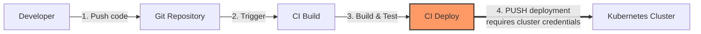
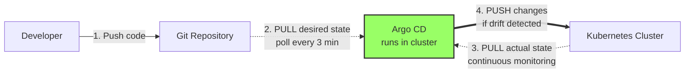
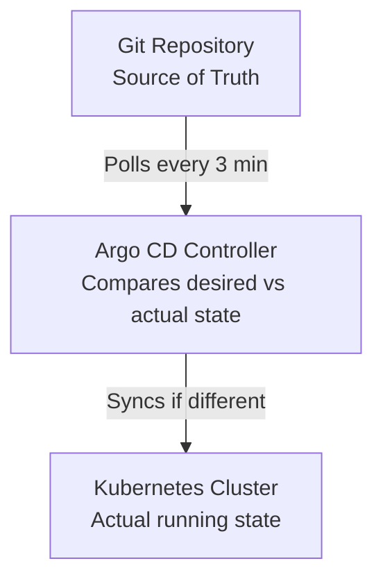
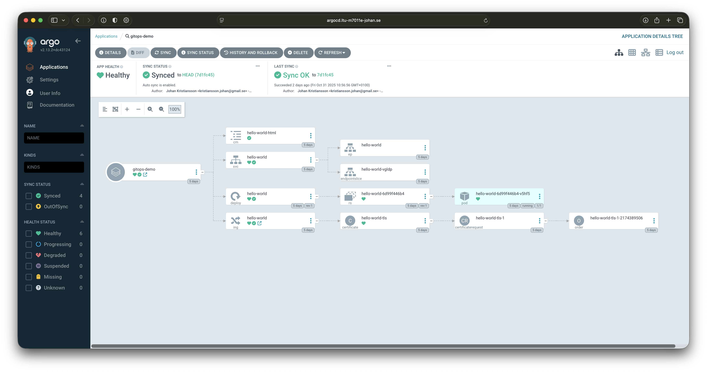

# Tutorial 9 - Continuous Deployment with Argo CD GitOps

This tutorial introduces GitOps principles and automated continuous deployment using Argo CD. You'll learn how to manage application deployments declaratively through Git, enabling automated synchronization, rollbacks, and multi-environment management.

## Understanding GitOps

**GitOps** is a modern approach to continuous deployment where Git serves as the single source of truth for declarative infrastructure and applications.

### Core Principles

1. **Declarative**: Everything (infrastructure and applications) is described declaratively
2. **Versioned and Immutable**: All changes are tracked in Git with complete audit history
3. **Pulled Automatically**: Automated agents watch Git and pull changes to deploy
4. **Continuously Reconciled**: Automated agents continuously ensure actual state matches desired state

### Traditional CI/CD vs GitOps

**Traditional CI/CD (Push-based):**

*One-way: CI/CD only pushes, doesn't monitor actual state*

**GitOps (Pull-based with Reconciliation Loop):**

*Two-way: Argo CD pulls from both Git (desired) and K8s (actual), then pushes corrections*

### Benefits of GitOps

- **Auditability**: Every change tracked in Git history
- **Disaster Recovery**: Cluster state can be recreated from Git
- **Consistency**: Same deployment process across all environments
- **Security**: No external access needed to cluster (pull-based)
- **Collaboration**: Use familiar Git workflows (PR reviews, branches)
- **Rollback**: Easy reversion using Git history

## Argo CD Architecture

**Argo CD** is a declarative GitOps continuous delivery tool for Kubernetes.

### Components

1. **API Server**: REST/gRPC API and web UI
2. **Repository Server**: Maintains local cache of Git repositories
3. **Application Controller**: Watches applications and compares actual state vs desired state
4. **Redis**: Caching layer
5. **Dex** (optional): Identity service for SSO integration

### How Argo CD Works



### Key Concepts

- **Application**: A Custom Resource Definition (CRD) representing a deployed application
- **Project**: Logical grouping of applications
- **Sync**: Process of making cluster state match Git state
- **Health**: Status of deployed resources (Healthy, Progressing, Degraded)
- **Sync Status**: Whether cluster matches Git (Synced, OutOfSync)

## Prerequisites

- Completed Tutorial 5 (Kubernetes Getting Started)
- Completed Tutorial 6 (Helm deployment)
- kubectl configured and connected to LTU cluster
- Git installed locally

## Part 1: Install Argo CD

We provide a simplified Helm chart for installing Argo CD on the LTU cluster.

### 1. Review the Configuration

Check the `argocd-install/values.yaml` file:
```bash
cat argocd-install/values.yaml
```

Customize if needed:
```yaml
# argocd-install/values.yaml
argocd:
  domain: argocd.ltu-m7011e-johan.se  # Change to your domain
  email: your.email@ltu.se            # Change to your email
```

### 2. Install Argo CD

```bash
cd argocd-install
helm install argocd -f values.yaml -n argocd --create-namespace .
```

### 3. Wait for Installation to Complete

```bash
kubectl get pods -n argocd -w
```

Wait until all pods show `Running` and `Ready` (Ctrl+C to stop watching).

The installation takes 2-3 minutes. The Helm chart automatically:
- Installs ArgoCD from official manifests
- Configures ArgoCD for Traefik ingress (TLS termination)
- Sets the external URL from your `values.yaml`
- No manual configuration needed!

### 4. Access Argo CD UI

#### Get Initial Admin Password

```bash
kubectl get secret argocd-initial-admin-secret -n argocd -o jsonpath="{.data.password}" | base64 -d && echo
```

#### Access via Ingress (Recommended)

Access ArgoCD at your configured domain: `https://argocd.ltu-m7011e-johan.se`

- Username: `admin`
- Password: (from previous command)

**Note**: You're using a Let's Encrypt staging certificate, so your browser will show a security warning. This is expected for testing. Switch to production certificates in `values.yaml` when ready.

#### Alternative: Access via Port Forwarding

If ingress isn't working or for local testing:

```bash
kubectl port-forward svc/argocd-server -n argocd 8080:443
```

Open browser to: `https://localhost:8080`

**Note**: Accept the self-signed certificate warning in your browser.



### 5. Install Argo CD CLI (Optional but Recommended)

The ArgoCD CLI provides a powerful command-line interface for managing applications.

**macOS:**
```bash
brew install argocd
```

**Linux:**
```bash
# Download the latest ArgoCD CLI
curl -sSL -o argocd https://github.com/argoproj/argo-cd/releases/latest/download/argocd-linux-amd64

# Make it executable
chmod +x argocd

# Move to system path
sudo mv argocd /usr/local/bin/

# Verify installation
argocd version --client
```

**Windows:**

Option 1 - Using PowerShell:
```powershell
# Download the latest release
$version = (Invoke-RestMethod https://api.github.com/repos/argoproj/argo-cd/releases/latest).tag_name
$url = "https://github.com/argoproj/argo-cd/releases/download/$version/argocd-windows-amd64.exe"
Invoke-WebRequest -Uri $url -OutFile "$env:USERPROFILE\Downloads\argocd.exe"

# Move to a directory in your PATH (e.g., C:\Program Files\argocd\)
# Or add the Downloads folder to your PATH
```

Option 2 - Manual Download:
1. Go to https://github.com/argoproj/argo-cd/releases/latest
2. Download `argocd-windows-amd64.exe`
3. Rename to `argocd.exe`
4. Move to a directory in your PATH or add the directory to PATH

**Login via CLI:**

If using ingress:
```bash
argocd login argocd.ltu-m7011e-johan.se --username admin --password <your-password> --insecure
```

If using port-forward (localhost):
```bash
argocd login localhost:8080 --username admin --password <your-password> --insecure
```

**Note**: The `--insecure` flag is needed because we're using Let's Encrypt staging certificates.

## Part 2: Deploy Your First Application

### Understanding the GitOps Repository Structure

```
gitops-demo/
├── environments/
│   ├── dev/
│   │   └── values.yaml          # Dev-specific values
│   ├── staging/
│   │   └── values.yaml          # Staging-specific values
│   └── production/
│       └── values.yaml          # Production-specific values
└── hello-world-app/
    ├── Chart.yaml               # Helm chart metadata
    └── templates/
        ├── deployment.yaml      # Kubernetes deployment
        ├── service.yaml         # Service definition
        ├── ingress.yaml         # Ingress for external access
        └── configmap.yaml       # Application configuration
```

### Step 1: Push GitOps Demo to Your Git Repository

**Important**: You need to push the `gitops-demo` folder to your own Git repository for Argo CD to access it.

#### Create a new Git repository on GitHub/GitLab

1. Go to GitHub or GitLab
2. Create a new repository (e.g., `m7011e-gitops`)
3. Clone it locally:

```bash
git clone https://github.com/YOUR_USERNAME/m7011e-gitops.git
cd m7011e-gitops
```

#### Copy and customize the demo files

```bash
# Copy the gitops-demo folder
cp -r /path/to/6-argocd-gitops/gitops-demo/* .

# Edit dev environment values
nano environments/dev/values.yaml
# Change domain and email to your assigned domain and your email 

# Edit staging environment values
nano environments/staging/values.yaml
# Change domain and email to your assigned domain and your email 

# Edit production environment values
nano environments/production/values.yaml
# Change domain and email to your assigned domain and your email 
```

#### Push to Git

```bash
git add .
git commit -m "Initial GitOps setup for hello-world app"
git push origin main
```

### Step 2: Create Argo CD Application (UI Method)

1. **Open Argo CD UI** (https://localhost:8080 or your domain)
2. **Login** with admin credentials
3. **Click "+ New App"**
4. **Fill in the form:**

   **General:**
   - Application Name: `hello-world-dev`
   - Project: `default`
   - Sync Policy: `Manual` (we'll change to automatic later)

   **Source:**
   - Repository URL: `https://github.com/YOUR_USERNAME/m7011e-gitops.git`
   - Revision: `HEAD` (or `main`)
   - Path: `hello-world-app`

   **Helm:**
   - Values Files: `../environments/dev/values.yaml`

   **Destination:**
   - Cluster URL: `https://kubernetes.default.svc`
   - Namespace: `hello-world-dev`

5. **Click "Create"**

### Step 3: Create Argo CD Application (CLI Method)

Alternatively, use the CLI:

```bash
argocd app create hello-world-dev \
  --repo https://github.com/YOUR_USERNAME/m7011e-gitops.git \
  --path hello-world-app \
  --dest-server https://kubernetes.default.svc \
  --dest-namespace hello-world-dev \
  --values ../environments/dev/values.yaml \
  --sync-policy manual
```

### Step 4: Create Argo CD Application (Declarative Method)

Most GitOps way - using YAML manifests:

```bash
kubectl apply -f - <<EOF
apiVersion: argoproj.io/v1alpha1
kind: Application
metadata:
  name: hello-world-dev
  namespace: argocd
spec:
  project: default
  source:
    repoURL: https://github.com/YOUR_USERNAME/m7011e-gitops.git
    targetRevision: HEAD
    path: hello-world-app
    helm:
      valueFiles:
        - ../environments/dev/values.yaml
  destination:
    server: https://kubernetes.default.svc
    namespace: hello-world-dev
  syncPolicy:
    automated:
      prune: true
      selfHeal: true
    syncOptions:
      - CreateNamespace=true
EOF
```

### Step 5: Sync the Application

The application is created but not yet deployed. Let's sync it!

Disclaimer! ArgoCD does not create new namespaces so we must create them if we haven't already. The needed namespaces for this tutorial can be created by running:
```bash
# dev environment
kubectl create namespace hello-world-dev

# staging environment
kubectl create namespace hello-world-staging

# prod environment
kubectl create namespace hello-world-prod
```

**Via UI:**
1. Click on the `hello-world-dev` application
2. Click "Sync" button
3. Click "Synchronize"

**Via CLI:**
```bash
argocd app sync hello-world-dev
```

**Via kubectl** (if using declarative method with automated sync, it syncs automatically)

### Step 6: Verify Deployment

```bash
# Check Argo CD application status
argocd app get hello-world-dev

# Check Kubernetes resources
kubectl get all -n hello-world-dev

# Check pods
kubectl get pods -n hello-world-dev

# Check ingress
kubectl get ingress -n hello-world-dev
```

**Visit your application:**
- Dev: `https://helloworld-dev.ltu-m7011e-johan.se`

You should see the hello world application running!

## Part 3: GitOps Workflow in Action

Now let's experience the power of GitOps by making changes through Git.

### Scenario 1: Scale Your Application

#### 1. Edit the values file in your Git repository

```bash
cd m7011e-gitops
nano environments/dev/values.yaml
```

Change replicas from 1 to 3:
```yaml
app:
  replicas: 3  # Changed from 1
```

#### 2. Commit and push

```bash
git add environments/dev/values.yaml
git commit -m "Scale hello-world-dev to 3 replicas"
git push origin main
```

#### 3. Watch Argo CD detect the change

**In UI:**
- The application will show "OutOfSync" status
- Click "Sync" to apply changes (if manual sync)
- Or wait for automatic sync (if enabled)

**Via CLI:**
```bash
argocd app get hello-world-dev
argocd app sync hello-world-dev  # If manual sync
```

#### 4. Verify the scaling

```bash
kubectl get pods -n hello-world-dev
```

You should now see 3 pods running!

### Scenario 2: Update Application Content

#### 1. Edit the message in values.yaml

```bash
nano environments/dev/values.yaml
```

```yaml
message: "Hello from GitOps - Updated via Git!"
```

#### 2. Commit and push

```bash
git add environments/dev/values.yaml
git commit -m "Update welcome message"
git push origin main
```

#### 3. Sync and verify

```bash
argocd app sync hello-world-dev
```

Visit your application URL and see the updated message!

### Scenario 3: Enable Automatic Sync

Stop syncing manually - enable automation!

**Via UI:**
1. Click on your application
2. Go to "App Details"
3. Click "Enable Auto-Sync"
4. Enable "Prune Resources" and "Self Heal"

**Via CLI:**
```bash
argocd app set hello-world-dev --sync-policy automated --auto-prune --self-heal
```

**Via kubectl:**
```bash
kubectl patch application hello-world-dev -n argocd --type merge -p '{"spec":{"syncPolicy":{"automated":{"prune":true,"selfHeal":true}}}}'
```

Now any Git commit will automatically deploy!

## Part 4: Multi-Environment Deployment

Let's deploy to staging and production environments.

### Deploy to Staging

```bash
argocd app create hello-world-staging \
  --repo https://github.com/YOUR_USERNAME/m7011e-gitops.git \
  --path hello-world-app \
  --dest-server https://kubernetes.default.svc \
  --dest-namespace hello-world-staging \
  --values ../environments/staging/values.yaml \
  --sync-policy automated \
  --auto-prune \
  --self-heal

argocd app sync hello-world-staging
```

### Deploy to Production

```bash
argocd app create hello-world-prod \
  --repo https://github.com/YOUR_USERNAME/m7011e-gitops.git \
  --path hello-world-app \
  --dest-server https://kubernetes.default.svc \
  --dest-namespace hello-world-prod \
  --values ../environments/production/values.yaml \
  --sync-policy manual  # Keep manual for production!

argocd app sync hello-world-prod
```

**Note**: Keep production sync manual for controlled deployments!

### Environment Promotion Workflow

1. **Develop in dev**: Make changes, test in dev environment
2. **Promote to staging**: Update staging values or merge branches
3. **Test in staging**: Validate changes work correctly
4. **Promote to production**: Update production values, manual sync
5. **Monitor**: Watch application health in Argo CD

## Part 5: Rollback Strategy

### Scenario: Bad Deployment

#### 1. Introduce a breaking change

```bash
nano environments/dev/values.yaml
```

Change to invalid image:
```yaml
image:
  repository: nginx
  tag: invalid-tag-that-doesnt-exist
```

#### 2. Commit and push

```bash
git commit -am "Bad deployment - invalid image"
git push origin main
```

#### 3. Watch it fail
Wait for automatic sync or sync manually before running the commands

```bash
argocd app get hello-world-dev
kubectl get pods -n hello-world-dev
```

Pods will fail with `ImagePullBackOff` error.

#### 4. Rollback using Argo CD

**Via UI:**
1. Click on application
2. Go to "History and Rollback"
3. Select previous healthy revision
4. Click "Rollback"

**Via CLI:**
```bash
argocd app rollback hello-world-dev
```

#### 5. Or fix in Git (preferred GitOps way)

```bash
git revert HEAD
git push origin main
```

Argo CD automatically syncs the fix!

## Part 6: Advanced Patterns

### Sync Waves

Control deployment order with annotations:

```yaml
metadata:
  annotations:
    argocd.argoproj.io/sync-wave: "1"  # Deploys first
```

Lower numbers deploy first. Useful for:
- Database before application
- ConfigMaps before Deployments
- Prerequisites before main app

### Sync Hooks

Execute tasks at specific points:

```yaml
metadata:
  annotations:
    argocd.argoproj.io/hook: PreSync  # Run before sync
```

Hook types: `PreSync`, `Sync`, `PostSync`, `Skip`, `SyncFail`

Use cases:
- Database migrations (PreSync)
- Run tests (PostSync)
- Notifications (SyncFail)

### App of Apps Pattern

Manage multiple applications with one parent application:

```yaml
# apps/app-of-apps.yaml
apiVersion: argoproj.io/v1alpha1
kind: Application
metadata:
  name: app-of-apps
spec:
  source:
    path: apps/
  # ... other fields
```

This deploys multiple child applications automatically.

## Part 7: Monitoring and Troubleshooting

### Argo CD UI Navigation

**Application View:**
- Tree view: Visual representation of all resources
- List view: Tabular view of resources
- Network view: Pod and service relationships

**Resource Details:**
- Live manifest: Actual cluster state
- Desired manifest: Git repository state
- Diff: Differences between live and desired

### Application Health Status

- **Healthy**: All resources running correctly
- **Progressing**: Deployment in progress
- **Degraded**: Some resources failing
- **Suspended**: Application intentionally paused
- **Missing**: Resources not found in cluster
- **Unknown**: Health status cannot be determined

### Sync Status

- **Synced**: Cluster matches Git
- **OutOfSync**: Cluster differs from Git
- **Unknown**: Cannot determine sync status

### Common Issues

#### 1. Application Stuck in "OutOfSync"

**Cause**: Manual changes in cluster or sync issues

**Solution:**
```bash
# Check diff
argocd app diff hello-world-dev

# Force sync
argocd app sync hello-world-dev --force

# Or enable self-heal to prevent manual changes
argocd app set hello-world-dev --self-heal
```

#### 2. Image Pull Errors

**Cause**: Invalid image tag or private registry access

**Solution:**
```bash
# Check pod events
kubectl describe pod <pod-name> -n hello-world-dev

# Fix image in Git and sync
# Or add image pull secrets if using private registry
```

#### 3. Sync Timeout

**Cause**: Resources taking too long to become healthy

**Solution:**
```bash
# Increase timeout
argocd app set hello-world-dev --sync-timeout 600

# Check resource health
kubectl get all -n hello-world-dev
```

#### 4. Certificate/TLS Issues

**Cause**: Let's Encrypt certificate not issued

**Solution:**
```bash
# Check certificate status
kubectl get certificate -n hello-world-dev

# Check cert-manager logs
kubectl logs -n cert-manager -l app=cert-manager
```

### Debugging Commands

```bash
# Get application details
argocd app get <app-name>

# View sync history
argocd app history <app-name>

# Compare live vs desired state
argocd app diff <app-name>

# View application logs
argocd app logs <app-name>

# List all applications
argocd app list

# Delete application (keeps resources)
argocd app delete <app-name>

# Delete application and all resources
argocd app delete <app-name> --cascade
```

## Part 8: Cleanup

### Delete Applications

```bash
# Delete application (keeps cluster resources)
argocd app delete hello-world-dev
argocd app delete hello-world-staging
argocd app delete hello-world-prod

# Or delete application and resources
argocd app delete hello-world-dev --cascade

# Or delete namespaces directly
kubectl delete namespace hello-world-dev
kubectl delete namespace hello-world-staging
kubectl delete namespace hello-world-prod
```

### Uninstall Argo CD

```bash
# If installed via our Helm chart
helm uninstall argocd -n argocd
kubectl delete namespace argocd

# If installed via official chart
helm uninstall argocd -n argocd
kubectl delete namespace argocd
```

## Exercise: Deploy Your Own Application

Now it's your turn! Deploy an application from a previous tutorial using GitOps.

### Goal

Deploy your Tutorial 8 React application (or Tutorial 1 Flask app) using Argo CD.

### Steps

1. **Create a Dockerfile** for your application
2. **Build and push** container image to a registry (Docker Hub, GitHub Container Registry)
3. **Create a Helm chart** for your application
4. **Push to Git repository**
5. **Create Argo CD application**
6. **Set up dev, staging, and production environments**
7. **Make a change and watch automatic deployment**
8. **Document your GitOps workflow**

### Bonus Challenges

- Add a database (PostgreSQL from Tutorial 7) using App of Apps pattern
- Implement sync hooks for database migrations
- Set up sync waves for ordered deployment
- Create a CI pipeline that updates image tags in Git
- Implement Blue/Green or Canary deployment strategy

## Additional Resources

- [Argo CD Official Documentation](https://argo-cd.readthedocs.io/)
- [GitOps Principles](https://opengitops.dev/)
- [Argo CD Best Practices](https://argo-cd.readthedocs.io/en/stable/user-guide/best_practices/)
- [GitOps Working Group](https://github.com/gitops-working-group/gitops-working-group)
- [Awesome Argo CD](https://github.com/terrytangyuan/awesome-argo)

## Comparison: Argo CD vs GitHub Actions

| Feature | Argo CD | GitHub Actions |
|---------|---------|----------------|
| **Type** | GitOps CD tool | CI/CD platform |
| **Deployment Model** | Pull-based | Push-based |
| **Kubernetes Focus** | Native Kubernetes | Generic workflows |
| **Self-Healing** | Built-in | Manual implementation |
| **Rollback** | Built-in UI/CLI | Manual or scripted |
| **Multi-Cluster** | Easy | Complex |
| **Security** | No cluster credentials needed | Requires cluster access |
| **Best For** | Kubernetes deployments | CI builds and tests |

**Recommendation**: Use GitHub Actions for CI (build, test, create container images) and Argo CD for CD (deploy to Kubernetes). This provides the best of both worlds!

## Summary

You've learned:

- GitOps principles and benefits
- Argo CD architecture and components
- How to install and configure Argo CD
- Creating and managing applications
- Multi-environment deployment strategies
- Rollback and recovery procedures
- Advanced patterns (sync waves, hooks, app of apps)
- Troubleshooting common issues

**Key Takeaway**: With GitOps and Argo CD, Git becomes your single source of truth. Every change is versioned, auditable, and automatically deployed. 

## What's Next?

- Explore Argo Rollouts for progressive delivery (Blue/Green, Canary)
- Implement Argo Workflows for complex CI pipelines
- Set up Argo Events for event-driven automation
- Learn about Sealed Secrets or External Secrets for secrets management
- Build a complete CI/CD pipeline combining GitHub Actions + Argo CD
