# Tutorial 10 - Identity and Access Management with Keycloak

This tutorial introduces Keycloak, an open-source Identity and Access Management (IAM) solution. You'll learn how to deploy Keycloak on Kubernetes, configure authentication and authorization, and integrate it with web applications to implement secure user management.

## Understanding Keycloak

**Keycloak** is a modern application and service authentication/authorization server that provides:
- Single Sign-On (SSO)
- Social Login (Google, Facebook, GitHub, etc.)
- User Federation (LDAP, Active Directory)
- Identity Brokering
- Multi-factor Authentication (MFA)
- Fine-grained Authorization

### Why Use Keycloak?

**Without Keycloak:**
- Each application implements its own authentication
- Password management duplicated across apps
- User data scattered in multiple databases
- Complex to add features like MFA or social login
- Security vulnerabilities if implemented incorrectly

**With Keycloak:**
- Centralized authentication for all applications
- Single user database and identity source
- Industry-standard protocols (OAuth 2.0, OpenID Connect, SAML)
- Built-in security best practices
- Easy integration with minimal code

## Theoretical Background: Understanding Authentication Protocols

Before diving into Keycloak, it's essential to understand the foundational protocols and technologies it implements. This section provides the theoretical background needed to understand modern authentication and authorization.

### Authentication vs Authorization

**Authentication** answers: **"Who are you?"**
- Verifying the identity of a user or system
- Example: Logging in with username and password

**Authorization** answers: **"What are you allowed to do?"**
- Determining what resources a user can access
- Example: Admin users can delete posts, regular users cannot

### OAuth 2.0: The Authorization Framework

**OAuth 2.0** is an **authorization** framework (not authentication!) that enables applications to obtain limited access to user resources without exposing credentials.

#### The Problem OAuth Solves

**Without OAuth (the old way):**
```
You want to use a photo printing service that needs access to your photos on Google Drive.

Bad solution: Give the printing service your Google username and password
Problems:
- Printing service has full access to everything in your account
- You can't revoke access without changing your password
- No way to limit what they can access
- Printing service must store your password (security risk)
```

**With OAuth 2.0:**
```
1. Printing service redirects you to Google
2. You login to Google directly (service never sees password)
3. Google asks: "Allow PrintService to access your photos?"
4. You approve
5. Google gives PrintService a limited access token
6. PrintService uses token to access only your photos
7. You can revoke access anytime without changing password
```

#### OAuth 2.0 Roles

1. **Resource Owner**: The user who owns the data (you)
2. **Client**: The application requesting access (PrintService)
3. **Authorization Server**: Issues access tokens (Google OAuth server)
4. **Resource Server**: Hosts the protected resources (Google Drive API)

#### OAuth 2.0 Flows (Grant Types)

**1. Authorization Code Flow** (Most secure for web apps)


**Why the code exchange step?**
- The authorization code is exposed in the browser URL (can be intercepted)
- The token exchange happens server-to-server (more secure)
- Client authenticates with secret when exchanging code
- Prevents token theft via browser history or logs

**2. Implicit Flow** (Deprecated - don't use)
- Token returned directly to browser (no code exchange)
- Less secure, no longer recommended

**3. Client Credentials Flow** (For server-to-server)


**4. Resource Owner Password Credentials** (Use only for trusted apps)
- App collects username/password directly
- Only for first-party applications you fully control

#### OAuth 2.0 Tokens

**Access Token:**
- Short-lived token (5-60 minutes typical)
- Used to access protected resources
- Presented in Authorization header: `Authorization: Bearer <access_token>`
- Can be opaque (random string) or JWT

**Refresh Token:**
- Long-lived token (days, weeks, or months)
- Used to obtain new access tokens when they expire
- Must be stored securely
- Can be revoked

### OpenID Connect (OIDC): Adding Authentication to OAuth

**OAuth 2.0** is for **authorization** (delegated access), not authentication.

**OpenID Connect** extends OAuth 2.0 to add **authentication** (identity verification).

#### What OIDC Adds

1. **ID Token**: A token containing user identity information (JWT format)
2. **UserInfo Endpoint**: Standardized endpoint to get user profile
3. **Standard Claims**: Predefined user attributes (name, email, etc.)
4. **Standardized Flow**: Authentication flow on top of OAuth 2.0

#### OIDC Flow


#### OIDC ID Token vs Access Token

**ID Token** (for the client application):
- Intended for the application to learn about the user
- Contains user identity claims (sub, name, email, etc.)
- Always in JWT format
- Should NOT be sent to APIs

**Access Token** (for API calls):
- Intended for accessing APIs
- Contains authorization information (scopes, roles)
- Can be JWT or opaque
- Sent to resource servers to authorize requests

### JWT (JSON Web Token): A Token Format

**JWT** is a compact, self-contained token format for securely transmitting information between parties.

#### JWT Structure

A JWT consists of three parts separated by dots:
```
header.payload.signature
```

**Example JWT:**
```
eyJhbGciOiJSUzI1NiIsInR5cCI6IkpXVCJ9.
eyJzdWIiOiIxMjM0NTY3ODkwIiwibmFtZSI6IkpvaG4gRG9lIiwiYWRtaW4iOnRydWUsImlhdCI6MTUxNjIzOTAyMn0.
NHVaYe26MbtOYhSKkoKYdFVomg4i8ZJd8_-RU8VNbftc4TSMb4bXP3l3YlNWACwyXPGffz5aXHc6lty1Y2t4SWRqGteragsVdZufDn5BlnJl9pdR_kdVFUsra2rWKEofkZeIC4yWytE58sMIihvo9H1ScmmVwBcQP6XETqYd0aSHp1gOa9RdUPDvoXQ5oqygTqVtxaDr6wUFKrKItgBMzWIdNZ6y7O9E0DhEPTbE9rfBo6KTFsHAZnMg4k68CDp2woYIaXbmYTWcvbzIuHO7_37GT79XdIwkm95QJ7hYC9RiwrV7mesbY4PAahERJawntho0my942XheVLmGwLMBkQ
```

#### 1. Header (Algorithm and Type)

Base64Url encoded JSON:
```json
{
  "alg": "RS256",    // Signature algorithm (RSA with SHA-256)
  "typ": "JWT"       // Token type
}
```

#### 2. Payload (Claims)

Base64Url encoded JSON containing claims (statements about the user):

```json
{
  // Standard claims (OIDC defined)
  "sub": "1234567890",              // Subject (user ID)
  "name": "John Doe",               // User's full name
  "email": "john@example.com",      // Email
  "email_verified": true,           // Email verification status
  "preferred_username": "johndoe",  // Username

  // Token metadata
  "iss": "https://keycloak.example.com/realms/m7011e",  // Issuer
  "aud": "demo-app",                // Audience (who can use this token)
  "exp": 1735689600,                // Expiration time (Unix timestamp)
  "iat": 1735686000,                // Issued at time
  "nbf": 1735686000,                // Not before time

  // Authorization
  "realm_access": {
    "roles": ["user", "admin"]      // User's roles
  },
  "resource_access": {
    "demo-app": {
      "roles": ["app-editor"]       // App-specific roles
    }
  },

  // Custom claims
  "department": "Engineering",
  "employee_id": "12345"
}
```

**Claim Types:**
- **Registered Claims**: Predefined by standards (sub, iss, exp, iat, etc.)
- **Public Claims**: Defined in OIDC spec (name, email, etc.)
- **Private Claims**: Custom claims for your application

#### 3. Signature (Verification)

Created by:
```
RSASHA256(
  base64UrlEncode(header) + "." + base64UrlEncode(payload),
  privateKey
)
```

**Purpose:**
- Ensures token hasn't been tampered with
- Verifies issuer (only Keycloak has private key)
- Anyone with public key can verify signature

#### How JWT Verification Works


#### Benefits of JWT

1. **Self-contained**: All info needed is in the token (no database lookup)
2. **Stateless**: Server doesn't need to store sessions
3. **Scalable**: Works across multiple servers
4. **Verifiable**: Cryptographically signed, can't be forged
5. **Expirable**: Built-in expiration (exp claim)

#### JWT Security Considerations

**DO:**
- ✅ Use HTTPS always (prevent token interception)
- ✅ Validate signature, expiration, issuer, audience
- ✅ Use short expiration times for access tokens
- ✅ Store tokens securely (not in localStorage for sensitive apps)
- ✅ Use refresh tokens to get new access tokens

**DON'T:**
- ❌ Store sensitive data in JWT (payload is base64, not encrypted!)
- ❌ Trust token without verification
- ❌ Use weak signing algorithms (HS256 with short secrets)
- ❌ Allow "none" algorithm
- ❌ Use JWTs for session storage (use server-side sessions for sensitive apps)

### OAuth 2.0 vs OpenID Connect vs JWT: Summary

| Concept | What It Is | Purpose |
|---------|-----------|---------|
| **OAuth 2.0** | Authorization framework | Delegated access to resources |
| **OpenID Connect** | Authentication layer on OAuth 2.0 | User identity verification |
| **JWT** | Token format | Container for claims and user info |

**Relationship:**

```mermaid
flowchart TB
    OIDC["OpenID Connect (OIDC)<br/>Authentication - Who are you?<br/><br/>Built on top of OAuth 2.0"]
    OAuth["OAuth 2.0<br/>Authorization - What can you access?<br/><br/>Uses JWT for tokens"]
    JWT["JWT (JSON Web Token)<br/>Token Format<br/><br/>Used for:<br/>• ID Tokens (OIDC)<br/>• Access Tokens (OAuth/OIDC)"]

    OIDC -->|extends| OAuth
    OAuth -->|uses| JWT

    style OIDC fill:#e1f5ff,stroke:#01579b,stroke-width:2px
    style OAuth fill:#fff9c4,stroke:#f57f17,stroke-width:2px
    style JWT fill:#f3e5f5,stroke:#4a148c,stroke-width:2px
```


**Example:**
1. User logs in via **OpenID Connect** (authentication)
2. Using **OAuth 2.0** authorization code flow
3. Receives an ID token and access token as **JWTs**
4. ID token proves who they are
5. Access token grants permission to call APIs
6. APIs verify JWT signature and check roles/scopes

### How Keycloak Uses These Standards

Keycloak implements all three:

1. **OAuth 2.0 Authorization Server**
   - Issues access tokens and refresh tokens
   - Supports all OAuth 2.0 flows
   - Manages client applications

2. **OpenID Connect Provider**
   - Issues ID tokens with user identity
   - Provides UserInfo endpoint
   - Handles authentication flows

3. **JWT Issuer and Validator**
   - Issues JWTs signed with private keys
   - Publishes public keys for verification
   - Includes claims for identity and authorization

**In practice:**
- Your frontend gets an ID token (JWT) to know who the user is
- Your backend receives access tokens (JWTs) to authorize API calls
- All tokens are verified using Keycloak's public keys
- Roles in JWT determine what users can access

### Core Concepts

#### 1. Realm
A **realm** is an isolated space where you manage a set of users, credentials, roles, and groups. Think of it as a tenant in a multi-tenant system.

- **Master Realm**: Administrative realm for managing Keycloak itself
- **Custom Realms**: Created for your applications (e.g., "company-app", "dev", "prod")

#### 2. Client
A **client** is an application or service that can request authentication from Keycloak.

**Client Types:**
- **Public**: Web applications, mobile apps (cannot keep secrets)
- **Confidential**: Backend services, server-side apps (can keep secrets)
- **Bearer-only**: Services that only verify tokens (no login flow)

#### 3. User
An entity that can authenticate in Keycloak. Users have:
- Credentials (password, OTP, certificates)
- Attributes (email, name, custom fields)
- Role mappings
- Group memberships

#### 4. Role
Permissions that can be assigned to users. Two types:

- **Realm Roles**: Global roles (e.g., "admin", "user")
- **Client Roles**: Application-specific roles (e.g., "app1-editor", "app2-viewer")

#### 5. Group
A collection of users. Groups can have roles, making it easy to manage permissions for multiple users.

### Authentication Flows

Keycloak supports multiple standard authentication flows:

#### Authorization Code Flow (Most Common for Web Apps)


#### Client Credentials Flow (For Service-to-Service)


### OpenID Connect vs OAuth 2.0

**OAuth 2.0**: Authorization framework (what resources can you access?)
**OpenID Connect (OIDC)**: Authentication layer on top of OAuth 2.0 (who are you?)

Keycloak implements both:
- **Access Token**: OAuth 2.0 token for authorization
- **ID Token**: OIDC token with user identity information
- **Refresh Token**: Long-lived token to get new access tokens

## Prerequisites

- Completed Tutorial 6 (Kubernetes Getting Started)
- Completed Tutorial 8 (PostgreSQL) - Keycloak needs a database
- kubectl configured and connected to LTU cluster
- Basic understanding of authentication and web security

## Part 1: Deploy PostgreSQL for Keycloak

Keycloak requires a database to store its configuration and user data. We'll use PostgreSQL.

### 1. Create Database Namespace

```bash
kubectl create namespace keycloak-db
```

### 2. Create PostgreSQL Values for Keycloak

Create a file `keycloak-db-values.yaml`:

```yaml
StorageClassName: "local-path"
Timezone: "Europe/Stockholm"
DBUser: "keycloak"
DBPassword: "keycloak-secure-password-123"  # Change this!
DBImage: "postgres:16"
DBResourceLimit: false
DBCPU: "1000m"
DBMemory: "1000Mi"
DBStorage: "5Gi"
```

### 3. Deploy PostgreSQL

Using the Helm chart from Tutorial 8:

```bash
cd ../08-postgresql
helm install keycloak-db -f ../11-keycloak/keycloak-db-values.yaml -n keycloak-db .
cd ../11-keycloak
```

### 4. Create Keycloak Database

```bash
# Port forward to access PostgreSQL
kubectl port-forward -n keycloak-db svc/postgres-service 5432:5432 &

# Create the database
PGPASSWORD=keycloak-secure-password-123 psql -h localhost -p 5432 -U keycloak -d postgres -c "CREATE DATABASE keycloak;"

# Stop port forwarding
pkill -f "port-forward.*postgres-service"
```

## Part 2: Deploy Keycloak on Kubernetes

### Understanding the Deployment

We'll deploy Keycloak using a custom Helm chart that includes:
- Keycloak deployment with database connection
- Service for internal networking
- Ingress for external HTTPS access
- ConfigMap for database configuration
- Secrets for sensitive credentials

### 1. Review Keycloak Chart Configuration

Check the `keycloak-chart/values.yaml` file:

```yaml
# keycloak-chart/values.yaml
keycloak:
  replicas: 1
  image: quay.io/keycloak/keycloak:23.0

  # Admin credentials (change these!)
  adminUser: admin
  adminPassword: admin-change-this-password

  # Database configuration
  database:
    vendor: postgres
    host: postgres-service.keycloak-db.svc.cluster.local
    port: 5432
    database: keycloak
    username: keycloak
    password: keycloak-secure-password-123  # Must match PostgreSQL password

# Ingress configuration
domain: keycloak.ltu-m7011e-johan.se  # Change to your domain
email: your.email@ltu.se              # Change to your email
```

### 2. Customize Values

Edit `keycloak-chart/values.yaml`:

```bash
nano keycloak-chart/values.yaml
```

**Important changes:**
- Update `domain` to your assigned subdomain
- Update `email` to your email address
- Change `adminPassword` to a strong password
- Ensure database password matches the one you used for PostgreSQL

### 3. Create Keycloak Namespace

```bash
kubectl create namespace keycloak
```

### 4. Install Keycloak

```bash
helm install keycloak -f keycloak-chart/values.yaml -n keycloak ./keycloak-chart
```

### 5. Wait for Deployment

```bash
kubectl get pods -n keycloak -w
```

Wait until the Keycloak pod shows `Running` and `Ready 1/1` (this may take 2-3 minutes).

**Note**: Keycloak performs database migrations on first startup, which can take time.

### 6. Access Keycloak Admin Console

Once deployed, access Keycloak at your configured domain:

```
https://keycloak.ltu-m7011e-johan.se
```

**Login credentials:**
- Username: `admin`
- Password: (the adminPassword you set in values.yaml)

**Note**: You'll see a certificate warning due to Let's Encrypt staging certificates. This is expected for testing.

## Part 3: Configure Your First Realm

Let's create a realm for our application and configure basic authentication.

### 1. Create a New Realm

1. **Login to Keycloak Admin Console**
2. **Click dropdown** in top-left (shows "Master")
3. **Click "Create Realm"**
4. **Fill in:**
   - Realm name: `m7011e`
   - Enabled: ON
5. **Click "Create"**

### 2. Configure Realm Settings

1. **Go to "Realm Settings"** (left sidebar)
2. **General tab:**
   - User Profile Enabled: ON
   - Email as username: OFF (keep usernames separate)
3. **Login tab:**
   - User registration: ON (allow self-registration)
   - Forgot password: ON
   - Remember me: ON
4. **Email tab** (optional, for production):
   - Configure SMTP settings to send verification emails
5. **Click "Save"**

### 3. Create Your First User

1. **Go to "Users"** (left sidebar)
2. **Click "Add user"**
3. **Fill in:**
   - Username: `testuser`
   - Email: `test@example.com`
   - First name: `Test`
   - Last name: `User`
   - Email verified: ON
   - Enabled: ON
4. **Click "Create"**
5. **Go to "Credentials" tab**
6. **Click "Set password"**
7. **Enter password:** `testpass123`
8. **Temporary:** OFF (don't force password change)
9. **Click "Save"**

### 4. Create Roles

1. **Go to "Realm Roles"** (left sidebar)
2. **Click "Create role"**
3. **Create these roles:**
   - Role name: `admin` → Description: `Administrator role`
   - Role name: `user` → Description: `Regular user role`
   - Role name: `viewer` → Description: `Read-only access`

### 5. Assign Roles to User

1. **Go to "Users"**
2. **Click on "testuser"**
3. **Go to "Role mapping" tab**
4. **Click "Assign role"**
5. **Select "user" role**
6. **Click "Assign"**

## Part 4: Create a Client Application

Now let's configure Keycloak to authenticate users for a web application.

### 1. Create a Public Client (for Frontend)

1. **Go to "Clients"** (left sidebar)
2. **Click "Create client"**
3. **General Settings:**
   - Client type: `OpenID Connect`
   - Client ID: `demo-app`
   - Name: `Demo Web Application`
4. **Click "Next"**
5. **Capability config:**
   - Client authentication: OFF (public client)
   - Authorization: OFF
   - Authentication flow: ✓ Standard flow, ✓ Direct access grants
6. **Click "Next"**
7. **Login settings:**
   - Root URL: `https://demo.ltu-m7011e-johan.se`
   - Home URL: `https://demo.ltu-m7011e-johan.se`
   - Valid redirect URIs: `https://demo.ltu-m7011e-johan.se/*`
   - Valid post logout redirect URIs: `https://demo.ltu-m7011e-johan.se/*`
   - Web origins: `https://demo.ltu-m7011e-johan.se`
8. **Click "Save"**

### 2. Create a Confidential Client (for Backend API)

1. **Click "Create client"** again
2. **General Settings:**
   - Client ID: `demo-api`
   - Name: `Demo API Service`
3. **Click "Next"**
4. **Capability config:**
   - Client authentication: ON (confidential client)
   - Authorization: ON (enable fine-grained permissions)
   - Service accounts roles: ON (for service-to-service auth)
5. **Click "Save"**
6. **Go to "Credentials" tab**
7. **Copy the "Client secret"** - you'll need this for your API

### 3. Test Authentication Flow

Use the Keycloak Account Console to verify setup:

```
https://keycloak.ltu-m7011e-johan.se/realms/m7011e/account
```

Login with:
- Username: `testuser`
- Password: `testpass123`

You should see the account management page where users can update their profile, change password, enable 2FA, etc.

## Part 5: Integrate with a Web Application

Let's create a simple web application that uses Keycloak for authentication.

### Example: React Application with Keycloak

#### 1. Install Keycloak JavaScript Adapter

```bash
npm install keycloak-js
```

#### 2. Configure Keycloak Client

Create `src/keycloak.js`:

```javascript
import Keycloak from 'keycloak-js';

const keycloak = new Keycloak({
  url: 'https://keycloak.ltu-m7011e-johan.se',
  realm: 'm7011e',
  clientId: 'demo-app'
});

export default keycloak;
```

#### 3. Initialize in Your App

Update `src/App.js`:

```javascript
import React, { useState, useEffect } from 'react';
import keycloak from './keycloak';

function App() {
  const [authenticated, setAuthenticated] = useState(false);
  const [user, setUser] = useState(null);

  useEffect(() => {
    keycloak.init({
      onLoad: 'login-required',
      checkLoginIframe: false
    }).then(authenticated => {
      setAuthenticated(authenticated);
      if (authenticated) {
        keycloak.loadUserProfile().then(profile => {
          setUser(profile);
        });
      }
    });
  }, []);

  const logout = () => {
    keycloak.logout();
  };

  if (!authenticated) {
    return <div>Authenticating...</div>;
  }

  return (
    <div>
      <h1>Welcome {user?.firstName}!</h1>
      <p>Email: {user?.email}</p>
      <p>Username: {user?.username}</p>

      <h2>Access Token</h2>
      <pre>{keycloak.token}</pre>

      <button onClick={logout}>Logout</button>
    </div>
  );
}

export default App;
```

#### 4. Making Authenticated API Calls

```javascript
const fetchProtectedData = async () => {
  const response = await fetch('https://api.example.com/data', {
    headers: {
      'Authorization': `Bearer ${keycloak.token}`
    }
  });
  const data = await response.json();
  return data;
};

// Refresh token if needed
keycloak.updateToken(30).then(refreshed => {
  if (refreshed) {
    console.log('Token refreshed');
  }
  fetchProtectedData();
});
```

### Example: Python Flask Backend

#### 1. Install Dependencies

```bash
pip install flask flask-oidc
```

#### 2. Configure Flask

Create `app.py`:

```python
from flask import Flask, jsonify, redirect, url_for
from flask_oidc import OpenIDConnect
import json

app = Flask(__name__)
app.config.update({
    'SECRET_KEY': 'your-secret-key-change-this',
    'OIDC_CLIENT_SECRETS': 'client_secrets.json',
    'OIDC_ID_TOKEN_COOKIE_SECURE': False,  # Set True in production
    'OIDC_REQUIRE_VERIFIED_EMAIL': False,
    'OIDC_OPENID_REALM': 'm7011e'
})

oidc = OpenIDConnect(app)

@app.route('/')
def index():
    if oidc.user_loggedin:
        return jsonify({
            'message': 'Welcome!',
            'user': oidc.user_getfield('preferred_username'),
            'email': oidc.user_getfield('email')
        })
    else:
        return redirect(url_for('login'))

@app.route('/login')
@oidc.require_login
def login():
    return redirect(url_for('index'))

@app.route('/api/protected')
@oidc.require_login
def protected():
    info = oidc.user_getinfo(['preferred_username', 'email', 'sub'])
    return jsonify({
        'username': info.get('preferred_username'),
        'email': info.get('email'),
        'sub': info.get('sub')
    })

@app.route('/logout')
def logout():
    oidc.logout()
    return redirect('https://keycloak.ltu-m7011e-johan.se/realms/m7011e/protocol/openid-connect/logout')

if __name__ == '__main__':
    app.run(debug=True, port=5000)
```

#### 3. Create Client Secrets File

Create `client_secrets.json`:

```json
{
  "web": {
    "issuer": "https://keycloak.ltu-m7011e-johan.se/realms/m7011e",
    "auth_uri": "https://keycloak.ltu-m7011e-johan.se/realms/m7011e/protocol/openid-connect/auth",
    "client_id": "demo-api",
    "client_secret": "YOUR_CLIENT_SECRET_FROM_KEYCLOAK",
    "redirect_uris": [
      "http://localhost:5000/*"
    ],
    "userinfo_uri": "https://keycloak.ltu-m7011e-johan.se/realms/m7011e/protocol/openid-connect/userinfo",
    "token_uri": "https://keycloak.ltu-m7011e-johan.se/realms/m7011e/protocol/openid-connect/token",
    "token_introspection_uri": "https://keycloak.ltu-m7011e-johan.se/realms/m7011e/protocol/openid-connect/token/introspect"
  }
}
```

## Part 5.1: Complete Todo App Example

**Want a complete, working example?** We've created a full todo application that demonstrates everything covered in this tutorial!

### 📦 Todo App with Keycloak Authentication

Located in `todo-app-example/`, this is a complete application building on Tutorial 1's todo app concept, now with full Keycloak integration.

**Features:**
- ✅ React frontend with Keycloak authentication
- ✅ Flask backend with JWT token validation
- ✅ Role-based access control (admin vs regular users)
- ✅ Automatic token refresh
- ✅ Protected API endpoints
- ✅ User-specific data filtering

**Quick Start:**

```bash
cd todo-app-example

# See the QUICKSTART.md for detailed instructions
cat QUICKSTART.md

# Or use the scripts:
./start-backend.sh    # Terminal 1
./start-frontend.sh   # Terminal 2
```

**What you'll learn:**
- How to integrate `keycloak-js` library in React
- JWT token verification in Flask using public keys
- Role-based filtering (admins see all todos, users see only their own)
- Token lifecycle management and refresh
- Secure API communication patterns
- Real-world authentication flow

**Files included:**
- Complete React app with modern hooks
- Flask API with comprehensive JWT validation
- Configuration examples
- Startup scripts
- Detailed README with troubleshooting

👉 **Start with `todo-app-example/README.md` for complete documentation!**

## Part 6: Role-Based Access Control (RBAC)

Implement fine-grained authorization based on user roles.

### 1. Configure Client Roles

1. **Go to "Clients"** → Select `demo-app`
2. **Go to "Roles" tab**
3. **Click "Create role"**
4. **Create roles:**
   - `app-admin`
   - `app-editor`
   - `app-viewer`

### 2. Assign Client Roles to Users

1. **Go to "Users"** → Select a user
2. **Go to "Role mapping" tab**
3. **Click "Assign role"**
4. **Filter by clients:** Select `demo-app`
5. **Assign appropriate roles**

### 3. Check Roles in Your Application

The JWT token contains role information. Decode it to check permissions:

```javascript
// JavaScript example
const hasRole = (role) => {
  return keycloak.hasRealmRole(role) ||
         keycloak.hasResourceRole(role, 'demo-app');
};

if (hasRole('app-admin')) {
  // Show admin features
}
```

```python
# Python example
from flask import jsonify

@app.route('/api/admin')
@oidc.require_login
def admin_only():
    # Get user's token
    token = oidc.get_access_token()

    # Decode and check roles (use python-jose library)
    import jose.jwt
    decoded = jose.jwt.decode(
        token,
        options={"verify_signature": False}  # Verify in production!
    )

    roles = decoded.get('realm_access', {}).get('roles', [])
    client_roles = decoded.get('resource_access', {}).get('demo-app', {}).get('roles', [])

    if 'admin' in roles or 'app-admin' in client_roles:
        return jsonify({'message': 'Admin access granted'})
    else:
        return jsonify({'error': 'Forbidden'}), 403
```

## Part 7: Social Login Integration

Enable users to login with Google, GitHub, or other providers.

### Example: GitHub Login

1. **Create GitHub OAuth App:**
   - Go to GitHub Settings → Developer settings → OAuth Apps
   - Click "New OAuth App"
   - Application name: `Keycloak M7011E`
   - Homepage URL: `https://keycloak.ltu-m7011e-johan.se`
   - Authorization callback URL: `https://keycloak.ltu-m7011e-johan.se/realms/m7011e/broker/github/endpoint`
   - Copy Client ID and Client Secret

2. **Configure in Keycloak:**
   - Go to "Identity Providers" (left sidebar)
   - Click "Add provider" → Select "GitHub"
   - Fill in:
     - Alias: `github`
     - Display name: `GitHub`
     - Client ID: (from GitHub)
     - Client Secret: (from GitHub)
   - Click "Save"

3. **Test Social Login:**
   - Go to your app login page
   - You should now see a "GitHub" button
   - Click it to authenticate via GitHub

### Example: Google Login

1. **Create Google OAuth Credentials:**
   - Go to Google Cloud Console
   - Create new project or select existing
   - APIs & Services → Credentials → Create OAuth Client ID
   - Authorized redirect URIs: `https://keycloak.ltu-m7011e-johan.se/realms/m7011e/broker/google/endpoint`

2. **Configure in Keycloak:**
   - Identity Providers → Add provider → Google
   - Enter Client ID and Client Secret
   - Save

## Part 8: Multi-Factor Authentication (MFA)

Add an extra layer of security with Time-based One-Time Passwords (TOTP).

### Enable OTP for Realm

1. **Go to "Authentication"** (left sidebar)
2. **Click "Required actions" tab**
3. **Enable "Configure OTP"** (set to default if you want to force all users)
4. **Go to "Policies" tab**
5. **OTP Policy:**
   - OTP Type: Time-Based
   - Algorithm: SHA256
   - Digits: 6
   - Period: 30 seconds
6. **Click "Save"**

### Configure OTP as User

1. **Login to Account Console:** `https://keycloak.ltu-m7011e-johan.se/realms/m7011e/account`
2. **Go to "Account Security" → "Signing in"**
3. **Click "Set up" under "Mobile Authenticator"**
4. **Scan QR code** with Google Authenticator, Authy, or similar app
5. **Enter the 6-digit code** to verify
6. **Save recovery codes** in a safe place

### Test MFA

1. **Logout and login again**
2. **After password, you'll be prompted for OTP**
3. **Enter 6-digit code from authenticator app**

## Part 9: Advanced Features

### User Federation with LDAP

Keycloak can sync users from existing LDAP or Active Directory:

1. **Go to "User Federation"**
2. **Add provider → ldap**
3. **Configure LDAP connection**
4. **Sync users from LDAP to Keycloak**

### Fine-Grained Authorization

Define complex permission policies:

1. **Enable Authorization** for your client
2. **Define Resources** (e.g., `/api/documents`)
3. **Define Scopes** (e.g., `read`, `write`, `delete`)
4. **Create Policies** (role-based, time-based, custom JavaScript)
5. **Create Permissions** linking resources + scopes + policies

### Custom Themes

Brand Keycloak with your company theme:

1. **Create theme directory** in Keycloak
2. **Customize HTML, CSS, and templates**
3. **Set theme in Realm Settings**

### Event Listeners

Track and audit authentication events:

1. **Go to "Realm Settings" → "Events"**
2. **Enable "Save Events"** and "Save Admin Events"**
3. **Configure event listeners**
4. **View event logs** in "Events" menu

## Part 10: Monitoring and Troubleshooting

### Health Checks

```bash
# Check Keycloak health
curl https://keycloak.ltu-m7011e-johan.se/health

# Check readiness
curl https://keycloak.ltu-m7011e-johan.se/health/ready
```

### View Logs

```bash
# View Keycloak logs
kubectl logs -n keycloak -l app=keycloak

# Follow logs in real-time
kubectl logs -n keycloak -l app=keycloak -f

# Check for errors
kubectl logs -n keycloak -l app=keycloak | grep ERROR
```

### Common Issues

#### 1. Database Connection Failed

**Symptoms:** Keycloak pod crashes or fails to start

**Solution:**
```bash
# Check database is running
kubectl get pods -n keycloak-db

# Verify database credentials in secret
kubectl get secret keycloak-db-secret -n keycloak -o yaml

# Test database connection
kubectl run -it --rm psql-test --image=postgres:16 --restart=Never -n keycloak -- \
  psql -h postgres-service.keycloak-db.svc.cluster.local -U keycloak -d keycloak
```

#### 2. Redirect URI Mismatch

**Symptoms:** "Invalid redirect URI" error when logging in

**Solution:**
- Verify client's "Valid Redirect URIs" includes your app's URL
- Check for trailing slashes
- Ensure HTTPS is used if required

#### 3. CORS Errors

**Symptoms:** Browser console shows CORS policy errors

**Solution:**
- Add your frontend URL to client's "Web Origins"
- Use `+` to allow all redirect URIs
- Check browser dev tools for exact domain being blocked

#### 4. Token Expired

**Symptoms:** API calls fail with 401 Unauthorized

**Solution:**
```javascript
// Refresh token before making requests
await keycloak.updateToken(30);  // Refresh if expires in < 30 seconds
```

#### 5. Certificate Issues

**Symptoms:** SSL certificate warnings or connection refused

**Solution:**
```bash
# Check certificate status
kubectl get certificate -n keycloak

# Check cert-manager logs
kubectl logs -n cert-manager -l app=cert-manager

# Describe certificate for details
kubectl describe certificate keycloak-tls -n keycloak
```

### Debugging Commands

```bash
# Get Keycloak pod details
kubectl describe pod -n keycloak -l app=keycloak

# Check service
kubectl get svc -n keycloak

# Check ingress
kubectl get ingress -n keycloak

# Port forward to access locally
kubectl port-forward -n keycloak svc/keycloak 8080:8080

# Access admin console via port-forward
open http://localhost:8080
```

## Part 11: Security Best Practices

### Production Checklist

- [ ] Change default admin password
- [ ] Use strong database passwords
- [ ] Enable HTTPS with valid certificates (not staging)
- [ ] Configure email SMTP for password recovery
- [ ] Enable MFA for admin accounts
- [ ] Regularly update Keycloak version
- [ ] Configure token lifetimes appropriately
- [ ] Enable event logging and auditing
- [ ] Backup database regularly
- [ ] Use Kubernetes secrets for sensitive data
- [ ] Implement network policies to restrict access
- [ ] Configure resource limits for pods

### Recommended Token Settings

```
Access Token Lifespan: 5 minutes
SSO Session Idle: 30 minutes
SSO Session Max: 10 hours
Refresh Token Lifespan: 30 days
```

### Password Policies

1. **Go to "Authentication" → "Policies" → "Password Policy"**
2. **Add policies:**
   - Minimum length: 8
   - Not username
   - Lowercase characters: 1
   - Uppercase characters: 1
   - Digits: 1
   - Special characters: 1
   - Not recently used: 3

## Part 12: Cleanup

### Remove Keycloak

```bash
# Delete Keycloak deployment
helm uninstall keycloak -n keycloak
kubectl delete namespace keycloak

# Delete database
helm uninstall keycloak-db -n keycloak-db
kubectl delete namespace keycloak-db

# Delete PVC to free storage
kubectl delete pvc -n keycloak-db --all
```

## Exercise: Secure Your Previous Project

Now it's your turn! Add Keycloak authentication to a previous tutorial project.

### Goal

Integrate Keycloak authentication with your Tutorial 8 React application or Tutorial 1 Flask app.

### Steps

1. **Deploy Keycloak** following Part 1 and Part 2
2. **Create a realm** for your application
3. **Configure a client** for your web app
4. **Create test users** with different roles
5. **Update your application** to use Keycloak authentication
6. **Implement role-based access control**
7. **Protect API endpoints** with token validation
8. **Test the full authentication flow**

### Bonus Challenges

- Add social login (GitHub or Google)
- Implement MFA for sensitive operations
- Create custom login page theme
- Set up user self-registration with email verification
- Implement fine-grained authorization policies
- Add session management and "active sessions" page
- Deploy with Argo CD from Tutorial 9

## Additional Resources

- [Keycloak Official Documentation](https://www.keycloak.org/documentation)
- [OAuth 2.0 and OpenID Connect](https://oauth.net/2/)
- [JWT Debugger](https://jwt.io/)
- [Keycloak Admin REST API](https://www.keycloak.org/docs-api/latest/rest-api/index.html)
- [Securing Applications and Services Guide](https://www.keycloak.org/docs/latest/securing_apps/)
- [Server Administration Guide](https://www.keycloak.org/docs/latest/server_admin/)

## Comparison: Keycloak vs Auth0 vs Okta

| Feature | Keycloak | Auth0 | Okta |
|---------|----------|-------|------|
| **Type** | Open-source, self-hosted | SaaS | SaaS |
| **Cost** | Free | Free tier, then paid | Paid |
| **Deployment** | You manage | Fully managed | Fully managed |
| **Customization** | Fully customizable | Limited | Moderate |
| **Protocols** | OIDC, OAuth2, SAML | OIDC, OAuth2, SAML | OIDC, OAuth2, SAML |
| **Social Login** | Yes | Yes | Yes |
| **User Federation** | LDAP, AD, custom | Limited | AD, LDAP |
| **Best For** | Full control, on-prem | Quick setup, startups | Enterprise |

**Recommendation**: Use Keycloak when you need full control, customization, or have compliance requirements. Use Auth0/Okta for faster setup and managed service.

## Summary

You've learned:

- What Keycloak is and why use Identity and Access Management
- Core concepts: Realms, Clients, Users, Roles, Groups
- Authentication flows (Authorization Code, Client Credentials)
- How to deploy Keycloak on Kubernetes
- Creating and configuring realms and clients
- Integrating Keycloak with web applications (React, Flask)
- Role-based access control (RBAC)
- Social login integration
- Multi-factor authentication (MFA)
- Security best practices and troubleshooting

**Key Takeaway**: Keycloak provides enterprise-grade identity and access management with minimal code. It centralizes authentication, implements security best practices, and supports modern authentication standards out of the box.

## What's Next?

- Explore Keycloak's advanced authorization services
- Implement custom authentication flows
- Set up user federation with LDAP/Active Directory
- Create custom themes and email templates
- Build a microservices architecture with centralized auth
- Implement API Gateway with Keycloak integration
- Learn about Keycloak clustering for high availability
