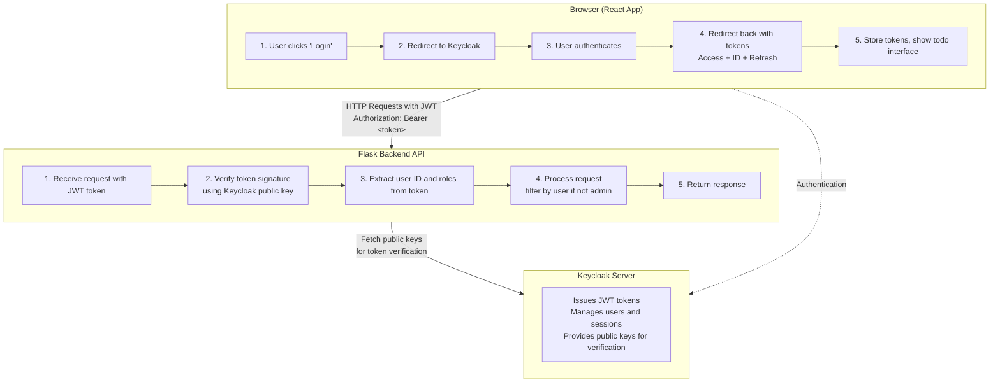

# Complete Example: Todo App with Keycloak Authentication

This example builds on Tutorial 1's todo application, adding Keycloak authentication and authorization. It demonstrates a real-world scenario where users must log in to manage their todos, with role-based access control.

## What You'll Build

A secure todo application with:
- **User Authentication**: Users must log in via Keycloak
- **Protected API**: Backend validates JWT tokens
- **Role-Based Access**: Admin users can see all todos, regular users see only their own
- **Token Refresh**: Automatic token renewal
- **Logout**: Proper session cleanup

## Architecture



## Prerequisites

1. **Completed Tutorial 12 Parts 1-3**: Keycloak must be deployed and configured
2. **Node.js and npm**: For React frontend
3. **Python 3.7+**: For Flask backend
4. **Keycloak Realm**: `m7011e` realm created with a client configured

## Setup Instructions

### Step 1: Configure Keycloak Client

1. **Login to Keycloak Admin Console**
2. **Select the `m7011e` realm**
3. **Create a new client:**
   - Client ID: `todo-app`
   - Client type: OpenID Connect
   - Client authentication: OFF (public client)
   - Standard flow: ✓ Enabled
   - Direct access grants: ✓ Enabled
4. **Configure URLs:**
   - Root URL: `http://localhost:3000`
   - Valid redirect URIs: `http://localhost:3000/*`
   - Valid post logout redirect URIs: `http://localhost:3000/*`
   - Web origins: `http://localhost:3000`
5. **Save**

### Step 2: Create Users with Roles

1. **Create realm role `admin`:**
   - Go to "Realm Roles"
   - Create role: `admin`

2. **Create test users:**

   **Admin User:**
   - Username: `admin`
   - Email: `admin@example.com`
   - Password: `admin123` (temporary: OFF)
   - Assign role: `admin`

   **Regular User:**
   - Username: `alice`
   - Email: `alice@example.com`
   - Password: `alice123` (temporary: OFF)
   - No admin role

### Step 3: Configure the Application

Edit `frontend/src/keycloak-config.js`:

```javascript
export const keycloakConfig = {
  url: 'https://keycloak.ltu-m7011e-YOUR-NAME.se',  // Change to your Keycloak URL
  realm: 'm7011e',
  clientId: 'todo-app'
};
```

Edit `backend/app.py` if needed:

```python
KEYCLOAK_URL = "https://keycloak.ltu-m7011e-YOUR-NAME.se"  # Change to your Keycloak URL
REALM = "m7011e"
```

### Step 4: Install and Run Backend

```bash
cd backend

# Install dependencies
pip install -r requirements.txt

# Run the server
python app.py
```

Backend will run on `http://localhost:5000`

### Step 5: Install and Run Frontend

```bash
cd frontend

# Install dependencies
npm install

# Start the development server
npm start
```

Frontend will run on `http://localhost:3000`

## Testing the Application

### Test 1: Login as Regular User

1. Open `http://localhost:3000`
2. Click "Login"
3. Enter username: `alice`, password: `alice123`
4. You should see the todo interface
5. Add some todos
6. Todos are associated with Alice's user ID

### Test 2: Login as Admin

1. Logout (click Logout button)
2. Login with username: `admin`, password: `admin123`
3. Admin can see all users' todos
4. Admin badge displayed in UI

### Test 3: Token Refresh

1. Keep the app open for 5+ minutes
2. Add a todo (token should auto-refresh)
3. Check browser console for "Token refreshed" message

### Test 4: API Protection

1. Open browser developer tools
2. Try accessing API without token:
   ```bash
   curl http://localhost:5000/api/todos
   ```
   Should return 401 Unauthorized

2. Try with invalid token:
   ```bash
   curl -H "Authorization: Bearer fake-token" http://localhost:5000/api/todos
   ```
   Should return 401 Unauthorized

## How It Works

### Frontend Flow

1. **Initialization** (`src/App.js`):
   ```javascript
   useEffect(() => {
     keycloak.init({ onLoad: 'login-required' })
       .then(authenticated => {
         if (authenticated) {
           loadUserProfile();
           fetchTodos();
         }
       });
   }, []);
   ```

2. **Making Authenticated Requests** (`src/api.js`):
   ```javascript
   export const getTodos = async (token) => {
     const response = await fetch('http://localhost:5000/api/todos', {
       headers: {
         'Authorization': `Bearer ${token}`
       }
     });
     return response.json();
   };
   ```

3. **Token Refresh** (`src/App.js`):
   ```javascript
   // Refresh token every 60 seconds if needed
   setInterval(() => {
     keycloak.updateToken(70).then(refreshed => {
       if (refreshed) console.log('Token refreshed');
     });
   }, 60000);
   ```

### Backend Flow

1. **Token Verification** (`backend/app.py`):
   ```python
   def verify_token(token):
       # Fetch Keycloak's public keys
       keys = get_public_keys()

       # Decode and verify JWT signature
       decoded = jwt.decode(
           token,
           public_key,
           algorithms=['RS256'],
           audience='account',
           issuer=KEYCLOAK_ISSUER
       )

       return decoded  # Contains user_id, roles, etc.
   ```

2. **Protected Endpoint** (`backend/app.py`):
   ```python
   @app.route('/api/todos', methods=['GET'])
   @require_auth
   def get_todos():
       user_id = request.user['sub']
       is_admin = 'admin' in request.user.get('realm_access', {}).get('roles', [])

       if is_admin:
           return jsonify(todos)  # Admin sees all
       else:
           user_todos = [t for t in todos if t['user_id'] == user_id]
           return jsonify(user_todos)  # User sees only their own
   ```

## Key Features Demonstrated

### 1. JWT Token Structure

When you login, you receive a JWT token. Decode it at [jwt.io](https://jwt.io) to see:

```json
{
  "sub": "abc-123-def",           // User ID
  "preferred_username": "alice",   // Username
  "email": "alice@example.com",    // Email
  "realm_access": {
    "roles": ["user"]              // User roles
  },
  "exp": 1735689600,               // Expiration timestamp
  "iss": "https://keycloak.../realms/m7011e"  // Issuer
}
```

### 2. Role-Based Access Control

```javascript
// Frontend: Show admin badge
{user.isAdmin && <span className="admin-badge">Admin</span>}

// Frontend: Admin sees all todos
const todosToDisplay = user.isAdmin ? allTodos : userTodos;
```

```python
# Backend: Filter todos based on role
if is_admin:
    return all_todos
else:
    return filter_by_user_id(todos, user_id)
```

### 3. Secure API Communication

Every API request includes the JWT token:

```javascript
fetch('http://localhost:5000/api/todos', {
  headers: {
    'Authorization': `Bearer ${keycloak.token}`
  }
})
```

Backend validates the token before processing:

```python
@require_auth  # Decorator validates token
def get_todos():
    # Token is valid if we reach here
    user_id = request.user['sub']
    ...
```

### 4. Token Lifecycle Management

```javascript
// Check token expiration and refresh if needed
keycloak.updateToken(70).then(refreshed => {
  if (refreshed) {
    console.log('Token refreshed');
    // Old token expired, new one issued
  } else {
    console.log('Token still valid');
  }
}).catch(() => {
  console.log('Failed to refresh, need to re-login');
  keycloak.login();
});
```

## Common Issues

### Issue 1: CORS Error

**Error:** "Access to fetch blocked by CORS policy"

**Solution:**
- Ensure Flask-CORS is configured correctly
- Check that frontend URL (`http://localhost:3000`) is allowed
- Backend already configured with CORS, should work out of the box

### Issue 2: Invalid Token

**Error:** "Invalid token" or "Token verification failed"

**Solution:**
- Check that Keycloak URL in both frontend and backend configs match
- Ensure realm name is correct (`m7011e`)
- Verify client ID is `todo-app`
- Check that the token hasn't expired (default: 5 minutes)

### Issue 3: Redirect URI Mismatch

**Error:** "Invalid redirect URI"

**Solution:**
- In Keycloak client settings, ensure redirect URI is `http://localhost:3000/*`
- Check web origins includes `http://localhost:3000`
- Restart frontend after changing Keycloak config

### Issue 4: Todos Don't Appear

**Possible causes:**
- User has no todos (create some!)
- Backend not running (check `http://localhost:5000`)
- Token expired (check browser console for errors)
- Wrong user_id filter (admin should see all, check roles)

## Extending the Example

### Add More Features

1. **Todo Sharing**:
   - Add a `shared_with` field to todos
   - Allow users to share specific todos with others
   - Require admin role to share with everyone

2. **Audit Logging**:
   - Log who created/modified/deleted each todo
   - Use JWT claims for audit trail

3. **Fine-Grained Permissions**:
   - Create roles: `can_create`, `can_edit`, `can_delete`
   - Check specific permissions before each operation

4. **Multi-Tenancy**:
   - Add organization/team concept
   - Filter todos by organization from JWT claims

## What You Learned

✅ How to integrate Keycloak with React applications
✅ How to validate JWT tokens in Flask backend
✅ Role-based access control implementation
✅ Token lifecycle management and refresh
✅ Secure API communication patterns
✅ Real-world authentication and authorization flow

## Next Steps

- Deploy this app to Kubernetes (Tutorial 7)
- Add PostgreSQL database instead of in-memory storage (Tutorial 8)
- Set up GitOps deployment with Argo CD (Tutorial 11)
- Add social login (GitHub/Google)
- Implement multi-factor authentication
- Add more complex authorization rules

## Files Structure

```
todo-app-example/
├── README.md                 # This file
├── frontend/
│   ├── package.json          # React dependencies
│   ├── public/
│   │   └── index.html        # HTML template
│   └── src/
│       ├── App.js            # Main React component
│       ├── keycloak-config.js # Keycloak configuration
│       ├── api.js            # API helper functions
│       └── index.js          # React entry point
└── backend/
    ├── requirements.txt      # Python dependencies
    └── app.py               # Flask API with JWT validation
```
