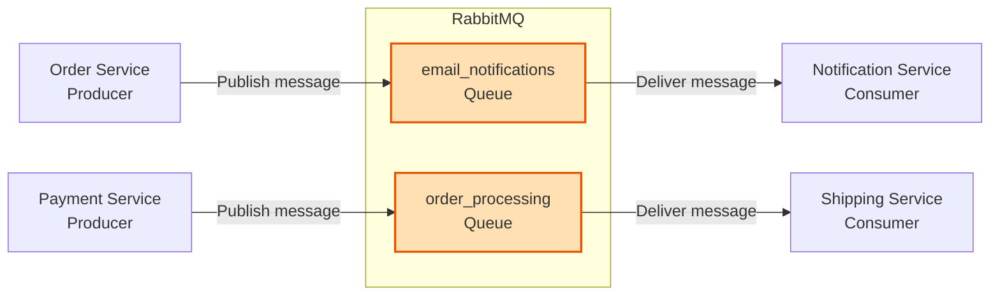
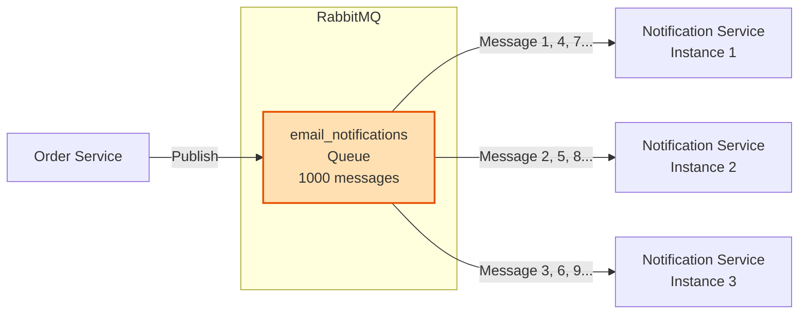
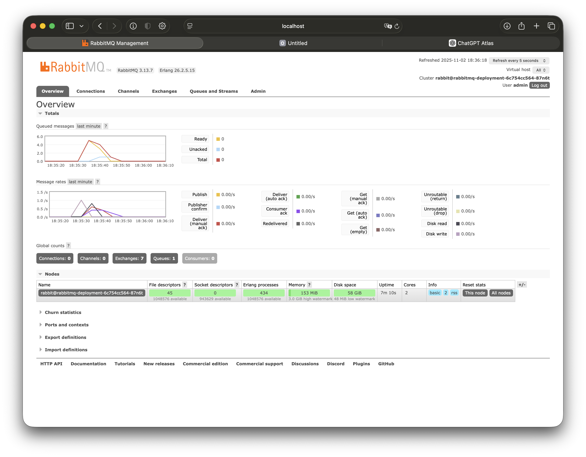

# Tutorial 13: RabbitMQ for Resilient Microservices Communication

Learn how to use RabbitMQ message queues for reliable asynchronous communication between microservices, with automatic retry on failure.

## Why This Tutorial Matters

In Tutorial 5, you learned about microservices communicating via synchronous HTTP/REST calls. This works for simple request-response patterns, but has critical limitations:

**Problem with Synchronous Communication:**
```python
# Order Service calling Notification Service directly
try:
    response = requests.post(
        "http://notification-service:5000/send-email",
        json={"email": "user@example.com", "order_id": 12345},
        timeout=5
    )
except requests.exceptions.Timeout:
    # What now? Email notification lost!
    # User never gets their order confirmation
```

**What happens if Notification Service crashes during the request?**
- ❌ The notification is **lost forever**
- ❌ Order Service must handle the failure (retry logic, error handling, logging)
- ❌ If Order Service crashes before retrying, the notification is still lost
- ❌ Tight coupling - Order Service must wait for Notification Service to respond

**Solution: RabbitMQ Message Queue:**
```python
# Order Service publishes a message to RabbitMQ
channel.basic_publish(
    exchange='',
    routing_key='email_notifications',
    body=json.dumps({"email": "user@example.com", "order_id": 12345})
)
# Message is now safely stored in RabbitMQ
# Order Service can continue immediately, doesn't wait
```

**If Notification Service crashes:**
- ✅ Message stays in queue **safely stored**
- ✅ When Notification Service restarts, it processes the message automatically
- ✅ **Automatic retry** via message acknowledgments (acks)
- ✅ No message loss, even if service is down for hours
- ✅ Order Service doesn't care - it published the message and moved on

## Learning Objectives

By the end of this tutorial, you will understand:
- Why asynchronous communication is critical for resilient microservices
- How RabbitMQ queues decouple services and provide reliability
- **Message acknowledgments (acks) and how they enable automatic retry**
- Work queue pattern for distributing tasks across multiple workers
- How to handle message failures with dead letter queues
- Deploying RabbitMQ to Kubernetes
- Building fault-tolerant microservices that survive crashes

## Prerequisites

- Completed Tutorial 5 (Microservices and Kubernetes)
- Completed Tutorial 6 (Kubernetes Getting Started)
- Basic Python knowledge
- Kubernetes cluster access

---

## Part 1: Understanding RabbitMQ and Message Queues

### What is RabbitMQ?

**RabbitMQ** is a message broker - a middleman that receives messages from producers (services that send messages) and delivers them to consumers (services that process messages). Messages are stored in **queues** until consumers are ready to process them.

**Key Concept**: Messages are stored durably in RabbitMQ. If a consumer crashes, the message stays in the queue and will be redelivered when the consumer restarts.

### The Producer-Queue-Consumer Model



**How it works:**

1. **Producer** (Order Service) creates a message: `{"email": "user@example.com", "order_id": 12345}`
2. **Producer** publishes the message to a **queue** in RabbitMQ: `email_notifications`
3. **RabbitMQ** stores the message durably (on disk if configured)
4. **Consumer** (Notification Service) connects to RabbitMQ and listens for messages
5. **RabbitMQ** delivers the message to the consumer
6. **Consumer** processes the message (sends email)
7. **Consumer** sends **acknowledgment (ack)** to RabbitMQ: "I successfully processed this message"
8. **RabbitMQ** removes the message from the queue (it's been handled)

### Why Queues Matter for Microservices

**1. Decoupling - Services Don't Wait**

Synchronous (REST):
```
Order Service → HTTP POST → Notification Service (wait 2 seconds) → Response → Continue
Total time: 2+ seconds (blocked waiting)
```

Asynchronous (RabbitMQ):
```
Order Service → Publish to queue (1ms) → Continue immediately
Notification Service → Process whenever ready
Total time for Order Service: 1ms (immediate)
```

**2. Resilience - Services Can Crash**

**Scenario: Notification Service crashes while processing**

**With REST (synchronous):**
```
Order Service → POST /send-email → Notification Service crashes → Timeout → Notification lost
```
User never receives order confirmation email. You'd need to implement complex retry logic, store failed notifications in a database, build a background job processor, etc.

**With RabbitMQ (asynchronous):**
```
Order Service → Publish to queue → Queue stores message
Notification Service → Receives message → Starts processing → CRASHES mid-processing
RabbitMQ → "No ack received, message not processed" → Keeps message in queue
Notification Service → Restarts 5 minutes later → Connects to queue
RabbitMQ → Redelivers the same message automatically
Notification Service → Processes successfully → Sends ack → Email sent
```

**The message was never lost.** RabbitMQ automatically retried delivery when the service recovered. This is the power of **message acknowledgments**.

**3. Load Leveling - Handle Traffic Spikes**

Black Friday sale: 10,000 orders per minute!

**With REST:**
- Notification Service must handle 10,000 emails/minute
- If it can only process 1,000/minute → **9,000 requests fail**
- Order Service gets timeouts and errors

**With RabbitMQ:**
- Order Service publishes 10,000 messages to queue in 1 second
- Queue buffers all 10,000 messages
- Notification Service processes at its own pace (1,000/minute)
- Takes 10 minutes to clear the queue, **but nothing is lost**
- Can scale Notification Service to 10 instances → 10,000/minute capacity

**4. Multiple Consumers - Parallel Processing**



RabbitMQ automatically distributes messages across all connected consumers (round-robin). Scale horizontally by adding more consumer instances.

---

## Part 2: Message Acknowledgments - The Core Feature

**This is the most important feature for building resilient microservices.**

### What is a Message Acknowledgment (Ack)?

An **acknowledgment** is a signal from the consumer to RabbitMQ saying: **"I successfully processed this message, you can delete it from the queue."**

**Without acks:** RabbitMQ delivers a message and immediately deletes it (fire-and-forget).
**With acks:** RabbitMQ delivers a message and waits for confirmation. If no ack arrives (consumer crashed), RabbitMQ redelivers the message.

### How Acknowledgments Work

```
Step 1: Consumer connects to queue
        Consumer: "I'm ready to receive messages"

Step 2: RabbitMQ delivers message #1 to consumer
        RabbitMQ: "Here's message #1, process it"
        RabbitMQ: [MARKS MESSAGE AS "UNACKED" - waiting for confirmation]

Step 3a: SUCCESS PATH - Consumer processes successfully
        Consumer: Receives message
        Consumer: Sends email successfully
        Consumer: Sends ACK to RabbitMQ
        RabbitMQ: Receives ACK
        RabbitMQ: [DELETES MESSAGE FROM QUEUE - it's been handled]

Step 3b: FAILURE PATH - Consumer crashes
        Consumer: Receives message
        Consumer: Starts sending email
        Consumer: **CRASHES** (out of memory, exception, pod terminated)
        Consumer: [NEVER SENDS ACK]
        RabbitMQ: Detects consumer disconnected
        RabbitMQ: [MESSAGE STILL IN QUEUE, marked as "ready"]
        RabbitMQ: Redelivers message to another consumer OR same consumer when it restarts
```

### Code Example: With vs Without Acknowledgments

**WITHOUT Acknowledgments (auto_ack=True) - DANGEROUS:**

```python
import pika
import json

connection = pika.BlockingConnection(pika.ConnectionParameters('rabbitmq-service-api'))
channel = connection.channel()
channel.queue_declare(queue='email_notifications', durable=True)

def callback(ch, method, properties, body):
    data = json.loads(body)
    print(f"Sending email to {data['email']}")

    # Simulate processing
    send_email(data['email'], data['order_id'])  # What if this crashes?

    # NO ACK NEEDED - RabbitMQ already deleted the message!
    # If send_email() crashes, MESSAGE IS LOST FOREVER

# auto_ack=True means RabbitMQ deletes message immediately upon delivery
channel.basic_consume(queue='email_notifications', on_message_callback=callback, auto_ack=True)
channel.start_consuming()
```

**Problem**: If `send_email()` crashes (network error, exception, service terminated), the message is **already deleted** from the queue. It's lost.

**WITH Acknowledgments (auto_ack=False) - SAFE:**

```python
import pika
import json
import time

connection = pika.BlockingConnection(pika.ConnectionParameters('rabbitmq-service-api'))
channel = connection.channel()
channel.queue_declare(queue='email_notifications', durable=True)

def callback(ch, method, properties, body):
    data = json.loads(body)
    print(f"[Worker] Received: {data}")

    try:
        # Simulate processing (this might fail!)
        send_email(data['email'], data['order_id'])
        print(f"[Worker] Email sent successfully")

        # IMPORTANT: Only send ack AFTER successful processing
        ch.basic_ack(delivery_tag=method.delivery_tag)
        print(f"[Worker] Sent ACK to RabbitMQ")

    except Exception as e:
        print(f"[Worker] ERROR: {e}")
        # DO NOT send ack - message will be redelivered
        # OR send NACK to reject and requeue
        ch.basic_nack(delivery_tag=method.delivery_tag, requeue=True)
        print(f"[Worker] Sent NACK - message will be redelivered")

# auto_ack=False means we must manually acknowledge messages
channel.basic_consume(queue='email_notifications', on_message_callback=callback, auto_ack=False)
print("[Worker] Waiting for messages. To exit press CTRL+C")
channel.start_consuming()
```

**How this handles crashes:**

**Scenario 1: Service crashes BEFORE sending ack**
```
Consumer receives message → Starts processing → CRASH (pod killed)
Consumer never sends ack
RabbitMQ detects disconnection
RabbitMQ redelivers message to another instance OR waits for service to restart
Message is NOT lost
```

**Scenario 2: Service processes successfully and sends ack**
```
Consumer receives message → Processes successfully → Sends ack → RabbitMQ deletes message
Even if consumer crashes AFTER ack, message is already handled (email was sent)
```

**Scenario 3: Service processes with error and sends NACK**
```
Consumer receives message → Processing fails (email server down)
Consumer sends NACK (requeue=True)
RabbitMQ requeues message → Will be redelivered later
Consumer can retry after a delay
```

### Demonstration: Crash Recovery with Acks

**Producer (Order Service) - Publishes Messages:**

```python
# producer.py
import pika
import json
import time

connection = pika.BlockingConnection(pika.ConnectionParameters('rabbitmq-service-api'))
channel = connection.channel()

# Declare durable queue (survives RabbitMQ restarts)
channel.queue_declare(queue='email_notifications', durable=True)

# Publish 10 messages
for i in range(1, 11):
    message = {
        "email": f"user{i}@example.com",
        "order_id": 10000 + i,
        "message": f"Order #{10000 + i} confirmed"
    }

    channel.basic_publish(
        exchange='',
        routing_key='email_notifications',
        body=json.dumps(message),
        properties=pika.BasicProperties(
            delivery_mode=2,  # Make message persistent (survives RabbitMQ restart)
        )
    )
    print(f"[Producer] Sent: {message}")
    time.sleep(0.5)

connection.close()
print("[Producer] Done publishing messages")
```

**Consumer (Notification Service) - Processes with Intentional Crashes:**

```python
# consumer_with_crash.py
import pika
import json
import time
import sys

connection = pika.BlockingConnection(pika.ConnectionParameters('rabbitmq-service-api'))
channel = connection.channel()
channel.queue_declare(queue='email_notifications', durable=True)

# Fair dispatch: Don't give worker new message until it acks previous one
channel.basic_qos(prefetch_count=1)

message_count = 0

def callback(ch, method, properties, body):
    global message_count
    message_count += 1

    data = json.loads(body)
    print(f"[Worker] Received message #{message_count}: {data}")

    # Simulate processing time
    time.sleep(2)

    # CRASH on message #3 to demonstrate redelivery
    if message_count == 3:
        print(f"[Worker] !!! SIMULATING CRASH on message #3 !!!")
        print(f"[Worker] !!! NOT sending ACK - message will be redelivered !!!")
        sys.exit(1)  # Crash the process

    # Process successfully
    print(f"[Worker] Processed: Sending email to {data['email']}")

    # Send acknowledgment ONLY after successful processing
    ch.basic_ack(delivery_tag=method.delivery_tag)
    print(f"[Worker] Sent ACK for message #{message_count}")

channel.basic_consume(queue='email_notifications', on_message_callback=callback, auto_ack=False)
print("[Worker] Waiting for messages. Will crash on message #3")
channel.start_consuming()
```

**What happens when you run this:**

```bash
# Terminal 1: Start consumer
python consumer_with_crash.py

# Output:
[Worker] Waiting for messages. Will crash on message #3
[Worker] Received message #1: {'email': 'user1@example.com', ...}
[Worker] Processed: Sending email to user1@example.com
[Worker] Sent ACK for message #1
[Worker] Received message #2: {'email': 'user2@example.com', ...}
[Worker] Processed: Sending email to user2@example.com
[Worker] Sent ACK for message #2
[Worker] Received message #3: {'email': 'user3@example.com', ...}
[Worker] !!! SIMULATING CRASH on message #3 !!!
[Worker] !!! NOT sending ACK - message will be redelivered !!!
# Process exits

# Terminal 2: Restart consumer immediately
python consumer_with_crash.py

# Output:
[Worker] Waiting for messages. Will crash on message #3
[Worker] Received message #3: {'email': 'user3@example.com', ...}  ← REDELIVERED!
[Worker] !!! SIMULATING CRASH on message #3 !!!
# Crashes again

# Keep restarting - eventually message #3 processes (or use proper NACK handling)
```

**Key Observation**: Message #3 was **automatically redelivered** because the consumer crashed before sending acknowledgment. RabbitMQ guarantees the message will be processed eventually.

---

## Part 3: Work Queue Pattern - Distributing Tasks

The **Work Queue** pattern distributes time-consuming tasks across multiple worker instances.

### Use Case: Image Processing Service

```
User uploads photo → Order Service publishes to queue → Worker processes (resize, compress)
Processing takes 30 seconds per image
During peak: 1000 images uploaded/minute
```

**With 1 worker**: 30 seconds/image × 1000 images = 30,000 seconds = 8.3 hours backlog!
**With 10 workers**: 30 seconds/image × 1000 images ÷ 10 workers = 3000 seconds = 50 minutes
**With 100 workers**: 30 seconds/image × 1000 images ÷ 100 workers = 300 seconds = 5 minutes

### Fair Dispatch with `prefetch_count`

**Problem**: By default, RabbitMQ dispatches messages round-robin **when they're delivered**, not when they're completed. If Worker 1 is slow and Worker 2 is fast:

```
Worker 1: Message 1 (30s), Message 3 (30s), Message 5 (30s) = 90 seconds
Worker 2: Message 2 (30s), Message 4 (30s), Message 6 (30s) = 90 seconds
```

Looks fair, but what if Worker 1 crashes? Messages 3 and 5 aren't delivered to Worker 2 until Worker 1 sends ack (which never comes).

**Solution**: `prefetch_count=1`

```python
channel.basic_qos(prefetch_count=1)
```

This tells RabbitMQ: **"Don't send me a new message until I've acknowledged the previous one."**

```
Worker 1: Message 1 → Processing → ACK → Message 3 → Processing → ACK
Worker 2: Message 2 → Processing → ACK → Message 4 → Processing → ACK
```

If Worker 1 is slower, Worker 2 will process more messages. If Worker 1 crashes mid-processing, RabbitMQ immediately redelivers the unacked message to Worker 2.

### Complete Work Queue Example

**Producer (publishes image processing tasks):**

```python
# producer_images.py
import pika
import json

connection = pika.BlockingConnection(pika.ConnectionParameters('rabbitmq-service-api'))
channel = connection.channel()
channel.queue_declare(queue='image_processing', durable=True)

images = [
    {"image_id": 1, "url": "https://example.com/image1.jpg", "user_id": 123},
    {"image_id": 2, "url": "https://example.com/image2.jpg", "user_id": 456},
    {"image_id": 3, "url": "https://example.com/image3.jpg", "user_id": 789},
    # ... 1000 more images
]

for image in images:
    channel.basic_publish(
        exchange='',
        routing_key='image_processing',
        body=json.dumps(image),
        properties=pika.BasicProperties(delivery_mode=2)  # Persistent
    )
    print(f"[Producer] Queued image {image['image_id']}")

connection.close()
print(f"[Producer] Queued {len(images)} images for processing")
```

**Worker (processes images):**

```python
# worker_image_processor.py
import pika
import json
import time
import os

WORKER_ID = os.getenv("WORKER_ID", "1")

connection = pika.BlockingConnection(pika.ConnectionParameters('rabbitmq-service-api'))
channel = connection.channel()
channel.queue_declare(queue='image_processing', durable=True)

# Fair dispatch: only process one image at a time
channel.basic_qos(prefetch_count=1)

def process_image(image_data):
    """Simulate image processing (resize, compress, etc.)"""
    print(f"[Worker {WORKER_ID}] Processing image {image_data['image_id']}")
    print(f"[Worker {WORKER_ID}]   - Downloading from {image_data['url']}")
    time.sleep(5)  # Simulate download
    print(f"[Worker {WORKER_ID}]   - Resizing image...")
    time.sleep(10)  # Simulate resize
    print(f"[Worker {WORKER_ID}]   - Compressing...")
    time.sleep(5)  # Simulate compression
    print(f"[Worker {WORKER_ID}]   - Uploading to CDN...")
    time.sleep(5)  # Simulate upload
    print(f"[Worker {WORKER_ID}] ✓ Completed image {image_data['image_id']}")

def callback(ch, method, properties, body):
    data = json.loads(body)

    try:
        process_image(data)
        # Only ack after successful processing
        ch.basic_ack(delivery_tag=method.delivery_tag)
        print(f"[Worker {WORKER_ID}] Sent ACK for image {data['image_id']}")

    except Exception as e:
        print(f"[Worker {WORKER_ID}] ERROR processing image {data['image_id']}: {e}")
        # Reject and requeue for retry
        ch.basic_nack(delivery_tag=method.delivery_tag, requeue=True)
        print(f"[Worker {WORKER_ID}] Sent NACK - will be retried")

channel.basic_consume(queue='image_processing', on_message_callback=callback, auto_ack=False)
print(f"[Worker {WORKER_ID}] Ready to process images")
channel.start_consuming()
```

**Run multiple workers:**

```bash
# Terminal 1
export WORKER_ID=1
python worker_image_processor.py

# Terminal 2
export WORKER_ID=2
python worker_image_processor.py

# Terminal 3
export WORKER_ID=3
python worker_image_processor.py
```

**What happens:**
- All 3 workers connect to the same queue
- RabbitMQ distributes images across workers (fair dispatch)
- Each worker processes images sequentially (prefetch_count=1)
- If Worker 2 crashes while processing image #7, RabbitMQ redelivers #7 to Worker 1 or 3
- Total throughput: 3x faster than single worker

---

## Part 4: Dead Letter Queues - Handling Permanent Failures

**Problem**: What if a message can't be processed even after retries?

Example: Email contains invalid email address, processing always fails.

Without DLQ:
- Message is redelivered forever (infinite loop)
- Blocks the queue (poison message)
- Worker keeps crashing

**Solution: Dead Letter Queue (DLQ)**

After N failed attempts (or after rejection with requeue=False), move the message to a **dead letter queue** for manual inspection or special handling.

### Setting up Dead Letter Queue

```python
# Setup main queue with DLX (Dead Letter Exchange)
channel.queue_declare(
    queue='email_notifications',
    durable=True,
    arguments={
        'x-dead-letter-exchange': 'dlx',  # Dead letter exchange
        'x-dead-letter-routing-key': 'email_notifications_failed'
    }
)

# Setup dead letter exchange and queue
channel.exchange_declare(exchange='dlx', exchange_type='direct')
channel.queue_declare(queue='email_notifications_failed', durable=True)
channel.queue_bind(exchange='dlx', queue='email_notifications_failed', routing_key='email_notifications_failed')
```

### Consumer with Retry Limit

```python
import pika
import json

MAX_RETRIES = 3

def callback(ch, method, properties, body):
    data = json.loads(body)

    # Check retry count (custom header)
    headers = properties.headers or {}
    retry_count = headers.get('x-retry-count', 0)

    try:
        send_email(data['email'], data['order_id'])
        # Success - acknowledge
        ch.basic_ack(delivery_tag=method.delivery_tag)

    except Exception as e:
        print(f"[Worker] Error: {e}, retry count: {retry_count}")

        if retry_count >= MAX_RETRIES:
            # Exceeded retry limit - reject without requeue
            # Message will go to dead letter queue
            ch.basic_nack(delivery_tag=method.delivery_tag, requeue=False)
            print(f"[Worker] Max retries exceeded - sending to DLQ")
        else:
            # Increment retry count and requeue
            headers['x-retry-count'] = retry_count + 1
            ch.basic_publish(
                exchange='',
                routing_key='email_notifications',
                body=body,
                properties=pika.BasicProperties(headers=headers, delivery_mode=2)
            )
            # Ack original message (we republished with updated headers)
            ch.basic_ack(delivery_tag=method.delivery_tag)
            print(f"[Worker] Requeued with retry count {retry_count + 1}")
```

**What happens:**
1. Message fails processing
2. Retry count incremented, message requeued
3. Fails again, retry count incremented
4. After 3 failures, message rejected (requeue=False)
5. RabbitMQ moves message to dead letter queue
6. Separate monitoring service processes DLQ messages (alert ops team, log to database, etc.)

---

## Part 5: Deploying RabbitMQ to Kubernetes

The Helm chart is already provided in this tutorial directory.

### Step 1: Configure Credentials

Edit `values.yaml` to set your RabbitMQ credentials:

```yaml
# RabbitMQ Configuration
Image: "rabbitmq:3-management"

# RabbitMQ Credentials
# ⚠️ IMPORTANT: Change these for production!
RabbitMQUser: "admin"
RabbitMQPassword: "changeme123"
```

**⚠️ IMPORTANT:** Change the default password before deploying to production!

You can also override credentials during installation:

```bash
helm install rabbitmq -n rabbitmq . \
  --set RabbitMQUser="yourusername" \
  --set RabbitMQPassword="yoursecurepassword"
```

### Step 2: Deploy RabbitMQ

```bash
# Navigate to the tutorial directory
cd 12-service-communication

# Create namespace
kubectl create namespace rabbitmq

# Install Helm chart
helm install rabbitmq -n rabbitmq .

# Check deployment status
kubectl get pods -n rabbitmq
kubectl get svc -n rabbitmq
```

**Expected output:**
```
NAME                                  READY   STATUS    RESTARTS   AGE
rabbitmq-deployment-xxxxxxxxxx-xxxxx  1/1     Running   0          30s

NAME                              TYPE       CLUSTER-IP      EXTERNAL-IP   PORT(S)           AGE
rabbitmq-service-api              NodePort   10.96.xxx.xxx   <none>        5672:30000/TCP    30s
rabbitmq-service-management       NodePort   10.96.xxx.xxx   <none>        15672:30001/TCP   30s
```

### Step 3: Access RabbitMQ Using kubectl port-forward

Instead of using Ingress, we'll use kubectl port-forward for local access:

**Option A: Forward Management UI (Web Interface)**

```bash
# Forward RabbitMQ management UI to localhost:15672
kubectl port-forward -n rabbitmq svc/rabbitmq-service-management 15672:15672
```

Now open your browser:
- **URL:** http://localhost:15672
- **Username:** `admin`
- **Password:** `changeme123`

You'll see the RabbitMQ Management UI where you can:
- View queues and their message counts
- Monitor message rates (publish/delivery)
- See active connections (producers/consumers)
- Manually inspect or purge messages
- View exchange and binding configuration



**Option B: Forward AMQP API (For Running Python Examples Locally)**

```bash
# Forward RabbitMQ AMQP port to localhost:5672
kubectl port-forward -n rabbitmq svc/rabbitmq-service-api 5672:5672
```

Now you can run the Python examples from your local machine:
```bash
# In a new terminal (while port-forward is running)
cd examples
python producer_simple.py   # Connects to localhost:5672
python consumer_simple.py
```

**Option C: Forward Both Ports Simultaneously**

```bash
# Terminal 1: Forward AMQP API
kubectl port-forward -n rabbitmq svc/rabbitmq-service-api 5672:5672

# Terminal 2: Forward Management UI
kubectl port-forward -n rabbitmq svc/rabbitmq-service-management 15672:15672
```

Now you can:
- Run Python scripts (connects to localhost:5672)
- Monitor queues in browser (http://localhost:15672)

**💡 Tip:** Keep the port-forward terminals open while testing. Press `Ctrl+C` to stop port-forwarding.

### Step 4: Access RabbitMQ from Services Inside Kubernetes

When your microservices run **inside** the Kubernetes cluster, they should connect using the **internal service names**:

**AMQP Connection (for producers/consumers):**
```python
# Python example - running inside Kubernetes
connection = pika.BlockingConnection(
    pika.ConnectionParameters(
        host='rabbitmq-service-api',  # Internal service name
        port=5672,
        credentials=pika.PlainCredentials('admin', 'changeme123')
    )
)
```

**Internal service addresses:**
- AMQP API: `rabbitmq-service-api:5672` (from within cluster)
- Management UI: `rabbitmq-service-management:15672` (from within cluster)

**External access (via NodePort):**
- AMQP API: `<NodeIP>:30000`
- Management UI: `<NodeIP>:30001`

To find your NodeIP:
```bash
kubectl get nodes -o wide
# Use the INTERNAL-IP or EXTERNAL-IP of any node
```

### Step 5: Deploy Producer and Consumer Services

**Example Deployment for Consumer:**

```yaml
apiVersion: apps/v1
kind: Deployment
metadata:
  name: notification-service
spec:
  replicas: 3  # Run 3 workers for parallel processing
  selector:
    matchLabels:
      app: notification-service
  template:
    metadata:
      labels:
        app: notification-service
    spec:
      containers:
      - name: notification-service
        image: your-registry/notification-service:v1
        env:
        - name: RABBITMQ_HOST
          value: "rabbitmq-service-api"  # Internal service name
        - name: RABBITMQ_PORT
          value: "5672"
        - name: RABBITMQ_USER
          value: "admin"
        - name: RABBITMQ_PASSWORD
          value: "changeme123"
        - name: QUEUE_NAME
          value: "email_notifications"
```

---

## Part 6: Quick Start - Try It Yourself

After deploying RabbitMQ, try this simple example to see message acknowledgments and automatic retry in action.

### Setup: Install Python Dependencies

```bash
# Create a virtual environment
python3 -m venv venv
source venv/bin/activate  # On Windows: venv\Scripts\activate

# Install pika (RabbitMQ client library)
pip install pika
```

### Example 1: Simple Producer and Consumer

**Create `producer_simple.py`:**

```python
#!/usr/bin/env python3
import pika
import json
import sys

# Connect to RabbitMQ
# If running locally or via port-forward: use 'localhost'
# If running inside Kubernetes cluster: use 'rabbitmq-service-api'
RABBITMQ_HOST = 'localhost'  # Change to 'rabbitmq-service-api' if inside K8s

print(f"[Producer] Connecting to RabbitMQ at {RABBITMQ_HOST}...")
connection = pika.BlockingConnection(
    pika.ConnectionParameters(
        host=RABBITMQ_HOST,
        credentials=pika.PlainCredentials('admin', 'changeme123')
    )
)
channel = connection.channel()

# Declare a durable queue (survives RabbitMQ restart)
queue_name = 'test_queue'
channel.queue_declare(queue=queue_name, durable=True)

# Send 5 messages
for i in range(1, 6):
    message = {
        "id": i,
        "task": f"Process task #{i}",
        "data": f"Some data for task {i}"
    }

    channel.basic_publish(
        exchange='',
        routing_key=queue_name,
        body=json.dumps(message),
        properties=pika.BasicProperties(
            delivery_mode=2,  # Make message persistent
        )
    )
    print(f"[Producer] ✓ Sent message #{i}: {message['task']}")

connection.close()
print(f"[Producer] Done! Sent 5 messages to queue '{queue_name}'")
```

**Create `consumer_simple.py`:**

```python
#!/usr/bin/env python3
import pika
import json
import time

RABBITMQ_HOST = 'localhost'  # Change to 'rabbitmq-service-api' if inside K8s

print(f"[Consumer] Connecting to RabbitMQ at {RABBITMQ_HOST}...")
connection = pika.BlockingConnection(
    pika.ConnectionParameters(
        host=RABBITMQ_HOST,
        credentials=pika.PlainCredentials('admin', 'changeme123')
    )
)
channel = connection.channel()

queue_name = 'test_queue'
channel.queue_declare(queue=queue_name, durable=True)

# Fair dispatch - only get one message at a time
channel.basic_qos(prefetch_count=1)

def callback(ch, method, properties, body):
    data = json.loads(body)
    print(f"\n[Consumer] Received: {data['task']}")

    # Simulate processing work
    print(f"[Consumer] Processing task #{data['id']}...")
    time.sleep(2)  # Simulate 2 seconds of work

    print(f"[Consumer] ✓ Completed task #{data['id']}")

    # Send acknowledgment - VERY IMPORTANT!
    ch.basic_ack(delivery_tag=method.delivery_tag)
    print(f"[Consumer] Sent ACK to RabbitMQ\n")

# Start consuming with manual acknowledgment
channel.basic_consume(
    queue=queue_name,
    on_message_callback=callback,
    auto_ack=False  # Manual acknowledgment
)

print(f"[Consumer] Waiting for messages from '{queue_name}'...")
print("[Consumer] Press CTRL+C to exit\n")
channel.start_consuming()
```

**Run the example:**

```bash
# Terminal 1: Start the consumer first
python consumer_simple.py

# Terminal 2: Send messages
python producer_simple.py
```

**Expected output:**

```
# Terminal 1 (Consumer):
[Consumer] Connecting to RabbitMQ at localhost...
[Consumer] Waiting for messages from 'test_queue'...
[Consumer] Press CTRL+C to exit

[Consumer] Received: Process task #1
[Consumer] Processing task #1...
[Consumer] ✓ Completed task #1
[Consumer] Sent ACK to RabbitMQ

[Consumer] Received: Process task #2
[Consumer] Processing task #2...
[Consumer] ✓ Completed task #2
[Consumer] Sent ACK to RabbitMQ
...

# Terminal 2 (Producer):
[Producer] Connecting to RabbitMQ at localhost...
[Producer] ✓ Sent message #1: Process task #1
[Producer] ✓ Sent message #2: Process task #2
[Producer] ✓ Sent message #3: Process task #3
[Producer] ✓ Sent message #4: Process task #4
[Producer] ✓ Sent message #5: Process task #5
[Producer] Done! Sent 5 messages to queue 'test_queue'
```

### Example 2: Demonstrating Crash Recovery with ACK

This example shows **automatic retry** when a consumer crashes without sending ACK.

**Create `consumer_crash_demo.py`:**

```python
#!/usr/bin/env python3
import pika
import json
import time
import sys

RABBITMQ_HOST = 'localhost'

print(f"[Consumer] Connecting to RabbitMQ at {RABBITMQ_HOST}...")
connection = pika.BlockingConnection(
    pika.ConnectionParameters(
        host=RABBITMQ_HOST,
        credentials=pika.PlainCredentials('admin', 'changeme123')
    )
)
channel = connection.channel()

queue_name = 'test_queue'
channel.queue_declare(queue=queue_name, durable=True)
channel.basic_qos(prefetch_count=1)

message_count = 0

def callback(ch, method, properties, body):
    global message_count
    message_count += 1

    data = json.loads(body)
    print(f"\n[Consumer] Received message #{message_count}: {data['task']}")

    # Simulate processing
    print(f"[Consumer] Processing task #{data['id']}...")
    time.sleep(2)

    # CRASH on message #3 to demonstrate redelivery
    if message_count == 3:
        print(f"\n" + "="*60)
        print(f"[Consumer] !!! SIMULATING CRASH on message #3 !!!")
        print(f"[Consumer] !!! NOT sending ACK !!!")
        print(f"[Consumer] Message #{message_count} will be REDELIVERED when service restarts")
        print("="*60 + "\n")
        sys.exit(1)  # Crash the process

    # Normal processing - send ACK
    print(f"[Consumer] ✓ Completed task #{data['id']}")
    ch.basic_ack(delivery_tag=method.delivery_tag)
    print(f"[Consumer] Sent ACK to RabbitMQ")

channel.basic_consume(queue=queue_name, on_message_callback=callback, auto_ack=False)

print(f"[Consumer] Waiting for messages...")
print(f"[Consumer] This consumer will CRASH on message #3 to demonstrate auto-retry")
print("[Consumer] Press CTRL+C to exit\n")

channel.start_consuming()
```

**Try the crash recovery:**

```bash
# Terminal 1: Run producer to send 5 messages
python producer_simple.py

# Terminal 2: Run consumer that will crash on message #3
python consumer_crash_demo.py
```

**What happens:**

```
# First run - crashes on message #3:
[Consumer] Received message #1: Process task #1
[Consumer] Processing task #1...
[Consumer] ✓ Completed task #1
[Consumer] Sent ACK to RabbitMQ

[Consumer] Received message #2: Process task #2
[Consumer] Processing task #2...
[Consumer] ✓ Completed task #2
[Consumer] Sent ACK to RabbitMQ

[Consumer] Received message #3: Process task #3
[Consumer] Processing task #3...

============================================================
[Consumer] !!! SIMULATING CRASH on message #3 !!!
[Consumer] !!! NOT sending ACK !!!
[Consumer] Message #3 will be REDELIVERED when service restarts
============================================================

# Process exits - no ACK was sent for message #3!
```

**Now restart the consumer:**

```bash
# Restart consumer in Terminal 2
python consumer_crash_demo.py
```

**Observe the automatic retry:**

```
[Consumer] Waiting for messages...
[Consumer] This consumer will CRASH on message #3 to demonstrate auto-retry

[Consumer] Received message #1: Process task #3  ← MESSAGE #3 REDELIVERED!
[Consumer] Processing task #3...

============================================================
[Consumer] !!! SIMULATING CRASH on message #3 !!!
# Crashes again because it's still message #3
```

**The key observation:**
- Message #3 was **automatically redelivered** by RabbitMQ
- Messages #1 and #2 were NOT redelivered (they were ACKed)
- Messages #4 and #5 are still in the queue, waiting
- This happens **automatically** - RabbitMQ detected the consumer crashed without sending ACK

**To complete the demo:** Modify `consumer_crash_demo.py` to not crash (comment out the crash logic), then run it again. It will process message #3, #4, and #5 successfully.

### Example 3: Multiple Workers (Parallel Processing)

See how RabbitMQ distributes work across multiple consumers.

**Create `producer_many.py`:**

```python
#!/usr/bin/env python3
import pika
import json

RABBITMQ_HOST = 'localhost'

connection = pika.BlockingConnection(
    pika.ConnectionParameters(
        host=RABBITMQ_HOST,
        credentials=pika.PlainCredentials('admin', 'changeme123')
    )
)
channel = connection.channel()
channel.queue_declare(queue='work_queue', durable=True)

# Send 20 messages
print("[Producer] Sending 20 tasks to work queue...")
for i in range(1, 21):
    message = {"task_id": i, "description": f"Task number {i}"}
    channel.basic_publish(
        exchange='',
        routing_key='work_queue',
        body=json.dumps(message),
        properties=pika.BasicProperties(delivery_mode=2)
    )
    print(f"[Producer] Queued task #{i}")

connection.close()
print("[Producer] Done! 20 tasks queued")
```

**Create `worker.py`:**

```python
#!/usr/bin/env python3
import pika
import json
import time
import os
import sys

WORKER_ID = sys.argv[1] if len(sys.argv) > 1 else "1"
RABBITMQ_HOST = 'localhost'

print(f"[Worker {WORKER_ID}] Starting...")
connection = pika.BlockingConnection(
    pika.ConnectionParameters(
        host=RABBITMQ_HOST,
        credentials=pika.PlainCredentials('admin', 'changeme123')
    )
)
channel = connection.channel()
channel.queue_declare(queue='work_queue', durable=True)
channel.basic_qos(prefetch_count=1)  # Fair dispatch

def callback(ch, method, properties, body):
    data = json.loads(body)
    print(f"[Worker {WORKER_ID}] Got task #{data['task_id']}")

    # Simulate variable processing time (1-3 seconds)
    time.sleep(1 + (data['task_id'] % 3))

    print(f"[Worker {WORKER_ID}] ✓ Completed task #{data['task_id']}")
    ch.basic_ack(delivery_tag=method.delivery_tag)

channel.basic_consume(queue='work_queue', on_message_callback=callback, auto_ack=False)
print(f"[Worker {WORKER_ID}] Ready! Waiting for tasks...")
channel.start_consuming()
```

**Run multiple workers:**

```bash
# Terminal 1: Worker 1
python worker.py 1

# Terminal 2: Worker 2
python worker.py 2

# Terminal 3: Worker 3
python worker.py 3

# Terminal 4: Send tasks
python producer_many.py
```

**Observe:** All 3 workers process tasks in parallel. RabbitMQ distributes tasks fairly using round-robin + prefetch_count.

### Accessing RabbitMQ Management UI

While the examples are running, view the queue in the web UI.

**First, set up port forwarding:**

```bash
# Forward management UI to your local machine
kubectl port-forward -n rabbitmq svc/rabbitmq-service-management 15672:15672
```

**Then access the UI:**

1. Open browser: http://localhost:15672
2. Login: `admin` / `changeme123`
3. Click **Queues** tab
4. See your queues: `test_queue`, `work_queue`
5. Watch message counts change in real-time as producers/consumers run
6. Click on a queue name to see detailed statistics

**Useful UI features:**
- **Get messages**: Manually retrieve and inspect messages
- **Purge**: Delete all messages from queue (useful for testing)
- **Message rates**: Charts showing publish/delivery rates
- **Connections**: See active producer/consumer connections

### Complete Setup for Local Testing

To run all examples locally with full monitoring:

```bash
# Terminal 1: Forward AMQP API (required for Python scripts)
kubectl port-forward -n rabbitmq svc/rabbitmq-service-api 5672:5672

# Terminal 2: Forward Management UI (optional - for monitoring)
kubectl port-forward -n rabbitmq svc/rabbitmq-service-management 15672:15672

# Terminal 3: Run examples
cd examples
python producer_simple.py
python consumer_simple.py

# Browser: Monitor at http://localhost:15672
```

### Troubleshooting

**Connection refused:**
```python
pika.exceptions.AMQPConnectionError: <class 'ConnectionRefusedError'>
```
- Check RabbitMQ is running: `kubectl get pods -n rabbitmq`
- Check service is accessible: `kubectl get svc -n rabbitmq`
- If testing locally, ensure port-forward is running
- Verify credentials in ConfigMap

**Authentication failed:**
```
pika.exceptions.ProbableAuthenticationError
```
- Check username/password in `rabbitmq-configmap.yaml`
- Default is `admin` / `changeme123` (change this!)
- Restart RabbitMQ pod after changing credentials

**Messages not being delivered:**
- Ensure `auto_ack=False` and you're calling `ch.basic_ack()`
- Check consumer is connected: `channel.start_consuming()` is blocking
- Check queue exists in management UI
- Verify queue names match between producer and consumer

---

## Summary: Why RabbitMQ is Essential for Microservices

### Problems Solved:

✅ **Service crashes don't lose messages** - Acknowledgments ensure messages are redelivered
✅ **Decoupling** - Services don't wait for each other (async)
✅ **Load leveling** - Queue buffers traffic spikes
✅ **Scalability** - Add more consumers for parallel processing
✅ **Reliability** - Messages persist even if RabbitMQ restarts (durable queues)
✅ **Failure handling** - Dead letter queues for poison messages

### Key Concepts Learned:

- **Message Queue**: Buffer between producers and consumers
- **Acknowledgments (ACK)**: Consumer confirms successful processing
- **NACK**: Consumer rejects message (with or without requeue)
- **Prefetch Count**: Fair dispatch across workers
- **Durable Queues**: Messages survive RabbitMQ restarts
- **Persistent Messages**: `delivery_mode=2`
- **Dead Letter Queue**: Handle permanently failed messages
- **Work Queue Pattern**: Distribute tasks across workers

### Production Best Practices:

1. **Always use manual acknowledgments** (`auto_ack=False`)
2. **Set prefetch_count=1** for fair task distribution
3. **Make queues durable** and **messages persistent**
4. **Implement dead letter queues** for failed messages
5. **Monitor queue depth** - alert if queue grows too large
6. **Use connection pooling** - don't create new connection per message
7. **Implement exponential backoff** for retries
8. **Log correlation IDs** for tracing messages across services

---

## Further Reading

- [RabbitMQ Tutorials](https://www.rabbitmq.com/getstarted.html) - Official tutorials
- [RabbitMQ Reliability Guide](https://www.rabbitmq.com/reliability.html) - Production patterns
- [CloudAMQP Best Practices](https://www.cloudamqp.com/blog/part1-rabbitmq-best-practice.html) - Scalability tips
- [Enterprise Integration Patterns](https://www.enterpriseintegrationpatterns.com/) - Messaging patterns
