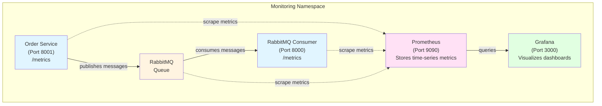
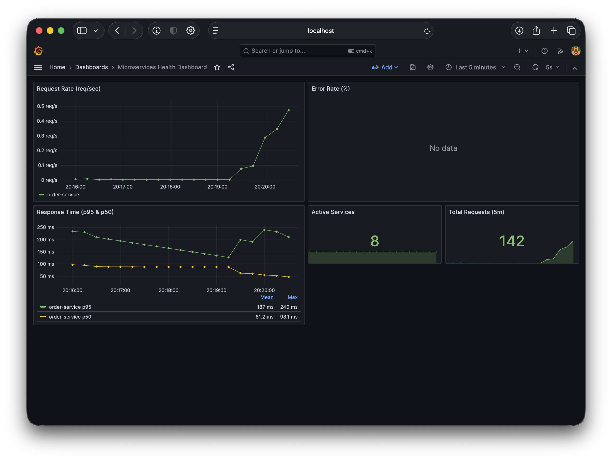

# Tutorial 14: Monitoring Microservices with Prometheus and Grafana

Learn how to monitor microservices and message queues with Prometheus metrics and Grafana dashboards for real-time observability.

## Why This Tutorial Matters

In Tutorial 13, you built microservices with RabbitMQ for reliable communication. But now you need to answer critical questions:

**Without monitoring, you're flying blind:**
- ❌ Is my service healthy right now?
- ❌ How many requests per second am I handling?
- ❌ Are my RabbitMQ queues backing up?
- ❌ Why is my service slow?
- ❌ Are users experiencing errors?

**With monitoring, you have visibility:**
- ✅ Real-time dashboards showing service health
- ✅ Alerts when something goes wrong
- ✅ Historical data for capacity planning
- ✅ Performance metrics (latency, throughput, errors)
- ✅ Queue depth and message processing rates

## Learning Objectives

By the end of this tutorial, you will understand:
- How to collect metrics with Prometheus
- How to instrument Python applications with metrics
- How to create Grafana dashboards for visualization
- The Four Golden Signals of monitoring
- How to set up alerts for critical issues
- Monitoring RabbitMQ message queues
- Kubernetes resource monitoring

## Prerequisites

- Kubernetes cluster access
- kubectl configured
- Helm installed (optional - scripts use it)
- Python 3.7+ (for running examples locally)
- Basic understanding of HTTP APIs

**Note:** This tutorial is **self-contained** and includes everything you need, including RabbitMQ for demonstration purposes.

---

## Part 1: Understanding Monitoring Fundamentals

### The Four Golden Signals

Every service should be monitored for these four key signals:

**1. Latency** - How long do requests take?
```
Examples:
- HTTP request duration: 50ms (p50), 200ms (p95), 500ms (p99)
- Message processing time: 1.2 seconds average
- Database query time: 15ms
```

**2. Traffic** - How much demand is the system handling?
```
Examples:
- HTTP requests: 1,250 requests/second
- Messages published: 500 messages/minute
- Active users: 3,420 concurrent
```

**3. Errors** - What's failing?
```
Examples:
- HTTP 5xx error rate: 2.3% (ALERT!)
- Failed message processing: 15 failures/hour
- Database connection errors: 5 in last 5 minutes
```

**4. Saturation** - How full are your resources?
```
Examples:
- CPU usage: 75% (approaching limit)
- Memory usage: 1.8GB / 2GB (90% - ALERT!)
- Queue depth: 5,234 messages (growing)
- Disk usage: 85%
```

### RED Method (for Requests)

- **R**ate: Requests per second
- **E**rrors: Error rate (percentage)
- **D**uration: Response time (latency)

```promql
# Rate
sum(rate(http_requests_total[5m]))

# Errors
sum(rate(http_requests_total{status=~"5.."}[5m])) / sum(rate(http_requests_total[5m]))

# Duration (p95)
histogram_quantile(0.95, rate(http_request_duration_seconds_bucket[5m]))
```

### USE Method (for Resources)

- **U**tilization: % time resource is busy
- **S**aturation: Queue depth / backlog
- **E**rrors: Error count

```promql
# Utilization (CPU)
sum(rate(container_cpu_usage_seconds_total[5m])) / sum(container_spec_cpu_quota/container_spec_cpu_period)

# Saturation (Queue depth)
rabbitmq_queue_messages

# Errors
sum(rate(container_errors_total[5m]))
```

---

## Part 2: Deploying Prometheus and Grafana

### Architecture Overview



### Step 1: Deploy Monitoring Stack

```bash
# Navigate to tutorial directory
cd 13-monitoring

# Install Prometheus and Grafana
./install.sh

# Or manually:
kubectl create namespace monitoring
helm install monitoring -n monitoring .
```

**Expected output:**
```
NAME                                READY   STATUS    RESTARTS   AGE
prometheus-xxxxx                    1/1     Running   0          30s
grafana-xxxxx                       1/1     Running   0          30s
```

### Step 2: Access Grafana

```bash
# Port-forward Grafana
kubectl port-forward -n monitoring svc/grafana 3000:3000
```

**Open browser:** http://localhost:3000
- **Username:** admin
- **Password:** admin123



### Step 3: Access Prometheus

```bash
# Port-forward Prometheus
kubectl port-forward -n monitoring svc/prometheus 9090:9090
```

**Open browser:** http://localhost:9090

---

## Part 3: Instrumenting Your Services

### Python Flask Service with Metrics

The `order-service.py` example demonstrates how to add Prometheus metrics to a Flask API:

**Metrics Defined:**
```python
from prometheus_client import Counter, Histogram, Gauge

# Count total requests
request_count = Counter(
    'http_requests_total',
    'Total HTTP requests',
    ['method', 'endpoint', 'status', 'service']
)

# Measure request duration
request_duration = Histogram(
    'http_request_duration_seconds',
    'HTTP request latency in seconds',
    ['method', 'endpoint', 'service']
)

# Track current state
active_orders = Gauge(
    'active_orders',
    'Number of currently active orders',
    ['service']
)
```

**Recording Metrics:**
```python
@app.route('/api/orders', methods=['GET'])
def get_orders():
    start_time = time.time()

    try:
        # Business logic
        orders = fetch_orders()

        # Record success
        request_count.labels(
            method='GET',
            endpoint='/api/orders',
            status=200,
            service='order-service'
        ).inc()

        request_duration.labels(
            method='GET',
            endpoint='/api/orders',
            service='order-service'
        ).observe(time.time() - start_time)

        return jsonify(orders), 200

    except Exception as e:
        # Record error
        request_count.labels(
            method='GET',
            endpoint='/api/orders',
            status=500,
            service='order-service'
        ).inc()
        raise
```

**Exposing Metrics:**
```python
from prometheus_client import generate_latest, REGISTRY

@app.route('/metrics')
def metrics():
    return generate_latest(REGISTRY)
```

### RabbitMQ Consumer with Metrics

The `rabbitmq-consumer-monitored.py` example shows message queue monitoring:

```python
from prometheus_client import Counter, Histogram, start_http_server

# Start metrics HTTP server
start_http_server(8000)

# Define metrics
messages_received = Counter(
    'rabbitmq_messages_received_total',
    'Total messages received',
    ['queue', 'service']
)

messages_processed = Counter(
    'rabbitmq_messages_processed_total',
    'Successfully processed messages',
    ['queue', 'service']
)

processing_time = Histogram(
    'rabbitmq_message_processing_seconds',
    'Message processing time',
    ['queue', 'service']
)

def callback(ch, method, properties, body):
    messages_received.labels(queue='email_notifications', service='consumer').inc()

    start_time = time.time()

    try:
        # Process message
        process_message(body)

        # Record success
        processing_time.labels(queue='email_notifications', service='consumer').observe(
            time.time() - start_time
        )
        messages_processed.labels(queue='email_notifications', service='consumer').inc()

        ch.basic_ack(delivery_tag=method.delivery_tag)

    except Exception as e:
        messages_failed.labels(queue='email_notifications', service='consumer').inc()
        ch.basic_nack(delivery_tag=method.delivery_tag, requeue=True)
```

---

## Part 4: Prometheus Configuration

Prometheus automatically discovers services with annotations:

```yaml
apiVersion: v1
kind: Service
metadata:
  name: order-service
  annotations:
    prometheus.io/scrape: "true"      # Enable scraping
    prometheus.io/port: "8001"        # Port to scrape
    prometheus.io/path: "/metrics"    # Metrics endpoint
spec:
  selector:
    app: order-service
  ports:
  - port: 8001
```

**Prometheus scrape configuration** (already included in templates):
```yaml
scrape_configs:
- job_name: 'kubernetes-pods'
  kubernetes_sd_configs:
  - role: pod
  relabel_configs:
  # Only scrape pods with prometheus.io/scrape: "true"
  - source_labels: [__meta_kubernetes_pod_annotation_prometheus_io_scrape]
    action: keep
    regex: true
```

---

## Part 5: PromQL Query Examples

**Request rate (requests per second):**
```promql
sum(rate(http_requests_total[5m])) by (service)
```

**Error rate (percentage):**
```promql
sum(rate(http_requests_total{status=~"5.."}[5m])) by (service)
/ sum(rate(http_requests_total[5m])) by (service) * 100
```

**Response time (p95):**
```promql
histogram_quantile(0.95,
  sum(rate(http_request_duration_seconds_bucket[5m])) by (le, service)
)
```

**RabbitMQ queue depth:**
```promql
rabbitmq_queue_messages{queue="email_notifications"}
```

**Message processing rate:**
```promql
rate(rabbitmq_messages_processed_total[1m])
```

**Consumer lag (messages waiting vs consumed):**
```promql
rate(rabbitmq_queue_messages_published_total[5m])
- rate(rabbitmq_queue_messages_acked_total[5m])
```

**CPU usage by pod:**
```promql
sum(rate(container_cpu_usage_seconds_total{namespace="default"}[5m])) by (pod)
```

**Memory usage by pod:**
```promql
sum(container_memory_working_set_bytes{namespace="default"}) by (pod) / 1024 / 1024
```

---

## Part 6: Grafana Dashboards

### Pre-built Dashboards

Two dashboards are included in this tutorial:

**1. Microservices Health Dashboard**
- Request rate (requests/sec)
- Error rate (%)
- Response time (p50, p95)
- Active services count
- Total requests

**2. RabbitMQ Monitoring Dashboard**
- Queue depth over time
- Message publish/consume rates
- Consumer count
- Unacked messages
- Memory usage
- Connection/channel counts

### Creating Custom Dashboards

1. Open Grafana: http://localhost:3000
2. Click **+** → **Create** → **Dashboard**
3. Click **Add visualization**
4. Select **Prometheus** as data source
5. Enter PromQL query
6. Configure visualization (Graph, Stat, Gauge, etc.)
7. Save dashboard

**Example Panel - Request Rate:**
```
Query: sum(rate(http_requests_total[5m])) by (service)
Visualization: Time series (Line graph)
Unit: requests/sec (reqps)
Legend: {{service}}
```

---

## Part 7: Alerts

### Alert Rules

Alert rules are configured in `templates/alert-rules.yaml`:

**High Error Rate Alert:**
```yaml
- alert: HighErrorRate
  expr: |
    (sum(rate(http_requests_total{status=~"5.."}[5m])) by (service)
    / sum(rate(http_requests_total[5m])) by (service)) > 0.05
  for: 5m
  labels:
    severity: critical
  annotations:
    summary: "High error rate in {{ $labels.service }}"
    description: "Error rate is {{ $value | humanizePercentage }}"
```

**RabbitMQ Queue Backlog Alert:**
```yaml
- alert: RabbitMQQueueBacklog
  expr: rabbitmq_queue_messages > 1000
  for: 5m
  labels:
    severity: warning
  annotations:
    summary: "Queue {{ $labels.queue }} backing up"
    description: "{{ $value }} messages waiting"
```

**Service Down Alert:**
```yaml
- alert: ServiceDown
  expr: up{job=~"kubernetes-.*"} == 0
  for: 2m
  labels:
    severity: critical
  annotations:
    summary: "Service {{ $labels.kubernetes_name }} is down"
```

### Viewing Alerts

**In Prometheus:**
1. Open http://localhost:9090
2. Go to **Alerts** tab
3. See active alerts and their status

**In Grafana:**
1. Go to **Alerting** → **Alert rules**
2. View all configured alerts
3. Configure notification channels (Slack, Email, PagerDuty)

---

## Part 8: Quick Start - Try It Yourself

### Step 1: Deploy Complete Monitoring Stack

Deploy everything with a single command:

```bash
cd 13-monitoring
./install.sh
```

This deploys:
- ✅ Prometheus (metrics storage)
- ✅ Grafana (dashboards)
- ✅ RabbitMQ (message queue)
- ✅ Order Service (example Flask API with metrics)
- ✅ RabbitMQ Consumer (example consumer with metrics)

The install script:
1. Deploys the complete stack with Helm
2. Uses pre-built images from Docker Hub (`johan/order-service`, `johan/rabbitmq-consumer`)
3. Waits for all pods to be ready

**Want to build your own images?** See the section below: "Building Your Own Images"

### Step 2: Access Dashboards

**Port-forward Grafana:**
```bash
kubectl port-forward -n monitoring svc/grafana 3000:3000
```

**Port-forward Prometheus:**
```bash
kubectl port-forward -n monitoring svc/prometheus 9090:9090
```

### Step 3: Generate Test Traffic

Generate some traffic to see metrics in action:

```bash
# Create a test order
kubectl run -it --rm test-client --image=curlimages/curl --restart=Never -- \
  curl -X POST http://order-service.monitoring.svc:8001/api/orders \
  -H "Content-Type: application/json" \
  -d '{"customer": "Alice", "items": ["laptop", "mouse"]}'

# Get all orders
kubectl run -it --rm test-client --image=curlimages/curl --restart=Never -- \
  curl http://order-service.monitoring.svc:8001/api/orders
```

For continuous load generation, see the "Generating Test Data" section below.

### Step 4: View Metrics in Grafana

1. Open http://localhost:3000
2. Login: **admin** / **admin123**
3. Go to **Dashboards** → **Browse**
4. Open **Microservices Health Dashboard**
5. Watch metrics update in real-time!

**What you'll see:**
- Request rates from order-service
- Error rates and response times
- Active orders gauge
- RabbitMQ message processing metrics

### Step 5: Explore Prometheus

1. Open http://localhost:9090
2. Try these queries:
   - `http_requests_total` - Total requests from order-service
   - `rate(http_requests_total[1m])` - Request rate per second
   - `rabbitmq_messages_processed_total` - Messages processed by consumer
   - `rabbitmq_queue_messages` - Current queue depth

---

## Generating Test Data

The example services generate some internal traffic automatically, but you can generate more data to see the monitoring system in action.

### Option 1: Run load-generator.py locally

**Step 1: Port-forward the services**

Open two terminal windows:

```bash
# Terminal 1: Port-forward order-service
kubectl port-forward -n monitoring svc/order-service 8001:8001

# Terminal 2: Port-forward RabbitMQ
kubectl port-forward -n monitoring svc/rabbitmq 5672:5672
```

Keep these running. You should see: `Forwarding from 127.0.0.1:8001 -> 8001`

**Step 2: Verify connectivity**

In a third terminal:

```bash
# Test order-service
curl http://localhost:8001/api/orders

# Test metrics endpoint
curl http://localhost:8001/metrics
```

**Step 3: Install dependencies and run**

```bash
cd examples
pip install -r requirements.txt
export ORDER_SERVICE_URL=http://localhost:8001
export RABBITMQ_HOST=localhost
python load-generator.py
```

**Expected output:**
```
[Load Generator] Starting HTTP traffic generation...
[Load Generator] Starting RabbitMQ traffic generation...
[HTTP] GET /api/orders -> 200
[RabbitMQ] Published message to email_notifications queue
[HTTP] POST /api/orders -> 201
...
```

The load generator will:
- Send HTTP requests to order-service (60% GET, 30% POST, 10% GET by ID)
- Publish messages to RabbitMQ 'email_notifications' queue
- Add random delays (0.1-2 seconds) between requests
- Run continuously until you press Ctrl+C

### Option 1: Simple Manual Testing

Port-forward and use curl manually:

```bash
# Port-forward order-service
kubectl port-forward -n monitoring svc/order-service 8001:8001

# In another terminal, generate requests:
# Create orders
curl -X POST http://localhost:8001/api/orders \
  -H "Content-Type: application/json" \
  -d '{"customer": "Bob", "items": ["keyboard"]}'

# List orders
curl http://localhost:8001/api/orders

# View metrics
curl http://localhost:8001/metrics
```

### Viewing the Generated Metrics

After generating traffic, check the metrics in Grafana:

1. Open http://localhost:3000 (Grafana)
2. Go to **Microservices Health Dashboard**
3. You should see:
   - **Request Rate** increasing
   - **Response Time** graph updating
   - **Total Requests** counter incrementing
   - **Error Rate** (if any errors occurred)

In Prometheus (http://localhost:9090):
```promql
# View request rate
rate(http_requests_total[1m])

# View total requests by endpoint
sum(http_requests_total) by (endpoint)

# View RabbitMQ message rate
rate(rabbitmq_messages_processed_total[1m])
```

---

## Building Your Own Images (Optional)

By default, the tutorial uses pre-built images from Docker Hub. All image names are configured in `values.yaml`:

```yaml
images:
  prometheus:
    repository: prom/prometheus
    tag: v2.45.0
  grafana:
    repository: grafana/grafana
    tag: 10.0.0
  rabbitmq:
    repository: rabbitmq
    tag: 3-management
  orderService:
    repository: johan/order-service
    tag: latest
  rabbitmqConsumer:
    repository: johan/rabbitmq-consumer
    tag: latest
```

If you want to modify the example services and build your own images:

### Step 1: Build Docker Images

```bash
cd examples
./build-images.sh
```

This builds:
- `order-service:latest`
- `rabbitmq-consumer:latest`

### Step 2: Push to Your Docker Hub

```bash
./push-images.sh your-dockerhub-username
```

Make sure you're logged in first:
```bash
docker login
```

### Step 3: Update values.yaml

Edit `values.yaml` and change the image repositories:

```yaml
images:
  orderService:
    repository: your-dockerhub-username/order-service
    tag: latest
    pullPolicy: Always
  rabbitmqConsumer:
    repository: your-dockerhub-username/rabbitmq-consumer
    tag: latest
    pullPolicy: Always
```

### Step 4: Deploy with Your Images

```bash
cd ..
helm upgrade monitoring -n monitoring .
```

Or for a fresh install:
```bash
helm install monitoring -n monitoring .
```

---

## Part 9: Monitoring Best Practices

### 1. Metric Naming Conventions

**Follow Prometheus standards:**
```
✅ http_requests_total                  (total counter)
✅ http_request_duration_seconds        (duration in base unit)
✅ process_resident_memory_bytes        (bytes as base unit)
✅ rabbitmq_queue_messages              (gauge of current state)

❌ requests                             (too generic)
❌ request_time_ms                      (use seconds, not milliseconds)
❌ total_http_requests                  (suffix with _total)
```

### 2. Cardinality Management

**What is Cardinality?**

Cardinality refers to the number of unique time series created by a metric. Each unique combination of label values creates a separate time series.

**Example:**
```python
# This metric with 3 labels creates:
# 10 methods × 50 endpoints × 15 statuses = 7,500 unique time series
request_count.labels(method='GET', endpoint='/api/orders', status=200).inc()
```

**Why High-Cardinality is Problematic:**

High-cardinality metrics create exponentially more time series, causing:

1. **Memory Explosion**
   - Each time series consumes ~3KB in Prometheus
   - 1 million time series = ~3GB RAM
   - Can quickly exhaust available memory

2. **Query Performance Degradation**
   - More series = slower queries
   - Dashboards become sluggish
   - Alerts may timeout

3. **Storage Costs**
   - More data to store on disk
   - Increased backup sizes
   - Higher cloud storage bills

4. **Cardinality Explosion Example**
   ```
   If you have:
   - 10,000 users (user_id label)
   - 50 endpoints (endpoint label)
   - 10 methods (method label)

   Total time series = 10,000 × 50 × 10 = 5,000,000 time series!
   Memory usage = 5M × 3KB = 15GB just for this one metric!
   ```

**Avoid high-cardinality labels:**
```python
# ❌ BAD - Creates millions of unique time series
request_count.labels(
    user_id=user_id,           # Thousands of users → HIGH CARDINALITY
    request_id=request_id      # Unique per request → INFINITE CARDINALITY
).inc()
# Result: 1000s of users × millions of requests = BILLIONS of time series

# ✅ GOOD - Bounded cardinality
request_count.labels(
    method='GET',              # ~10 HTTP methods
    endpoint='/api/orders',    # ~50 endpoints
    status=200                 # ~15 status codes
).inc()
# Result: 10 × 50 × 15 = 7,500 time series (manageable!)
```

**Rule of Thumb:**
- Total unique time series per metric should be < 10,000
- Never use unbounded values (IDs, emails, timestamps) as labels
- Use high-cardinality data in logs, not metrics

### 3. Dashboard Organization

- **One overview dashboard** for entire system
- **One dashboard per service** with detailed metrics
- **Critical metrics at the top**
- **Use consistent colors** (red=errors, green=success)
- **Add descriptions** to panels

### 4. Alert Thresholds

```yaml
# ✅ GOOD - Actionable alerts
- Error rate > 5% for 5 minutes
- Response time p95 > 1 second for 5 minutes
- Queue depth > 1000 messages for 10 minutes

# ❌ BAD - Too sensitive (alert fatigue)
- Any single error
- Response time > 100ms
- Queue has any messages
```

### 5. Retention and Storage

```yaml
# Configure in values.yaml
prometheus:
  retention: 15d  # Keep 15 days of data
```

**For long-term storage:**
- Use recording rules to pre-aggregate data
- Export to long-term storage (Thanos, Cortex)
- Archive old dashboards

---

## Part 10: Troubleshooting

### Metrics Not Appearing in Prometheus

**Check service has correct annotations:**
```bash
kubectl get svc order-service -o yaml | grep prometheus
```

Should show:
```yaml
prometheus.io/scrape: "true"
prometheus.io/port: "8001"
prometheus.io/path: "/metrics"
```

**Check Prometheus targets:**
1. Open http://localhost:9090
2. Go to **Status** → **Targets**
3. Find your service
4. Check if it's **UP** or **DOWN**

**Test metrics endpoint directly:**
```bash
curl http://localhost:8001/metrics
```

### Grafana Dashboard Shows "No Data"

**Check Prometheus data source:**
1. Grafana → **Configuration** → **Data Sources**
2. Click **Prometheus**
3. Click **Test** - should be green

**Verify PromQL query returns data:**
1. Open Prometheus: http://localhost:9090
2. Enter query: `http_requests_total`
3. Click **Execute**
4. Should show results

**Check time range:**
- Make sure dashboard time range includes recent data
- Try "Last 5 minutes" or "Last 1 hour"

### High Memory Usage

**Reduce scrape frequency:**
```yaml
# In prometheus-config.yaml
global:
  scrape_interval: 60s  # Increase from 30s to 60s
```

**Reduce retention:**
```yaml
# In values.yaml
prometheus:
  retention: 7d  # Reduce from 15d to 7d
```

---

## Summary

### What You Learned

- ✅ **The Four Golden Signals**: Latency, Traffic, Errors, Saturation
- ✅ **Prometheus metrics collection**: Counters, Histograms, Gauges
- ✅ **Instrumenting Python services**: Flask APIs and RabbitMQ consumers
- ✅ **PromQL queries**: Rate, histogram_quantile, aggregations
- ✅ **Grafana dashboards**: Visualization and alerting
- ✅ **Monitoring RabbitMQ**: Queue depth, message rates, consumer lag
- ✅ **Setting up alerts**: Critical thresholds and notifications

### Key Takeaways

1. **Monitoring is not optional** - You can't manage what you can't measure
2. **Instrument early** - Add metrics from day one, not after problems occur
3. **Monitor the right things** - Focus on user-facing metrics (RED method)
4. **Alert on symptoms, not causes** - Alert when users are affected
5. **Dashboards tell stories** - Organize metrics to show system health at a glance

### Metric Types Summary

| Type | Use Case | Example |
|------|----------|---------|
| **Counter** | Things that only go up | `http_requests_total`, `messages_processed_total` |
| **Gauge** | Current state/value | `active_users`, `queue_depth`, `memory_usage_bytes` |
| **Histogram** | Distribution of values | `http_request_duration_seconds`, `message_size_bytes` |
| **Summary** | Like histogram, client-side quantiles | `rpc_duration_seconds` (rarely used) |

### Next Steps

- **Tutorial 15**: Service Mesh with Istio (includes distributed tracing with Jaeger)
- **Tutorial 16**: AI-Powered Personalization
- **Tutorial 17**: MCP - Connecting AI to Your Microservices

---

## Further Reading

- [Prometheus Documentation](https://prometheus.io/docs/)
- [Grafana Documentation](https://grafana.com/docs/)
- [The Four Golden Signals (Google SRE Book)](https://sre.google/sre-book/monitoring-distributed-systems/)
- [RED Method (Grafana Labs)](https://grafana.com/blog/2018/08/02/the-red-method-how-to-instrument-your-services/)
- [USE Method](http://www.brendangregg.com/usemethod.html)
