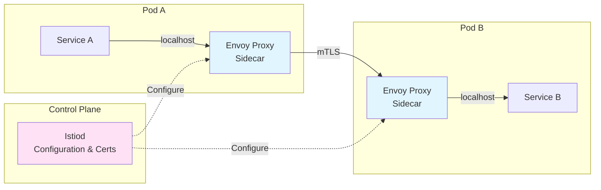
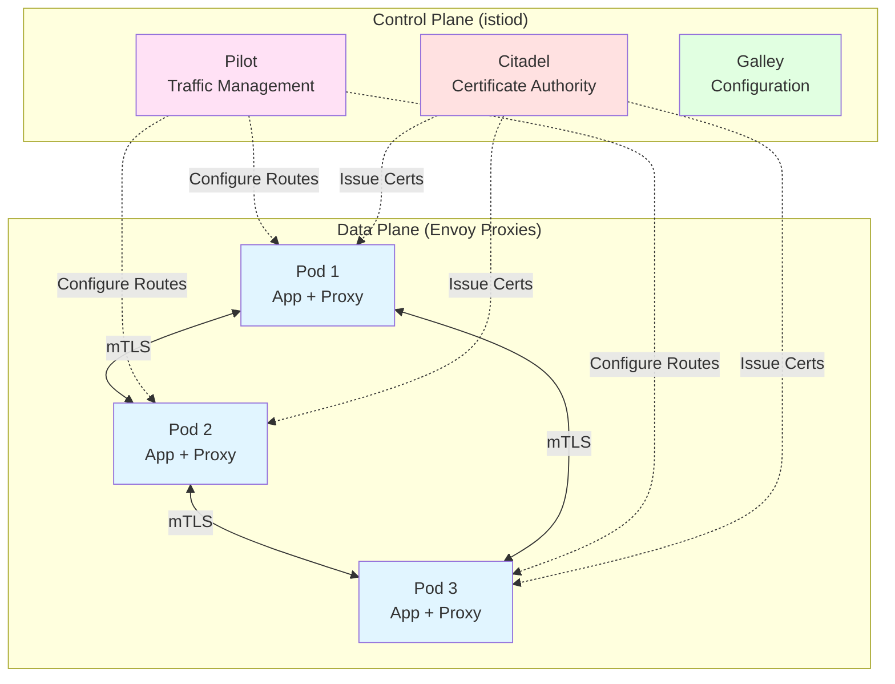
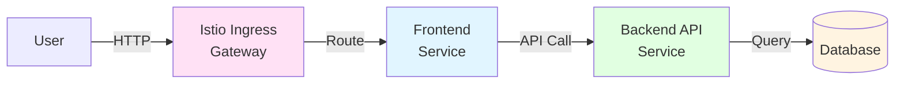

# Tutorial 14: Service Meshes with Istio

Learn how to implement advanced traffic management, security, and observability with Istio service mesh.

## Why This Tutorial Matters

In Tutorial 13, you learned to monitor microservices with Prometheus and Grafana. But as your microservices architecture grows, you face new challenges:

**Without a service mesh:**
- ❌ Each service implements its own retry logic, timeouts, and circuit breakers
- ❌ Service-to-service communication is unencrypted (security risk)
- ❌ Difficult to implement canary deployments or A/B testing
- ❌ No visibility into service-to-service traffic patterns
- ❌ Hard to enforce access policies between services
- ❌ Distributed tracing requires code changes in every service

**With a service mesh:**
- ✅ Automatic retries, timeouts, and circuit breaking (no code changes)
- ✅ Automatic mTLS encryption for all service communication
- ✅ Easy canary deployments and traffic splitting
- ✅ Complete observability with distributed tracing
- ✅ Fine-grained access control policies
- ✅ Advanced load balancing and traffic routing

## What is a Service Mesh?

A **service mesh** is a dedicated infrastructure layer that handles service-to-service communication. It provides:

1. **Traffic Management**: Intelligent routing, load balancing, retries, timeouts
2. **Security**: mTLS encryption, authentication, authorization
3. **Observability**: Distributed tracing, metrics, logging

### How It Works



**Key Concept: Sidecar Pattern**
- Each pod gets an Envoy proxy container automatically injected
- All traffic goes through the sidecar proxy
- Proxies are configured by the Istio control plane
- Your application code doesn't change!

## Learning Objectives

By the end of this tutorial, you will understand:
- Service mesh architecture and the sidecar pattern
- Installing and configuring Istio on Kubernetes
- Automatic mTLS encryption between services
- Traffic management (routing rules, retries, timeouts, circuit breakers)
- Canary deployments and traffic splitting
- Distributed tracing with Jaeger
- Authorization policies and security
- Integrating Istio with existing monitoring (Prometheus/Grafana)

## Prerequisites

- Completed Tutorial 13 (Monitoring with Prometheus and Grafana)
- Kubernetes cluster access
- kubectl configured
- Basic understanding of Kubernetes Services and Deployments

## Quick Start - Try It Now!

Want to see Istio in action immediately? Try our 5-minute demo:

```bash
cd examples

# 1. Install Istio
cd ..
./install-istio.sh

# 2. Enable sidecar injection (use --overwrite if already labeled)
kubectl label namespace default istio-injection=enabled --overwrite

# 3. Deploy the demo
cd examples
kubectl apply -f simple-demo.yaml

# 4. Test traffic splitting (70% v1, 30% v2)
./test-demo.sh 20
```

You'll see Istio automatically:
- ✅ Inject Envoy sidecar proxies into your pods
- ✅ Split traffic 70% to v1, 30% to v2
- ✅ Encrypt all traffic with mTLS
- ✅ Enable distributed tracing

See [examples/README.md](./examples/README.md) for the complete quick start guide with experiments!

---

## Part 1: Understanding Service Mesh Concepts

### The Sidecar Pattern

**Traditional Approach:**
```yaml
apiVersion: v1
kind: Pod
metadata:
  name: my-app
spec:
  containers:
  - name: app
    image: myapp:latest
```

**With Istio (Automatic Sidecar Injection):**
```yaml
apiVersion: v1
kind: Pod
metadata:
  name: my-app
  labels:
    app: my-app
spec:
  containers:
  - name: app
    image: myapp:latest
  - name: istio-proxy  # ← Automatically injected!
    image: istio/proxyv2:1.20.0
```

### Istio Architecture



**Components:**

1. **Data Plane (Envoy Proxies)**
   - Lightweight proxies deployed as sidecars
   - Handle all network traffic
   - Enforce policies and collect telemetry

2. **Control Plane (istiod)**
   - **Pilot**: Distributes traffic rules to proxies
   - **Citadel**: Manages certificates for mTLS
   - **Galley**: Validates and processes configuration

### Traffic Flow Example

```
User Request → Ingress Gateway → Service A Pod
                                  ↓
                         [Service A Container]
                                  ↓
                         [Envoy Sidecar Proxy]
                                  ↓
                         Apply: Retries, Timeouts,
                                Circuit Breaking,
                                Load Balancing
                                  ↓
                         [Envoy Sidecar Proxy] → Service B Container
```

---

## Part 2: Installing Istio

### Step 1: Download Istio

```bash
cd ~
curl -L https://istio.io/downloadIstio | sh -

# Move to the Istio directory
cd istio-1.20.0

# Add istioctl to PATH
export PATH=$PWD/bin:$PATH

# Verify installation
istioctl version
```

### Step 2: Install Istio on Kubernetes

**Install with demo profile** (includes Kiali, Jaeger, Prometheus, Grafana):

```bash
istioctl install --set profile=demo -y
```

**Expected output:**
```
✔ Istio core installed
✔ Istiod installed
✔ Ingress gateways installed
✔ Egress gateways installed
✔ Installation complete
```

**Verify installation:**
```bash
kubectl get pods -n istio-system
```

**Expected pods:**
```
NAME                                    READY   STATUS    RESTARTS   AGE
istio-ingressgateway-xxx                1/1     Running   0          2m
istio-egressgateway-xxx                 1/1     Running   0          2m
istiod-xxx                              1/1     Running   0          2m
```

### Step 3: Enable Automatic Sidecar Injection

Label your namespace to automatically inject Envoy sidecars:

```bash
# Enable for default namespace
kubectl label namespace default istio-injection=enabled --overwrite

# Verify the label
kubectl get namespace -L istio-injection
```

Expected output:
```
NAME              STATUS   AGE   ISTIO-INJECTION
default           Active   10d   enabled
```

**Note:** If you see "namespace/default not labeled", the namespace is already labeled (that's fine!). The `--overwrite` flag ensures the label is set regardless.

**How it works:**
- When you deploy a pod in a labeled namespace, Istio automatically adds the Envoy sidecar
- No changes to your deployment YAML required!

---

## Part 3: Deploying Services with Istio

Let's deploy a simple multi-service application to demonstrate Istio features.

### Application Architecture



### Create Sample Application

**backend-deployment.yaml:**
```yaml
apiVersion: v1
kind: Service
metadata:
  name: backend
  labels:
    app: backend
spec:
  ports:
  - port: 8080
    name: http
  selector:
    app: backend
---
apiVersion: apps/v1
kind: Deployment
metadata:
  name: backend
spec:
  replicas: 2
  selector:
    matchLabels:
      app: backend
  template:
    metadata:
      labels:
        app: backend
        version: v1
    spec:
      containers:
      - name: backend
        image: hashicorp/http-echo
        args:
        - "-text=Backend v1 response"
        ports:
        - containerPort: 5678
```

**frontend-deployment.yaml:**
```yaml
apiVersion: v1
kind: Service
metadata:
  name: frontend
  labels:
    app: frontend
spec:
  ports:
  - port: 8080
    name: http
  selector:
    app: frontend
---
apiVersion: apps/v1
kind: Deployment
metadata:
  name: frontend
spec:
  replicas: 1
  selector:
    matchLabels:
      app: frontend
  template:
    metadata:
      labels:
        app: frontend
    spec:
      containers:
      - name: frontend
        image: curlimages/curl
        command: ["/bin/sh"]
        args:
        - -c
        - |
          while true; do
            echo "Frontend waiting for requests..."
            sleep 3600
          done
```

**Deploy the application:**
```bash
kubectl apply -f backend-deployment.yaml
kubectl apply -f frontend-deployment.yaml

# Verify sidecars were injected
kubectl get pods
```

**You should see 2 containers per pod** (app + istio-proxy):
```
NAME                        READY   STATUS    RESTARTS   AGE
backend-xxx                 2/2     Running   0          1m
frontend-xxx                2/2     Running   0          1m
```

---

## Part 4: Traffic Management

### Virtual Services and Destination Rules

**VirtualService** defines routing rules (where traffic goes)
**DestinationRule** defines policies (how traffic is handled)

### Example 1: Simple Routing

**backend-virtualservice.yaml:**
```yaml
apiVersion: networking.istio.io/v1beta1
kind: VirtualService
metadata:
  name: backend
spec:
  hosts:
  - backend
  http:
  - route:
    - destination:
        host: backend
        port:
          number: 8080
```

### Example 2: Retries and Timeouts

```yaml
apiVersion: networking.istio.io/v1beta1
kind: VirtualService
metadata:
  name: backend
spec:
  hosts:
  - backend
  http:
  - route:
    - destination:
        host: backend
    timeout: 5s
    retries:
      attempts: 3
      perTryTimeout: 2s
      retryOn: 5xx,reset,connect-failure
```

**What this does:**
- Total timeout: 5 seconds
- Retry up to 3 times on errors
- Each retry has 2-second timeout
- Retry on: HTTP 5xx, connection reset, connection failure

### Example 3: Circuit Breaking

**backend-destinationrule.yaml:**
```yaml
apiVersion: networking.istio.io/v1beta1
kind: DestinationRule
metadata:
  name: backend
spec:
  host: backend
  trafficPolicy:
    connectionPool:
      tcp:
        maxConnections: 100
      http:
        http1MaxPendingRequests: 10
        maxRequestsPerConnection: 2
    outlierDetection:
      consecutiveErrors: 5
      interval: 30s
      baseEjectionTime: 60s
      maxEjectionPercent: 50
```

**What this does:**
- Max 100 TCP connections
- Max 10 pending HTTP requests
- If a pod fails 5 times in 30 seconds → eject it for 60 seconds
- Never eject more than 50% of backends

---

## Part 5: Canary Deployments

Deploy a new version (v2) and gradually shift traffic.

### Deploy Backend v2

```yaml
apiVersion: apps/v1
kind: Deployment
metadata:
  name: backend-v2
spec:
  replicas: 1
  selector:
    matchLabels:
      app: backend
      version: v2
  template:
    metadata:
      labels:
        app: backend
        version: v2
    spec:
      containers:
      - name: backend
        image: hashicorp/http-echo
        args:
        - "-text=Backend v2 NEW FEATURE!"
        ports:
        - containerPort: 5678
```

### Traffic Splitting (90% v1, 10% v2)

```yaml
apiVersion: networking.istio.io/v1beta1
kind: VirtualService
metadata:
  name: backend
spec:
  hosts:
  - backend
  http:
  - match:
    - headers:
        x-beta-user:
          exact: "true"
    route:
    - destination:
        host: backend
        subset: v2
      weight: 100
  - route:
    - destination:
        host: backend
        subset: v1
      weight: 90
    - destination:
        host: backend
        subset: v2
      weight: 10
---
apiVersion: networking.istio.io/v1beta1
kind: DestinationRule
metadata:
  name: backend
spec:
  host: backend
  subsets:
  - name: v1
    labels:
      version: v1
  - name: v2
    labels:
      version: v2
```

**What this does:**
- Beta users (header `x-beta-user: true`) → 100% to v2
- Everyone else → 90% to v1, 10% to v2
- Gradually increase v2 weight as confidence grows

**Test it:**
```bash
# Regular user (90% v1, 10% v2)
kubectl exec frontend-xxx -c frontend -- curl backend:8080

# Beta user (100% v2)
kubectl exec frontend-xxx -c frontend -- curl -H "x-beta-user: true" backend:8080
```

---

## Part 6: Security with mTLS

### Enable Strict mTLS

Force all communication to use mutual TLS:

```yaml
apiVersion: security.istio.io/v1beta1
kind: PeerAuthentication
metadata:
  name: default
  namespace: default
spec:
  mtls:
    mode: STRICT
```

**Apply it:**
```bash
kubectl apply -f mtls-strict.yaml
```

**Verify mTLS is enabled:**
```bash
istioctl authn tls-check frontend-xxx.default backend.default.svc.cluster.local
```

**Expected output:**
```
HOST:PORT                              STATUS     SERVER     CLIENT     AUTHN POLICY     DESTINATION RULE
backend.default.svc.cluster.local:8080 OK         mTLS       mTLS       default/         -
```

### Authorization Policies

**Only allow frontend to call backend:**

```yaml
apiVersion: security.istio.io/v1beta1
kind: AuthorizationPolicy
metadata:
  name: backend-policy
  namespace: default
spec:
  selector:
    matchLabels:
      app: backend
  action: ALLOW
  rules:
  - from:
    - source:
        principals: ["cluster.local/ns/default/sa/frontend"]
```

**What this does:**
- Only pods with `frontend` service account can call backend
- All other requests are denied (403 Forbidden)

---

## Part 7: Observability with Kiali and Jaeger

### Install Observability Add-ons

```bash
kubectl apply -f https://raw.githubusercontent.com/istio/istio/release-1.20/samples/addons/kiali.yaml
kubectl apply -f https://raw.githubusercontent.com/istio/istio/release-1.20/samples/addons/jaeger.yaml
kubectl apply -f https://raw.githubusercontent.com/istio/istio/release-1.20/samples/addons/prometheus.yaml
kubectl apply -f https://raw.githubusercontent.com/istio/istio/release-1.20/samples/addons/grafana.yaml
```

### Access Kiali (Service Mesh Dashboard)

```bash
kubectl port-forward -n istio-system svc/kiali 20001:20001
```

Open: http://localhost:20001

**Kiali provides:**
- Service topology graph
- Traffic flow visualization
- Health status
- Configuration validation
- Security policies overview

### Access Jaeger (Distributed Tracing)

```bash
kubectl port-forward -n istio-system svc/tracing 16686:80
```

Open: http://localhost:16686

**Jaeger shows:**
- Request traces across services
- Latency breakdown per service
- Error tracking
- Dependency analysis

### Generate Traffic for Tracing

```bash
# Generate requests
for i in {1..100}; do
  kubectl exec frontend-xxx -c frontend -- curl -s backend:8080
done
```

Then view traces in Jaeger to see:
- Frontend → Backend request flow
- Timing for each hop
- Sidecar proxy overhead

---

## Part 8: Fault Injection for Testing

Test your application's resilience by injecting faults.

### Inject HTTP Delays

```yaml
apiVersion: networking.istio.io/v1beta1
kind: VirtualService
metadata:
  name: backend
spec:
  hosts:
  - backend
  http:
  - fault:
      delay:
        percentage:
          value: 50
        fixedDelay: 5s
    route:
    - destination:
        host: backend
```

**What this does:**
- 50% of requests get a 5-second delay
- Tests timeout handling in frontend

### Inject HTTP Errors

```yaml
apiVersion: networking.istio.io/v1beta1
kind: VirtualService
metadata:
  name: backend
spec:
  hosts:
  - backend
  http:
  - fault:
      abort:
        percentage:
          value: 10
        httpStatus: 500
    route:
    - destination:
        host: backend
```

**What this does:**
- 10% of requests return HTTP 500
- Tests error handling and retry logic

---

## Part 9: Integration with Existing Monitoring

Istio integrates seamlessly with Tutorial 13's Prometheus/Grafana setup.

### Istio Metrics in Prometheus

Istio automatically exports metrics to Prometheus:

```promql
# Request rate by service
rate(istio_requests_total[1m])

# Request duration (p95)
histogram_quantile(0.95,
  sum(rate(istio_request_duration_milliseconds_bucket[1m])) by (le, destination_service)
)

# Error rate
sum(rate(istio_requests_total{response_code=~"5.."}[1m])) by (destination_service)
/ sum(rate(istio_requests_total[1m])) by (destination_service)
```

### Istio Dashboards in Grafana

Import Istio dashboards:

1. Open Grafana: http://localhost:3000
2. Go to **Dashboards** → **Import**
3. Use dashboard ID: **7645** (Istio Service Dashboard)
4. Select Prometheus data source
5. Click **Import**

---

## Part 10: Best Practices

### 1. Start with Permissive Mode

```yaml
apiVersion: security.istio.io/v1beta1
kind: PeerAuthentication
metadata:
  name: default
spec:
  mtls:
    mode: PERMISSIVE  # Allow both mTLS and plain text
```

Then migrate to STRICT once all services are working.

### 2. Use Namespace-Scoped Policies

```yaml
apiVersion: networking.istio.io/v1beta1
kind: VirtualService
metadata:
  name: backend
  namespace: production  # Scoped to namespace
spec:
  hosts:
  - backend.production.svc.cluster.local
```

### 3. Set Resource Limits on Sidecars

```yaml
apiVersion: v1
kind: Namespace
metadata:
  name: default
  annotations:
    # Limit sidecar resources
    sidecar.istio.io/proxyCPU: "100m"
    sidecar.istio.io/proxyMemory: "128Mi"
```

### 4. Monitor Sidecar Overhead

```bash
# Check sidecar resource usage
kubectl top pods

# Compare with and without sidecar
```

**Expected overhead:**
- CPU: 50-100m per sidecar
- Memory: 50-100Mi per sidecar

---

## Summary

### What You Learned

- ✅ **Service mesh fundamentals**: Sidecar pattern, control/data plane architecture
- ✅ **Installing Istio**: istioctl, automatic sidecar injection
- ✅ **Traffic management**: VirtualServices, DestinationRules, retries, timeouts
- ✅ **Advanced deployments**: Canary releases, traffic splitting, A/B testing
- ✅ **Security**: Automatic mTLS, authorization policies
- ✅ **Observability**: Kiali service graph, Jaeger distributed tracing
- ✅ **Fault injection**: Testing resilience with delays and errors
- ✅ **Integration**: Connecting Istio with Prometheus/Grafana

### Key Takeaways

1. **Service mesh moves logic out of application code**
   - Retries, timeouts, circuit breaking → handled by sidecar
   - mTLS encryption → automatic
   - Distributed tracing → no code changes

2. **Progressive rollouts made easy**
   - Deploy new versions without risk
   - Gradually shift traffic based on metrics
   - Rollback instantly if issues occur

3. **Zero-trust security by default**
   - All traffic encrypted with mTLS
   - Fine-grained authorization policies
   - Identity-based access control

4. **Complete observability**
   - Kiali for topology and health
   - Jaeger for distributed traces
   - Prometheus/Grafana for metrics

### When to Use a Service Mesh

**Use Istio when:**
- You have many microservices (10+)
- You need advanced traffic management (canary, A/B testing)
- Security is critical (mTLS, zero-trust)
- You want distributed tracing without code changes

**Don't use Istio when:**
- You have < 5 services (overhead not worth it)
- Simple architecture (Kubernetes Services are enough)
- Limited resources (sidecars consume CPU/memory)

---

## Further Reading

- [Istio Documentation](https://istio.io/latest/docs/)
- [Envoy Proxy Documentation](https://www.envoyproxy.io/docs/)
- [Service Mesh Patterns](https://www.oreilly.com/library/view/istio-up-and/9781492043775/)
- [Kiali Documentation](https://kiali.io/docs/)
- [Jaeger Tracing](https://www.jaegertracing.io/docs/)
