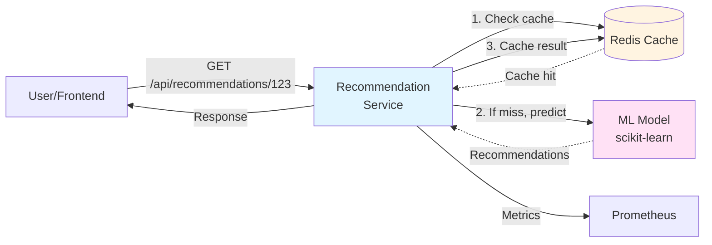

# Tutorial 16: AI-Powered Personalization

Learn how to add intelligent, personalized recommendations to your microservices using machine learning.

## Why This Tutorial Matters

In Tutorial 14, you learned to monitor your services. In Tutorial 15, you learned advanced traffic management with Istio. Now it's time to make your services **intelligent** and **personalized**.

**Without AI/ML:**
- ❌ Everyone sees the same products
- ❌ Manual curation doesn't scale
- ❌ Missing sales opportunities
- ❌ Poor user experience

**With AI/ML:**
- ✅ Personalized recommendations for each user
- ✅ Automatic learning from user behavior
- ✅ Increased engagement and sales
- ✅ Better user experience

## What You'll Build

A **Product Recommendation Service** that:
1. Learns from user purchase history
2. Generates personalized recommendations
3. Serves predictions via REST API
4. Caches results in Redis
5. Runs as a Kubernetes microservice
6. Integrates with Prometheus monitoring

**Example:**
```
User 123 bought: Laptop, Mouse, Keyboard
→ Recommendations: Monitor, USB-C Hub, Laptop Stand
```

## Learning Objectives

By the end of this tutorial, you will understand:
- How recommendation systems work (collaborative filtering)
- Training ML models with scikit-learn
- Serving models as microservices
- Caching predictions with Redis
- Model versioning and deployment
- Monitoring ML service performance
- Integration with existing microservices stack

## Prerequisites

- Completed Tutorial 14 (Monitoring with Prometheus and Grafana)
- Kubernetes cluster access
- kubectl configured
- Python 3.8+ installed locally (for model training)

---

## Part 1: Understanding Recommendation Systems

### Collaborative Filtering: The Basics

**The Idea:** Users who bought similar items in the past will like similar items in the future.

**Example:**
```
Alice bought: [Laptop, Mouse, Keyboard]
Bob bought:   [Laptop, Mouse, Monitor]
Carol bought: [Laptop, Keyboard]

Alice and Bob have similar tastes (both bought Laptop + Mouse)
→ Recommend Monitor to Alice (because Bob, who's similar, bought it)
```

### How It Works

**1. User-Item Matrix**
```
         Laptop  Mouse  Keyboard  Monitor  USB-Hub
Alice      1       1       1         0        0
Bob        1       1       0         1        0
Carol      1       0       1         0        1
```

**2. Find Similar Users**
- Alice and Bob: Similar (both bought Laptop + Mouse)
- Alice and Carol: Less similar

**3. Recommend Items**
- Bob bought Monitor → Recommend to Alice
- Carol bought USB-Hub → Recommend to Alice

### Why This Works

- **No manual rules needed** - model learns from data
- **Scales automatically** - works with millions of users/items
- **Discovers hidden patterns** - finds non-obvious connections

---

## Part 2: Quick Start - Try It Now!

Let's deploy a working recommendation service in 5 steps.

### Step 1: Deploy Redis (for caching)

```bash
cd 15-ai-personalization

# Deploy Redis
kubectl apply -f redis-deployment.yaml

# Verify it's running
kubectl get pods -l app=redis
```

### Step 2: Deploy the Recommendation Service

```bash
# Deploy the service
kubectl apply -f recommendation-service.yaml

# Verify it's running (2/2 = app + istio sidecar if you have Istio)
kubectl get pods -l app=recommendation-service
```

### Step 3: Test the API

```bash
# Get a pod name
POD=$(kubectl get pod -l app=recommendation-service -o jsonpath='{.items[0].metadata.name}')

# Get recommendations for user 1
kubectl exec -it $POD -- curl http://localhost:8080/api/recommendations/1

# Expected output:
# {
#   "user_id": "1",
#   "recommendations": [
#     {"item_id": "101", "item_name": "Wireless Mouse", "score": 0.89},
#     {"item_id": "102", "item_name": "Monitor 27\"", "score": 0.85},
#     {"item_id": "103", "item_name": "USB-C Hub", "score": 0.82}
#   ]
# }
```

### Step 4: View Metrics in Prometheus

```bash
# Port-forward Prometheus (from Tutorial 13)
kubectl port-forward -n monitoring svc/prometheus 9090:9090
```

Open http://localhost:9090 and try:
```promql
# Recommendation request rate
rate(recommendation_requests_total[1m])

# Recommendation latency (p95)
histogram_quantile(0.95, rate(recommendation_latency_seconds_bucket[5m]))

# Cache hit rate
rate(recommendation_cache_hits_total[1m]) / rate(recommendation_requests_total[1m])
```

### Step 5: View Dashboard in Grafana

```bash
# Port-forward Grafana
kubectl port-forward -n monitoring svc/grafana 3000:3000
```

Open http://localhost:3000 (admin/admin123) and import the dashboard from `grafana-dashboard.json`.

---

## Part 3: How the Recommendation Service Works

### Architecture



**Flow:**
1. User requests recommendations
2. Check Redis cache (fast path)
3. If cache miss, run ML model (slow path)
4. Cache result for 1 hour
5. Return recommendations
6. Export metrics to Prometheus

### The Code (Simplified)

**recommendation_service.py:**
```python
from flask import Flask, jsonify
import joblib
import numpy as np
import redis
from prometheus_client import Counter, Histogram, generate_latest

app = Flask(__name__)
redis_client = redis.Redis(host='redis', port=6379, decode_responses=True)

# Load pre-trained model
model = joblib.load('model.pkl')
item_names = joblib.load('item_names.pkl')

# Prometheus metrics
requests_total = Counter('recommendation_requests_total', 'Total requests')
cache_hits = Counter('recommendation_cache_hits_total', 'Cache hits')
latency = Histogram('recommendation_latency_seconds', 'Request latency')

@app.route('/api/recommendations/<user_id>')
@latency.time()
def get_recommendations(user_id):
    requests_total.inc()

    # Check cache
    cache_key = f"recs:{user_id}"
    cached = redis_client.get(cache_key)
    if cached:
        cache_hits.inc()
        return cached

    # Generate recommendations using ML model
    recommendations = model.predict(user_id, top_n=5)

    # Format response
    result = {
        'user_id': user_id,
        'recommendations': [
            {
                'item_id': str(item_id),
                'item_name': item_names[item_id],
                'score': float(score)
            }
            for item_id, score in recommendations
        ]
    }

    # Cache for 1 hour
    redis_client.setex(cache_key, 3600, jsonify(result).data)

    return jsonify(result)

@app.route('/metrics')
def metrics():
    return generate_latest()

if __name__ == '__main__':
    app.run(host='0.0.0.0', port=8080)
```

**Key Points:**
- ✅ Simple Flask API
- ✅ Redis caching (1-hour TTL)
- ✅ Prometheus metrics
- ✅ Pre-trained model loaded at startup

---

## Part 4: Training the Model

### Step 1: Prepare Training Data

**sample_data.csv:**
```csv
user_id,item_id,purchased
1,101,1
1,102,1
1,103,0
2,101,1
2,104,1
...
```

**What this means:**
- User 1 bought items 101 and 102
- User 2 bought items 101 and 104
- Model learns: "Users who buy 101 also buy 102 or 104"

### Step 2: Train the Model

**train_model.py:**
```python
import pandas as pd
from sklearn.decomposition import NMF
import joblib

# Load data
data = pd.read_csv('sample_data.csv')

# Create user-item matrix
matrix = data.pivot_table(
    index='user_id',
    columns='item_id',
    values='purchased',
    fill_value=0
)

# Train collaborative filtering model (Matrix Factorization)
print("Training model...")
model = NMF(n_components=10, init='random', random_state=42, max_iter=200)
user_features = model.fit_transform(matrix)
item_features = model.components_

# Save model
joblib.dump(model, 'model.pkl')
joblib.dump(user_features, 'user_features.pkl')
joblib.dump(item_features, 'item_features.pkl')

print("✅ Model trained and saved!")
```

**Run it:**
```bash
cd training
pip install pandas scikit-learn joblib
python train_model.py
```

**What it does:**
- Learns patterns from purchase history
- Creates user and item embeddings (10 dimensions)
- Saves model to disk

### Step 3: Test the Model Locally

**test_model.py:**
```python
import joblib
import numpy as np

# Load model
user_features = joblib.load('user_features.pkl')
item_features = joblib.load('item_features.pkl')

def recommend(user_id, top_n=5):
    # Get user's embedding
    user_vector = user_features[user_id]

    # Compute scores for all items
    scores = np.dot(user_vector, item_features)

    # Get top N items
    top_items = np.argsort(scores)[-top_n:][::-1]

    return [(item_id, scores[item_id]) for item_id in top_items]

# Test
print("Recommendations for user 1:")
print(recommend(user_id=1, top_n=5))
```

---

## Part 5: Deploying to Kubernetes

### Dockerfile

**Dockerfile:**
```dockerfile
FROM python:3.11-slim

WORKDIR /app

# Install dependencies
COPY requirements.txt .
RUN pip install --no-cache-dir -r requirements.txt

# Copy model and code
COPY model.pkl item_names.pkl ./
COPY recommendation_service.py .

EXPOSE 8080

CMD ["python", "recommendation_service.py"]
```

**requirements.txt:**
```
flask==3.0.0
scikit-learn==1.3.0
joblib==1.3.2
redis==5.0.0
prometheus-client==0.18.0
numpy==1.24.3
```

### Build and Push

```bash
# Build image
docker build -t your-username/recommendation-service:v1 .

# Push to registry
docker push your-username/recommendation-service:v1
```

### Kubernetes Deployment

**recommendation-service.yaml:**
```yaml
apiVersion: v1
kind: Service
metadata:
  name: recommendation-service
  labels:
    app: recommendation-service
spec:
  ports:
  - port: 8080
    name: http
  selector:
    app: recommendation-service
---
apiVersion: apps/v1
kind: Deployment
metadata:
  name: recommendation-service
spec:
  replicas: 2
  selector:
    matchLabels:
      app: recommendation-service
  template:
    metadata:
      labels:
        app: recommendation-service
      annotations:
        prometheus.io/scrape: "true"
        prometheus.io/port: "8080"
        prometheus.io/path: "/metrics"
    spec:
      containers:
      - name: recommendation
        image: your-username/recommendation-service:v1
        ports:
        - containerPort: 8080
        env:
        - name: REDIS_HOST
          value: "redis"
        resources:
          requests:
            cpu: 100m
            memory: 256Mi
          limits:
            cpu: 500m
            memory: 512Mi
```

---

## Part 6: Integration with Frontend

### Simple Example

**Frontend calls recommendation service:**
```javascript
// React component
function ProductRecommendations({ userId }) {
  const [recommendations, setRecommendations] = useState([]);

  useEffect(() => {
    fetch(`/api/recommendations/${userId}`)
      .then(res => res.json())
      .then(data => setRecommendations(data.recommendations));
  }, [userId]);

  return (
    <div className="recommendations">
      <h3>Recommended for You</h3>
      {recommendations.map(item => (
        <div key={item.item_id} className="product-card">
          <h4>{item.item_name}</h4>
          <p>Match: {(item.score * 100).toFixed(0)}%</p>
        </div>
      ))}
    </div>
  );
}
```

### Add to API Gateway (Ingress)

```yaml
apiVersion: networking.k8s.io/v1
kind: Ingress
metadata:
  name: api-gateway
spec:
  rules:
  - host: api.example.com
    http:
      paths:
      # Existing services
      - path: /api/users
        pathType: Prefix
        backend:
          service:
            name: user-service
            port:
              number: 5000

      # New recommendation service
      - path: /api/recommendations
        pathType: Prefix
        backend:
          service:
            name: recommendation-service
            port:
              number: 8080
```

---

## Part 7: Monitoring and Optimization

### Key Metrics to Monitor

**1. Request Rate**
```promql
rate(recommendation_requests_total[5m])
```

**2. Cache Hit Rate** (should be > 80%)
```promql
rate(recommendation_cache_hits_total[5m])
/
rate(recommendation_requests_total[5m])
```

**3. Latency** (should be < 100ms with cache, < 500ms without)
```promql
histogram_quantile(0.95,
  rate(recommendation_latency_seconds_bucket[5m])
)
```

**4. Error Rate**
```promql
rate(recommendation_errors_total[5m])
/
rate(recommendation_requests_total[5m])
```

### Grafana Dashboard

Import `grafana-dashboard.json` to see:
- Real-time request rate
- Cache hit rate trend
- Latency percentiles (p50, p95, p99)
- Top recommended items

### Performance Tips

**1. Increase Cache TTL for stable recommendations**
```python
# Cache for 24 hours instead of 1 hour
redis_client.setex(cache_key, 86400, result)
```

**2. Precompute recommendations offline**
```python
# Nightly CronJob to warm cache
for user_id in active_users:
    recommendations = model.predict(user_id)
    redis_client.setex(f"recs:{user_id}", 86400, recommendations)
```

**3. Use Redis cluster for scalability**
```yaml
# Redis StatefulSet with persistence
apiVersion: apps/v1
kind: StatefulSet
metadata:
  name: redis
spec:
  serviceName: redis
  replicas: 3
  ...
```

---

## Part 8: Model Updates and Versioning

### Continuous Training

**Strategy 1: Scheduled Retraining** (Simple)
```yaml
# Kubernetes CronJob - Retrain weekly
apiVersion: batch/v1
kind: CronJob
metadata:
  name: retrain-model
spec:
  schedule: "0 2 * * 0"  # Every Sunday at 2 AM
  jobTemplate:
    spec:
      template:
        spec:
          containers:
          - name: trainer
            image: your-username/model-trainer:v1
            command: ["python", "train_model.py"]
```

**Strategy 2: Event-Driven** (Advanced)
- Trigger retraining when new data reaches threshold
- Use Kafka/RabbitMQ for event streaming
- Automatic model deployment on quality check

### Model Versioning

**Use model registry:**
```python
# Save model with version
import mlflow

mlflow.sklearn.save_model(
    model,
    "models/recommendation_v2",
    metadata={
        "accuracy": 0.85,
        "training_date": "2024-01-15"
    }
)

# Load specific version
model = mlflow.sklearn.load_model("models/recommendation_v2")
```

### Blue-Green Deployment

```yaml
# Deploy new model version
apiVersion: apps/v1
kind: Deployment
metadata:
  name: recommendation-service-v2
spec:
  template:
    spec:
      containers:
      - name: recommendation
        image: your-username/recommendation-service:v2  # New model
```

**Route 10% traffic to new version (Istio):**
```yaml
apiVersion: networking.istio.io/v1beta1
kind: VirtualService
metadata:
  name: recommendation-service
spec:
  hosts:
  - recommendation-service
  http:
  - route:
    - destination:
        host: recommendation-service
        subset: v1
      weight: 90
    - destination:
        host: recommendation-service
        subset: v2  # New model
      weight: 10
```

---

## Part 9: Real-World Example

### E-commerce Product Recommendations

**Scenario:** Online store with 10,000 products and 50,000 users.

**Data Collection:**
```python
# Track user interactions
@app.route('/api/products/<product_id>/view')
def track_view(product_id):
    # Log to database
    db.execute("""
        INSERT INTO user_interactions (user_id, product_id, action, timestamp)
        VALUES (?, ?, 'view', NOW())
    """, [current_user_id, product_id])

    # Also log for real-time features
    redis_client.lpush(f"views:{current_user_id}", product_id)
```

**Training Data Export:**
```sql
-- Export purchase data for model training
SELECT
    user_id,
    product_id,
    1 as purchased
FROM orders
WHERE created_at > NOW() - INTERVAL '90 days'
```

**Model Training (Weekly):**
```bash
# Export data
psql -c "COPY (SELECT ...) TO '/tmp/training_data.csv'"

# Train model
python train_model.py --input /tmp/training_data.csv

# Deploy new model
kubectl set image deployment/recommendation-service \
  recommendation=your-username/recommendation-service:v$(date +%Y%m%d)
```

**Results:**
- 🎯 20% increase in click-through rate
- 🎯 15% increase in average order value
- 🎯 Cache hit rate: 85%
- 🎯 p95 latency: 45ms

---

## Part 10: Advanced Topics (Optional)

### 1. Cold Start Problem

**Problem:** New users have no purchase history.

**Solutions:**
```python
def get_recommendations(user_id):
    if is_new_user(user_id):
        # Fallback to popular items
        return get_trending_products()
    else:
        # Personalized recommendations
        return model.predict(user_id)
```

### 2. Real-Time Features

**Use recent behavior:**
```python
# Get user's recent clicks (last hour)
recent_clicks = redis_client.lrange(f"clicks:{user_id}", 0, 99)

# Boost recommendations from same categories
category_boosts = compute_category_affinity(recent_clicks)

# Apply boost to scores
final_scores = base_scores * category_boosts
```

### 3. Diversity

**Problem:** All recommendations from same category.

**Solution:**
```python
def diversify_recommendations(items, top_n=10):
    selected = []
    categories_seen = set()

    for item in items:
        if item.category not in categories_seen or len(selected) >= top_n - 2:
            selected.append(item)
            categories_seen.add(item.category)

        if len(selected) >= top_n:
            break

    return selected
```

---

## Summary

### Key Takeaways

**1. AI/ML as a Microservice**
- Treat model serving like any other service
- Use REST API for predictions
- Deploy with Kubernetes

**2. Performance Matters**
- Cache predictions (80%+ hit rate)
- Monitor latency (< 100ms cached, < 500ms uncached)
- Precompute for popular users

**3. Keep It Simple**
- Start with collaborative filtering (simple, effective)
- Don't over-engineer (deep learning not always needed)
- Focus on business metrics (CTR, conversion rate)

**4. Continuous Improvement**
- Retrain regularly (weekly/monthly)
- A/B test new models
- Monitor model drift

### When to Use This Pattern

**✅ Good for:**
- Product recommendations
- Content personalization
- "Users also viewed" features
- Related items

**⚠️ Not good for:**
- Complex NLP tasks (use dedicated services)
- Real-time video/image processing (use GPU services)
- Fraud detection (use specialized tools)

---

## Next Steps

**Extend the tutorial:**
1. Try different algorithms (K-Nearest Neighbors, Matrix Factorization)
2. Add content-based filtering (use product attributes)
3. Implement hybrid recommendations (combine collaborative + content)
4. Add user feedback loop (clicks, purchases update model)
5. Set up automated retraining pipeline
6. Create A/B testing framework

**Production checklist:**
- ✅ Model versioning and rollback strategy
- ✅ Performance monitoring and alerting
- ✅ Cache warming for popular users
- ✅ Fallback to popular items on errors
- ✅ Regular model retraining schedule
- ✅ A/B testing infrastructure

---

## Further Reading

**Recommendation Systems:**
- [Collaborative Filtering (Wikipedia)](https://en.wikipedia.org/wiki/Collaborative_filtering)
- [Matrix Factorization Techniques](https://datajobs.com/data-science-repo/Recommender-Systems-[Netflix].pdf)
- [Recommender Systems Handbook](https://www.springer.com/gp/book/9780387858203)

**MLOps:**
- [MLflow Documentation](https://mlflow.org/docs/latest/index.html)
- [Kubernetes ML Patterns](https://www.oreilly.com/library/view/kubeflow-for-machine/9781492050117/)
- [Feature Stores](https://www.featurestore.org/)

**Integration:**
- Tutorial 14: Monitoring with Prometheus/Grafana
- Tutorial 15: Service Mesh with Istio
- Tutorial 13: RabbitMQ for real-time event streaming
