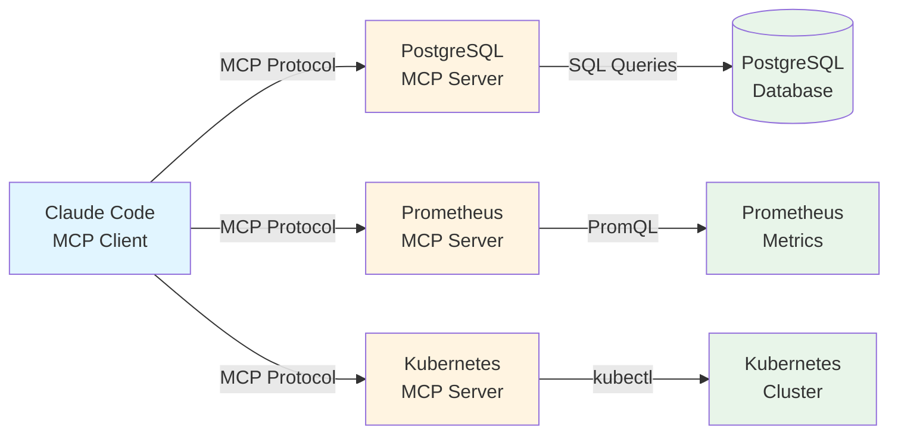
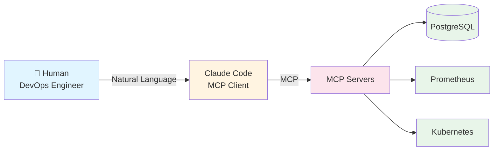
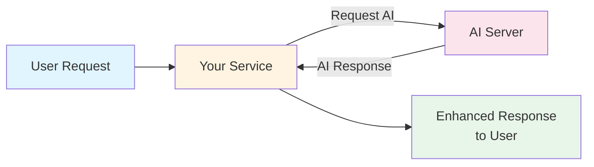

# Tutorial 16: MCP - Connecting AI to Your Microservices

Learn how to build Model Context Protocol (MCP) servers that make your entire microservices platform accessible to AI assistants like Claude Code.

## What You'll Learn

- **MCP fundamentals**: Understand the Model Context Protocol and why it matters
- **Building MCP servers**: Create servers that expose your services to AI
- **Integration patterns**: Connect MCP to PostgreSQL, Prometheus, and Kubernetes
- **Real-world workflows**: Use Claude to query databases, check metrics, and debug issues
- **Production practices**: Security, authentication, and error handling

## Prerequisites

- Completed Tutorial 8 (PostgreSQL)
- Completed Tutorial 13 (Prometheus monitoring)
- Python 3.10+ installed
- Claude Code or another MCP client

## What is MCP?

The **Model Context Protocol (MCP)** is an open protocol created by Anthropic that standardizes how AI assistants connect to data sources and tools.

### The Problem

Before MCP, integrating AI with your systems required:
- Custom APIs for each tool
- Different authentication mechanisms
- Inconsistent data formats
- No standardization across AI platforms

### The Solution

MCP provides a universal protocol where:
- AI assistants can discover available tools and data
- Servers expose capabilities in a standard format
- One integration works with any MCP-compatible AI
- Security and permissions are built-in

### How MCP Works



**Key concepts:**

1. **MCP Client**: AI assistant (like Claude Code) that uses MCP servers
2. **MCP Server**: Your code that exposes tools, resources, and prompts
3. **Tools**: Functions the AI can call (e.g., `query_database()`)
4. **Resources**: Data the AI can read (e.g., schema information)
5. **Prompts**: Pre-configured prompt templates

### MCP vs REST APIs

| Feature | REST API | MCP |
|---------|----------|-----|
| Discovery | Manual (OpenAPI docs) | Automatic (protocol built-in) |
| AI Integration | Custom per tool | Standardized |
| Authentication | Various methods | Built-in patterns |
| Use Case | General web services | AI-to-system integration |

## Scope of This Tutorial: Platform Operations

**This tutorial focuses on using MCP for platform operations** - helping humans (DevOps engineers, developers) interact with their infrastructure using AI.

### What We're Building



**Use cases covered:**
- ✅ DevOps monitoring and debugging
- ✅ Querying databases with natural language
- ✅ Analyzing Prometheus metrics
- ✅ Checking Kubernetes pod status
- ✅ Troubleshooting production issues
- ✅ One-off queries and analysis

**Operations:**
- 🔒 Read-only (queries, logs, metrics)
- 👤 Human-initiated via Claude Code
- 🎯 Understanding and operating the platform

### What We're NOT Building (See Tutorial 17)

**Dynamic AI-powered services** where services themselves call AI at runtime:



**Examples (Tutorial 17):**
- ❌ Content generation in a blog service
- ❌ Real-time content moderation
- ❌ Dynamic pricing calculations
- ❌ Natural language query interfaces for users
- ❌ AI-powered routing decisions

**Key difference:**
- **Tutorial 16 (this)**: Humans use AI to operate the platform
- **Tutorial 17 (next)**: Services use AI to enhance their features

If you want to make your services more intelligent at runtime (not just monitor them), continue to Tutorial 17 after completing this one.

---

## Part 1: Your First MCP Server

Let's build a simple MCP server that connects Claude to your PostgreSQL database from Tutorial 8.

### Install MCP SDK

```bash
cd servers/postgres-mcp
pip install mcp
```

### Create PostgreSQL MCP Server

Create `postgres_server.py`:

```python
#!/usr/bin/env python3
"""
PostgreSQL MCP Server - Query your database with AI

This MCP server allows Claude to execute read-only SQL queries
against your PostgreSQL database from Tutorial 8.
"""

import asyncio
import os
from mcp.server import Server
from mcp.server.stdio import stdio_server
from mcp.types import Tool, TextContent
import psycopg2
from psycopg2.extras import RealDictCursor

# Database configuration
DB_CONFIG = {
    'host': os.getenv('DB_HOST', 'localhost'),
    'port': int(os.getenv('DB_PORT', 5432)),
    'database': os.getenv('DB_NAME', 'tododb'),
    'user': os.getenv('DB_USER', 'postgres'),
    'password': os.getenv('DB_PASSWORD', 'postgres')
}

# Create MCP server instance
app = Server("postgres-mcp")

def execute_query(sql: str):
    """Execute a read-only SQL query"""
    # Security: only allow SELECT statements
    sql_upper = sql.strip().upper()
    if not sql_upper.startswith('SELECT'):
        return {"error": "Only SELECT queries are allowed"}

    try:
        conn = psycopg2.connect(**DB_CONFIG)
        cursor = conn.cursor(cursor_factory=RealDictCursor)

        cursor.execute(sql)
        results = cursor.fetchall()

        cursor.close()
        conn.close()

        return {
            "success": True,
            "rows": len(results),
            "data": [dict(row) for row in results]
        }
    except Exception as e:
        return {
            "success": False,
            "error": str(e)
        }

@app.list_tools()
async def list_tools() -> list[Tool]:
    """List available tools"""
    return [
        Tool(
            name="query_database",
            description="Execute a read-only SQL query against PostgreSQL. Only SELECT statements are allowed.",
            inputSchema={
                "type": "object",
                "properties": {
                    "sql": {
                        "type": "string",
                        "description": "SQL SELECT query to execute"
                    }
                },
                "required": ["sql"]
            }
        ),
        Tool(
            name="list_tables",
            description="List all tables in the database",
            inputSchema={
                "type": "object",
                "properties": {}
            }
        ),
        Tool(
            name="describe_table",
            description="Show the schema of a specific table",
            inputSchema={
                "type": "object",
                "properties": {
                    "table_name": {
                        "type": "string",
                        "description": "Name of the table to describe"
                    }
                },
                "required": ["table_name"]
            }
        )
    ]

@app.call_tool()
async def call_tool(name: str, arguments: dict) -> list[TextContent]:
    """Handle tool calls"""

    if name == "query_database":
        sql = arguments.get("sql", "")
        result = execute_query(sql)
        return [TextContent(
            type="text",
            text=f"Query Results:\n{result}"
        )]

    elif name == "list_tables":
        sql = """
            SELECT table_name
            FROM information_schema.tables
            WHERE table_schema = 'public'
            ORDER BY table_name
        """
        result = execute_query(sql)
        tables = [row['table_name'] for row in result.get('data', [])]
        return [TextContent(
            type="text",
            text=f"Tables in database:\n" + "\n".join(f"  - {t}" for t in tables)
        )]

    elif name == "describe_table":
        table_name = arguments.get("table_name", "")
        sql = f"""
            SELECT column_name, data_type, is_nullable
            FROM information_schema.columns
            WHERE table_name = '{table_name}'
            ORDER BY ordinal_position
        """
        result = execute_query(sql)
        if result.get('success'):
            schema = "\n".join(
                f"  {row['column_name']}: {row['data_type']} ({'NULL' if row['is_nullable'] == 'YES' else 'NOT NULL'})"
                for row in result.get('data', [])
            )
            return [TextContent(
                type="text",
                text=f"Schema for table '{table_name}':\n{schema}"
            )]
        else:
            return [TextContent(
                type="text",
                text=f"Error: {result.get('error')}"
            )]

    return [TextContent(
        type="text",
        text=f"Unknown tool: {name}"
    )]

async def main():
    """Run the MCP server"""
    async with stdio_server() as (read_stream, write_stream):
        await app.run(
            read_stream,
            write_stream,
            app.create_initialization_options()
        )

if __name__ == "__main__":
    asyncio.run(main())
```

### Create requirements.txt

```bash
cat > requirements.txt << EOF
mcp>=0.9.0
psycopg2-binary>=2.9.9
EOF
```

### Test the Server

```bash
# Install dependencies
pip install -r requirements.txt

# Set database credentials
export DB_HOST=localhost
export DB_PORT=5432
export DB_NAME=tododb
export DB_USER=postgres
export DB_PASSWORD=postgres

# Run the server (it communicates via stdio)
python postgres_server.py
```

## Part 2: Configuring Claude Code

To use your MCP server with Claude Code, add it to your configuration.

### Create MCP Configuration

For **Claude Code**, create or edit `~/.config/claude-code/mcp_settings.json`:

```json
{
  "mcpServers": {
    "postgres": {
      "command": "python3",
      "args": [
        "/path/to/m7011e/16-mcp/servers/postgres-mcp/postgres_server.py"
      ],
      "env": {
        "DB_HOST": "localhost",
        "DB_PORT": "5432",
        "DB_NAME": "tododb",
        "DB_USER": "postgres",
        "DB_PASSWORD": "postgres"
      }
    }
  }
}
```

**Important**: Replace `/path/to/m7011e` with your actual path.

### Restart Claude Code

After adding the configuration, restart Claude Code. The MCP server will be available.

### Test with Claude

Now you can ask Claude things like:

- "What tables are in my database?"
- "Show me all todos"
- "How many users have completed todos?"
- "Find the most active user"

Claude will automatically use the MCP tools to query your database!

## Part 3: Prometheus Metrics MCP Server

Let's build another MCP server that lets Claude query your Prometheus metrics from Tutorial 13.

### Create Prometheus MCP Server

Create `servers/prometheus-mcp/prometheus_server.py`:

```python
#!/usr/bin/env python3
"""
Prometheus MCP Server - Query metrics with AI

This MCP server allows Claude to query Prometheus metrics,
check service health, and analyze performance.
"""

import asyncio
import os
import requests
from datetime import datetime, timedelta
from mcp.server import Server
from mcp.server.stdio import stdio_server
from mcp.types import Tool, TextContent

# Prometheus configuration
PROMETHEUS_URL = os.getenv('PROMETHEUS_URL', 'http://localhost:9090')

app = Server("prometheus-mcp")

def query_prometheus(query: str, time_range: str = "5m"):
    """Execute a PromQL query"""
    try:
        url = f"{PROMETHEUS_URL}/api/v1/query"
        params = {'query': query}

        response = requests.get(url, params=params, timeout=10)
        response.raise_for_status()

        data = response.json()

        if data['status'] == 'success':
            return {
                "success": True,
                "result": data['data']['result']
            }
        else:
            return {
                "success": False,
                "error": data.get('error', 'Unknown error')
            }
    except Exception as e:
        return {
            "success": False,
            "error": str(e)
        }

def query_prometheus_range(query: str, duration: str = "1h"):
    """Execute a PromQL range query"""
    try:
        url = f"{PROMETHEUS_URL}/api/v1/query_range"

        end = datetime.now()
        if duration.endswith('h'):
            hours = int(duration[:-1])
            start = end - timedelta(hours=hours)
        elif duration.endswith('m'):
            minutes = int(duration[:-1])
            start = end - timedelta(minutes=minutes)
        else:
            start = end - timedelta(hours=1)

        params = {
            'query': query,
            'start': start.timestamp(),
            'end': end.timestamp(),
            'step': '30s'
        }

        response = requests.get(url, params=params, timeout=10)
        response.raise_for_status()

        data = response.json()

        if data['status'] == 'success':
            return {
                "success": True,
                "result": data['data']['result']
            }
        else:
            return {
                "success": False,
                "error": data.get('error', 'Unknown error')
            }
    except Exception as e:
        return {
            "success": False,
            "error": str(e)
        }

@app.list_tools()
async def list_tools() -> list[Tool]:
    """List available tools"""
    return [
        Tool(
            name="query_metrics",
            description="Execute a PromQL query to get current metric values",
            inputSchema={
                "type": "object",
                "properties": {
                    "query": {
                        "type": "string",
                        "description": "PromQL query (e.g., 'up', 'rate(http_requests_total[5m])')"
                    }
                },
                "required": ["query"]
            }
        ),
        Tool(
            name="query_metrics_range",
            description="Execute a PromQL range query to get metrics over time",
            inputSchema={
                "type": "object",
                "properties": {
                    "query": {
                        "type": "string",
                        "description": "PromQL query"
                    },
                    "duration": {
                        "type": "string",
                        "description": "Time range (e.g., '1h', '30m', '24h')",
                        "default": "1h"
                    }
                },
                "required": ["query"]
            }
        ),
        Tool(
            name="check_service_health",
            description="Check if a service is healthy (up metric = 1)",
            inputSchema={
                "type": "object",
                "properties": {
                    "service": {
                        "type": "string",
                        "description": "Service name to check"
                    }
                },
                "required": ["service"]
            }
        ),
        Tool(
            name="get_error_rate",
            description="Get the error rate for a service over the last 5 minutes",
            inputSchema={
                "type": "object",
                "properties": {
                    "service": {
                        "type": "string",
                        "description": "Service name"
                    }
                },
                "required": ["service"]
            }
        )
    ]

@app.call_tool()
async def call_tool(name: str, arguments: dict) -> list[TextContent]:
    """Handle tool calls"""

    if name == "query_metrics":
        query = arguments.get("query", "")
        result = query_prometheus(query)

        if result.get('success'):
            metrics = result.get('result', [])
            if metrics:
                output = "Metrics:\n"
                for metric in metrics:
                    labels = metric.get('metric', {})
                    value = metric.get('value', [None, None])[1]
                    output += f"  {labels}: {value}\n"
            else:
                output = "No metrics found"
        else:
            output = f"Error: {result.get('error')}"

        return [TextContent(type="text", text=output)]

    elif name == "query_metrics_range":
        query = arguments.get("query", "")
        duration = arguments.get("duration", "1h")
        result = query_prometheus_range(query, duration)

        if result.get('success'):
            metrics = result.get('result', [])
            if metrics:
                output = f"Metrics over {duration}:\n"
                for metric in metrics:
                    labels = metric.get('metric', {})
                    values = metric.get('values', [])
                    output += f"  {labels}: {len(values)} data points\n"
                    if values:
                        latest = values[-1][1]
                        output += f"    Latest value: {latest}\n"
            else:
                output = "No metrics found"
        else:
            output = f"Error: {result.get('error')}"

        return [TextContent(type="text", text=output)]

    elif name == "check_service_health":
        service = arguments.get("service", "")
        query = f'up{{job="{service}"}}'
        result = query_prometheus(query)

        if result.get('success'):
            metrics = result.get('result', [])
            if metrics:
                value = metrics[0].get('value', [None, None])[1]
                if value == '1':
                    output = f"✅ Service '{service}' is UP"
                else:
                    output = f"❌ Service '{service}' is DOWN"
            else:
                output = f"⚠️ Service '{service}' not found"
        else:
            output = f"Error: {result.get('error')}"

        return [TextContent(type="text", text=output)]

    elif name == "get_error_rate":
        service = arguments.get("service", "")
        query = f'rate(http_requests_total{{job="{service}",status=~"5.."}}[5m])'
        result = query_prometheus(query)

        if result.get('success'):
            metrics = result.get('result', [])
            if metrics:
                value = float(metrics[0].get('value', [None, 0])[1])
                output = f"Error rate for '{service}': {value:.4f} errors/sec"
            else:
                output = f"No errors for '{service}' (or service not found)"
        else:
            output = f"Error: {result.get('error')}"

        return [TextContent(type="text", text=output)]

    return [TextContent(type="text", text=f"Unknown tool: {name}")]

async def main():
    """Run the MCP server"""
    async with stdio_server() as (read_stream, write_stream):
        await app.run(
            read_stream,
            write_stream,
            app.create_initialization_options()
        )

if __name__ == "__main__":
    asyncio.run(main())
```

### Create requirements.txt

```bash
cd servers/prometheus-mcp
cat > requirements.txt << EOF
mcp>=0.9.0
requests>=2.31.0
EOF
```

### Add to Claude Code Configuration

Update `~/.config/claude-code/mcp_settings.json`:

```json
{
  "mcpServers": {
    "postgres": {
      "command": "python3",
      "args": ["/path/to/16-mcp/servers/postgres-mcp/postgres_server.py"],
      "env": {
        "DB_HOST": "localhost",
        "DB_PORT": "5432",
        "DB_NAME": "tododb",
        "DB_USER": "postgres",
        "DB_PASSWORD": "postgres"
      }
    },
    "prometheus": {
      "command": "python3",
      "args": ["/path/to/16-mcp/servers/prometheus-mcp/prometheus_server.py"],
      "env": {
        "PROMETHEUS_URL": "http://localhost:9090"
      }
    }
  }
}
```

### Test with Claude

Restart Claude Code and try:

- "What metrics are available?"
- "Is the user-service healthy?"
- "What's the error rate for the API?"
- "Show me the request rate over the last hour"

## Part 4: Kubernetes MCP Server

Create an MCP server for querying Kubernetes resources.

### Create Kubernetes MCP Server

Create `servers/kubernetes-mcp/kubernetes_server.py`:

```python
#!/usr/bin/env python3
"""
Kubernetes MCP Server - Manage K8s resources with AI

This MCP server allows Claude to query Kubernetes resources,
check pod status, view logs, and more.
"""

import asyncio
import subprocess
import json
from mcp.server import Server
from mcp.server.stdio import stdio_server
from mcp.types import Tool, TextContent

app = Server("kubernetes-mcp")

def run_kubectl(args: list[str]):
    """Execute kubectl command"""
    try:
        cmd = ['kubectl'] + args
        result = subprocess.run(
            cmd,
            capture_output=True,
            text=True,
            timeout=30
        )

        if result.returncode == 0:
            return {
                "success": True,
                "output": result.stdout
            }
        else:
            return {
                "success": False,
                "error": result.stderr
            }
    except Exception as e:
        return {
            "success": False,
            "error": str(e)
        }

@app.list_tools()
async def list_tools() -> list[Tool]:
    """List available tools"""
    return [
        Tool(
            name="get_pods",
            description="List all pods in a namespace",
            inputSchema={
                "type": "object",
                "properties": {
                    "namespace": {
                        "type": "string",
                        "description": "Namespace (default: default)",
                        "default": "default"
                    }
                }
            }
        ),
        Tool(
            name="get_pod_logs",
            description="Get logs from a specific pod",
            inputSchema={
                "type": "object",
                "properties": {
                    "pod_name": {
                        "type": "string",
                        "description": "Name of the pod"
                    },
                    "namespace": {
                        "type": "string",
                        "description": "Namespace (default: default)",
                        "default": "default"
                    },
                    "tail": {
                        "type": "integer",
                        "description": "Number of lines to show (default: 50)",
                        "default": 50
                    }
                },
                "required": ["pod_name"]
            }
        ),
        Tool(
            name="describe_pod",
            description="Get detailed information about a pod",
            inputSchema={
                "type": "object",
                "properties": {
                    "pod_name": {
                        "type": "string",
                        "description": "Name of the pod"
                    },
                    "namespace": {
                        "type": "string",
                        "description": "Namespace (default: default)",
                        "default": "default"
                    }
                },
                "required": ["pod_name"]
            }
        ),
        Tool(
            name="get_services",
            description="List all services in a namespace",
            inputSchema={
                "type": "object",
                "properties": {
                    "namespace": {
                        "type": "string",
                        "description": "Namespace (default: default)",
                        "default": "default"
                    }
                }
            }
        ),
        Tool(
            name="get_deployments",
            description="List all deployments in a namespace",
            inputSchema={
                "type": "object",
                "properties": {
                    "namespace": {
                        "type": "string",
                        "description": "Namespace (default: default)",
                        "default": "default"
                    }
                }
            }
        )
    ]

@app.call_tool()
async def call_tool(name: str, arguments: dict) -> list[TextContent]:
    """Handle tool calls"""

    if name == "get_pods":
        namespace = arguments.get("namespace", "default")
        result = run_kubectl(['get', 'pods', '-n', namespace, '-o', 'wide'])

        if result.get('success'):
            output = f"Pods in namespace '{namespace}':\n{result.get('output')}"
        else:
            output = f"Error: {result.get('error')}"

        return [TextContent(type="text", text=output)]

    elif name == "get_pod_logs":
        pod_name = arguments.get("pod_name", "")
        namespace = arguments.get("namespace", "default")
        tail = arguments.get("tail", 50)

        result = run_kubectl([
            'logs',
            pod_name,
            '-n', namespace,
            '--tail', str(tail)
        ])

        if result.get('success'):
            output = f"Logs for pod '{pod_name}':\n{result.get('output')}"
        else:
            output = f"Error: {result.get('error')}"

        return [TextContent(type="text", text=output)]

    elif name == "describe_pod":
        pod_name = arguments.get("pod_name", "")
        namespace = arguments.get("namespace", "default")

        result = run_kubectl(['describe', 'pod', pod_name, '-n', namespace])

        if result.get('success'):
            output = f"Description of pod '{pod_name}':\n{result.get('output')}"
        else:
            output = f"Error: {result.get('error')}"

        return [TextContent(type="text", text=output)]

    elif name == "get_services":
        namespace = arguments.get("namespace", "default")
        result = run_kubectl(['get', 'services', '-n', namespace, '-o', 'wide'])

        if result.get('success'):
            output = f"Services in namespace '{namespace}':\n{result.get('output')}"
        else:
            output = f"Error: {result.get('error')}"

        return [TextContent(type="text", text=output)]

    elif name == "get_deployments":
        namespace = arguments.get("namespace", "default")
        result = run_kubectl(['get', 'deployments', '-n', namespace, '-o', 'wide'])

        if result.get('success'):
            output = f"Deployments in namespace '{namespace}':\n{result.get('output')}"
        else:
            output = f"Error: {result.get('error')}"

        return [TextContent(type="text", text=output)]

    return [TextContent(type="text", text=f"Unknown tool: {name}")]

async def main():
    """Run the MCP server"""
    async with stdio_server() as (read_stream, write_stream):
        await app.run(
            read_stream,
            write_stream,
            app.create_initialization_options()
        )

if __name__ == "__main__":
    asyncio.run(main())
```

### Create requirements.txt

```bash
cd servers/kubernetes-mcp
cat > requirements.txt << EOF
mcp>=0.9.0
EOF
```

### Add to Configuration

Update `~/.config/claude-code/mcp_settings.json`:

```json
{
  "mcpServers": {
    "postgres": {
      "command": "python3",
      "args": ["/path/to/16-mcp/servers/postgres-mcp/postgres_server.py"],
      "env": {
        "DB_HOST": "localhost",
        "DB_PORT": "5432",
        "DB_NAME": "tododb",
        "DB_USER": "postgres",
        "DB_PASSWORD": "postgres"
      }
    },
    "prometheus": {
      "command": "python3",
      "args": ["/path/to/16-mcp/servers/prometheus-mcp/prometheus_server.py"],
      "env": {
        "PROMETHEUS_URL": "http://localhost:9090"
      }
    },
    "kubernetes": {
      "command": "python3",
      "args": ["/path/to/16-mcp/servers/kubernetes-mcp/kubernetes_server.py"]
    }
  }
}
```

### Test with Claude

Restart Claude Code and try:

- "What pods are running?"
- "Show me logs for the postgres pod"
- "Describe the user-service deployment"
- "Are there any failing pods?"

## Part 5: Real-World Use Cases

Now that you have all three MCP servers running, you can do powerful things with Claude:

### 1. Debugging Production Issues

**You:** "Why is the user-service slow?"

**Claude (using MCP):**
1. Checks Prometheus metrics: `query_metrics_range("rate(http_request_duration_seconds[5m])", "1h")`
2. Checks pod status: `get_pods(namespace="default")`
3. Gets recent logs: `get_pod_logs(pod_name="user-service-xxx", tail=100)`
4. Queries database: `query_database("SELECT COUNT(*) FROM users")`

**Response:** "The user-service has high latency (500ms p95). Pod logs show connection pool exhaustion. Database has 50,000 users. Recommendation: Increase connection pool size."

### 2. Performance Analysis

**You:** "Which service has the highest error rate?"

**Claude:**
1. Queries Prometheus for all services: `query_metrics("rate(http_requests_total{status=~'5..'}[5m])")`
2. Compares error rates
3. Gets logs from failing service

### 3. Data Analysis

**You:** "What percentage of users have completed todos?"

**Claude:**
1. Queries database for total users
2. Queries database for users with completed todos
3. Calculates percentage

### 4. Capacity Planning

**You:** "How much has traffic grown in the last 24 hours?"

**Claude:**
1. Queries metrics range: `query_metrics_range("rate(http_requests_total[5m])", "24h")`
2. Compares first and last values
3. Calculates growth percentage

## Part 6: Security Best Practices

### 1. Read-Only Access

Always enforce read-only operations in production:

```python
# PostgreSQL: Only allow SELECT
if not sql.strip().upper().startswith('SELECT'):
    return {"error": "Only SELECT queries are allowed"}

# Kubernetes: Only allow get/describe/logs
ALLOWED_COMMANDS = ['get', 'describe', 'logs', 'top']
if kubectl_command not in ALLOWED_COMMANDS:
    return {"error": f"Command '{kubectl_command}' not allowed"}
```

### 2. Authentication

Use Kubernetes RBAC for the kubernetes-mcp server:

```yaml
# Create a read-only service account
apiVersion: v1
kind: ServiceAccount
metadata:
  name: mcp-reader

---
apiVersion: rbac.authorization.k8s.io/v1
kind: ClusterRole
metadata:
  name: mcp-read-only
rules:
- apiGroups: [""]
  resources: ["pods", "services", "deployments"]
  verbs: ["get", "list"]
- apiGroups: [""]
  resources: ["pods/log"]
  verbs: ["get"]

---
apiVersion: rbac.authorization.k8s.io/v1
kind: ClusterRoleBinding
metadata:
  name: mcp-reader-binding
subjects:
- kind: ServiceAccount
  name: mcp-reader
  namespace: default
roleRef:
  kind: ClusterRole
  name: mcp-read-only
  apiGroup: rbac.authorization.k8s.io
```

### 3. Secrets Management

Never hardcode credentials. Use environment variables or secret management:

```python
# Good
DB_PASSWORD = os.getenv('DB_PASSWORD')

# Bad
DB_PASSWORD = "postgres"  # Never do this!
```

### 4. Rate Limiting

Implement rate limiting to prevent abuse:

```python
from time import time
from collections import defaultdict

# Simple rate limiter
rate_limits = defaultdict(list)
MAX_REQUESTS_PER_MINUTE = 60

def check_rate_limit(tool_name: str) -> bool:
    now = time()
    # Clean old requests
    rate_limits[tool_name] = [
        t for t in rate_limits[tool_name]
        if now - t < 60
    ]

    if len(rate_limits[tool_name]) >= MAX_REQUESTS_PER_MINUTE:
        return False

    rate_limits[tool_name].append(now)
    return True
```

### 5. Audit Logging

Log all MCP tool calls for security auditing:

```python
import logging

logging.basicConfig(
    filename='mcp_audit.log',
    level=logging.INFO,
    format='%(asctime)s - %(name)s - %(message)s'
)

@app.call_tool()
async def call_tool(name: str, arguments: dict):
    logging.info(f"Tool called: {name}, Args: {arguments}")
    # ... rest of implementation
```

## Part 7: Advanced Patterns

### 1. Composite Tools

Create tools that combine multiple data sources:

```python
@app.call_tool()
async def call_tool(name: str, arguments: dict):
    if name == "service_health_report":
        service = arguments.get("service")

        # 1. Check if pods are running
        pods_result = run_kubectl(['get', 'pods', '-l', f'app={service}'])

        # 2. Get error rate from Prometheus
        metrics_result = query_prometheus(
            f'rate(http_requests_total{{job="{service}",status=~"5.."}}[5m])'
        )

        # 3. Query database for recent activity
        db_result = execute_query(
            f"SELECT COUNT(*) FROM events WHERE service='{service}' AND timestamp > NOW() - INTERVAL '5 minutes'"
        )

        # Combine results
        report = f"""
        Service Health Report: {service}
        ===================================
        Pods: {pods_result}
        Error Rate: {metrics_result}
        Recent Activity: {db_result}
        """

        return [TextContent(type="text", text=report)]
```

### 2. Caching

Cache expensive queries to improve performance:

```python
from functools import lru_cache
from time import time

cache = {}
CACHE_TTL = 60  # 60 seconds

def cached_query(query: str):
    cache_key = hash(query)

    if cache_key in cache:
        cached_time, cached_result = cache[cache_key]
        if time() - cached_time < CACHE_TTL:
            return cached_result

    result = execute_query(query)
    cache[cache_key] = (time(), result)
    return result
```

### 3. Streaming Logs

For long-running operations, stream results:

```python
# Note: This requires MCP streaming support
# Check MCP documentation for latest API

async def stream_logs(pod_name: str):
    """Stream pod logs in real-time"""
    process = await asyncio.create_subprocess_exec(
        'kubectl', 'logs', '-f', pod_name,
        stdout=asyncio.subprocess.PIPE
    )

    async for line in process.stdout:
        yield line.decode('utf-8')
```

## Part 8: Testing Your MCP Servers

### Unit Tests

Create `test_postgres_mcp.py`:

```python
import unittest
from unittest.mock import patch, MagicMock
import sys
sys.path.append('../servers/postgres-mcp')
from postgres_server import execute_query

class TestPostgresMCP(unittest.TestCase):

    @patch('postgres_server.psycopg2.connect')
    def test_execute_query_select(self, mock_connect):
        # Mock database connection
        mock_cursor = MagicMock()
        mock_cursor.fetchall.return_value = [
            {'id': 1, 'title': 'Test Todo'}
        ]
        mock_connect.return_value.cursor.return_value = mock_cursor

        # Test SELECT query
        result = execute_query("SELECT * FROM todos")

        self.assertTrue(result['success'])
        self.assertEqual(len(result['data']), 1)

    def test_execute_query_rejects_non_select(self):
        # Test that non-SELECT queries are rejected
        result = execute_query("DELETE FROM todos")

        self.assertFalse(result.get('success', True))
        self.assertIn('error', result)

if __name__ == '__main__':
    unittest.main()
```

Run tests:
```bash
python test_postgres_mcp.py
```

### Integration Tests

Test the full MCP protocol:

```python
import asyncio
import json
from mcp.client import ClientSession, StdioServerParameters
from mcp.client.stdio import stdio_client

async def test_mcp_server():
    """Test MCP server integration"""

    server_params = StdioServerParameters(
        command="python3",
        args=["servers/postgres-mcp/postgres_server.py"],
        env={
            "DB_HOST": "localhost",
            "DB_NAME": "testdb"
        }
    )

    async with stdio_client(server_params) as (read, write):
        async with ClientSession(read, write) as session:
            # Initialize
            await session.initialize()

            # List tools
            tools = await session.list_tools()
            print(f"Available tools: {[t.name for t in tools.tools]}")

            # Call a tool
            result = await session.call_tool("list_tables", {})
            print(f"Result: {result}")

if __name__ == "__main__":
    asyncio.run(test_mcp_server())
```

## Part 9: Deploying MCP Servers

### Option 1: Local Development

For local development, run MCP servers directly:

```bash
# Terminal 1: PostgreSQL MCP
cd servers/postgres-mcp
python postgres_server.py

# Terminal 2: Prometheus MCP
cd servers/prometheus-mcp
python prometheus_server.py

# Terminal 3: Kubernetes MCP
cd servers/kubernetes-mcp
python kubernetes_server.py
```

Configure Claude Code to connect to local servers.

### Option 2: Containerized

Create Docker images for each MCP server:

```dockerfile
# Dockerfile for postgres-mcp
FROM python:3.11-slim

WORKDIR /app

COPY requirements.txt .
RUN pip install --no-cache-dir -r requirements.txt

COPY postgres_server.py .

CMD ["python", "postgres_server.py"]
```

Run in Docker:
```bash
docker build -t postgres-mcp .
docker run -e DB_HOST=postgres -e DB_PASSWORD=secret postgres-mcp
```

### Option 3: Kubernetes Deployment

Deploy MCP servers as pods in Kubernetes:

```yaml
apiVersion: apps/v1
kind: Deployment
metadata:
  name: postgres-mcp
spec:
  replicas: 1
  selector:
    matchLabels:
      app: postgres-mcp
  template:
    metadata:
      labels:
        app: postgres-mcp
    spec:
      containers:
      - name: postgres-mcp
        image: your-registry/postgres-mcp:latest
        env:
        - name: DB_HOST
          value: postgres
        - name: DB_PASSWORD
          valueFrom:
            secretKeyRef:
              name: db-secret
              key: password
        ports:
        - containerPort: 8080
```

Expose via Service:
```yaml
apiVersion: v1
kind: Service
metadata:
  name: postgres-mcp
spec:
  selector:
    app: postgres-mcp
  ports:
  - port: 8080
    targetPort: 8080
```

Connect Claude Code to the service endpoint.

## Key Takeaways

✅ **MCP standardizes AI integration**: One protocol works with any MCP-compatible AI assistant

✅ **Expose your entire stack to AI**: PostgreSQL, Prometheus, Kubernetes, and more

✅ **Security is critical**: Always use read-only access, authentication, and audit logging

✅ **Real-world value**: Debug issues, analyze data, and monitor systems with natural language

✅ **Extensible**: Build MCP servers for any service or data source

## What's Next?

- **Add more MCP servers**: Redis, RabbitMQ, recommendation service
- **Build custom tools**: Create domain-specific tools for your business logic
- **Implement authentication**: Add OAuth or API keys for production use
- **Create MCP resources**: Expose schemas, documentation, and configuration as MCP resources
- **Explore prompts**: Create pre-configured prompt templates for common tasks

## Common Issues

### MCP Server Won't Start

```bash
# Check Python version
python3 --version  # Should be 3.10+

# Reinstall dependencies
pip install --upgrade mcp

# Check for syntax errors
python3 -m py_compile postgres_server.py
```

### Claude Can't Connect to MCP Server

```bash
# Verify configuration path
cat ~/.config/claude-code/mcp_settings.json

# Check server path is absolute
# Wrong: "args": ["postgres_server.py"]
# Correct: "args": ["/full/path/to/postgres_server.py"]

# Test server manually
python3 /full/path/to/postgres_server.py
```

### Database Connection Fails

```bash
# Test database connectivity
psql -h localhost -U postgres -d tododb

# Verify environment variables
echo $DB_HOST
echo $DB_PORT

# Check PostgreSQL is running
kubectl get pods -l app=postgres
```

### Prometheus Queries Fail

```bash
# Test Prometheus endpoint
curl http://localhost:9090/api/v1/query?query=up

# Port-forward if needed
kubectl port-forward svc/prometheus 9090:9090

# Verify PROMETHEUS_URL in config
```

## Additional Resources

- **MCP Documentation**: https://modelcontextprotocol.io/
- **MCP GitHub**: https://github.com/modelcontextprotocol
- **MCP Python SDK**: https://github.com/modelcontextprotocol/python-sdk
- **Claude Code MCP Guide**: https://docs.claude.com/claude-code/mcp

## Summary

You've learned how to:
- Build MCP servers that connect AI to PostgreSQL, Prometheus, and Kubernetes
- Configure Claude Code to use your MCP servers
- Query databases, metrics, and cluster resources with natural language
- Implement security best practices for production deployments
- Create composite tools that combine multiple data sources

MCP transforms how you interact with your microservices platform. Instead of manually running kubectl commands, writing SQL queries, or building PromQL expressions, you can simply ask Claude in natural language and get instant answers.

Your entire platform is now AI-accessible! 🎉
