# Tutorial 17: Dynamic AI-Powered Services

Learn how to build microservices that use AI at runtime to provide intelligent, dynamic features to your users.

## What You'll Learn

- **Service-to-AI integration**: How services call AI to enhance their features
- **Content generation**: Build an AI-powered blog suggestion service
- **Content moderation**: Implement real-time content filtering
- **Query building**: Convert natural language to database queries
- **Caching strategies**: Optimize AI calls for performance and cost
- **Fallback patterns**: Handle AI unavailability gracefully
- **A/B testing**: Compare AI vs rule-based logic
- **Cost management**: Monitor and control AI API costs

## Prerequisites

- Completed Tutorial 16 (MCP basics)
- Completed Tutorial 8 (PostgreSQL)
- Completed Tutorial 13 (Prometheus monitoring)
- Python 3.10+ installed
- **AI Provider** (choose one):
  - **Option A: Local Models** (Recommended for learning) - FREE, no API key needed
    - Install Ollama: https://ollama.ai
    - See [LOCAL_MODELS.md](./LOCAL_MODELS.md) for setup
  - **Option B: Cloud APIs** - Better quality, costs money
    - Anthropic API key (Claude): https://console.anthropic.com/
    - Or OpenAI API key (GPT): https://platform.openai.com/

## AI Provider Options

This tutorial is **provider-agnostic** - you can use any AI provider:

### Option A: Local Models with Ollama (Recommended for Students)


**Pros:**
- ✅ **FREE** - No API costs
- ✅ **No API key needed** - Start immediately
- ✅ **Privacy** - Data stays on your machine
- ✅ **Offline** - Works without internet

**Cons:**
- ⚠️ Slower (2-10 seconds vs 1-3 seconds)
- ⚠️ Lower quality than GPT-4/Claude
- ⚠️ Requires disk space (2-40GB per model)

**Setup:** See [LOCAL_MODELS.md](./LOCAL_MODELS.md)

### Option B: Cloud APIs (Anthropic, OpenAI)


**Pros:**
- ✅ **High quality** - Best AI models
- ✅ **Fast** - 1-3 second responses
- ✅ **No local resources** - Runs on their servers

**Cons:**
- ⚠️ **Costs money** - $0.001-$0.01 per request
- ⚠️ **Requires API key** - Signup needed
- ⚠️ **Privacy** - Data sent to third party

**Setup:** Get API key from Anthropic or OpenAI

### Recommendation

- **For learning this tutorial**: Use Ollama (free, no limits)
- **For production**: Start with Ollama, upgrade to cloud if needed
- **For high-quality needs**: Use Claude or GPT-4

You can easily switch between providers by changing the AI_SERVER_URL!

---

## Tutorial 16 vs Tutorial 17

### Tutorial 16: Platform Operations

```mermaid
graph LR
    A[👤 Human<br/>DevOps] -->|Ask Questions| B[Claude Code]
    B -->|MCP| C[MCP Server]
    C -->|Read| D[(PostgreSQL)]
    C -->|Query| E[Prometheus]
    C -->|kubectl| F[Kubernetes]

    style A fill:#e1f5ff
    style B fill:#fff4e1
    style C fill:#fce4ec
```



- **Who uses it**: DevOps engineers, developers
- **Purpose**: Monitor, debug, analyze platform
- **Operations**: Read-only queries
- **Initiated by**: Humans

### Tutorial 17: Dynamic Services (This Tutorial)

```mermaid
graph LR
    A[👥 End User] -->|API Request| B[Your Service]
    B -->|Call AI| C[AI Server]
    C -->|Generate Content| D[AI Model<br/>Claude/GPT]
    D -->|Response| C
    C -->|AI Result| B
    B -->|Enhanced Response| A

    style A fill:#e1f5ff
    style B fill:#fff4e1
    style C fill:#fce4ec
    style D fill:#f3e5f5
```



- **Who uses it**: End users of your application
- **Purpose**: Provide AI-powered features
- **Operations**: Content generation, moderation, decisions
- **Initiated by**: Service code at runtime

## Architecture Overview

### Traditional Service


### AI-Enhanced Service


### Key Components

1. **Your Service**: Flask/FastAPI microservice handling user requests
2. **AI MCP Server**: Exposes AI capabilities (generation, moderation, etc.)
3. **AI Provider**: OpenAI, Anthropic, or local LLM
4. **Cache Layer**: Redis for caching AI responses
5. **Metrics**: Prometheus for monitoring AI usage and costs

## Part 1: Content Generation Service

Build a blog service that uses AI to suggest article topics and outlines.

### The Service

Create `services/blog-service/app.py`:

```python
#!/usr/bin/env python3
"""
Blog Service with AI-powered content suggestions

This service uses AI to help users generate blog topics and outlines
based on their interests and past content.
"""

from flask import Flask, jsonify, request
import requests
import os
import json
from datetime import datetime
import redis
from prometheus_client import Counter, Histogram, generate_latest

app = Flask(__name__)

# Configuration
AI_SERVER_URL = os.getenv('AI_SERVER_URL', 'http://localhost:8081')
REDIS_HOST = os.getenv('REDIS_HOST', 'localhost')
CACHE_TTL = int(os.getenv('CACHE_TTL', 3600))

# Redis client
redis_client = redis.Redis(host=REDIS_HOST, decode_responses=True)

# Prometheus metrics
ai_requests = Counter(
    'ai_requests_total',
    'Total AI requests',
    ['endpoint', 'model']
)
ai_latency = Histogram(
    'ai_request_duration_seconds',
    'AI request latency',
    ['endpoint']
)
ai_cache_hits = Counter('ai_cache_hits_total', 'AI cache hits')
ai_cache_misses = Counter('ai_cache_misses_total', 'AI cache misses')
ai_errors = Counter('ai_errors_total', 'AI errors', ['error_type'])
ai_cost = Counter('ai_cost_total', 'Estimated AI cost in USD', ['model'])

def call_ai(tool_name: str, arguments: dict, cache_key: str = None):
    """Call AI server with caching and error handling"""

    # Check cache
    if cache_key and redis_client:
        try:
            cached = redis_client.get(cache_key)
            if cached:
                ai_cache_hits.inc()
                return json.loads(cached)
        except Exception as e:
            print(f"Cache read error: {e}")

    ai_cache_misses.inc()

    # Call AI server
    try:
        with ai_latency.labels(endpoint=tool_name).time():
            response = requests.post(
                f"{AI_SERVER_URL}/call_tool",
                json={"tool": tool_name, "arguments": arguments},
                timeout=30
            )
            response.raise_for_status()

            result = response.json()
            ai_requests.labels(endpoint=tool_name, model=result.get('model', 'unknown')).inc()

            # Estimate cost (example: $0.01 per request)
            ai_cost.labels(model=result.get('model', 'unknown')).inc(0.01)

            # Cache result
            if cache_key and redis_client:
                try:
                    redis_client.setex(
                        cache_key,
                        CACHE_TTL,
                        json.dumps(result)
                    )
                except Exception as e:
                    print(f"Cache write error: {e}")

            return result

    except requests.exceptions.Timeout:
        ai_errors.labels(error_type='timeout').inc()
        return {"error": "AI request timed out"}
    except requests.exceptions.RequestException as e:
        ai_errors.labels(error_type='request_failed').inc()
        return {"error": f"AI request failed: {str(e)}"}
    except Exception as e:
        ai_errors.labels(error_type='unknown').inc()
        return {"error": f"Unexpected error: {str(e)}"}

@app.route('/health')
def health():
    return jsonify({'status': 'healthy', 'service': 'blog-service'})

@app.route('/api/blog/suggest-topics', methods=['POST'])
def suggest_topics():
    """Generate blog topic suggestions using AI"""

    data = request.json
    user_interests = data.get('interests', [])
    past_topics = data.get('past_topics', [])
    count = min(data.get('count', 5), 10)

    # Create cache key
    cache_key = f"topics:{','.join(sorted(user_interests))}:{count}"

    # Call AI
    result = call_ai(
        tool_name='generate_blog_topics',
        arguments={
            'interests': user_interests,
            'past_topics': past_topics,
            'count': count
        },
        cache_key=cache_key
    )

    if 'error' in result:
        # Fallback: return generic topics
        return jsonify({
            'topics': [
                f"Introduction to {interest}"
                for interest in user_interests[:count]
            ],
            'source': 'fallback',
            'error': result['error']
        })

    return jsonify({
        'topics': result.get('topics', []),
        'source': 'ai',
        'cached': result.get('cached', False)
    })

@app.route('/api/blog/generate-outline', methods=['POST'])
def generate_outline():
    """Generate a blog post outline using AI"""

    data = request.json
    topic = data.get('topic', '')
    target_audience = data.get('audience', 'general')
    length = data.get('length', 'medium')

    if not topic:
        return jsonify({'error': 'Topic is required'}), 400

    # Cache key based on topic
    cache_key = f"outline:{hash(topic)}:{target_audience}:{length}"

    # Call AI
    result = call_ai(
        tool_name='generate_blog_outline',
        arguments={
            'topic': topic,
            'audience': target_audience,
            'length': length
        },
        cache_key=cache_key
    )

    if 'error' in result:
        # Fallback: return basic outline
        return jsonify({
            'outline': {
                'introduction': f"Introduction to {topic}",
                'main_points': [
                    'Background and context',
                    'Key concepts',
                    'Practical examples',
                    'Conclusion'
                ],
                'conclusion': 'Summary and next steps'
            },
            'source': 'fallback',
            'error': result['error']
        })

    return jsonify({
        'outline': result.get('outline', {}),
        'source': 'ai',
        'cached': result.get('cached', False)
    })

@app.route('/metrics')
def metrics():
    """Prometheus metrics"""
    return generate_latest()

if __name__ == '__main__':
    print("Blog Service with AI Starting...")
    print(f"AI Server: {AI_SERVER_URL}")
    print(f"Redis: {REDIS_HOST}")
    app.run(host='0.0.0.0', port=8080, debug=False)
```

### The AI Server

Create `ai-servers/content-ai/server.py`:

```python
#!/usr/bin/env python3
"""
Content AI Server - Provides AI-powered content generation

This server handles content generation requests from microservices.
It uses OpenAI/Anthropic APIs and implements caching, rate limiting, etc.
"""

from flask import Flask, jsonify, request
import os
import anthropic
from prometheus_client import Counter, Histogram, generate_latest

app = Flask(__name__)

# Configuration
ANTHROPIC_API_KEY = os.getenv('ANTHROPIC_API_KEY')
MODEL = os.getenv('AI_MODEL', 'claude-3-haiku-20240307')

# Initialize AI client
client = anthropic.Anthropic(api_key=ANTHROPIC_API_KEY)

# Metrics
ai_calls = Counter('ai_calls_total', 'Total AI API calls', ['tool'])
ai_tokens = Counter('ai_tokens_total', 'Total tokens used', ['type'])
ai_api_latency = Histogram('ai_api_latency_seconds', 'AI API latency')

def generate_with_ai(prompt: str, max_tokens: int = 1024):
    """Generate content using Claude"""
    try:
        with ai_api_latency.time():
            message = client.messages.create(
                model=MODEL,
                max_tokens=max_tokens,
                messages=[{
                    "role": "user",
                    "content": prompt
                }]
            )

        # Track tokens
        ai_tokens.labels(type='input').inc(message.usage.input_tokens)
        ai_tokens.labels(type='output').inc(message.usage.output_tokens)

        return {
            'success': True,
            'content': message.content[0].text,
            'model': MODEL,
            'tokens': {
                'input': message.usage.input_tokens,
                'output': message.usage.output_tokens
            }
        }
    except Exception as e:
        return {
            'success': False,
            'error': str(e)
        }

@app.route('/health')
def health():
    return jsonify({'status': 'healthy', 'service': 'content-ai'})

@app.route('/call_tool', methods=['POST'])
def call_tool():
    """Handle tool calls from services"""

    data = request.json
    tool_name = data.get('tool')
    arguments = data.get('arguments', {})

    ai_calls.labels(tool=tool_name).inc()

    if tool_name == 'generate_blog_topics':
        interests = arguments.get('interests', [])
        past_topics = arguments.get('past_topics', [])
        count = arguments.get('count', 5)

        prompt = f"""Generate {count} engaging blog post topic ideas for someone interested in: {', '.join(interests)}.

They've previously written about: {', '.join(past_topics) if past_topics else 'nothing yet'}.

Return ONLY a JSON array of topic strings, like: ["Topic 1", "Topic 2", ...]
No other text."""

        result = generate_with_ai(prompt, max_tokens=500)

        if result['success']:
            try:
                import json
                # Parse the JSON from Claude's response
                topics = json.loads(result['content'])
                return jsonify({
                    'topics': topics,
                    'model': result['model'],
                    'tokens': result['tokens']
                })
            except json.JSONDecodeError:
                # Fallback: split by newlines
                topics = [
                    line.strip().strip('"-')
                    for line in result['content'].split('\n')
                    if line.strip() and not line.strip().startswith('[')
                ]
                return jsonify({
                    'topics': topics[:count],
                    'model': result['model'],
                    'tokens': result['tokens']
                })
        else:
            return jsonify({'error': result['error']}), 500

    elif tool_name == 'generate_blog_outline':
        topic = arguments.get('topic')
        audience = arguments.get('audience', 'general')
        length = arguments.get('length', 'medium')

        prompt = f"""Create a detailed blog post outline for the topic: "{topic}"

Target audience: {audience}
Desired length: {length}

Return a JSON object with this structure:
{{
  "introduction": "Brief intro description",
  "main_points": ["Point 1", "Point 2", ...],
  "conclusion": "Conclusion description"
}}

No other text."""

        result = generate_with_ai(prompt, max_tokens=800)

        if result['success']:
            try:
                import json
                outline = json.loads(result['content'])
                return jsonify({
                    'outline': outline,
                    'model': result['model'],
                    'tokens': result['tokens']
                })
            except json.JSONDecodeError:
                return jsonify({'error': 'Failed to parse AI response'}), 500
        else:
            return jsonify({'error': result['error']}), 500

    else:
        return jsonify({'error': f'Unknown tool: {tool_name}'}), 400

@app.route('/metrics')
def metrics():
    return generate_latest()

if __name__ == '__main__':
    if not ANTHROPIC_API_KEY:
        print("⚠️  WARNING: ANTHROPIC_API_KEY not set!")
        print("Set it with: export ANTHROPIC_API_KEY=your-key")

    print(f"Content AI Server Starting...")
    print(f"Model: {MODEL}")
    app.run(host='0.0.0.0', port=8081, debug=False)
```

### Requirements

Create `services/blog-service/requirements.txt`:

```
flask==3.0.0
requests>=2.31.0
redis==5.0.0
prometheus-client==0.18.0
```

Create `ai-servers/content-ai/requirements.txt`:

```
flask==3.0.0
anthropic>=0.18.0
prometheus-client==0.18.0
```

### Testing Locally

```bash
# Terminal 1: Start AI server
cd ai-servers/content-ai
export ANTHROPIC_API_KEY=your-key-here
pip install -r requirements.txt
python server.py

# Terminal 2: Start blog service
cd services/blog-service
pip install -r requirements.txt
python app.py

# Terminal 3: Test it
curl -X POST http://localhost:8080/api/blog/suggest-topics \
  -H "Content-Type: application/json" \
  -d '{
    "interests": ["kubernetes", "microservices", "AI"],
    "count": 5
  }'

curl -X POST http://localhost:8080/api/blog/generate-outline \
  -H "Content-Type: application/json" \
  -d '{
    "topic": "Getting Started with Kubernetes",
    "audience": "beginners",
    "length": "medium"
  }'
```

## Part 2: Content Moderation Service

Build a comments service that uses AI to moderate content in real-time.

### The Service

Create `services/comment-service/app.py`:

```python
#!/usr/bin/env python3
"""
Comment Service with AI-powered moderation

This service moderates user comments using AI before storing them.
"""

from flask import Flask, jsonify, request
import requests
import os
import psycopg2
from psycopg2.extras import RealDictCursor
from prometheus_client import Counter, Histogram, generate_latest

app = Flask(__name__)

# Configuration
AI_SERVER_URL = os.getenv('AI_SERVER_URL', 'http://localhost:8082')
DB_CONFIG = {
    'host': os.getenv('DB_HOST', 'localhost'),
    'database': os.getenv('DB_NAME', 'tododb'),
    'user': os.getenv('DB_USER', 'postgres'),
    'password': os.getenv('DB_PASSWORD', 'postgres')
}

# Metrics
moderation_requests = Counter(
    'moderation_requests_total',
    'Total moderation requests'
)
moderation_results = Counter(
    'moderation_results_total',
    'Moderation results',
    ['result']  # allowed, blocked, error
)
moderation_latency = Histogram(
    'moderation_latency_seconds',
    'Moderation latency'
)

def moderate_content(text: str, context: str = 'comment'):
    """Moderate content using AI"""
    try:
        with moderation_latency.time():
            response = requests.post(
                f"{AI_SERVER_URL}/moderate",
                json={'text': text, 'context': context},
                timeout=5
            )
            response.raise_for_status()
            moderation_requests.inc()
            return response.json()
    except Exception as e:
        # If AI fails, apply strict fallback
        return {
            'safe': False,
            'confidence': 0.0,
            'reason': f'Moderation service unavailable: {str(e)}',
            'source': 'fallback'
        }

@app.route('/health')
def health():
    return jsonify({'status': 'healthy', 'service': 'comment-service'})

@app.route('/api/comments', methods=['POST'])
def create_comment():
    """Create a comment with AI moderation"""

    data = request.json
    text = data.get('text', '')
    user_id = data.get('user_id')
    post_id = data.get('post_id')

    if not text or not user_id or not post_id:
        return jsonify({'error': 'Missing required fields'}), 400

    # Moderate content
    moderation = moderate_content(text, context='comment')

    if not moderation.get('safe', False):
        moderation_results.labels(result='blocked').inc()
        return jsonify({
            'error': 'Comment blocked by moderation',
            'reason': moderation.get('reason', 'Content policy violation'),
            'details': moderation.get('details', {})
        }), 400

    moderation_results.labels(result='allowed').inc()

    # Store comment
    try:
        conn = psycopg2.connect(**DB_CONFIG)
        cursor = conn.cursor(cursor_factory=RealDictCursor)

        cursor.execute(
            """
            INSERT INTO comments (user_id, post_id, text, moderation_score)
            VALUES (%s, %s, %s, %s)
            RETURNING id, created_at
            """,
            (user_id, post_id, text, moderation.get('confidence', 1.0))
        )

        result = cursor.fetchone()
        conn.commit()
        cursor.close()
        conn.close()

        return jsonify({
            'id': result['id'],
            'text': text,
            'created_at': result['created_at'].isoformat(),
            'moderation': {
                'passed': True,
                'confidence': moderation.get('confidence'),
                'source': moderation.get('source', 'ai')
            }
        }), 201

    except Exception as e:
        return jsonify({'error': f'Database error: {str(e)}'}), 500

@app.route('/api/comments', methods=['GET'])
def get_comments():
    """Get comments for a post"""

    post_id = request.args.get('post_id')
    if not post_id:
        return jsonify({'error': 'post_id required'}), 400

    try:
        conn = psycopg2.connect(**DB_CONFIG)
        cursor = conn.cursor(cursor_factory=RealDictCursor)

        cursor.execute(
            """
            SELECT id, user_id, text, created_at, moderation_score
            FROM comments
            WHERE post_id = %s
            ORDER BY created_at DESC
            LIMIT 100
            """,
            (post_id,)
        )

        comments = cursor.fetchall()
        cursor.close()
        conn.close()

        return jsonify({
            'comments': [dict(comment) for comment in comments]
        })

    except Exception as e:
        return jsonify({'error': f'Database error: {str(e)}'}), 500

@app.route('/metrics')
def metrics():
    return generate_latest()

if __name__ == '__main__':
    print("Comment Service with AI Moderation Starting...")
    print(f"AI Server: {AI_SERVER_URL}")
    app.run(host='0.0.0.0', port=8083, debug=False)
```

### The AI Moderation Server

Create `ai-servers/moderation-ai/server.py`:

```python
#!/usr/bin/env python3
"""
Moderation AI Server - Content moderation using AI

This server analyzes content for policy violations.
"""

from flask import Flask, jsonify, request
import os
import anthropic
from prometheus_client import Counter, generate_latest

app = Flask(__name__)

# Configuration
ANTHROPIC_API_KEY = os.getenv('ANTHROPIC_API_KEY')
MODEL = os.getenv('AI_MODEL', 'claude-3-haiku-20240307')

client = anthropic.Anthropic(api_key=ANTHROPIC_API_KEY)

# Metrics
moderation_calls = Counter('moderation_calls_total', 'Moderation calls')
moderation_decisions = Counter(
    'moderation_decisions_total',
    'Moderation decisions',
    ['decision']
)

@app.route('/health')
def health():
    return jsonify({'status': 'healthy', 'service': 'moderation-ai'})

@app.route('/moderate', methods=['POST'])
def moderate():
    """Moderate content"""

    data = request.json
    text = data.get('text', '')
    context = data.get('context', 'general')

    if not text:
        return jsonify({'error': 'Text required'}), 400

    moderation_calls.inc()

    try:
        # Call Claude for moderation
        message = client.messages.create(
            model=MODEL,
            max_tokens=200,
            messages=[{
                "role": "user",
                "content": f"""Analyze this {context} for content policy violations.

Content: "{text}"

Check for:
- Spam or promotional content
- Hate speech or harassment
- Explicit or adult content
- Misinformation
- Personal information

Respond ONLY with JSON:
{{
  "safe": true/false,
  "confidence": 0.0-1.0,
  "violations": ["type1", "type2"] or [],
  "reason": "brief explanation"
}}"""
            }]
        )

        # Parse response
        import json
        result = json.loads(message.content[0].text)

        safe = result.get('safe', False)
        moderation_decisions.labels(
            decision='safe' if safe else 'blocked'
        ).inc()

        return jsonify({
            'safe': safe,
            'confidence': result.get('confidence', 0.5),
            'violations': result.get('violations', []),
            'reason': result.get('reason', ''),
            'source': 'ai'
        })

    except Exception as e:
        # Fail safe: block on error
        moderation_decisions.labels(decision='error').inc()
        return jsonify({
            'safe': False,
            'confidence': 0.0,
            'reason': f'Moderation error: {str(e)}',
            'source': 'error'
        })

@app.route('/metrics')
def metrics():
    return generate_latest()

if __name__ == '__main__':
    if not ANTHROPIC_API_KEY:
        print("⚠️  WARNING: ANTHROPIC_API_KEY not set!")

    print("Moderation AI Server Starting...")
    print(f"Model: {MODEL}")
    app.run(host='0.0.0.0', port=8082, debug=False)
```

### Database Schema

```sql
-- Add comments table
CREATE TABLE IF NOT EXISTS comments (
    id SERIAL PRIMARY KEY,
    user_id INTEGER NOT NULL,
    post_id INTEGER NOT NULL,
    text TEXT NOT NULL,
    moderation_score FLOAT DEFAULT 1.0,
    created_at TIMESTAMP DEFAULT NOW()
);

CREATE INDEX idx_comments_post ON comments(post_id);
```

## Part 3: Caching and Performance Optimization

### Caching Architecture


**Benefits:**
- ⚡ **Speed**: Cached responses are 100-500x faster
- 💰 **Cost**: No AI API call = $0.00
- 🚀 **Scale**: Handle 1000x more requests with same AI budget

### Strategy 1: Response Caching

```python
import hashlib

def create_cache_key(tool: str, arguments: dict) -> str:
    """Create deterministic cache key"""
    # Sort arguments for consistent keys
    sorted_args = json.dumps(arguments, sort_keys=True)
    hash_value = hashlib.md5(sorted_args.encode()).hexdigest()
    return f"ai:{tool}:{hash_value}"

def call_ai_with_cache(tool: str, arguments: dict, ttl: int = 3600):
    """Call AI with Redis caching"""
    cache_key = create_cache_key(tool, arguments)

    # Try cache first
    cached = redis_client.get(cache_key)
    if cached:
        ai_cache_hits.inc()
        return json.loads(cached)

    # Call AI
    ai_cache_misses.inc()
    result = call_ai_server(tool, arguments)

    # Cache result
    redis_client.setex(cache_key, ttl, json.dumps(result))

    return result
```

### Strategy 2: Batch Processing

```python
from collections import defaultdict
import asyncio

class AIBatcher:
    def __init__(self, batch_size=10, max_wait=0.1):
        self.batch_size = batch_size
        self.max_wait = max_wait
        self.pending = []

    async def add_request(self, tool: str, arguments: dict):
        """Add request to batch"""
        future = asyncio.Future()
        self.pending.append((tool, arguments, future))

        # Process batch if full or after timeout
        if len(self.pending) >= self.batch_size:
            await self.process_batch()

        return await future

    async def process_batch(self):
        """Process batched requests"""
        if not self.pending:
            return

        batch = self.pending[:self.batch_size]
        self.pending = self.pending[self.batch_size:]

        # Call AI with all requests
        results = await call_ai_batch([
            {'tool': t, 'args': a}
            for t, a, _ in batch
        ])

        # Resolve futures
        for (_, _, future), result in zip(batch, results):
            future.set_result(result)
```

### Strategy 3: Precomputation

```python
# Precompute common queries
PRECOMPUTED_TOPICS = {
    'kubernetes': [
        "Getting Started with Kubernetes Clusters",
        "Kubernetes Security Best Practices",
        "Deploying Microservices on Kubernetes"
    ],
    'python': [
        "Python Performance Optimization Tips",
        "Building REST APIs with FastAPI",
        "Python Async Programming Guide"
    ]
}

def get_topics_with_fallback(interests: list):
    """Get topics with instant fallback"""

    # Check if we have precomputed topics
    if len(interests) == 1 and interests[0] in PRECOMPUTED_TOPICS:
        return {
            'topics': PRECOMPUTED_TOPICS[interests[0]],
            'source': 'precomputed',
            'latency_ms': 0
        }

    # Otherwise call AI
    return call_ai_for_topics(interests)
```

## Part 4: Fallback Strategies

### Fallback Chain Architecture


**Graceful degradation** ensures your service always responds, even if AI fails.

### Pattern 1: Graceful Degradation

```python
def get_blog_topics(interests: list, count: int = 5):
    """Get blog topics with fallback chain"""

    # Try AI first
    try:
        result = call_ai('generate_topics', {
            'interests': interests,
            'count': count
        }, timeout=5)

        if result.get('success'):
            return {
                'topics': result['topics'],
                'source': 'ai',
                'quality': 'high'
            }
    except TimeoutError:
        pass  # Fall through to fallback

    # Fallback 1: Check precomputed topics
    if len(interests) == 1 and interests[0] in PRECOMPUTED_TOPICS:
        return {
            'topics': PRECOMPUTED_TOPICS[interests[0]][:count],
            'source': 'precomputed',
            'quality': 'medium'
        }

    # Fallback 2: Template-based generation
    return {
        'topics': [
            f"Introduction to {interest}"
            for interest in interests[:count]
        ],
        'source': 'template',
        'quality': 'low'
    }
```

### Pattern 2: Circuit Breaker

```python
from datetime import datetime, timedelta

class CircuitBreaker:
    def __init__(self, failure_threshold=5, timeout=60):
        self.failure_threshold = failure_threshold
        self.timeout = timeout
        self.failures = 0
        self.last_failure = None
        self.state = 'closed'  # closed, open, half-open

    def call(self, func, *args, **kwargs):
        """Execute function with circuit breaker"""

        # Check if circuit is open
        if self.state == 'open':
            if datetime.now() - self.last_failure > timedelta(seconds=self.timeout):
                self.state = 'half-open'
            else:
                raise Exception("Circuit breaker is OPEN")

        try:
            result = func(*args, **kwargs)

            # Success - reset circuit
            if self.state == 'half-open':
                self.state = 'closed'
                self.failures = 0

            return result

        except Exception as e:
            self.failures += 1
            self.last_failure = datetime.now()

            if self.failures >= self.failure_threshold:
                self.state = 'open'

            raise e

# Usage
ai_circuit_breaker = CircuitBreaker(failure_threshold=5, timeout=60)

def call_ai_with_breaker(tool, args):
    try:
        return ai_circuit_breaker.call(call_ai, tool, args)
    except Exception:
        # Use fallback
        return fallback_response(tool, args)
```

## Part 5: Cost Management

### Track AI Costs

```python
# Cost per model (example prices)
COST_PER_TOKEN = {
    'claude-3-haiku-20240307': {
        'input': 0.25 / 1_000_000,   # $0.25 per 1M tokens
        'output': 1.25 / 1_000_000   # $1.25 per 1M tokens
    },
    'claude-3-sonnet-20240229': {
        'input': 3.00 / 1_000_000,
        'output': 15.00 / 1_000_000
    }
}

def calculate_cost(model: str, input_tokens: int, output_tokens: int) -> float:
    """Calculate cost of AI call"""
    costs = COST_PER_TOKEN.get(model, COST_PER_TOKEN['claude-3-haiku-20240307'])
    return (
        input_tokens * costs['input'] +
        output_tokens * costs['output']
    )

# Track in Prometheus
ai_cost_total = Counter('ai_cost_usd_total', 'Total AI cost', ['model', 'service'])

def track_ai_call(model: str, service: str, input_tokens: int, output_tokens: int):
    cost = calculate_cost(model, input_tokens, output_tokens)
    ai_cost_total.labels(model=model, service=service).inc(cost)
```

### Budget Limits

```python
class BudgetManager:
    def __init__(self, daily_limit: float = 10.0):
        self.daily_limit = daily_limit
        self.current_date = datetime.now().date()
        self.daily_spend = 0.0

    def can_make_request(self, estimated_cost: float = 0.01) -> bool:
        """Check if request is within budget"""

        # Reset counter if new day
        today = datetime.now().date()
        if today != self.current_date:
            self.current_date = today
            self.daily_spend = 0.0

        return (self.daily_spend + estimated_cost) <= self.daily_limit

    def record_spend(self, cost: float):
        """Record actual spend"""
        self.daily_spend += cost

# Usage
budget = BudgetManager(daily_limit=10.0)  # $10/day

def call_ai_with_budget(tool, args):
    if not budget.can_make_request():
        # Use fallback instead
        return fallback_response(tool, args)

    result = call_ai(tool, args)
    budget.record_spend(result.get('cost', 0.01))
    return result
```

## Part 6: A/B Testing AI vs Rules

### A/B Testing Architecture


**Why A/B test?**
- Validate that AI actually improves metrics
- Measure cost vs benefit
- Gradually roll out AI features

### Setup

```python
import random

class ABTest:
    def __init__(self, test_name: str, ai_percentage: float = 0.5):
        self.test_name = test_name
        self.ai_percentage = ai_percentage

    def should_use_ai(self, user_id: str) -> bool:
        """Determine if user should get AI version"""
        # Consistent assignment based on user_id
        hash_value = hash(f"{self.test_name}:{user_id}")
        return (hash_value % 100) < (self.ai_percentage * 100)

# Create A/B test
topic_generation_test = ABTest('topic_generation_v1', ai_percentage=0.5)

# Metrics
ab_requests = Counter(
    'ab_test_requests_total',
    'A/B test requests',
    ['test', 'variant']
)
ab_conversions = Counter(
    'ab_test_conversions_total',
    'A/B test conversions',
    ['test', 'variant']
)

def get_topics_ab_test(user_id: str, interests: list):
    """Get topics with A/B test"""

    use_ai = topic_generation_test.should_use_ai(user_id)
    variant = 'ai' if use_ai else 'rules'

    ab_requests.labels(test='topic_generation_v1', variant=variant).inc()

    if use_ai:
        # AI variant
        topics = call_ai('generate_topics', {'interests': interests})
    else:
        # Rules-based variant
        topics = generate_topics_with_rules(interests)

    return {
        'topics': topics,
        'variant': variant,
        'test': 'topic_generation_v1'
    }

def track_conversion(user_id: str, test_name: str, variant: str):
    """Track when user acts on suggestion"""
    ab_conversions.labels(test=test_name, variant=variant).inc()
```

### Analyzing Results

```promql
# Click-through rate by variant
sum(rate(ab_test_conversions_total{test="topic_generation_v1"}[1h])) by (variant)
/
sum(rate(ab_test_requests_total{test="topic_generation_v1"}[1h])) by (variant)

# Cost per conversion
sum(rate(ai_cost_usd_total{service="blog"}[1h]))
/
sum(rate(ab_test_conversions_total{test="topic_generation_v1",variant="ai"}[1h]))
```

## Part 7: Deployment

### Complete System Architecture


### Docker Compose

Create `docker-compose.yml`:

```yaml
version: '3.8'

services:
  redis:
    image: redis:7-alpine
    ports:
      - "6379:6379"

  content-ai:
    build: ./ai-servers/content-ai
    ports:
      - "8081:8081"
    environment:
      - ANTHROPIC_API_KEY=${ANTHROPIC_API_KEY}
    depends_on:
      - redis

  moderation-ai:
    build: ./ai-servers/moderation-ai
    ports:
      - "8082:8082"
    environment:
      - ANTHROPIC_API_KEY=${ANTHROPIC_API_KEY}

  blog-service:
    build: ./services/blog-service
    ports:
      - "8080:8080"
    environment:
      - AI_SERVER_URL=http://content-ai:8081
      - REDIS_HOST=redis
    depends_on:
      - redis
      - content-ai

  comment-service:
    build: ./services/comment-service
    ports:
      - "8083:8083"
    environment:
      - AI_SERVER_URL=http://moderation-ai:8082
      - DB_HOST=postgres
    depends_on:
      - moderation-ai
```

### Kubernetes Deployment

```yaml
apiVersion: apps/v1
kind: Deployment
metadata:
  name: content-ai
spec:
  replicas: 2
  selector:
    matchLabels:
      app: content-ai
  template:
    metadata:
      labels:
        app: content-ai
      annotations:
        prometheus.io/scrape: "true"
        prometheus.io/port: "8081"
    spec:
      containers:
      - name: content-ai
        image: your-registry/content-ai:latest
        ports:
        - containerPort: 8081
        env:
        - name: ANTHROPIC_API_KEY
          valueFrom:
            secretKeyRef:
              name: ai-secrets
              key: anthropic-api-key
        resources:
          requests:
            cpu: 100m
            memory: 256Mi
          limits:
            cpu: 500m
            memory: 512Mi
---
apiVersion: apps/v1
kind: Deployment
metadata:
  name: blog-service
spec:
  replicas: 3
  selector:
    matchLabels:
      app: blog-service
  template:
    metadata:
      labels:
        app: blog-service
      annotations:
        prometheus.io/scrape: "true"
        prometheus.io/port: "8080"
    spec:
      containers:
      - name: blog-service
        image: your-registry/blog-service:latest
        ports:
        - containerPort: 8080
        env:
        - name: AI_SERVER_URL
          value: "http://content-ai:8081"
        - name: REDIS_HOST
          value: "redis"
        resources:
          requests:
            cpu: 100m
            memory: 128Mi
          limits:
            cpu: 200m
            memory: 256Mi
```

## Key Takeaways

✅ **Services can use AI at runtime** to provide dynamic, intelligent features

✅ **Caching is critical** - Cache AI responses aggressively to reduce costs and latency

✅ **Always have fallbacks** - Use circuit breakers, graceful degradation, and template-based responses

✅ **Monitor costs** - Track token usage and spending with Prometheus metrics

✅ **A/B test AI vs rules** - Validate that AI actually improves user experience

✅ **Security matters** - Validate all AI outputs before using them

✅ **Optimize for latency** - Use batching, precomputation, and async processing

## What's Next?

- **Add more AI capabilities**: Sentiment analysis, summarization, translation
- **Implement rate limiting**: Prevent abuse and control costs
- **Build feedback loops**: Collect user reactions to improve AI prompts
- **Experiment with models**: Compare Claude, GPT-4, local LLMs
- **Create AI monitoring dashboard**: Track usage, costs, and quality
- **Implement prompt versioning**: A/B test different prompts

## Common Issues

### High Latency

```python
# Problem: Synchronous AI calls block request
# Solution: Use async or background jobs

from celery import Celery

celery = Celery('tasks', broker='redis://localhost')

@celery.task
def generate_topics_async(user_id, interests):
    """Generate topics in background"""
    topics = call_ai('generate_topics', {'interests': interests})
    # Store in database
    save_topics(user_id, topics)

# In API
@app.route('/api/topics/generate', methods=['POST'])
def request_topics():
    task = generate_topics_async.delay(user_id, interests)
    return jsonify({'task_id': task.id, 'status': 'processing'})
```

### High Costs

```python
# Problem: Too many AI calls
# Solutions:
# 1. Increase cache TTL
# 2. Use cheaper models (Haiku vs Sonnet)
# 3. Implement budget limits
# 4. Precompute common queries
# 5. Use A/B testing to reduce AI % gradually
```

### Low Quality Outputs

```python
# Problem: AI responses aren't good enough
# Solutions:
# 1. Improve prompts with examples
# 2. Add validation and retry logic
# 3. Fine-tune models on your data
# 4. Combine AI with rules (hybrid approach)

def generate_with_validation(prompt):
    max_retries = 3
    for attempt in range(max_retries):
        result = call_ai(prompt)

        if validate_output(result):
            return result

        # Improve prompt and retry
        prompt = improve_prompt(prompt, result)

    # Fallback to rules
    return rule_based_generation()
```

## Summary

You've learned how to:
- Build services that call AI at runtime
- Implement content generation and moderation
- Cache AI responses for performance
- Handle AI failures with fallbacks
- Monitor and control AI costs
- A/B test AI vs traditional logic
- Deploy AI-powered services to production
