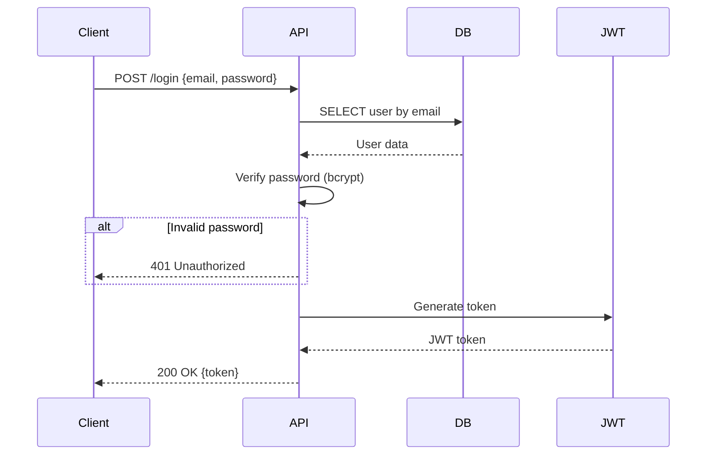
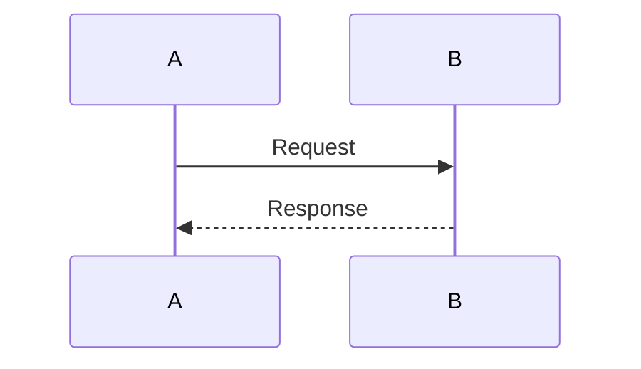

# Quick Start - AI-Generated Documentation

Generate beautiful documentation from your code in 3 minutes.

## Option A: Using Ollama (FREE, Recommended)

### Step 1: Ensure Ollama is Running

```bash
# Should already be running from Tutorial 17
ollama serve

# Verify it's working
ollama list
```

### Step 2: Create Example Code

```bash
cd 18-ai-documentation/examples

# We'll use the provided user_service.py example
ls user_service.py
```

### Step 3: Generate Documentation Interactively

Open Claude Code or use `ollama run llama3.2`:

```bash
ollama run llama3.2
```

**Prompt 1 - Generate Architecture Diagram:**
```
Analyze this Flask user service and generate a Mermaid architecture diagram:

[paste contents of examples/user_service.py]

Show external dependencies, API endpoints, and data flow.
Return ONLY Mermaid code.
```

Copy the output to `docs/architecture.mmd`.

**Prompt 2 - Generate README:**
```
Generate a comprehensive README.md for this user service:

[paste code]

Include:
- Features
- Architecture diagram (mermaid)
- API endpoints table
- Setup instructions
- Usage examples

Return markdown.
```

**Done!** You've generated documentation using AI.

## Option B: Automated Script

### Step 1: Install Dependencies

```bash
cd 18-ai-documentation
pip install requests pyyaml
```

### Step 2: Start AI Server

```bash
# From Tutorial 17
cd ../17-dynamic-ai-services/ai-servers/local-ai
python ollama_server.py
```

### Step 3: Run Documentation Generator

```bash
cd ../../18-ai-documentation
python scripts/generate_docs.py examples/user_service.py
```

Output:
```
Generating documentation for user_service...
  Generating architecture diagram...
  Generating sequence diagrams...
  Generating OpenAPI specification...
  Generating README...
✅ Documentation generated in docs/user_service/
   - README.md
   - architecture.mmd
   - openapi.yaml
```

### Step 4: View Generated Docs

```bash
# View README
cat docs/user_service/README.md

# View Mermaid diagram
cat docs/user_service/architecture.mmd

# View OpenAPI spec
cat docs/user_service/openapi.yaml
```

## Quick Examples

### Example 1: Generate Just a Diagram

**Prompt:**
```
Generate a Mermaid sequence diagram for user login:

1. Client sends POST /api/users/login {email, password}
2. Service queries database
3. Verifies password hash
4. Generates JWT token
5. Returns token to client

Return only Mermaid code.
```

**AI Output:**


### Example 2: Document an Existing Function

**Prompt:**
```
Add a docstring to this function:

```python
def calculate_price(product_id, quantity, user_tier):
    base_price = get_product_price(product_id)
    discount = get_tier_discount(user_tier)
    tax = calculate_tax(base_price, quantity)
    return (base_price * quantity * (1 - discount)) + tax
```

Include:
- Description
- Parameters with types
- Returns
- Example
```

**AI Output:**
```python
def calculate_price(product_id: int, quantity: int, user_tier: str) -> float:
    """
    Calculate the final price for a product purchase.

    Applies tier-based discounts and calculates applicable tax.

    Args:
        product_id (int): Unique identifier for the product
        quantity (int): Number of units to purchase
        user_tier (str): User's membership tier ('basic', 'premium', 'enterprise')

    Returns:
        float: Final price including discount and tax

    Example:
        >>> calculate_price(123, 2, 'premium')
        89.99

    Note:
        Price calculation: (base_price * quantity * (1 - discount)) + tax
    """
    base_price = get_product_price(product_id)
    discount = get_tier_discount(user_tier)
    tax = calculate_tax(base_price, quantity)
    return (base_price * quantity * (1 - discount)) + tax
```

### Example 3: Generate API Documentation

**Prompt:**
```
Generate OpenAPI documentation for this endpoint:

@app.route('/api/products/<int:product_id>', methods=['GET'])
def get_product(product_id):
    """Get product by ID"""
    product = db.query(Product).filter_by(id=product_id).first()
    if not product:
        return {'error': 'Product not found'}, 404
    return {
        'id': product.id,
        'name': product.name,
        'price': product.price,
        'stock': product.stock
    }

Return YAML.
```

## Using Different AI Models

### For Quick Diagrams: phi

```bash
ollama pull phi
export AI_MODEL=phi
python scripts/generate_docs.py examples/user_service.py
```

- **Speed**: Very fast (1-2 seconds)
- **Quality**: Good for simple diagrams
- **Best for**: Quick iterations

### For Best Quality: mistral

```bash
ollama pull mistral
export AI_MODEL=mistral
python scripts/generate_docs.py examples/user_service.py
```

- **Speed**: Medium (3-5 seconds)
- **Quality**: Excellent
- **Best for**: Production documentation

### For Technical Content: codellama

```bash
ollama pull codellama
export AI_MODEL=codellama
python scripts/generate_docs.py examples/user_service.py
```

- **Speed**: Medium (3-5 seconds)
- **Quality**: Great for code documentation
- **Best for**: API docs, code comments

## Tips for Better Results

### 1. Be Specific About Format

❌ **Bad:**
```
Document this code
```

✅ **Good:**
```
Generate a Mermaid flowchart diagram for this code.
Use 'graph TB' layout.
Return ONLY the Mermaid code, no explanations.
```

### 2. Provide Examples

❌ **Bad:**
```
Create a sequence diagram
```

✅ **Good:**
```
Create a Mermaid sequence diagram like this example:



Now create one for this code: [code]
```

### 3. Iterate and Refine

```bash
# First pass: Basic diagram
ollama run llama3.2
>>> Generate architecture diagram for this service: [code]

# Second pass: Improve it
>>> Improve this diagram by adding color coding and grouping: [diagram]

# Third pass: Add details
>>> Add data flow arrows with labels: [improved diagram]
```

## Common Workflows

### Workflow 1: New Feature Documentation

```bash
# 1. Write code
vim my_service.py

# 2. Generate docs
python scripts/generate_docs.py my_service.py

# 3. Review and commit
git add docs/my_service/
git commit -m "docs: Add my_service documentation"
```

### Workflow 2: Update Existing Docs

```bash
# 1. Modify code
vim user_service.py

# 2. Regenerate docs
python scripts/generate_docs.py user_service.py

# 3. Review changes
git diff docs/user_service/

# 4. Commit if good
git add docs/user_service/
git commit -m "docs: Update user_service documentation"
```

### Workflow 3: Document Multiple Services

```bash
# Generate for all services
for service in examples/*.py; do
    python scripts/generate_docs.py "$service"
done

# Or use find
find examples -name "*.py" -exec python scripts/generate_docs.py {} \;
```

## Troubleshooting

### "AI server not responding"

```bash
# Check if Ollama is running
ollama list

# Restart if needed
pkill ollama
ollama serve
```

### "Invalid Mermaid syntax"

The AI sometimes generates invalid syntax. Fix manually or re-prompt:

```
The diagram has syntax errors. Fix it:
[paste diagram]

Return valid Mermaid code.
```

### "Diagram too complex"

Simplify in stages:

```
Generate a high-level architecture diagram with only:
- Main components
- External dependencies
- No internal details

[code]
```

Then:

```
Now generate a detailed sequence diagram for just the login flow.
```

## Next Steps

1. **Explore more prompts** - See README Part 6
2. **Automate with pre-commit** - See README Part 5
3. **Set up CI/CD** - See README Part 8
4. **Try different diagram types** - ERD, deployment, C4 diagrams
5. **Document your own services** - Apply to your Tutorial 1-17 code!

Documentation doesn't have to be a chore - let AI help! 🚀
