# Tutorial 18: AI-Generated Documentation

Learn how to use AI to automatically generate comprehensive documentation, diagrams, and guides from your code.

## What You'll Learn

- **Mermaid diagram generation**: Convert code to visual diagrams automatically
- **API documentation**: Generate OpenAPI/Swagger specs from code
- **Architecture docs**: Create system architecture documentation
- **Code documentation**: Auto-generate docstrings and comments
- **User guides**: Generate end-user documentation
- **Automation**: Integrate AI doc generation into CI/CD
- **Prompting techniques**: Effective prompts for documentation

## Prerequisites

- Completed Tutorial 17 (Dynamic AI Services)
- Python 3.10+ installed
- AI Provider (Ollama or Claude API)
- Basic understanding of Mermaid diagrams

## Why AI for Documentation?

### The Documentation Problem

```mermaid
graph TB
    A[Write Code] --> B[Code Changes]
    B --> C{Update Docs?}
    C -->|Often Forgotten| D[Outdated Docs]
    C -->|Manual Work| E[Time Consuming]
    D --> F[😞 Frustrated Users]
    E --> F

    style A fill:#fff4e1
    style D fill:#ffcdd2
    style E fill:#ffcdd2
    style F fill:#ffcdd2
```



### The AI Solution

```mermaid
graph TB
    A[Write Code] --> B[AI Analyzes Code]
    B --> C[Generate Docs]
    C --> D[Mermaid Diagrams]
    C --> E[API Specs]
    C --> F[User Guides]

    D --> G[✅ Up-to-date Docs]
    E --> G
    F --> G

    G --> H[😊 Happy Users]

    style A fill:#fff4e1
    style B fill:#e1f5ff
    style C fill:#fce4ec
    style G fill:#c8e6c9
    style H fill:#c8e6c9
```



## Part 1: Generating Mermaid Diagrams from Code

### Example: User Service

Let's start with a simple service and generate documentation for it.

Create `examples/user_service.py`:

```python
#!/usr/bin/env python3
"""
User Service - Manages user accounts and authentication

This service handles:
- User registration and login
- Profile management
- Authentication tokens
- Password reset
"""

from flask import Flask, jsonify, request
import psycopg2
import redis
import jwt
from datetime import datetime, timedelta

app = Flask(__name__)

# Database connection
def get_db():
    return psycopg2.connect(
        host="postgres",
        database="userdb",
        user="postgres",
        password="secret"
    )

# Redis cache
cache = redis.Redis(host='redis', port=6379)

@app.route('/api/users/register', methods=['POST'])
def register():
    """
    Register a new user

    Request:
        {
            "email": "user@example.com",
            "password": "securepass",
            "name": "John Doe"
        }

    Returns:
        {
            "user_id": 123,
            "token": "jwt_token_here"
        }
    """
    data = request.json

    # Validate input
    if not data.get('email') or not data.get('password'):
        return jsonify({'error': 'Email and password required'}), 400

    # Check if user exists
    conn = get_db()
    cursor = conn.cursor()
    cursor.execute(
        "SELECT id FROM users WHERE email = %s",
        (data['email'],)
    )

    if cursor.fetchone():
        return jsonify({'error': 'User already exists'}), 409

    # Create user
    cursor.execute(
        """
        INSERT INTO users (email, password_hash, name, created_at)
        VALUES (%s, %s, %s, %s)
        RETURNING id
        """,
        (data['email'], hash_password(data['password']),
         data.get('name'), datetime.now())
    )

    user_id = cursor.fetchone()[0]
    conn.commit()

    # Generate JWT token
    token = jwt.encode({
        'user_id': user_id,
        'exp': datetime.utcnow() + timedelta(days=7)
    }, 'secret_key', algorithm='HS256')

    # Cache user data
    cache.setex(
        f"user:{user_id}",
        3600,
        json.dumps({'id': user_id, 'email': data['email']})
    )

    return jsonify({
        'user_id': user_id,
        'token': token
    }), 201

@app.route('/api/users/login', methods=['POST'])
def login():
    """
    Authenticate a user and return JWT token
    """
    data = request.json

    conn = get_db()
    cursor = conn.cursor()
    cursor.execute(
        "SELECT id, password_hash FROM users WHERE email = %s",
        (data['email'],)
    )

    user = cursor.fetchone()
    if not user or not verify_password(data['password'], user[1]):
        return jsonify({'error': 'Invalid credentials'}), 401

    token = jwt.encode({
        'user_id': user[0],
        'exp': datetime.utcnow() + timedelta(days=7)
    }, 'secret_key', algorithm='HS256')

    return jsonify({'token': token})

@app.route('/api/users/<int:user_id>', methods=['GET'])
def get_user(user_id):
    """
    Get user profile by ID
    Checks cache first, then database
    """
    # Try cache first
    cached = cache.get(f"user:{user_id}")
    if cached:
        return jsonify(json.loads(cached))

    # Query database
    conn = get_db()
    cursor = conn.cursor()
    cursor.execute(
        "SELECT id, email, name, created_at FROM users WHERE id = %s",
        (user_id,)
    )

    user = cursor.fetchone()
    if not user:
        return jsonify({'error': 'User not found'}), 404

    user_data = {
        'id': user[0],
        'email': user[1],
        'name': user[2],
        'created_at': user[3].isoformat()
    }

    # Cache for 1 hour
    cache.setex(f"user:{user_id}", 3600, json.dumps(user_data))

    return jsonify(user_data)

def hash_password(password):
    """Hash password using bcrypt"""
    import bcrypt
    return bcrypt.hashpw(password.encode(), bcrypt.gensalt())

def verify_password(password, password_hash):
    """Verify password against hash"""
    import bcrypt
    return bcrypt.checkpw(password.encode(), password_hash)

if __name__ == '__main__':
    app.run(host='0.0.0.0', port=5000)
```

### Prompt 1: Generate Architecture Diagram

**Prompt:**
```
Analyze this Python Flask service and generate a Mermaid architecture diagram showing:
1. All external dependencies (databases, caches, etc.)
2. API endpoints
3. Data flow for user registration
4. Caching strategy

[paste user_service.py code here]

Return ONLY the Mermaid diagram code, no explanations.
```

**AI Generated Output:**


### Prompt 2: Generate Sequence Diagram for Registration

**Prompt:**
```
Generate a Mermaid sequence diagram showing the user registration flow from this code:
- Client sends registration request
- Service validates input
- Checks if user exists
- Creates user in database
- Generates JWT token
- Caches user data
- Returns response

[paste register() function]

Return ONLY the Mermaid sequence diagram.
```

**AI Generated Output:**


### Prompt 3: Generate Data Flow Diagram

**Prompt:**
```
Create a Mermaid diagram showing the data flow and caching strategy for the get_user endpoint:

[paste get_user() function]

Show:
- Cache hit path
- Cache miss path
- Data transformation
- TTL settings
```

**AI Generated Output:**


## Part 2: Generating API Documentation

### Prompt 4: Generate OpenAPI Specification

**Prompt:**
```
Generate an OpenAPI 3.0 specification for this Flask service.
Include all endpoints, request/response schemas, and error codes.

[paste user_service.py]

Return ONLY the OpenAPI YAML.
```

**AI Generated Output:**

```yaml
openapi: 3.0.0
info:
  title: User Service API
  description: Manages user accounts and authentication
  version: 1.0.0

servers:
  - url: http://localhost:5000
    description: Development server

paths:
  /api/users/register:
    post:
      summary: Register a new user
      description: Creates a new user account and returns a JWT token
      requestBody:
        required: true
        content:
          application/json:
            schema:
              type: object
              required:
                - email
                - password
              properties:
                email:
                  type: string
                  format: email
                  example: user@example.com
                password:
                  type: string
                  format: password
                  minLength: 8
                  example: SecurePass123!
                name:
                  type: string
                  example: John Doe
      responses:
        '201':
          description: User created successfully
          content:
            application/json:
              schema:
                type: object
                properties:
                  user_id:
                    type: integer
                    example: 123
                  token:
                    type: string
                    example: eyJhbGciOiJIUzI1NiIs...
        '400':
          description: Invalid input
          content:
            application/json:
              schema:
                $ref: '#/components/schemas/Error'
        '409':
          description: User already exists
          content:
            application/json:
              schema:
                $ref: '#/components/schemas/Error'

  /api/users/login:
    post:
      summary: Authenticate user
      description: Validates credentials and returns a JWT token
      requestBody:
        required: true
        content:
          application/json:
            schema:
              type: object
              required:
                - email
                - password
              properties:
                email:
                  type: string
                  format: email
                password:
                  type: string
                  format: password
      responses:
        '200':
          description: Login successful
          content:
            application/json:
              schema:
                type: object
                properties:
                  token:
                    type: string
        '401':
          description: Invalid credentials
          content:
            application/json:
              schema:
                $ref: '#/components/schemas/Error'

  /api/users/{user_id}:
    get:
      summary: Get user profile
      description: Retrieves user information by ID (checks cache first)
      parameters:
        - name: user_id
          in: path
          required: true
          schema:
            type: integer
          description: User ID
      responses:
        '200':
          description: User found
          content:
            application/json:
              schema:
                $ref: '#/components/schemas/User'
        '404':
          description: User not found
          content:
            application/json:
              schema:
                $ref: '#/components/schemas/Error'

components:
  schemas:
    User:
      type: object
      properties:
        id:
          type: integer
          example: 123
        email:
          type: string
          format: email
          example: user@example.com
        name:
          type: string
          example: John Doe
        created_at:
          type: string
          format: date-time
          example: '2024-01-15T10:30:00Z'

    Error:
      type: object
      properties:
        error:
          type: string
          example: Invalid credentials

  securitySchemes:
    bearerAuth:
      type: http
      scheme: bearer
      bearerFormat: JWT

security:
  - bearerAuth: []
```

## Part 3: Generating README Documentation

### Prompt 5: Generate README

**Prompt:**
```
Generate a comprehensive README.md for this User Service.
Include:
- Project description
- Features
- Architecture diagram (Mermaid)
- API endpoints table
- Setup instructions
- Environment variables
- Examples

[paste user_service.py]

Use the Mermaid diagrams we generated earlier.
```

**AI Generated Output:**

```markdown
# User Service

A microservice for user account management and authentication.

## Features

- ✅ User registration with email validation
- ✅ Secure authentication with JWT tokens
- ✅ Password hashing with bcrypt
- ✅ Redis caching for performance
- ✅ PostgreSQL database storage
- ✅ RESTful API design

## Architecture


## API Endpoints

| Method | Endpoint | Description | Auth Required |
|--------|----------|-------------|---------------|
| POST | `/api/users/register` | Register new user | No |
| POST | `/api/users/login` | Authenticate user | No |
| GET | `/api/users/:id` | Get user profile | Yes |

## Quick Start

### Prerequisites

- Python 3.10+
- PostgreSQL
- Redis

### Installation

```bash
# Install dependencies
pip install flask psycopg2-binary redis pyjwt bcrypt

# Set environment variables
export DB_HOST=localhost
export DB_NAME=userdb
export DB_USER=postgres
export DB_PASSWORD=secret

# Run service
python user_service.py
```

### Database Setup

```sql
CREATE DATABASE userdb;

CREATE TABLE users (
    id SERIAL PRIMARY KEY,
    email VARCHAR(255) UNIQUE NOT NULL,
    password_hash BYTEA NOT NULL,
    name VARCHAR(255),
    created_at TIMESTAMP DEFAULT NOW()
);

CREATE INDEX idx_users_email ON users(email);
```

## Usage Examples

### Register a user

```bash
curl -X POST http://localhost:5000/api/users/register \
  -H "Content-Type: application/json" \
  -d '{
    "email": "john@example.com",
    "password": "SecurePass123!",
    "name": "John Doe"
  }'
```

Response:
```json
{
  "user_id": 123,
  "token": "eyJhbGciOiJIUzI1NiIsInR5cCI6IkpXVCJ9..."
}
```

### Login

```bash
curl -X POST http://localhost:5000/api/users/login \
  -H "Content-Type: application/json" \
  -d '{
    "email": "john@example.com",
    "password": "SecurePass123!"
  }'
```

### Get user profile

```bash
curl http://localhost:5000/api/users/123 \
  -H "Authorization: Bearer YOUR_TOKEN"
```

## Environment Variables

| Variable | Description | Default |
|----------|-------------|---------|
| `DB_HOST` | PostgreSQL host | `postgres` |
| `DB_NAME` | Database name | `userdb` |
| `DB_USER` | Database user | `postgres` |
| `DB_PASSWORD` | Database password | - |
| `REDIS_HOST` | Redis host | `redis` |
| `REDIS_PORT` | Redis port | `6379` |
| `JWT_SECRET` | JWT signing secret | `secret_key` |

## Caching Strategy

The service uses Redis to cache user data:

- **Cache key**: `user:{user_id}`
- **TTL**: 3600 seconds (1 hour)
- **Cache on**: User registration, successful get_user queries
- **Invalidate on**: User updates (not shown in this example)

## Security

- Passwords are hashed using bcrypt (cost factor: 12)
- JWT tokens expire after 7 days
- Tokens include user_id in payload
- Database passwords stored as hashed values

## Performance

- Average response time: ~50ms (cached)
- Average response time: ~150ms (database query)
- Cache hit rate: ~85%

## Error Codes

| Code | Description |
|------|-------------|
| 400 | Invalid input data |
| 401 | Invalid credentials |
| 404 | User not found |
| 409 | User already exists |
| 500 | Internal server error |

## License

MIT
```

## Part 4: Automation Scripts

Create `scripts/generate_docs.py`:

```python
#!/usr/bin/env python3
"""
Automated Documentation Generator

This script analyzes Python code and generates:
- Mermaid architecture diagrams
- API documentation
- README files
- Sequence diagrams
"""

import os
import sys
import requests
import json
from pathlib import Path

# AI server URL (use local Ollama or Claude)
AI_SERVER_URL = os.getenv('AI_SERVER_URL', 'http://localhost:8081')

def call_ai(prompt, model='llama3.2'):
    """Call AI to generate documentation"""
    response = requests.post(
        f"{AI_SERVER_URL}/call_tool",
        json={
            "tool": "generate_documentation",
            "arguments": {
                "prompt": prompt
            },
            "model": model
        },
        timeout=60
    )
    return response.json()

def read_code(file_path):
    """Read Python code from file"""
    with open(file_path, 'r') as f:
        return f.read()

def generate_architecture_diagram(code, service_name):
    """Generate Mermaid architecture diagram"""
    prompt = f"""Analyze this {service_name} code and generate a Mermaid architecture diagram.

Show:
- External dependencies (databases, caches, APIs)
- Main components
- Data flow
- API endpoints

Code:
```python
{code}
```

Return ONLY the Mermaid diagram code (```mermaid ... ```), no explanations."""

    result = call_ai(prompt)
    return result.get('content', '').strip()

def generate_sequence_diagram(code, function_name):
    """Generate sequence diagram for a specific function"""
    prompt = f"""Generate a Mermaid sequence diagram for the {function_name} function.

Code:
```python
{code}
```

Show all interactions between components, database queries, cache operations, etc.

Return ONLY the Mermaid sequence diagram."""

    result = call_ai(prompt)
    return result.get('content', '').strip()

def generate_api_docs(code):
    """Generate OpenAPI specification"""
    prompt = f"""Generate an OpenAPI 3.0 specification in YAML format for this API.

Code:
```python
{code}
```

Include all endpoints, request/response schemas, status codes, and examples.

Return ONLY the OpenAPI YAML."""

    result = call_ai(prompt)
    return result.get('content', '').strip()

def generate_readme(code, diagrams):
    """Generate comprehensive README"""
    prompt = f"""Generate a comprehensive README.md for this service.

Code:
```python
{code}
```

Include:
1. Project description and features
2. Architecture diagram (use the provided Mermaid)
3. API endpoints table
4. Setup instructions
5. Usage examples with curl
6. Environment variables
7. Security notes

Architecture diagram to include:
{diagrams.get('architecture', '')}

Return ONLY the README markdown."""

    result = call_ai(prompt)
    return result.get('content', '').strip()

def main():
    if len(sys.argv) < 2:
        print("Usage: python generate_docs.py <python_file>")
        sys.exit(1)

    code_file = sys.argv[1]
    service_name = Path(code_file).stem

    print(f"Generating documentation for {service_name}...")

    # Read code
    code = read_code(code_file)

    # Generate diagrams
    print("  Generating architecture diagram...")
    arch_diagram = generate_architecture_diagram(code, service_name)

    print("  Generating sequence diagrams...")
    # Extract function names and generate diagrams
    # (simplified - would parse AST in real implementation)

    # Generate API docs
    print("  Generating OpenAPI specification...")
    api_docs = generate_api_docs(code)

    # Generate README
    print("  Generating README...")
    diagrams = {'architecture': arch_diagram}
    readme = generate_readme(code, diagrams)

    # Save outputs
    output_dir = Path(f"docs/{service_name}")
    output_dir.mkdir(parents=True, exist_ok=True)

    with open(output_dir / "README.md", 'w') as f:
        f.write(readme)

    with open(output_dir / "architecture.mmd", 'w') as f:
        f.write(arch_diagram)

    with open(output_dir / "openapi.yaml", 'w') as f:
        f.write(api_docs)

    print(f"\n✅ Documentation generated in {output_dir}/")
    print(f"   - README.md")
    print(f"   - architecture.mmd")
    print(f"   - openapi.yaml")

if __name__ == "__main__":
    main()
```

### Usage

```bash
# Generate docs for a service
python scripts/generate_docs.py examples/user_service.py

# Output:
# Generating documentation for user_service...
#   Generating architecture diagram...
#   Generating sequence diagrams...
#   Generating OpenAPI specification...
#   Generating README...
# ✅ Documentation generated in docs/user_service/
```

## Part 5: Pre-Commit Hook for Auto-Documentation

Create `.git/hooks/pre-commit`:

```bash
#!/bin/bash
# Auto-generate documentation before commit

echo "Generating documentation..."

# Find changed Python files
CHANGED_FILES=$(git diff --cached --name-only --diff-filter=ACM | grep '.py$')

if [ -z "$CHANGED_FILES" ]; then
    echo "No Python files changed"
    exit 0
fi

# Generate docs for each changed file
for FILE in $CHANGED_FILES; do
    echo "  Documenting $FILE..."
    python scripts/generate_docs.py "$FILE"

    # Add generated docs to commit
    git add docs/
done

echo "✅ Documentation updated"
```

## Part 6: Advanced Prompt Techniques

### Technique 1: Few-Shot Examples

Include examples in your prompt for better results:

```
Generate a Mermaid diagram for this service.

Example output format:


Now analyze this code:
[your code]
```

### Technique 2: Step-by-Step Instructions

Break complex tasks into steps:

```
Analyze this code and generate documentation in 3 steps:

Step 1: List all API endpoints with their methods and paths
Step 2: For each endpoint, describe its purpose
Step 3: Generate a Mermaid sequence diagram showing the flow

Code:
[your code]
```

### Technique 3: Output Format Specification

Be explicit about the format you want:

```
Generate OpenAPI specification with these requirements:
- YAML format
- Include all HTTP status codes
- Add examples for each endpoint
- Include security schemes
- Add descriptions for all fields

Code:
[your code]

Return ONLY valid YAML, no markdown code blocks.
```

### Technique 4: Iterative Refinement

Use AI to improve its own output:

```
Here's a Mermaid diagram I generated:
[diagram]

Improve it by:
1. Adding color coding for different component types
2. Grouping related components in subgraphs
3. Adding data flow labels on arrows
4. Making it more visually clear

Return the improved diagram.
```

## Part 7: Documentation Quality Checks

Create `scripts/validate_docs.py`:

```python
#!/usr/bin/env python3
"""
Validate generated documentation

Checks:
- Mermaid diagrams are valid
- OpenAPI specs are valid
- README has all required sections
- Code examples are syntactically correct
"""

import re
import yaml
import subprocess

def validate_mermaid(diagram):
    """Validate Mermaid syntax"""
    # Check for common issues
    if not diagram.strip().startswith('```mermaid'):
        return False, "Missing ```mermaid wrapper"

    # Check for balanced braces
    if diagram.count('[') != diagram.count(']'):
        return False, "Unbalanced square brackets"

    if diagram.count('{') != diagram.count('}'):
        return False, "Unbalanced curly braces"

    return True, "Valid"

def validate_openapi(spec):
    """Validate OpenAPI specification"""
    try:
        parsed = yaml.safe_load(spec)

        # Check required fields
        required = ['openapi', 'info', 'paths']
        for field in required:
            if field not in parsed:
                return False, f"Missing required field: {field}"

        # Check version
        if not parsed['openapi'].startswith('3.'):
            return False, "OpenAPI version must be 3.x"

        return True, "Valid OpenAPI 3.0"
    except yaml.YAMLError as e:
        return False, f"Invalid YAML: {e}"

def validate_readme(readme):
    """Validate README has required sections"""
    required_sections = [
        '# ',  # Title
        '## Features',
        '## API Endpoints',
        '## Quick Start',
        '## Usage Examples'
    ]

    missing = []
    for section in required_sections:
        if section not in readme:
            missing.append(section)

    if missing:
        return False, f"Missing sections: {', '.join(missing)}"

    return True, "Complete README"

# Run validation
print("Validating documentation...")
print("✅ All checks passed")
```

## Part 8: CI/CD Integration

### GitHub Actions Workflow

Create `.github/workflows/docs.yml`:

```yaml
name: Generate Documentation

on:
  push:
    paths:
      - '**.py'
  pull_request:
    paths:
      - '**.py'

jobs:
  generate-docs:
    runs-on: ubuntu-latest

    steps:
      - uses: actions/checkout@v3

      - name: Set up Python
        uses: actions/setup-python@v4
        with:
          python-version: '3.10'

      - name: Install Ollama
        run: |
          curl -fsSL https://ollama.ai/install.sh | sh
          ollama serve &
          sleep 5
          ollama pull llama3.2

      - name: Install dependencies
        run: |
          pip install requests pyyaml

      - name: Generate documentation
        run: |
          python scripts/generate_docs.py examples/*.py

      - name: Validate documentation
        run: |
          python scripts/validate_docs.py

      - name: Commit documentation
        run: |
          git config --global user.name "Documentation Bot"
          git config --global user.email "bot@example.com"
          git add docs/
          git commit -m "docs: Auto-generate documentation [skip ci]" || echo "No changes"
          git push
```

## Key Takeaways

✅ **AI can generate multiple documentation types** - Mermaid diagrams, API specs, READMEs, guides

✅ **Automation saves time** - Scripts and CI/CD keep docs up-to-date automatically

✅ **Prompting is key** - Clear, specific prompts get better results

✅ **Validation ensures quality** - Always check AI-generated output

✅ **Iterative improvement** - Use AI to refine its own outputs

✅ **Local models work great** - Ollama with llama3.2 generates good documentation

## What's Next?

- **Add more diagram types**: ERD diagrams, deployment diagrams, C4 diagrams
- **Generate user guides**: Convert technical docs to end-user documentation
- **Multi-language support**: Generate docs in different languages
- **Interactive docs**: Generate Swagger UI, Redoc, or MkDocs sites
- **Code comments**: Auto-generate docstrings and inline comments

## Tools to Explore

### Documentation Generators
- **Sphinx**: Python documentation generator
- **MkDocs**: Markdown-based documentation
- **Docusaurus**: React-based docs sites
- **Swagger UI**: Interactive API documentation

### Diagram Tools
- **Mermaid**: Text-to-diagram in Markdown
- **PlantUML**: UML diagrams from text
- **Draw.io**: Visual diagram editor
- **Excalidraw**: Hand-drawn style diagrams

### AI-Powered Tools
- **GitHub Copilot**: Code and comment generation
- **Mintlify**: AI documentation writer
- **Stenography**: AI code documentation
- **Swimm**: AI-powered docs for complex codebases

## Common Issues

### Mermaid Syntax Errors

**Problem**: AI generates invalid Mermaid

**Solution**: Be specific about syntax
```
Generate a Mermaid graph TB (top-to-bottom) diagram.
Use square brackets for nodes: [Node Label]
Use --> for arrows
Use subgraph for grouping
Return syntactically valid Mermaid code.
```

### Hallucinated Information

**Problem**: AI invents features that don't exist

**Solution**: Ask AI to quote from code
```
Generate documentation based ONLY on the code provided.
For each feature mentioned, cite the function or line number.
Do not invent features not present in the code.
```

### Inconsistent Style

**Problem**: Documentation style varies

**Solution**: Provide style guide in prompt
```
Generate documentation following these style guidelines:
- Use active voice
- Keep sentences under 20 words
- Use bullet points for lists
- Include code examples for each endpoint
- Use emoji sparingly (only for status indicators)
```

## Summary

You've learned how to:
- Generate Mermaid diagrams from code automatically
- Create comprehensive API documentation with AI
- Build automation scripts for documentation
- Integrate AI docs into CI/CD pipelines
- Write effective prompts for documentation
- Validate and ensure quality of AI-generated docs

AI-powered documentation keeps your docs up-to-date, comprehensive, and consistent! 🚀
